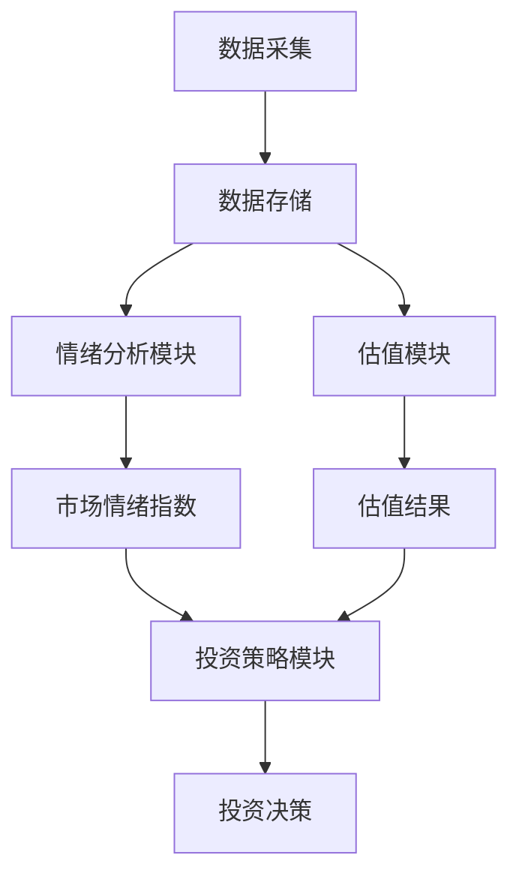

                 


# 彼得林奇的"逆向投资"思想

## 关键词：逆向投资，彼得林奇，市场情绪，估值方法，投资策略

## 摘要：  
逆向投资是一种在市场低迷时寻找投资机会的方法，强调在市场恐慌时买入，在市场狂热时卖出。本文深入分析了彼得·林奇的逆向投资思想，探讨其核心概念、算法原理、系统架构及实际应用，帮助读者理解如何在复杂市场中运用逆向思维实现长期收益。

---

## 第一部分：逆向投资的背景与核心理念

### 第1章：逆向投资的基本概念

#### 1.1 逆向投资的定义与特点
逆向投资是一种与市场情绪相反的投资策略，强调在市场低估时买入，在市场高估时卖出。其核心特点包括：
- **反周期性**：在市场低谷时寻找机会，在市场顶峰时规避风险。
- **逆向思维**：与市场大多数投资者行为相反，避免羊群效应。
- **长期视角**：关注长期价值，而非短期波动。

#### 1.2 彼得·林奇的投资理念
彼得·林奇是逆向投资的代表人物，他强调：
- **价值投资**：寻找被市场低估的股票，关注公司的基本面。
- **逆向时机选择**：在市场恐慌时买入，在市场乐观时卖出。
- **分散投资**：通过分散投资降低风险，避免过度集中。

#### 1.3 逆向投资的现实意义
在当前市场环境下，逆向投资的重要性体现在：
- **应对市场波动**：通过逆向策略降低市场波动带来的风险。
- **挖掘低估机会**：在市场低迷时发现潜在价值。
- **长期收益**：逆向投资通过长期持有优质资产实现复利效应。

---

### 第2章：逆向投资的核心策略与方法

#### 2.1 市场情绪分析与逆向投资
市场情绪分析是逆向投资的重要工具，包括：
- **情绪指数**：通过市场情绪指标（如恐慌指数、投资者情绪指数）判断市场情绪。
- **情绪周期**：分析市场情绪的周期性变化，识别市场拐点。

#### 2.2 估值方法与逆向投资
估值方法帮助投资者识别市场低估或高估的情况，常用方法包括：
- **市盈率（P/E）**：比较公司股价与盈利的关系。
- **市净率（P/B）**：比较公司股价与资产净值的关系。
- **股息率**：评估股票的分红能力。

#### 2.3 选股策略与逆向投资
选股策略是逆向投资的核心，包括：
- **基本面分析**：关注公司的财务状况、盈利能力、管理团队。
- **行业分析**：选择具有长期增长潜力的行业。
- **逆向筛选**：在市场冷门行业或板块中寻找低估股票。

---

## 第二部分：逆向投资的数学模型与算法

### 第3章：逆向投资的数学模型

#### 3.1 市场情绪指数的构建
市场情绪指数可以通过以下步骤构建：
1. **数据收集**：收集市场指数、成交量、投资者情绪数据。
2. **数据预处理**：清洗数据，去除异常值。
3. **指数计算**：使用公式计算情绪指数，如：
   $$ 情绪指数 = \frac{市场指数 - 历史均值}{历史标准差} $$
4. **指数分析**：分析情绪指数与市场走势的关系。

#### 3.2 估值模型的建立
常用的估值模型包括：
1. **市盈率模型**：$$ P/E = \frac{股价}{每股收益} $$
2. **市净率模型**：$$ P/B = \frac{股价}{每股净资产} $$
3. **股息率模型**：$$ 股息率 = \frac{每股股息}{股价} $$

#### 3.3 选股策略的优化
优化选股策略可以通过以下步骤：
1. **筛选低估值股票**：使用上述估值模型筛选低于行业平均水平的股票。
2. **分析市场情绪**：选择市场情绪低迷时的低估值股票。
3. **组合优化**：通过现代投资组合理论优化投资组合，降低风险。

### 第4章：逆向投资的算法实现

#### 4.1 市场情绪分析算法
以下是一个基于情感分析的市场情绪检测算法示例：

```python
import nltk
from textblob import TextBlob

def calculate_sentiment(text):
    blob = TextBlob(text)
    return blob.sentiment.polarity

# 示例文本
text = "The market is very bullish today."
print(calculate_sentiment(text))  # 输出情绪值
```

#### 4.2 估值模型的算法实现
以下是基于市盈率模型的股票估值算法：

```python
def calculate_pe_ratio(stock_data):
    pe_ratio = stock_data['股价'] / stock_data['每股收益']
    return pe_ratio

# 示例数据
stock_data = {
    '股价': 50,
    '每股收益': 10
}
print(calculate_pe_ratio(stock_data))  # 输出市盈率
```

#### 4.3 选股策略的算法实现
以下是基于逆向投资的选股策略实现：

```python
import pandas as pd

def inverse_strategy(stock_data, threshold):
    # 筛选低估值股票
    low_valuation = stock_data[stock_data['市盈率'] < stock_data['市盈率'].mean()]
    # 分析市场情绪
    low_valuation = low_valuation[low_valuation['市场情绪'] < threshold]
    return low_valuation

# 示例数据
stock_data = pd.DataFrame({
    '市盈率': [15, 20, 25, 18, 12],
    '市场情绪': [0.3, 0.5, 0.2, 0.7, 0.4]
})
threshold = 0.3
print(inverse_strategy(stock_data, threshold))
```

---

## 第三部分：系统分析与架构设计

### 第5章：系统分析与架构设计

#### 5.1 投资决策支持系统架构
系统架构包括以下几个模块：
- 数据采集模块：采集市场数据、公司财务数据。
- 情绪分析模块：分析市场情绪，计算情绪指数。
- 估值模块：计算股票估值，筛选低估值股票。
- 投资策略模块：根据市场情绪和估值结果制定投资策略。

#### 5.2 系统架构图
以下是一个投资决策支持系统的架构图：



---

## 第四部分：项目实战

### 第6章：项目实战

#### 6.1 环境安装
需要安装以下库：
- Python
- NumPy
- Pandas
- TextBlob
- NLTK

#### 6.2 核心实现
以下是一个情绪分析和估值计算的示例代码：

```python
from textblob import TextBlob
import pandas as pd

# 情绪分析
def analyze_sentiment(text):
    blob = TextBlob(text)
    return blob.sentiment.polarity

# 估值计算
def calculate_pe_ratio(stock_price, earnings_per_share):
    return stock_price / earnings_per_share

# 示例数据
text = "The stock is undervalued."
print(analyze_sentiment(text))  # 输出情绪值

stock_price = 50
earnings_per_share = 10
print(calculate_pe_ratio(st

