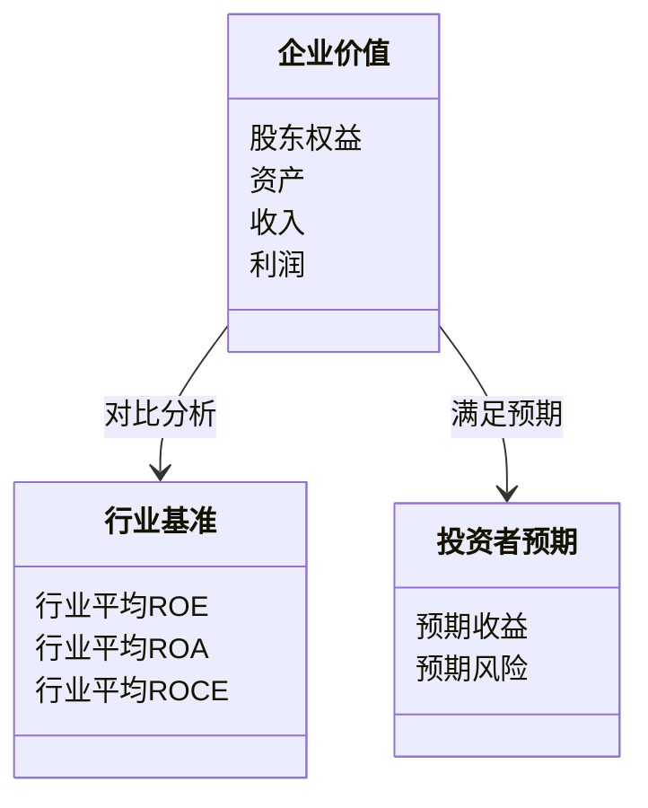
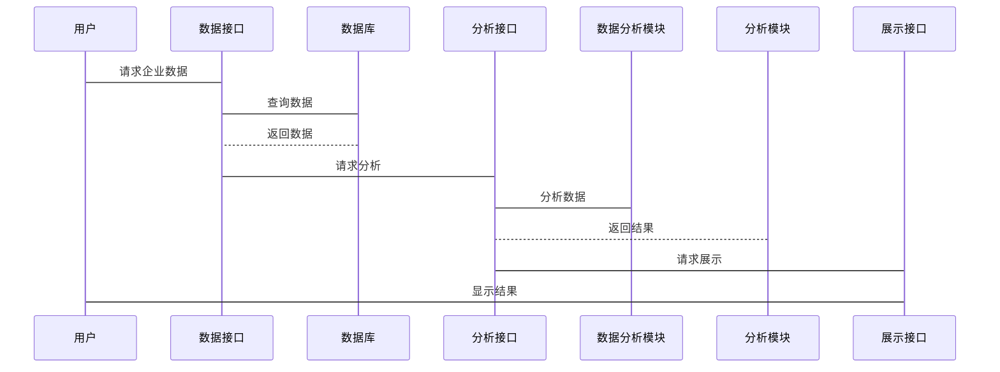

                 


# 彼得林奇的"长期价值创造"在不同行业的衡量标准

## 关键词：长期价值创造，彼得林奇，行业标准，价值评估，投资策略

## 摘要：本文深入探讨了彼得林奇的长期价值创造理念，并分析了在不同行业中如何衡量和实现这一价值。通过系统分析和数学模型，文章提出了适用于各个行业的价值评估方法，为企业管理者和投资者提供了实用的指导。

---

## 第1章: 彼得林奇投资理念与长期价值创造

### 1.1 彼得林奇投资理念的核心思想

#### 1.1.1 彼得林奇的投资者画像
彼得林奇是美国著名的投资经理，以其长期价值投资理念闻名。他强调选择具有持续增长潜力的企业，并长期持有。他的投资者画像包括：
- **价值投资者**：寻找被市场低估的企业。
- **基本面分析师**：关注企业的财务状况和盈利能力。
- **成长投资者**：寻找具有持续增长潜力的企业。

#### 1.1.2 长期价值创造的核心概念
长期价值创造是指企业在较长的时间内，通过创新、效率提升和市场拓展等方式，不断提升其市场价值和股东回报。核心概念包括：
- **企业价值**：企业的整体价值，包括资产、品牌和未来收益。
- **股东价值**：股东通过企业增长获得的收益。
- **可持续发展**：企业不仅要追求短期利润，还要注重长期的可持续发展。

#### 1.1.3 投资理念对企业管理的启示
彼得林奇的投资理念对企业管理有重要启示，包括：
- **关注基本面**：企业应注重财务健康和盈利能力。
- **长期视角**：管理层应以长期价值为目标，避免短期行为。
- **股东利益**：企业决策应以股东利益为核心。

### 1.2 长期价值创造的定义与特征

#### 1.2.1 长期价值创造的定义
长期价值创造是指企业在较长的时间内，通过持续改进和创新，提升其市场地位和盈利能力，从而为股东创造持续价值。

#### 1.2.2 长期价值创造的核心特征对比表格
以下是长期价值创造与短期收益的对比：

| 特征                | 长期价值创造        | 短期收益          |
|---------------------|---------------------|-------------------|
| 时间跨度            | 5年及以上           | 几个月到几年      |
| 目标                | 持续增长和股东价值最大化 | 短期利润最大化    |
| 风险承受能力        | 较高               | 较低              |
| 资源投入            | 高                 | 中低              |
| 结果                | 高可持续性          | 可能不可持续      |

#### 1.2.3 长期价值创造与短期收益的关系
长期价值创造与短期收益并非对立，而是相辅相成。短期收益是长期价值的基础，而长期价值是短期收益的延续。例如，技术创新可能在短期内增加成本，但长期来看会提升企业的竞争力和盈利能力。

### 1.3 长期价值创造的衡量标准

#### 1.3.1 财务指标：ROE、ROA、ROCE
长期价值创造可以通过财务指标来衡量，包括：
- **ROE（净资产收益率）**：衡量企业使用股东资金的效率。
- **ROA（资产回报率）**：衡量企业利用资产创造利润的能力。
- **ROCE（股东权益回报率）**：衡量企业利用资本创造利润的能力。

#### 1.3.2 非财务指标：品牌价值、客户忠诚度
除了财务指标，非财务指标也是衡量长期价值的重要标准，包括：
- **品牌价值**：强大的品牌可以为企业带来持续的溢价能力。
- **客户忠诚度**：高忠诚度客户是企业长期价值的重要来源。

#### 1.3.3 行业基准与企业目标的结合
在衡量长期价值时，需要结合行业基准和企业目标。例如，科技行业的基准可能是高ROE和高增长，而制造业的基准可能是高ROA和成本控制。

---

## 第2章: 不同行业的价值创造特点

### 2.1 高科技行业的价值创造

#### 2.1.1 技术创新对企业价值的影响
技术创新是高科技行业长期价值创造的核心。例如，苹果通过不断创新的产品设计，持续提升品牌价值和市场地位。

#### 2.1.2 知识资本的衡量与管理
高科技企业依赖知识资本，包括研发人员、专利和技术储备。知识资本的管理和评估是衡量长期价值的重要部分。

#### 2.1.3 高科技企业的长期价值评估
高科技企业的长期价值评估需要考虑技术创新、市场地位和未来增长潜力。例如，可以使用 discounted cash flow（DCF）模型来评估企业的未来价值。

### 2.2 金融行业的价值创造

#### 2.2.1 资产管理行业的价值衡量标准
资产管理行业的长期价值创造主要体现在资产管理规模和投资收益上。例如，巴菲特的伯克希尔哈撒韦通过长期稳定的投资收益，实现了巨大的长期价值。

#### 2.2.2 风险控制与长期价值的关系
金融行业风险控制是长期价值创造的关键。有效的风险控制可以减少波动，提高企业的稳定性，从而增强长期价值。

#### 2.2.3 金融创新对企业价值的影响
金融创新是金融行业长期价值创造的重要驱动力。例如，衍生品的创新为企业提供了新的风险管理工具，同时也带来了新的增长机会。

### 2.3 制造业的价值创造

#### 2.3.1 成本控制与效率提升
制造业的长期价值创造主要依赖于成本控制和效率提升。例如，丰田的精益生产模式通过持续优化流程，降低了成本，提高了效率。

#### 2.3.2 创新与规模化生产
制造业的创新是长期价值创造的关键。例如，特斯拉通过技术创新和规模化生产，成功将电动汽车推向主流市场，创造了巨大的长期价值。

#### 2.3.3 制造业的长期价值评估模型
制造业的长期价值评估可以使用经济利润（EVA）模型，考虑企业的成本控制、效率提升和技术创新能力。

### 2.4 服务业的价值创造

#### 2.4.1 客户满意度与长期价值
服务业的长期价值创造主要体现在客户满意度和忠诚度上。例如，星巴克通过提供优质服务和客户体验，培养了大批忠诚客户，创造了长期价值。

#### 2.4.2 服务质量与品牌价值的关系
服务质量是服务业品牌价值的核心。优质的服务可以提升品牌形象，增强客户忠诚度，从而提高长期价值。

#### 2.4.3 服务行业的长期价值评估指标
服务行业的长期价值评估可以使用客户生命周期价值（CLV）模型，考虑客户的获取成本、生命周期内的收益和流失率。

---

## 第3章: 长期价值创造的系统分析与架构设计

### 3.1 系统分析

#### 3.1.1 问题场景介绍
本文讨论的长期价值创造涉及多个行业，需要建立一个通用的系统框架来分析和评估。

#### 3.1.2 领域模型（Mermaid类图）


### 3.2 系统架构设计

#### 3.2.1 分层架构（Mermaid架构图）


#### 3.2.2 关键模块设计
- **数据采集模块**：收集企业的财务数据和市场数据。
- **数据分析模块**：使用算法对数据进行分析，评估企业的长期价值。
- **结果展示模块**：将分析结果以图表形式展示给用户。

### 3.3 系统接口与交互设计

#### 3.3.1 关键接口设计
- 数据接口：从数据库获取企业数据。
- 分析接口：调用算法进行价值评估。
- 展示接口：将结果展示给用户。

#### 3.3.2 交互流程（Mermaid序列图）


---

## 第4章: 长期价值创造的数学模型与算法原理

### 4.1 价值评估的数学模型

#### 4.1.1 市盈率模型
市盈率（P/E）= 股价 / 每股收益
$$ P/E = \frac{P}{E} $$

#### 4.1.2 市净率模型
市净率（P/B）= 股价 / 每股净资产
$$ P/B = \frac{P}{B} $$

#### 4.1.3 内在价值计算公式
内在价值（V）= 股息贴现模型（DDM）
$$ V = \frac{D}{k - g} $$

### 4.2 价值增长的算法原理

#### 4.2.1 现金流折现模型（DCF）
企业价值 = 现金流的现值
$$ V = \sum_{t=1}^{n} \frac{CF_t}{(1 + r)^t} $$

#### 4.2.2 经济利润（EVA）模型
经济利润 = 净利润 - 资本成本
$$ EVA = N - WACC $$

---

## 第5章: 项目实战

### 5.1 环境安装
需要安装Python和相关库（如Pandas、NumPy、Matplotlib）。

### 5.2 系统核心实现源代码

#### 5.2.1 数据分析模块
```python
import pandas as pd
import numpy as np

def calculate_roe(df):
    return df['净利润'] / df['股东权益']
```

#### 5.2.2 价值评估模块
```python
def discounted_cash_flow(cash_flows, discount_rate):
    return np.npv(discount_rate, cash_flows)
```

### 5.3 代码应用解读与分析
通过上述代码，可以计算企业的ROE和现金流的现值，从而评估其长期价值。

### 5.4 实际案例分析和详细讲解剖析
以苹果公司为例，分析其长期价值创造过程，包括技术创新、市场拓展和品牌建设。

### 5.5 项目小结
通过实战项目，我们掌握了长期价值创造的衡量方法和系统设计，为企业管理者提供了实用的工具和方法。

---

## 第6章: 最佳实践、小结与展望

### 6.1 小结
本文深入探讨了彼得林奇的长期价值创造理念，并分析了在不同行业中的应用。通过系统分析和数学模型，提出了适用于各个行业的价值评估方法。

### 6.2 注意事项
- 数据分析需结合行业特点。
- 长期价值创造需注重风险控制。
- 投资决策需基于充分的市场研究。

### 6.3 拓展阅读
- 《彼得林奇的投资哲学》
- 《价值投资：Shares Made Simple》

---

## 作者：AI天才研究院/AI Genius Institute & 禅与计算机程序设计艺术 /Zen And The Art of Computer Programming

---

**本文是对长期价值创造在不同行业的衡量标准的系统分析，结合了理论与实践，为企业管理者和投资者提供了实用的指导。**

