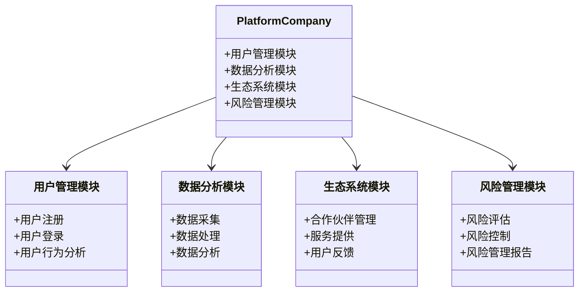
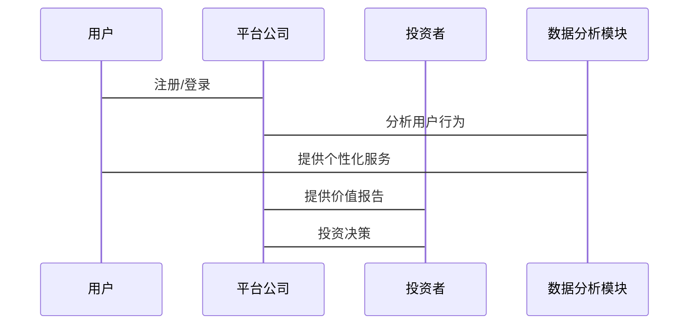

                 


# 彼得林奇的"长期价值创造"在平台型公司中的新指标

> 关键词：长期价值创造，彼得·林奇，平台型公司，投资回报，生态系统

> 摘要：本文探讨了彼得·林奇的“长期价值创造”理念在平台型公司中的应用，提出了适用于平台型公司的新指标。通过分析长期价值创造的核心概念、平台型公司的特征、价值创造与投资回报的关系，结合实际案例，提出了新的价值评估指标，并详细阐述了实现长期价值创造的路径。

---

## 第一部分：背景介绍

### 第1章：长期价值创造的核心概念

#### 1.1 问题背景
在当今快速变化的商业环境中，企业需要关注长期价值的创造，而不仅仅是短期收益。特别是在平台型公司中，长期价值创造不仅是企业发展的关键，也是投资者关注的重点。彼得·林奇作为投资大师，其长期价值创造的理念为平台型公司提供了重要的借鉴。

#### 1.2 问题描述
传统的企业发展模式往往关注短期利润，而忽视了长期的价值积累。平台型公司由于其独特的商业模式，可以通过网络效应和生态系统建设实现长期价值创造。然而，如何衡量和实现这一目标仍是一个挑战。

#### 1.3 解决方法
通过引入新的价值评估指标，结合彼得·林奇的长期价值创造理念，帮助平台型公司更好地实现长期价值创造。

#### 1.4 边界与外延
长期价值创造的边界在于企业与投资者之间的长期共赢关系，外延则包括企业内部的创新能力和外部生态系统的建设。

---

## 第二部分：核心概念

### 第2章：彼得·林奇的长期价值创造理念

#### 2.1 核心原理
彼得·林奇强调长期投资和价值创造，认为企业应注重长期的盈利能力和社会价值。这与平台型公司的特点高度契合。

#### 2.2 平台型公司特征
平台型公司具有网络效应、生态系统建设和数据驱动的特点，这些特点为长期价值创造提供了基础。

#### 2.3 价值创造与投资回报的关系
长期价值创造能够为投资者带来持续的投资回报，而投资者的支持也为平台型公司提供了发展的动力。

---

## 第三部分：算法与数学模型

### 第3章：价值评估模型的设计与实现

#### 3.1 算法原理
价值评估模型基于彼得·林奇的长期价值创造理念，结合平台型公司的特征，设计了一个多维度的价值评估指标。

#### 3.2 代码实现
```python
def value_assessment(platform_data):
    # 数据预处理
    features = platform_data[['用户增长', '收入增长', '创新能力', '网络效应']]
    # 特征标准化
    features_normalized = (features - features.mean()) / features.std()
    # 计算综合价值指数
    value_index = features_normalized.dot([0.4, 0.3, 0.2, 0.1])
    return value_index
```

#### 3.3 数学模型
$$
\text{综合价值指数} = 0.4 \times \text{用户增长} + 0.3 \times \text{收入增长} + 0.2 \times \text{创新能力} + 0.1 \times \text{网络效应}
$$

---

## 第四部分：系统架构设计

### 第4章：平台型公司的系统架构

#### 4.1 系统功能设计
平台型公司的系统架构包括用户管理、数据分析、生态系统建设和风险管理模块。

#### 4.2 类图设计


#### 4.3 接口设计
平台型公司需要与用户、合作伙伴和投资者建立高效的接口，确保信息的流畅传递和系统的正常运行。

#### 4.4 交互流程


---

## 第五部分：项目实战

### 第5章：价值创造的实现路径

#### 5.1 环境安装
读者需要安装Python和相关数据处理库（如Pandas、NumPy）。

#### 5.2 核心代码实现
```python
import pandas as pd
import numpy as np

# 示例数据
data = {
    '用户增长': [100, 150, 200, 250],
    '收入增长': [50, 70, 90, 110],
    '创新能力': [80, 90, 70, 85],
    '网络效应': [0.8, 0.9, 0.7, 0.85]
}
platform_data = pd.DataFrame(data)

# 调用价值评估函数
value_index = value_assessment(platform_data)
print(value_index)
```

#### 5.3 案例分析
以某平台型公司为例，分析其如何通过用户增长和网络效应实现长期价值创造。

---

## 第六部分：总结

### 第6章：长期价值创造的实现与展望

#### 6.1 总结
本文结合彼得·林奇的长期价值创造理念，提出了适用于平台型公司的新指标，并通过算法和系统架构设计为其实现提供了技术支持。

#### 6.2 最佳实践
平台型公司应注重用户增长和生态系统建设，同时加强风险管理，确保长期价值创造的实现。

#### 6.3 注意事项
在实际应用中，需根据具体情况调整价值评估模型和系统架构设计。

#### 6.4 拓展阅读
推荐阅读彼得·林奇的投资著作，深入理解长期价值创造的理念。

---

## 作者信息

作者：AI天才研究院/AI Genius Institute & 禅与计算机程序设计艺术 /Zen And The Art of Computer Programming

---

通过以上结构，文章详细探讨了彼得·林奇的长期价值创造理念在平台型公司中的应用，结合理论分析和实际案例，提出了新的价值评估指标，并通过系统架构设计和技术实现为读者提供了全面的解决方案。

