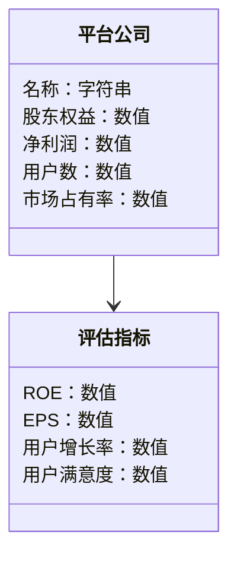
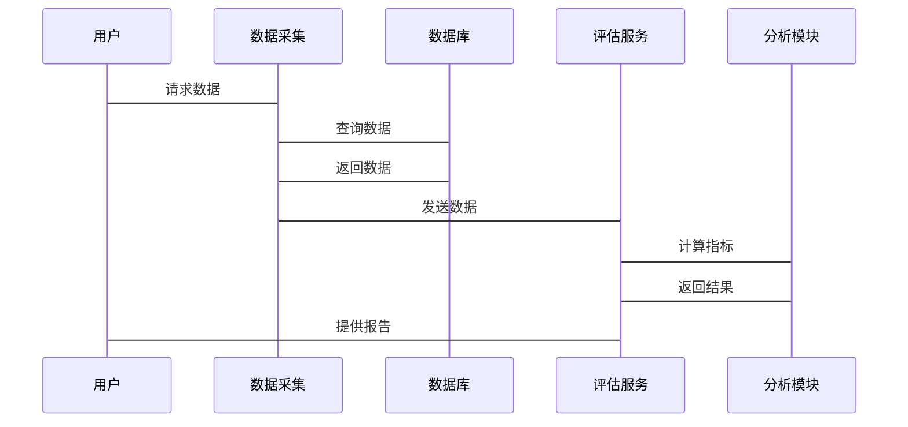

                 


---

# 彼得林奇的"长期价值创造"在平台型公司中的衡量

## 关键词
- 彼得·林奇
- 长期价值创造
- 平台型公司
- 价值衡量
- 投资策略

## 摘要
本文深入探讨了彼得·林奇的长期价值创造理念，并分析其在平台型公司中的具体应用和衡量方法。通过结合财务指标、非财务指标及系统架构设计，文章为读者提供了全面的分析框架，帮助投资者和企业管理者更好地评估平台型公司的长期价值。

---

# 第一部分: 彼得林奇的"长期价值创造"概述

## 第1章: 长期价值创造的定义与背景

### 1.1 长期价值创造的核心概念

#### 1.1.1 长期价值创造的定义
长期价值创造是指企业在长期经营过程中，通过优化资源分配、创新商业模式、提升效率和用户体验，为股东、客户、员工和社会创造持续价值的过程。

#### 1.1.2 长期价值创造的背景与重要性
在经济全球化和信息化的今天，企业竞争日益激烈，仅关注短期利润无法持续发展。长期价值创造强调企业与利益相关者之间的共生关系，是企业基业长青的关键。

#### 1.1.3 长期价值创造与投资的关系
长期价值创造是投资成功的核心，投资者通过识别和投资于能持续创造价值的企业，实现长期收益。

### 1.2 彼得·林奇的投资理念

#### 1.2.1 彼得·林奇的生平简介
彼得·林奇是富达投资的传奇经理人，以其卓越的投资业绩闻名。他的成功在于深入研究企业基本面，寻找能够长期创造价值的公司。

#### 1.2.2 彼得·林奇的价值投资策略
林奇强调买入并持有优质股票，关注企业的基本面，如盈利能力、管理团队和行业地位，避免短期市场波动的干扰。

#### 1.2.3 彼得·林奇对长期价值创造的贡献
林奇的策略强调长期价值，而非短期收益，为投资者提供了识别和投资于真正具有长期价值创造能力的企业的框架。

---

## 第2章: 平台型公司的特点与优势

### 2.1 平台型公司的定义

#### 2.1.1 平台型公司的基本定义
平台型公司通过构建平台，连接供需双方，提供撮合交易或增值服务，形成双边市场。

#### 2.1.2 平台型公司的核心特征
- **双边市场**：连接两个或多个用户群体。
- **网络效应**：用户数量增加，平台价值提升。
- **数据驱动**：通过数据分析优化运营。

#### 2.1.3 平台型公司与传统企业的区别
平台型公司依赖于用户生成内容和数据，传统企业主要通过生产或服务直接创造价值。

### 2.2 平台型公司的优势

#### 2.2.1 规模效应
平台型公司通过降低边际成本，实现用户增长的 economies of scale。

#### 2.2.2 网络效应
用户数量增加，平台价值呈指数级增长，形成正反馈循环。

#### 2.2.3 数据驱动的优势
通过收集和分析用户数据，平台优化产品和服务，提升用户体验。

---

## 第3章: 长期价值创造在平台型公司的应用

### 3.1 平台型公司的长期价值创造目标

#### 3.1.1 股东价值最大化
通过持续增长和利润分配，为股东创造长期回报。

#### 3.1.2 用户价值最大化
提升用户满意度和忠诚度，增强平台粘性。

#### 3.1.3 员工价值最大化
通过提供良好的职业发展和工作环境，吸引和留住优秀人才。

### 3.2 平台型公司长期价值创造的关键因素

#### 3.2.1 创新能力
持续创新商业模式和产品，保持竞争力。

#### 3.2.2 运营效率
优化流程和成本控制，提升整体运营效率。

#### 3.2.3 顾客满意度
通过优质服务和用户体验，提升客户忠诚度。

---

# 第二部分: 长期价值创造的衡量指标与方法

## 第4章: 长期价值创造的衡量指标

### 4.1 财务指标

#### 4.1.1 净利润增长率
净利润增长率=(净利润增长量/净利润基期数)*100%

公式：$$净利润增长率 = \frac{\text{净利润增长量}}{\text{净利润基期数}} \times 100\%$$

#### 4.1.2 股东权益回报率（ROE）
ROE=净利润/平均股东权益

公式：$$ROE = \frac{\text{净利润}}{\text{平均股东权益}}$$

#### 4.1.3 每股收益（EPS）
EPS=净利润/普通股股数

公式：$$EPS = \frac{\text{净利润}}{\text{普通股股数}}$$

### 4.2 非财务指标

#### 4.2.1 用户增长率
用户增长率=(新增用户数/用户基数)*100%

公式：$$用户增长率 = \frac{\text{新增用户数}}{\text{用户基数}} \times 100\%$$

#### 4.2.2 用户满意度
通过调查和反馈，评估用户对平台的满意程度。

#### 4.2.3 市场占有率
市场占有率=（平台交易额/市场总交易额）*100%

公式：$$市场占有率 = \frac{\text{平台交易额}}{\text{市场总交易额}} \times 100\%$$

---

## 第5章: 彼得·林奇的长期价值创造衡量方法

### 5.1 基本面分析法

#### 5.1.1 行业分析
研究行业趋势、竞争格局和政策影响，评估平台的行业地位。

#### 5.1.2 公司分析
考察公司的财务状况、管理团队和商业模式。

#### 5.1.3 财务报表分析
分析利润表、资产负债表和现金流量表，评估公司财务健康状况。

### 5.2 股票估值法

#### 5.2.1 市盈率法
市盈率=股价/每股收益

公式：$$市盈率 = \frac{\text{股价}}{\text{每股收益}}$$

#### 5.2.2 市净率法
市净率=股价/每股净资产

公式：$$市净率 = \frac{\text{股价}}{\text{每股净资产}}$$

#### 5.2.3 股息率法
股息率=每股股息/股价

公式：$$股息率 = \frac{\text{每股股息}}{\text{股价}}$$

---

## 第6章: 平台型公司的长期价值创造评估模型

### 6.1 模型概述

#### 6.1.1 模型的构建逻辑
结合财务和非财务指标，构建多维度评估体系，全面衡量平台的长期价值。

#### 6.1.2 模型的适用范围
适用于互联网、电商、社交媒体等平台型公司。

#### 6.1.3 模型的优缺点
优点：全面性；缺点：复杂性，需大量数据支持。

### 6.2 模型的实现步骤

#### 6.2.1 数据收集与处理
收集财务数据、用户数据和市场数据，进行清洗和预处理。

#### 6.2.2 指标计算与分析
计算各项指标，分析各指标对长期价值的影响权重。

#### 6.2.3 综合评估与优化
根据指标权重，综合评估企业价值，进行模型优化。

---

## 第7章: 系统分析与架构设计

### 7.1 项目介绍

#### 7.1.1 项目背景
构建一个评估平台型公司长期价值的系统，帮助投资者和企业管理者进行决策。

#### 7.1.2 项目目标
开发一个基于长期价值创造的评估系统，提供实时数据和分析报告。

### 7.2 系统功能设计

#### 7.2.1 领域模型类图


#### 7.2.2 系统架构设计
```mermaid
container 平台型公司评估系统 {
    service 评估服务
    service 数据采集
    service 数据分析
    service 报告生成
}
```

#### 7.2.3 系统接口设计
- 数据采集接口：从数据库获取实时数据。
- 评估服务接口：计算各项指标并返回结果。
- 报告生成接口：整合数据生成评估报告。

#### 7.2.4 系统交互序列图


---

## 第8章: 项目实战

### 8.1 环境安装

#### 8.1.1 安装Python
```bash
pip install numpy pandas matplotlib
```

#### 8.1.2 安装依赖库
```bash
pip install scikit-learn
```

### 8.2 系统核心实现源代码

#### 8.2.1 数据处理代码
```python
import pandas as pd

# 读取数据
data = pd.read_csv('platform_company.csv')

# 数据清洗
data.dropna(inplace=True)
data['净利润'] = data['净利润'].astype(float)
```

#### 8.2.2 指标计算代码
```python
import numpy as np

# 计算ROE
data['ROE'] = data['净利润'] / data['股东权益']

# 计算EPS
data['EPS'] = data['净利润'] / data['普通股股数']

# 计算用户增长率
data['用户增长率'] = (data['新增用户数'] / data['用户基数']) * 100
```

#### 8.2.3 模型训练代码
```python
from sklearn.linear_model import LinearRegression

# 训练模型
model = LinearRegression()
model.fit(X, y)

# 预测长期价值
y_pred = model.predict(X_new)
```

### 8.3 代码应用解读与分析

#### 8.3.1 数据处理部分
- 读取CSV文件中的数据，清洗数据，处理异常值和缺失值。

#### 8.3.2 指标计算部分
- 计算ROE、EPS、用户增长率等指标，为模型提供输入数据。

#### 8.3.3 模型训练部分
- 使用线性回归模型，训练数据，预测平台公司的长期价值。

### 8.4 实际案例分析

#### 8.4.1 案例介绍
分析一家电商平台，计算其ROE、EPS和用户增长率，评估其长期价值。

#### 8.4.2 数据分析
- ROE为15%，EPS为2元，用户增长率为20%。

#### 8.4.3 模型预测
预测未来三年的净利润增长率和市场占有率。

### 8.5 项目小结
通过实战项目，验证了模型的有效性，为平台型公司的长期价值评估提供了可行的方法。

---

## 第9章: 总结与展望

### 9.1 总结

#### 9.1.1 核心内容回顾
本文详细探讨了彼得·林奇的长期价值创造理念，并分析其在平台型公司的应用。通过多维度的衡量指标和系统架构设计，为投资者和企业管理者提供了有效的评估工具。

#### 9.1.2 实践意义
帮助投资者识别和投资于具有长期价值创造能力的平台型公司，促进企业的可持续发展。

### 9.2 展望

#### 9.2.1 研究方向
未来可进一步研究动态指标和实时评估模型，提升评估的准确性和及时性。

#### 9.2.2 技术发展
随着AI和大数据技术的进步，长期价值评估将更加精准和智能化。

---

## 第10章: 最佳实践与注意事项

### 10.1 最佳实践 tips

#### 10.1.1 定期评估
定期更新数据和指标，确保评估结果的准确性。

#### 10.1.2 综合分析
结合财务和非财务指标，进行全面评估。

#### 10.1.3 风险控制
建立风险管理机制，降低投资风险。

### 10.2 注意事项

#### 10.2.1 数据质量
确保数据的准确性和完整性，避免错误分析。

#### 10.2.2 指标选择
根据公司特点选择合适的指标，避免一刀切。

#### 10.2.3 持续学习
关注行业动态和新技术，不断提升评估能力。

---

## 第11章: 结语

### 11.1 小结
彼得·林奇的长期价值创造理念为平台型公司的评估提供了重要指导。通过多维度的衡量指标和系统的架构设计，投资者和企业管理者能够更准确地评估公司的长期价值。

### 11.2 留言
长期价值创造是一个持续的过程，需要企业、投资者和社会的共同努力。希望本文能为读者提供有价值的见解和实践指导。

---

## 作者信息

作者：AI天才研究院/AI Genius Institute & 禅与计算机程序设计艺术 /Zen And The Art of Computer Programming

---

通过以上内容，读者可以全面理解彼得·林奇的长期价值创造理念，并掌握其在平台型公司的应用和衡量方法。

