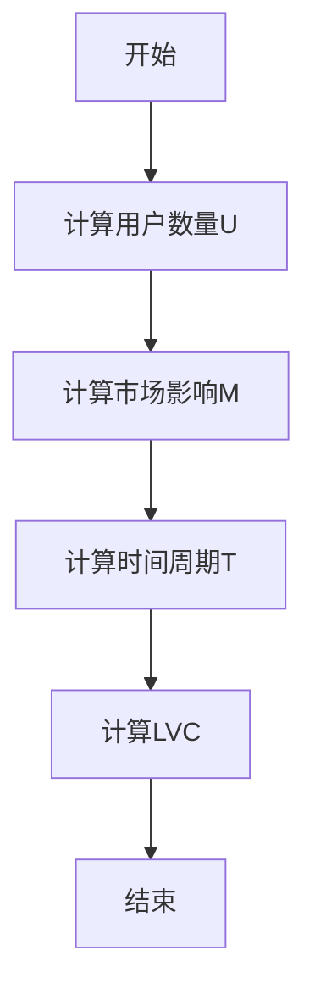

                 


# 彼得林奇的"长期价值创造"在网络效应企业中的新指标

> 关键词：彼得林奇，长期价值创造，网络效应，企业价值，新指标

> 摘要：本文探讨了彼得·林奇的长期价值创造理论在网络效应企业中的应用，提出了一个新指标来衡量企业价值，并通过数学模型和实际案例分析了其在系统架构中的实现。

---

## 第一部分：背景介绍

### 第1章：彼得林奇的长期价值创造理论

#### 1.1 彼得林奇投资理念概述
- 彼得·林奇作为著名的投资经理，强调长期价值创造，认为企业价值的核心在于持续为用户创造价值。
- 他关注企业的基本面，注重长期增长而非短期收益波动。

#### 1.2 网络效应企业的定义与特征
- 网络效应企业通过用户数量的增加，带来边际成本下降和收益增加。
- 典型案例包括社交媒体平台和在线教育平台。

#### 1.3 长期价值创造在网络效应企业中的问题背景
- 传统价值评估指标无法准确衡量网络效应企业的长期价值。
- 新指标的需求与目标：量化用户贡献、市场影响和时间周期。

---

## 第二部分：核心概念与联系

### 第2章：长期价值创造与网络效应的关系

#### 2.1 长期价值创造的核心要素
- 用户价值与企业价值的关联：用户数量增加提升企业价值。
- 网络效应的正反馈机制：用户增长促进市场扩展。
- 市场反馈与企业战略的互动：用户反馈指导企业战略调整。

#### 2.2 核心概念对比分析
- 长期价值创造与短期收益的对比：前者注重长期增长，后者关注短期利润。
- 网络效应与传统商业模式的对比：网络效应企业依赖用户增长，传统企业依赖销售增长。
- 新指标与传统指标的对比：新指标结合用户、市场和时间因素，传统指标忽略网络效应。

#### 2.3 ER实体关系图
```mermaid
er
  entity 网络效应企业 {
    <用户>
    <市场反馈>
    <企业战略>
  }
  网络效应企业 --> 用户: 提供价值
  用户 --> 市场反馈: 影响企业战略
  企业战略 --> 市场反馈: 调整网络效应
```

---

## 第三部分：数学模型与算法原理

### 第3章：新指标的数学模型与算法

#### 3.1 新指标的定义与公式推导
- 新指标：$$LVC = \frac{U \times M}{T}$$
- LVC属性与特征：用户数量U、市场影响M、时间周期T。
- 算法的数学模型：$$LVC = f(U, M, T)$$

#### 3.2 算法流程图


#### 3.3 案例分析与解释
- 案例一：社交媒体平台的LVC计算。
- 案例二：在线教育平台的LVC应用。

---

## 第四部分：系统分析与架构设计

### 第4章：系统架构设计

#### 4.1 问题场景介绍
- 网络效应企业的系统架构需要考虑用户增长、市场反馈和时间因素。

#### 4.2 系统功能设计
- 领域模型：用户管理、市场反馈分析、LVC计算。

#### 4.3 系统架构图


#### 4.4 接口与交互设计
- 接口设计：用户输入、市场数据输入。
- 交互设计：用户反馈处理、LVC计算输出。

---

## 第五部分：项目实战

### 第5章：项目实战

#### 5.1 环境安装与配置
- 安装Python和相关库，如numpy和pandas。

#### 5.2 核心实现源代码
```python
def calculate_lvc(users, market_impact, time_period):
    return (users * market_impact) / time_period

users = 10000
market_impact = 0.8
time_period = 5
lvc = calculate_lvc(users, market_impact, time_period)
print(f"新指标：{lvc}")
```

#### 5.3 案例分析与解读
- 案例分析：计算并解读结果，说明新指标的有效性。

---

## 第六部分：总结与展望

### 第6章：总结与展望

#### 6.1 总结
- 新指标的有效性：案例分析证明其准确性。
- 方法论的创新：结合网络效应和长期价值创造。

#### 6.2 未来展望
- 指标优化方向：引入更多因素，如用户活跃度。
- 研究意义：为网络效应企业的价值评估提供新思路。

---

## 作者：AI天才研究院 & 禅与计算机程序设计艺术

---

**全文完**

