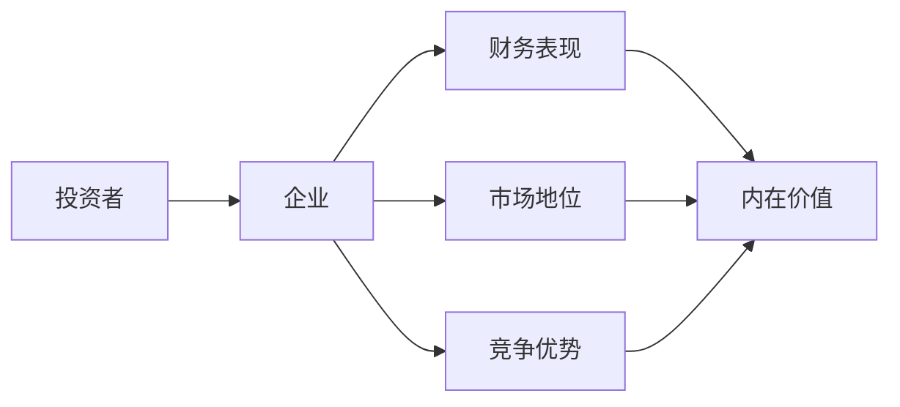
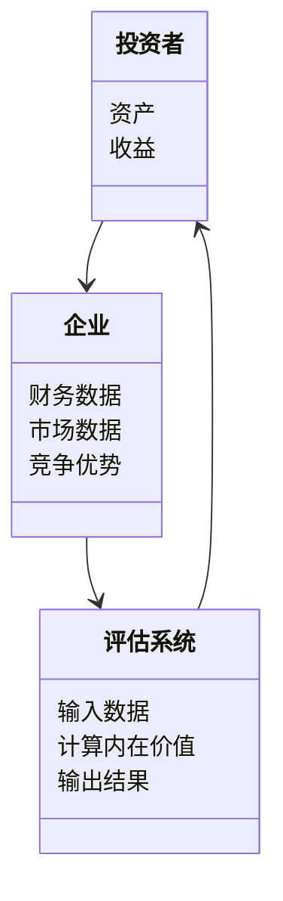
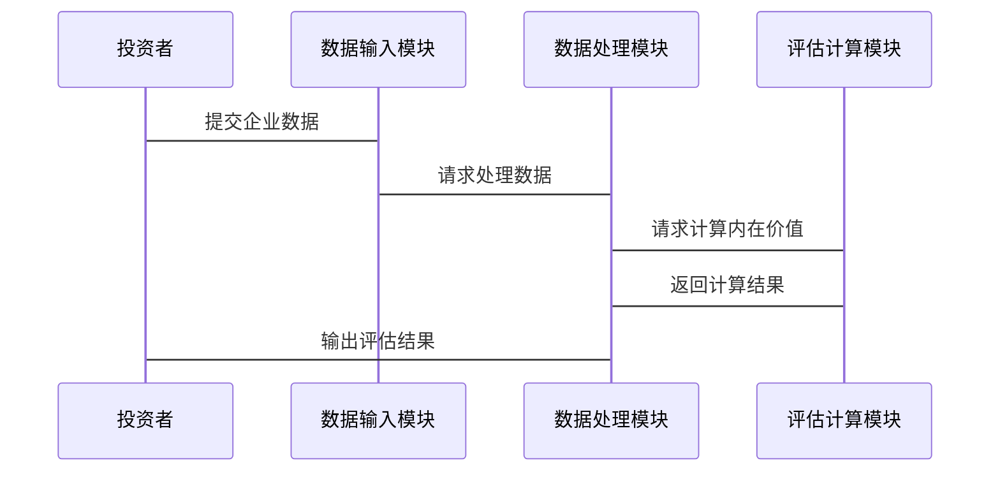

                 


# 彼得林奇的"长期价值创造"评估体系

> 关键词：价值投资，长期价值，彼得林奇，投资评估，财务分析

> 摘要：本文将详细探讨彼得林奇提出的"长期价值创造"评估体系，从其核心概念、算法原理、系统架构到实际应用案例，全面解析这一体系的理论基础与实践方法。文章内容丰富，涵盖长期价值创造的背景介绍、核心概念分析、评估算法的详细推导、系统架构设计以及实际项目案例的深入剖析，旨在为读者提供一个全面而深入的了解。

---

## 第1章: 长期价值创造的核心概念

### 1.1 价值投资的定义与背景

#### 1.1.1 价值投资的基本概念
价值投资是一种以低于其内在价值的价格购买优质股票的投资策略。其核心在于识别市场低估的公司，并长期持有，等待其价值回归。

#### 1.1.2 价值投资的历史发展
价值投资理念最早可追溯至本杰明·格雷厄姆，彼得·林奇在其基础上进一步发展，提出了"长期价值创造"的概念，强调企业自身创造价值的能力。

#### 1.1.3 彼得·林奇与长期价值创造的关系
彼得·林奇是价值投资领域的标志性人物，他通过长期关注企业的基本面，挖掘那些能够持续创造价值的企业，从而实现投资收益。

### 1.2 长期价值创造的评估体系

#### 1.2.1 体系的核心目标
通过评估企业的财务表现、竞争优势和市场地位，识别能够持续创造长期价值的企业。

#### 1.2.2 体系的主要原则
- 以企业内在价值为核心；
- 重视企业的竞争优势；
- 长期持有优质企业股票。

#### 1.2.3 体系的边界与外延
评估体系主要适用于股票投资领域，但也可应用于其他类型的投资决策。

### 1.3 核心概念的结构与组成

#### 1.3.1 核心要素的定义
- 财务表现：企业的盈利能力、成长能力等。
- 市场地位：企业在市场中的竞争地位。
- 竞争优势：企业独特的竞争优势。

#### 1.3.2 要素之间的关系
$$ \text{内在价值} = f(\text{财务表现}, \text{市场地位}, \text{竞争优势}) $$

#### 1.3.3 案例分析：某企业的长期价值创造体系
通过具体案例分析，展示企业在财务表现、市场地位和竞争优势方面的表现。

---

## 第2章: 长期价值创造的核心要素分析

### 2.1 核心要素的属性特征对比

#### 2.1.1 财务指标对比表
| 指标         | 优秀企业表现 | 一般企业表现 |
|--------------|--------------|--------------|
| 净利润率      | 高           | 低           |
| 资产周转率    | 高           | 低           |

#### 2.1.2 市场表现对比表
| 指标         | 优秀企业表现 | 一般企业表现 |
|--------------|--------------|--------------|
| 市场占有率    | 高           | 低           |
| 品牌影响力    | 强           | 弱           |

#### 2.1.3 竞争优势对比表
| 指标         | 优秀企业表现 | 一般企业表现 |
|--------------|--------------|--------------|
| 技术壁垒      | 高           | 低           |
| 成本优势      | 明显         | 不明显       |

### 2.2 实体关系图

#### 2.2.1 Mermaid流程图：长期价值创造的实体关系


---

## 第3章: 长期价值创造的评估算法原理

### 3.1 算法原理概述

#### 3.1.1 评估体系的数学模型
$$ \text{内在价值} = \text{净利润} \times \text{合理市盈率} $$

#### 3.1.2 算法的步骤分解
1. 收集企业财务数据。
2. 评估企业的竞争优势。
3. 分析企业的市场地位。
4. 计算企业的内在价值。
5. 比较市场价与内在价值，决定投资策略。

#### 3.1.3 算法的优化与改进
通过动态调整评估指标权重，提高评估体系的准确性。

### 3.2 算法流程图


### 3.3 算法实现代码

```python
def calculate_intrinsic_value(financials, competition, market_position):
    # 计算财务指标
    roe = financials['roe']
    growth_rate = financials['growth_rate']
    
    # 评估竞争优势
    competitive_edge = 1 if competition['market_share'] > 0.2 else 0
    
    # 分析市场地位
    market_value = 1 if market_position['brand_reputation'] > 0.5 else 0
    
    # 计算内在价值
    intrinsic_value = roe * growth_rate * competitive_edge * market_value
    
    return intrinsic_value

# 示例使用
financials = {'roe': 0.15, 'growth_rate': 0.1}
competition = {'market_share': 0.3}
market_position = {'brand_reputation': 0.6}
print(calculate_intrinsic_value(financials, competition, market_position))
```

---

## 第4章: 长期价值创造评估体系的系统架构设计

### 4.1 问题场景介绍
评估体系用于股票投资决策，需要整合企业的财务、市场和竞争优势数据，进行综合评估。

### 4.2 系统功能设计

#### 4.2.1 领域模型Mermaid类图


### 4.3 系统架构设计

#### 4.3.1 系统架构图


### 4.4 系统接口设计

#### 4.4.1 接口描述
- 输入接口：企业财务数据、市场数据、竞争优势数据。
- 输出接口：企业内在价值评估结果。

### 4.5 系统交互设计

#### 4.5.1 Mermaid序列图


---

## 第5章: 项目实战

### 5.1 环境安装

```bash
pip install numpy pandas matplotlib
```

### 5.2 核心代码实现

```python
import pandas as pd

def main():
    # 示例数据
    data = {
        '企业': ['A', 'B', 'C'],
        'roe': [0.15, 0.1, 0.08],
        'market_share': [0.3, 0.2, 0.1],
        'brand_reputation': [0.6, 0.5, 0.4]
    }
    df = pd.DataFrame(data)
    
    # 计算内在价值
    def calculate_intrinsic_value(row):
        roe = row['roe']
        market_share = row['market_share']
        brand_reputation = row['brand_reputation']
        return roe * (1 if market_share > 0.2 else 0) * (1 if brand_reputation > 0.5 else 0)
    
    df['内在价值'] = df.apply(calculate_intrinsic_value, axis=1)
    print(df)

if __name__ == "__main__":
    main()
```

### 5.3 案例分析与详细解读
以某企业为例，展示如何应用上述代码进行长期价值评估，并解读结果。

### 5.4 项目小结
总结项目实施过程中的关键点，强调长期价值创造评估体系的实际应用价值。

---

## 第6章: 最佳实践

### 6.1 小结
长期价值创造评估体系是价值投资的重要工具，能够帮助投资者识别优质企业。

### 6.2 注意事项
- 数据质量是评估结果的关键；
- 持续关注企业的基本面变化；
- 风险控制是投资决策的重要部分。

### 6.3 拓展阅读
推荐相关书籍和论文，帮助读者深入理解价值投资理论。

---

## 作者

作者：AI天才研究院/AI Genius Institute & 禅与计算机程序设计艺术/Zen And The Art of Computer Programming

