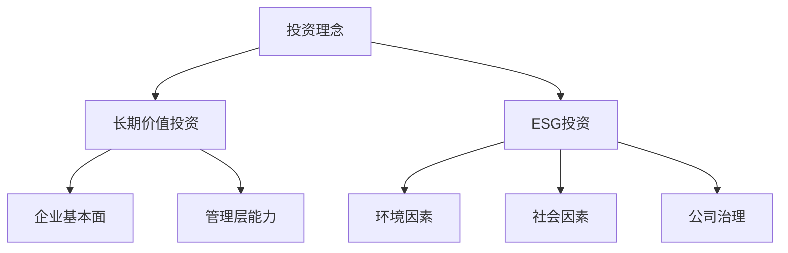
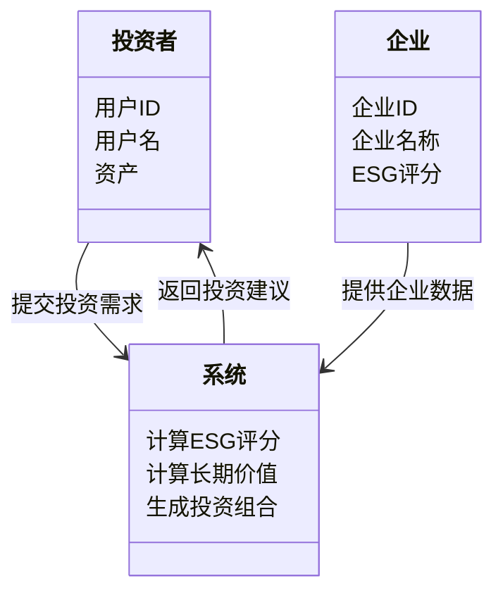

                 


# 彼得林奇的"长期价值"在ESG投资中的体现

> 关键词：长期价值投资、ESG投资、彼得林奇、可持续发展、投资策略

> 摘要：本文探讨了彼得林奇的长期价值投资理念在ESG投资中的应用，通过分析长期价值投资的核心要素和ESG投资的三维度，结合实际案例和数学模型，详细阐述了两者如何结合以实现可持续的财富增长。

---

## 第一部分：背景介绍

### 第1章：彼得林奇的长期价值投资理念

#### 1.1 长期价值投资的核心概念

- **1.1.1 什么是长期价值投资**  
  长期价值投资是一种以长期持有优质企业股票为核心策略的投资方式。它强调通过深入研究企业的基本面，选择那些具有持续盈利能力、强大管理层和良好行业地位的公司进行投资。彼得林奇是这一理念的代表人物，他主张投资者应该关注企业的内在价值，而非短期市场波动。

- **1.1.2 彼得林奇的投资哲学**  
  彼得林奇认为，成功的投资不在于预测市场波动，而在于选择那些具有强大竞争优势和良好管理的企业。他提倡投资者进行深入的基本面分析，关注企业的财务状况、行业地位和管理层能力。

- **1.1.3 长期价值投资的三大原则**  
  1. **选择优秀企业**：投资于具有强大竞争优势和持续盈利能力的企业。  
  2. **长期持有**：避免频繁交易，减少交易成本和税务负担。  
  3. **分散投资**：通过投资于多个优秀企业来降低风险。

#### 1.2 ESG投资的基本概念

- **1.2.1 ESG的定义与内涵**  
  ESG是环境（Environmental）、社会（Social）和公司治理（Governance）的缩写。ESG投资要求企业在追求经济效益的同时，兼顾环境和社会责任，注重公司治理结构的完善。

- **1.2.2 ESG投资的起源与发展**  
  ESG投资起源于20世纪60年代的社会责任投资运动，随着全球环境问题和社会问题的加剧，ESG投资逐渐受到更多关注。近年来，随着气候变化和企业社会责任意识的增强，ESG投资成为全球投资的重要趋势。

- **1.2.3 ESG与传统投资的区别**  
  传统投资主要关注企业的财务表现和市场地位，而ESG投资则将环境、社会和治理因素纳入考虑范围，强调企业的可持续发展能力。

#### 1.3 长期价值与ESG投资的结合

- **1.3.1 长期价值与ESG的内在联系**  
  长期价值投资关注企业的持续盈利能力，而ESG投资关注企业的可持续发展能力。两者在追求长期收益方面有共同的目标，即选择那些能够在未来持续创造价值的企业。

- **1.3.2 彼得林奇理念如何影响ESG投资**  
  彼得林奇的长期价值投资理念强调企业的基本面和管理层能力，这些因素与ESG投资中的公司治理和社会责任密切相关。通过将ESG因素纳入长期价值评估，投资者可以选择那些不仅财务表现优秀，而且在社会责任和环境表现方面表现良好的企业。

- **1.3.3 ESG投资的长期价值视角**  
  从长期价值的角度来看，ESG投资不仅仅是追求短期的市场收益，而是通过选择具有可持续发展能力的企业，实现长期的财富增长。这种投资策略不仅符合彼得林奇的长期价值理念，也符合全球可持续发展的趋势。

---

## 第二部分：核心概念与联系

### 第2章：长期价值投资与ESG投资的核心要素

#### 2.1 核心概念原理

- **2.1.1 长期价值投资的三要素：企业基本面、管理层能力和行业地位**  
  企业基本面包括财务状况、盈利能力、资产负债情况等。管理层能力包括管理团队的经验、战略规划和决策能力。行业地位包括企业在行业中的竞争地位、市场占有率等。

- **2.1.2 ESG投资的三维度：环境、社会和公司治理**  
  环境因素包括企业的碳排放、资源利用效率、环保政策遵守情况等。社会因素包括企业对员工权益、社会责任、社区贡献等方面的表现。公司治理包括董事会结构、管理层透明度、内部控制机制等。

#### 2.2 核心概念属性对比表

| 概念       | 长期价值投资 | ESG投资 |
|------------|--------------|---------|
| 核心目标   | 实现财富增值 | 促进可持续发展 |
| 关注重点   | 企业盈利能力 | ESG表现 |
| 投资策略   | 长期持有优质企业 | 选择高ESG评级企业 |

#### 2.3 实体关系图（Mermaid）



---

## 第三部分：算法原理讲解

### 第3章：ESG评分算法与长期价值评估模型

#### 3.1 ESG评分算法

- **3.1.1 算法概述：基于因子分析的ESG评分方法**  
  ESG评分算法通过对企业在环境、社会和治理三个维度的表现进行量化评估，得出企业的ESG评级。常用的方法包括因子分析、回归分析和聚类分析等。

- **3.1.2 算法流程**

  1. 数据收集：收集企业在环境、社会和治理方面的相关数据，包括碳排放、社会责任报告、公司治理结构等。  
  2. 数据预处理：对数据进行清洗、标准化和归一化处理。  
  3. 指标权重确定：根据行业特点和投资目标，确定各指标的权重。  
  4. 计算得分：通过加权计算得出企业在每个维度的得分，最终得出综合ESG评级。

#### 3.2 长期价值评估模型

- **3.2.1 模型概述：基于彼得林奇理念的长期价值评估**  
  长期价值评估模型通过对企业基本面、管理层能力和行业地位进行综合评估，判断企业的长期盈利能力。

- **3.2.2 模型公式**  

  $$ \text{长期价值} = \text{企业基本面} \times \text{管理层能力} \times \text{行业地位} $$

- **3.2.3 实例分析**  
  假设某企业基本面得分为80，管理层能力得分为90，行业地位得分为70，则其长期价值得分为：  
  $$ 80 \times 90 \times 70 = 504,000 $$  

---

## 第四部分：系统分析与架构设计方案

### 第4章：ESG投资系统的应用场景与架构设计

#### 4.1 项目介绍

- **4.1.1 项目目标**  
  开发一个基于长期价值理念的ESG投资系统，帮助投资者选择具有可持续发展能力的企业。

- **4.1.2 项目范围**  
  系统将提供企业ESG评分、长期价值评估、投资组合优化等功能。

#### 4.2 系统功能设计（领域模型Mermaid类图）



#### 4.3 系统架构设计（Mermaid架构图）


---

## 第五部分：项目实战

### 第5章：基于长期价值理念的ESG投资实战

#### 5.1 环境安装

- 安装Python和必要的库（如Pandas、NumPy、Scikit-learn等）。

#### 5.2 核心实现源代码

```python
import pandas as pd
import numpy as np

def calculate_esg_score(data):
    # 数据预处理
    data = data.dropna()
    data = (data - data.min()) / (data.max() - data.min())
    # 计算ESG评分
    weights = [0.4, 0.3, 0.3]
    esg_scores = np.dot(data, weights)
    return esg_scores

# 示例数据
data = pd.DataFrame({
    '环境因素': [0.8, 0.6, 0.9],
    '社会因素': [0.7, 0.5, 0.8],
    '公司治理': [0.6, 0.7, 0.5]
})

esg_scores = calculate_esg_score(data)
print(esg_scores)
```

#### 5.3 实例分析

- 以某企业为例，计算其ESG评分和长期价值评分，分析其是否符合长期价值投资的标准。

---

## 第六部分：最佳实践

### 第6章：ESG投资与长期价值投资的结合策略

#### 6.1 小结

- 通过本文的分析，我们可以看到，彼得林奇的长期价值投资理念与ESG投资具有高度的契合性。将ESG因素纳入长期价值评估，可以帮助投资者选择那些具有可持续发展能力的企业，实现长期的财富增长。

#### 6.2 注意事项

- 投资者在进行ESG投资时，需要关注企业的长期基本面和管理层能力，避免仅关注短期的ESG评级。  
- 在实际操作中，应结合具体的行业特点和市场环境，灵活调整投资策略。

#### 6.3 拓展阅读

- 彼得林奇的《投资最重要的事情》  
- 联合国可持续发展目标（SDGs）  

---

## 作者：AI天才研究院/AI Genius Institute & 禅与计算机程序设计艺术 /Zen And The Art of Computer Programming

---

**本文由AI天才研究院与“禅与计算机程序设计艺术”联合出品，转载请注明出处。**

