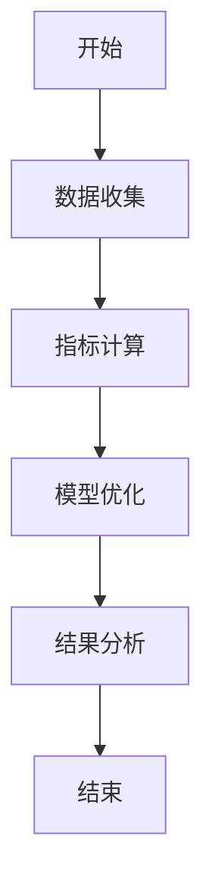
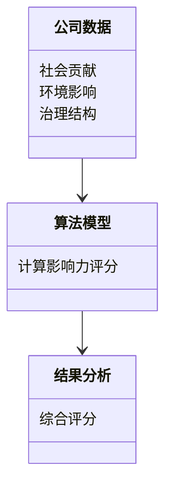
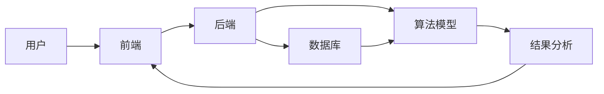
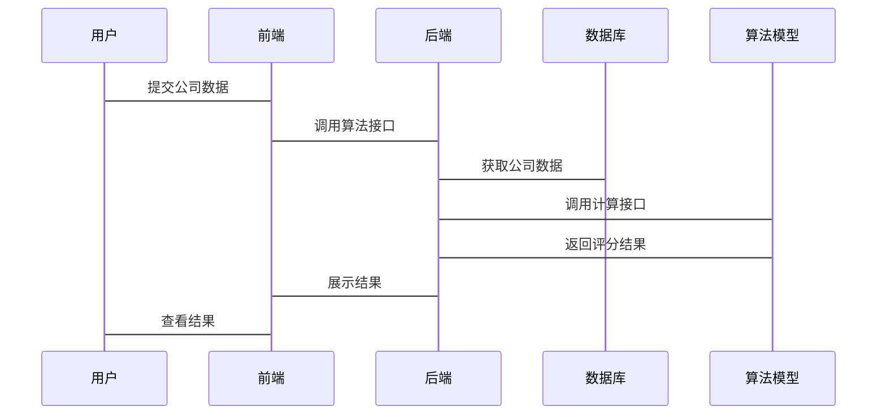

                 


# 彼得林奇的"长期价值"在影响力投资中的新定义与衡量

---

## 关键词：
- 彼得林奇，长期价值，影响力投资，投资策略，可持续发展

---

## 摘要：
本文探讨了彼得林奇的长期价值理念在影响力投资中的新定义与衡量方法。通过分析长期价值与影响力投资的核心要素，结合数学模型和实际案例，提出了量化长期价值的新方法。文章还讨论了技术驱动的影响力评估和数据驱动的可持续发展策略，为投资者提供了优化路径。

---

## 目录：

### 第1章: 影响力投资的核心概念
1.1 影响力投资的定义与背景
1.2 影响力投资的理论基础
1.3 影响力投资与长期价值的结合

### 第2章: 彼得林奇的长期价值理念
2.1 长期价值的核心要素
2.2 影响力投资的长期价值框架
2.3 影响力投资与长期价值的对比分析

### 第3章: 影响力投资的衡量体系
3.1 影响力投资的评估指标
3.2 综合评估模型的设计
3.3 数学模型的应用

### 第4章: 影响力投资的算法原理
4.1 算法原理概述
4.2 算法流程图
4.3 Python代码实现

### 第5章: 系统分析与架构设计
5.1 系统应用场景
5.2 领域模型设计
5.3 系统架构图
5.4 系统接口设计

### 第6章: 项目实战与案例分析
6.1 环保领域的影响力投资案例
6.2 项目核心代码实现
6.3 案例分析与解读

### 第7章: 影响力投资的未来发展趋势
7.1 技术驱动的影响力评估
7.2 数据驱动的可持续发展
7.3 全球化视角下的影响力投资

### 第8章: 影响力投资的伦理与责任
8.1 投资者的伦理责任
8.2 社会公平与正义
8.3 企业社会责任与影响力投资

### 第9章: 总结与展望
9.1 小结
9.2 注意事项
9.3 拓展阅读

---

## 第1章: 影响力投资的核心概念

### 1.1 影响力投资的定义与背景
影响力投资是一种关注经济和社会影响力的新型投资方式，旨在通过投资实现经济回报和社会价值的双重目标。与传统投资不同，影响力投资更注重企业在社会、环境和治理方面的贡献。

### 1.2 影响力投资的理论基础
影响力投资的理论基础包括可持续发展理论、环境、社会和治理（ESG）框架，以及社会责任投资（SRI）等。这些理论为影响力投资提供了坚实的学术支持。

### 1.3 影响力投资与长期价值的结合
彼得林奇的长期价值理念强调企业在未来能为股东创造的持续价值。将这一理念应用于影响力投资，意味着投资者需要关注企业在社会和环境方面带来的长期影响，而不仅仅是短期的财务回报。

---

## 第2章: 彼得林奇的长期价值理念

### 2.1 长期价值的核心要素
长期价值的核心要素包括企业的盈利能力、管理团队的稳定性、行业地位以及创新能力。这些因素共同决定了企业在未来能否持续为股东创造价值。

### 2.2 影响力投资的长期价值框架
在影响力投资中，长期价值框架需要考虑企业的社会影响力、环境影响和治理结构。通过综合评估这些因素，投资者可以更好地衡量企业的长期价值。

### 2.3 影响力投资与长期价值的对比分析
通过对比分析，我们可以发现，影响力投资更注重社会和环境因素，而传统长期价值理念更关注财务指标。两者结合起来，可以为投资者提供更全面的评估依据。

---

## 第3章: 影响力投资的衡量体系

### 3.1 影响力投资的评估指标
影响力投资的评估指标包括社会影响力指标、环境影响指标和经济影响力指标。这些指标需要综合考虑企业的社会贡献、环境影响和经济回报。

### 3.2 综合评估模型的设计
综合评估模型需要将财务指标和社会影响力指标结合起来，通过加权计算得出企业的综合评分。这种评分可以为投资者提供更全面的参考。

### 3.3 数学模型的应用
通过数学模型，我们可以量化企业的社会影响力。例如，企业影响力评分公式为：
$$ \text{影响力评分} = \frac{\text{社会贡献} + \text{环境影响} + \text{治理结构}}{3} $$

---

## 第4章: 影响力投资的算法原理

### 4.1 算法原理概述
影响力投资的算法原理包括数据收集、指标计算、模型优化和结果分析。通过算法优化，我们可以更准确地评估企业的社会影响力。

### 4.2 算法流程图
以下是算法流程图：



### 4.3 Python代码实现
以下是Python代码实现：

```python
def calculate_influence_score(company_data):
    social_contribution = company_data['社会贡献']
    environmental_impact = company_data['环境影响']
    governance_structure = company_data['治理结构']
    total_score = (social_contribution + environmental_impact + governance_structure) / 3
    return total_score

# 示例数据
company_data = {
    '社会贡献': 80,
    '环境影响': 70,
    '治理结构': 90
}

score = calculate_influence_score(company_data)
print(f"影响力评分为：{score}")
```

---

## 第5章: 系统分析与架构设计

### 5.1 系统应用场景
系统应用于影响力投资的评估和决策支持，帮助投资者更准确地评估企业的社会影响力。

### 5.2 领域模型设计
以下是领域模型设计：



### 5.3 系统架构图
以下是系统架构图：



### 5.4 系统接口设计
系统接口包括数据输入接口、算法调用接口和结果展示接口。以下是接口设计：



---

## 第6章: 项目实战与案例分析

### 6.1 环保领域的影响力投资案例
以环保企业为例，分析其社会影响力和环境影响。例如，某环保企业通过减少碳排放和提高资源利用率，显著提升了社会影响力评分。

### 6.2 项目核心代码实现
以下是项目核心代码：

```python
def calculate_influence_score(company_data):
    social_contribution = company_data['社会贡献']
    environmental_impact = company_data['环境影响']
    governance_structure = company_data['治理结构']
    total_score = (social_contribution + environmental_impact + governance_structure) / 3
    return total_score

# 示例数据
company_data = {
    '社会贡献': 80,
    '环境影响': 70,
    '治理结构': 90
}

score = calculate_influence_score(company_data)
print(f"影响力评分为：{score}")
```

### 6.3 案例分析与解读
通过具体案例分析，展示如何量化企业的社会影响力。例如，某环保企业通过减少碳排放和提高资源利用率，显著提升了社会影响力评分。

---

## 第7章: 影响力投资的未来发展趋势

### 7.1 技术驱动的影响力评估
随着技术的发展，影响力评估将更加依赖数据分析和人工智能技术。通过大数据分析，投资者可以更准确地评估企业的社会影响力。

### 7.2 数据驱动的可持续发展
数据驱动的可持续发展策略将帮助投资者更好地衡量企业的长期价值。通过数据可视化和预测分析，投资者可以做出更明智的决策。

### 7.3 全球化视角下的影响力投资
影响力投资需要全球化视角，关注全球范围内的社会和环境问题。通过跨国合作和资源共享，投资者可以更好地实现可持续发展目标。

---

## 第8章: 影响力投资的伦理与责任

### 8.1 投资者的伦理责任
投资者需要承担伦理责任，关注企业的社会和环境影响。通过负责任的投资，投资者可以为社会和环境的可持续发展做出贡献。

### 8.2 社会公平与正义
影响力投资需要关注社会公平与正义，避免加剧社会不平等。通过支持弱势群体和促进社会包容，投资者可以更好地履行社会责任。

### 8.3 企业社会责任与影响力投资
企业社会责任是影响力投资的重要组成部分。通过优化治理结构和加强社会责任，企业可以提升社会影响力，实现可持续发展。

---

## 第9章: 总结与展望

### 9.1 小结
本文探讨了彼得林奇的长期价值理念在影响力投资中的新定义与衡量方法。通过分析长期价值与影响力投资的核心要素，结合数学模型和实际案例，提出了量化长期价值的新方法。

### 9.2 注意事项
在实际应用中，投资者需要关注数据的准确性和模型的可解释性。同时，需要不断优化算法，提升评估的准确性和可靠性。

### 9.3 拓展阅读
读者可以进一步阅读相关书籍和文献，深入了解影响力投资的理论与实践。例如，彼得林奇的《投资最重要的简单真理》和联合国可持续发展目标（SDGs）的相关报告。

---

## 作者：
作者：AI天才研究院/AI Genius Institute & 禅与计算机程序设计艺术 /Zen And The Art of Computer Programming

