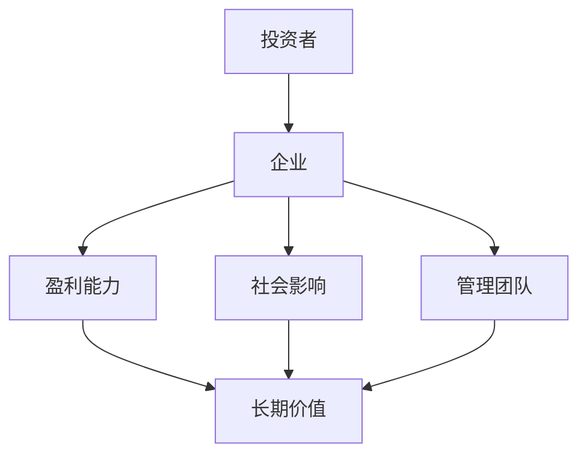
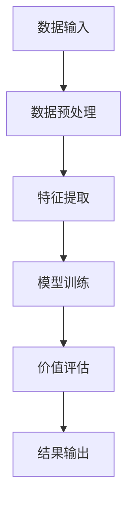
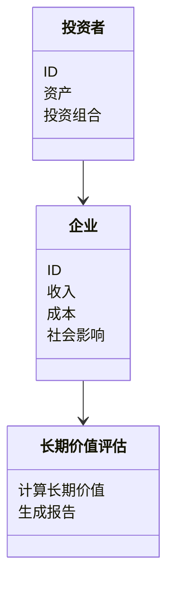
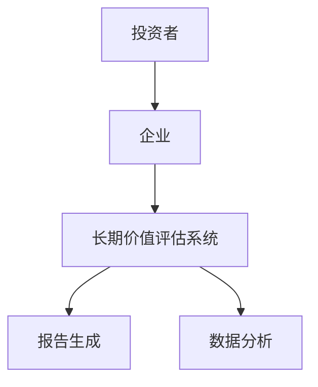

                 


# 彼得林奇的"长期价值"在社会企业投资中的新定义

> **关键词**：长期价值投资、彼得林奇、社会企业、投资评估模型、数学模型  
> **摘要**：本文深入探讨了彼得林奇的长期价值投资理论在社会企业中的新定义，分析了社会企业的特殊性质，提出了结合长期价值评估的数学模型，并通过实际案例展示了如何在社会企业中实现长期价值投资。

---

## 第一章: 彼得林奇的长期价值投资理论概述

### 1.1 长期价值投资的背景介绍

#### 1.1.1 投资领域的传统观念与挑战
传统投资理论往往关注短期收益和市场波动，这种“短视”投资策略在金融市场中导致了频繁的买卖操作和过度投机。这种传统观念忽视了企业的基本面和长期发展，容易导致市场泡沫和崩盘。

#### 1.1.2 彼得林奇投资理论的起源与发展
彼得·林奇是美国著名投资专家，他倡导的长期价值投资理念强调对企业基本面的深入研究，寻找具有持续竞争优势和良好管理的企业进行长期投资。这种理念在20世纪80年代取得了巨大成功，为投资者带来了稳定而可观的回报。

#### 1.1.3 长期价值投资的核心理念与目标
长期价值投资的核心理念是寻找那些能够持续创造价值的企业，并通过长期持有这些企业股份来实现财富增长。其目标是通过深入的企业分析和市场研究，选择那些具有长期竞争优势和社会价值的企业。

---

### 1.2 社会企业的定义与特点

#### 1.2.1 社会企业的基本定义
社会企业是一种以实现社会目标为核心使命的企业类型，其经营目的是在追求经济利益的同时，最大限度地创造社会价值。与传统企业不同，社会企业更加注重社会责任和可持续发展。

#### 1.2.2 社会企业与传统企业的区别
社会企业在目标、治理结构、财务透明度等方面与传统企业存在显著差异。社会企业更加注重社会影响评估、环境友好和员工福祉，而传统企业往往更关注短期利润。

---

### 1.3 彼得林奇长期价值理念与社会企业的结合

#### 1.3.1 长期价值投资与社会企业的契合点
社会企业的长期目标与彼得林奇的价值投资理念高度契合。社会企业追求的可持续发展和社会价值，正是长期价值投资的核心关注点。

#### 1.3.2 社会企业在传统投资理论中的位置
社会企业作为一类特殊的企业类型，在传统投资理论中并未得到充分关注。将彼得林奇的价值投资理念引入社会企业领域，有助于发现具有长期社会价值和经济价值的企业。

---

## 第二章: 社会企业投资中的长期价值评估模型

### 2.1 长期价值评估的核心概念与联系

#### 2.1.1 核心概念的原理与属性
长期价值评估的核心概念包括企业盈利能力、社会影响、管理团队、行业地位等。这些因素共同决定了企业的长期价值。

#### 2.1.2 实体关系图（ER图）展示


---

### 2.2 长期价值评估的算法原理

#### 2.2.1 投资评估模型的算法流程


#### 2.2.2 算法实现代码
```python
def calculate_long_term_value(revenue, cost, social_impact):
    # 计算企业净利润
    net_profit = revenue - cost
    # 计算长期价值
    long_term_value = net_profit * social_impact
    return long_term_value

# 示例数据
revenue = 1000000  # 收入
cost = 800000      # 成本
social_impact = 0.8  # 社会影响权重

# 计算并输出长期价值
print(f"长期价值 = ${calculate_long_term_value(revenue, cost, social_impact):.2f}")
```

---

### 2.3 数学模型与公式解析

#### 2.3.1 长期价值评估的数学模型
$$\text{长期价值} = \text{净利润} \times \text{社会影响权重}$$
其中，净利润 = 收入 - 成本。

#### 2.3.2 投资

---

## 第三章: 社会企业投资的系统分析与架构设计

### 3.1 问题场景介绍
在社会企业投资中，如何评估企业的长期价值是一个复杂的系统问题。需要考虑企业的财务状况、社会影响、管理能力等多个维度。

### 3.2 系统功能设计

#### 3.2.1 领域模型类图


### 3.3 系统架构设计

#### 3.3.1 系统架构图


---

## 第四章: 项目实战

### 4.1 环境安装与配置
需要安装Python、数据分析库（如Pandas、NumPy）和可视化工具（如Matplotlib）。

### 4.2 核心代码实现
```python
import pandas as pd

def calculate_long_term_value(df):
    df['净利润'] = df['收入'] - df['成本']
    df['长期价值'] = df['净利润'] * df['社会影响']
    return df

# 示例数据
data = {
    '企业ID': ['E1', 'E2', 'E3'],
    '收入': [1000000, 1500000, 2000000],
    '成本': [800000, 1000000, 1500000],
    '社会影响': [0.8, 0.9, 0.7]
}

df = pd.DataFrame(data)
result = calculate_long_term_value(df)
print(result)
```

---

## 第五章: 最佳实践与总结

### 5.1 最佳实践
在社会企业投资中，投资者应注重对企业社会责任和长期社会价值的评估，避免过度关注短期收益。

### 5.2 小结
本文通过分析彼得林奇的长期价值投资理念，将其应用到社会企业投资中，提出了新的长期价值评估模型，并通过实际案例展示了其应用价值。

### 5.3 注意事项
投资者在进行社会企业投资时，应充分考虑市场风险、企业治理和社会影响等多方面因素。

### 5.4 拓展阅读
推荐阅读《彼得·林奇的投资哲学》和《社会企业的崛起》等书籍。

---

**作者：AI天才研究院/AI Genius Institute & 禅与计算机程序设计艺术 /Zen And The Art of Computer Programming**

