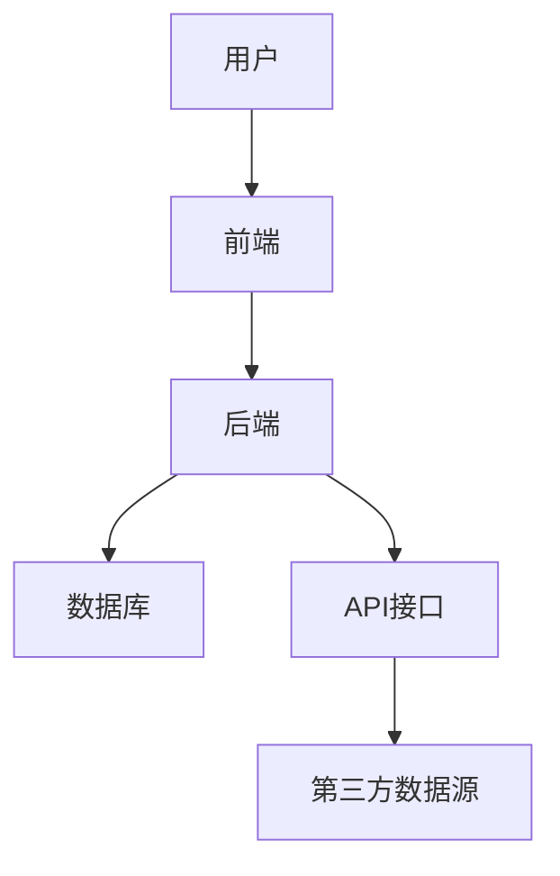

                 


# 彼得林奇的"长期价值"在社会影响力投资中的新定义

---

## 关键词：长期价值投资，社会影响力投资，彼得林奇，ESG投资，可持续发展

---

## 摘要：  
本文探讨了彼得林奇提出的“长期价值”投资理念在社会影响力投资中的新定义。通过分析长期价值与社会影响力投资的核心概念、评估模型和系统架构，本文提出了一种将传统财务回报与社会价值相结合的投资策略。结合实际案例和系统设计，本文为投资者和企业提供了实现可持续发展的实践指导。

---

## 第一章：长期价值投资的起源与演变

### 1.1 彼得林奇与长期价值投资的定义  
彼得林奇是美国著名投资经理人，他提出的长期价值投资理念强调通过深入研究企业基本面，寻找具有持续竞争优势和良好治理结构的公司进行长期投资。这种理念的核心在于关注企业的内在价值，而非短期市场波动。  

#### 长期价值投资的核心要素  
1. **企业基本面分析**：包括收入、利润、负债、现金流等财务指标。  
2. **竞争优势**：企业是否具备独特的竞争优势，如技术壁垒、品牌影响力等。  
3. **治理结构**：公司管理层的透明度、股权结构的合理性等。  

### 1.2 社会影响力投资的兴起  
社会影响力投资（Socially Responsible Investment，SRI）是一种关注环境（Environmental）、社会（Social）和治理（Governance）因素的投资方式。随着全球可持续发展目标的推进，社会影响力投资逐渐成为主流。  

#### 社会影响力投资的特征  
1. **环境因素**：关注企业的碳排放、资源利用效率等。  
2. **社会因素**：关注企业的社会责任、员工权益等。  
3. **治理因素**：关注企业的透明度、董事会结构等。  

---

## 第二章：长期价值与社会影响力投资的核心概念

### 2.1 长期价值投资的理论基础  
长期价值投资的哲学基础是“价值发现”：通过识别市场低估的企业，实现超额收益。彼得林奇认为，长期持有优质资产是实现财富增长的关键。  

#### 长期价值投资与社会影响力投资的联系  
1. **投资目标**：两者都关注企业的长期价值，但社会影响力投资更注重社会价值的创造。  
2. **风险偏好**：长期价值投资注重风险可控，社会影响力投资则关注风险的社会影响。  

### 2.2 社会影响力投资的理论框架  
社会影响力投资的理论框架通常基于“三重底线”（Triple Bottom Line）：  
1. **People**：关注社会公平与正义。  
2. **Planet**：关注环境保护与资源效率。  
3. **Profit**：关注经济回报与可持续性。  

---

## 第三章：长期价值评估模型在社会影响力投资中的应用

### 3.1 长期价值评估模型的构建  
长期价值评估模型的核心在于将企业的财务表现与社会影响力指标相结合。  

#### 模型构建的数学公式  
$$ V = \frac{FCF}{(1 + r)^n} $$
其中，$V$ 是企业的长期价值，$FCF$ 是自由现金流，$r$ 是折现率，$n$ 是时间跨度。  

### 3.2 社会影响力投资中的长期价值评估  
在社会影响力投资中，评估模型需要考虑企业的社会价值贡献。例如，通过计算企业的碳足迹、员工满意度等指标，调整其长期价值评估结果。  

#### 评估指标的设计  
1. **环境指标**：碳排放强度、能源效率等。  
2. **社会指标**：员工福利、社区贡献等。  
3. **治理指标**：董事会多样性、高管薪酬结构等。  

---

## 第四章：社会影响力投资的系统架构设计

### 4.1 系统功能设计  
#### 系统功能模块划分  
1. **数据采集模块**：收集企业的财务数据、ESG数据等。  
2. **评估模块**：基于长期价值模型计算企业的综合价值。  
3. **报告生成模块**：生成投资报告，展示评估结果。  

#### 系统功能实现方式  
- 数据采集模块通过API接口获取企业数据。  
- 评估模块基于Python脚本实现长期价值模型的计算。  
- 报告生成模块使用模板引擎生成动态报告。  

### 4.2 系统架构设计  
#### 系统架构图（Mermaid）  


---

## 第五章：社会影响力投资的项目实战

### 5.1 项目背景与目标  
本项目旨在开发一个基于长期价值模型的社会影响力投资评估系统，帮助投资者实现财务回报与社会价值的双重目标。  

#### 环境安装  
- Python 3.8及以上版本  
- 数据库：MySQL或PostgreSQL  
- 开发框架：Django或Flask  

### 5.2 核心代码实现  
```python
def calculate_long_term_value(fcf, r, n):
    return fcf / (1 + r) ** n
```

### 5.3 案例分析  
假设某企业未来5年的自由现金流为1000万元，折现率为8%，计算其长期价值：  
$$ V = \frac{1000}{(1 + 0.08)^5} = 620.92 \text{万元} $$  

### 5.4 项目小结  
通过本项目，我们验证了长期价值模型在社会影响力投资中的可行性，并展示了如何通过技术手段实现投资决策的优化。

---

## 第六章：最佳实践与未来趋势

### 6.1 投资策略优化  
- 结合ESG指标优化投资组合。  
- 定期评估企业社会影响力贡献。  

### 6.2 风险管理  
- 建立风险预警机制，及时应对市场波动。  
- 定期审查投资组合的社会影响力表现。  

### 6.3 技术应用  
- 利用大数据技术提高评估效率。  
- 引入人工智能优化长期价值模型。  

---

## 第七章：总结与展望

### 7.1 总结  
本文通过分析彼得林奇的长期价值投资理念，探讨了其在社会影响力投资中的新定义。我们提出了一个结合财务回报与社会价值的评估模型，并通过系统设计和项目实战验证了其可行性。  

### 7.2 展望  
未来，随着技术的进步和社会影响力的提升，长期价值投资将更加注重可持续发展。投资者需要在追求财务回报的同时，关注企业的社会价值创造，实现经济与社会的双重目标。

---

## 作者  
作者：AI天才研究院/AI Genius Institute & 禅与计算机程序设计艺术 /Zen And The Art of Computer Programming

