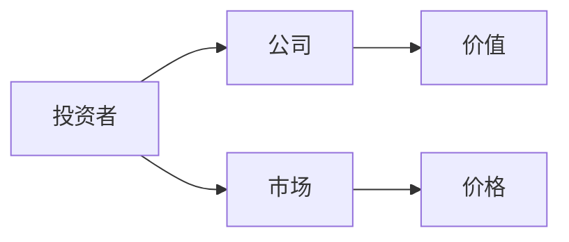
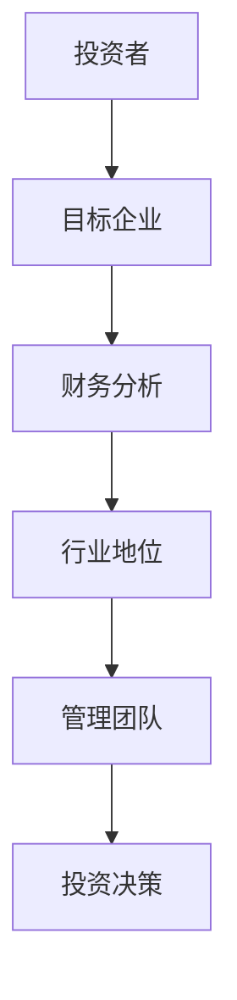
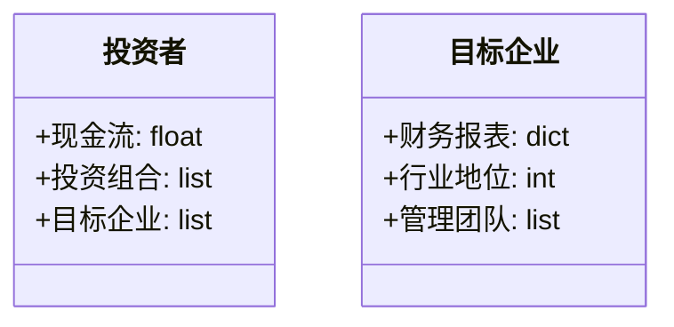

                 

# 彼得林奇的"长期价值"投资哲学

## 关键词：
长期价值投资，彼得·林奇，投资哲学，价值评估，风险管理

## 摘要：
本文深入分析了彼得·林奇的长期价值投资哲学，探讨了其核心概念、策略与方法，以及实际应用中的案例分析。通过系统的理论框架和丰富的实例，文章揭示了长期价值投资的本质，并结合数学模型和系统架构，为读者提供了全面的理解和实践指导。

---

## 第1章：彼得·林奇与长期价值投资概述

### 1.1 彼得·林奇的背景与投资理念

#### 1.1.1 彼得·林奇的生平简介
彼得·林奇是美国著名投资家，曾管理富达麦哲伦基金，创造了辉煌的投资业绩。他的投资哲学以长期价值投资为核心，强调深入研究和长期持有优质股票。

#### 1.1.2 长期价值投资的核心理念
长期价值投资强调买入并持有优质资产，关注企业的内在价值而非短期市场波动。林奇认为，投资的目的是寻找那些具有持续竞争优势和良好管理的企业。

#### 1.1.3 彼得·林奇的投资哲学与市场观点
林奇认为市场短期波动不可预测，但长期趋势可以通过基本面分析确定。他倡导投资者关注企业的基本面，而非市场的短期情绪。

---

### 1.2 长期价值投资的意义与应用

#### 1.2.1 长期价值投资的定义与特点
长期价值投资是一种以企业内在价值为导向的投资策略，强调长期持有优质资产，避免短期市场波动的干扰。

#### 1.2.2 长期价值投资与短期投资的对比
长期价值投资注重基本面分析和长期收益，而短期投资关注市场波动和短期收益。两者在风险承受、投资期限和策略选择上存在显著差异。

#### 1.2.3 长期价值投资在现代金融中的地位
长期价值投资是金融市场的基石，为投资者提供了稳定收益的可能。它强调理性投资，避免了短期投机带来的风险。

---

## 第2章：长期价值投资的核心概念

### 2.1 长期价值投资的定义与要素

#### 2.1.1 长期价值投资的定义
长期价值投资是指通过深入研究企业的基本面，买入并长期持有具有持续竞争优势和良好管理的公司股票，以实现长期稳定的投资回报。

#### 2.1.2 核心要素对比表（概念属性特征对比）
| 概念 | 属性 | 特征 |
|------|------|------|
| 长期价值投资 | 投资策略 | 长期持有、价值导向 |
| 短期投资 | 投资策略 | 短期交易、价格导向 |

#### 2.1.3 ER实体关系图（Mermaid流程图）

---

### 2.2 彼得·林奇的价值评估体系

#### 2.2.1 价值评估的核心原理
林奇的价值评估体系基于企业的基本面分析，包括财务指标、行业地位和管理团队等因素。

#### 2.2.2 价值评估的数学模型与公式
企业内在价值（V）的计算公式：
$$ V = \frac{E}{r} $$
其中，E为企业的未来现金流，r为折现率。

#### 2.2.3 实例分析与通俗解释
以苹果公司为例，通过分析其财务报表和行业地位，评估其内在价值，从而决定是否投资。

---

## 第3章：长期价值投资的策略与方法

### 3.1 长期价值投资的策略框架

#### 3.1.1 投资策略的系统分析与架构设计

#### 3.1.2 系统功能设计（领域模型Mermaid类图）

---

### 3.2 投资组合管理与风险控制

#### 3.2.1 投资组合管理的数学模型与公式
投资组合的预期收益公式：
$$ E = \sum (p_i \times r_i) $$
其中，p_i为资产i的比例，r_i为资产i的预期收益。

#### 3.2.2 风险控制的策略与方法
通过分散投资和定期调整投资组合来降低风险。

---

## 第4章：长期价值投资的案例分析

### 4.1 彼得·林奇的经典投资案例

#### 4.1.1 案例一：购买与卖出决策
林奇在1980年代买入莲花软件公司股票，长期持有，最终获得丰厚回报。

#### 4.1.2 案例二：行业研究与选股标准
林奇通过深入研究行业趋势和公司基本面，选择具有竞争优势的企业进行投资。

---

### 4.2 案例分析的数学模型与公式

#### 4.2.1 投资回报率的计算公式
$$ ROI = \frac{（最终价值 - 初始投资）}{初始投资} \times 100\% $$

#### 4.2.2 风险调整后的收益模型
$$ RAR = \frac{E(r) - R_f}{\sigma} $$
其中，R_f为无风险利率，σ为投资组合的标准差。

---

## 第5章：长期价值投资的风险管理

### 5.1 风险管理的核心原理

#### 5.1.1 风险管理的定义与重要性
风险管理是通过识别和评估潜在风险，制定相应的应对策略，以降低投资损失。

#### 5.1.2 风险管理的数学模型与公式
夏普比率公式：
$$ \text{夏普比率} = \frac{E(r - R_f)}{\sigma} $$

---

### 5.2 风险控制的策略与方法

#### 5.2.1 投资组合的风险分散策略
通过投资不同行业和资产类别来分散风险。

#### 5.2.2 风险控制的策略与方法
定期评估投资组合，及时调整以应对市场变化。

---

## 第6章：长期价值投资的心理因素与纪律

### 6.1 长期投资心理的重要性

#### 6.1.1 投资者心理的常见问题
贪婪和恐惧是投资中的主要障碍，容易导致非理性决策。

#### 6.1.2 投资纪律的重要性
严格的纪律是长期价值投资成功的关键，包括坚持长期持有和避免频繁交易。

---

## 第7章：结论与展望

### 7.1 全文总结

长期价值投资是一种以基本面分析为核心的策略，强调长期持有优质资产，避免短期市场波动的干扰。彼得·林奇的投资哲学为投资者提供了宝贵的经验和启示。

### 7.2 未来展望

随着金融市场的不断发展，长期价值投资将继续在投资领域中占据重要地位，为投资者提供稳定收益的可能。

---

## 附录

### 附录A：投资工具与资源

#### 1. 投资分析工具
- 财务报表分析工具
- 估值模型工具

#### 2. 投资教育资源
- 书籍推荐：《彼得·林奇的投资哲学》
- 网站推荐：Yahoo Finance, Morningstar

### 附录B：常用公式与图表

#### 1. 常用公式
- 内在价值公式
- 夏普比率公式

#### 2. 图表
- 股票价格与内在价值对比图
- 投资组合风险分散图

---

## 作者：AI天才研究院/AI Genius Institute & 禅与计算机程序设计艺术 /Zen And The Art of Computer Programming

