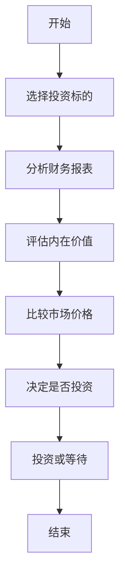
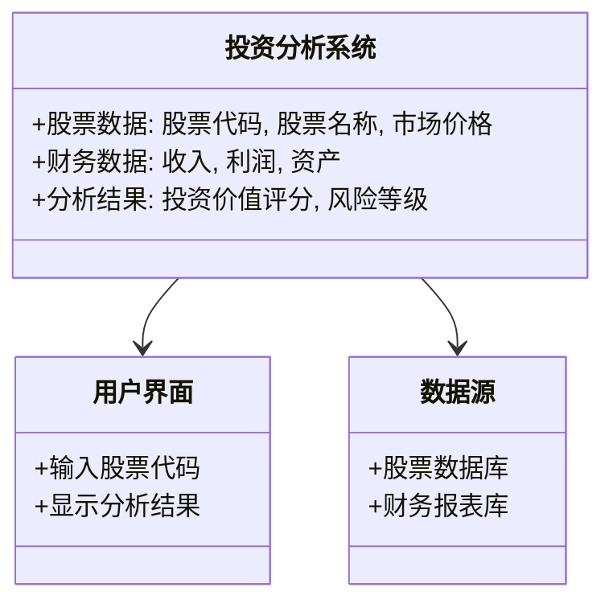

                 

# 彼得林奇的"长期价值"投资案例分析

> 关键词：长期价值投资，彼得林奇，投资策略，数学模型，系统架构

> 摘要：本文将深入分析彼得林奇的长期价值投资理念，从其核心概念、数学模型、系统架构到实际案例，全面解析其投资策略。通过详细的技术分析和实际案例，揭示长期价值投资的内在逻辑和实现方法。

---

## 第一部分：长期价值投资的核心概念

### 第1章：长期价值投资的背景与定义

#### 1.1 问题背景与问题描述

长期价值投资是一种以长期持有优质资产为核心的投资策略，旨在通过深入分析企业的内在价值，寻找具有持续竞争优势和良好管理的公司，进行长期投资。本文将探讨彼得林奇如何通过这种策略实现卓越的投资业绩。

#### 1.2 核心概念与属性特征

长期价值投资的核心在于识别具有持续增长潜力的企业，并在合理估值时买入并长期持有。以下是长期价值投资的关键属性：

| 属性 | 描述 |
|------|------|
| 投资目标 | 寻找具有持续竞争优势的公司 |
| 投资期限 | 长期持有，避免短期波动干扰 |
| 估值方法 | 基于基本面分析，计算内在价值 |
| 风险控制 | 通过分散投资和严格选股降低风险 |

### 第2章：彼得林奇的投资哲学

#### 2.1 彼得林奇的生平与投资理念

彼得林奇是全球著名投资家，以其长期价值投资策略闻名。他的投资理念强调深入研究企业基本面，寻找具有持续增长潜力的公司。

#### 2.2 投资策略的核心要素

彼得林奇的投资策略包括以下几个核心要素：

- **价值发现**：通过分析财务报表，识别具有竞争优势的企业。
- **风险控制**：避免投资于高风险行业，选择稳定增长的企业。
- **长期持有**：避免频繁交易，降低交易成本和税务负担。

### 第3章：长期价值投资的数学模型与算法原理

#### 3.1 投资价值评估模型

彼得林奇的长期价值投资模型基于企业基本面分析，计算股票的内在价值。以下是核心公式：

$$ V = \frac{E}{k} $$

其中，\( V \) 为股票的内在价值，\( E \) 为预期收益，\( k \) 为折现率。

#### 3.2 投资决策的算法流程

以下是长期价值投资的算法流程：

### 第4章：长期价值投资的系统架构设计

#### 4.1 系统功能设计

长期价值投资的系统功能设计包括以下几个模块：

- 数据采集：收集企业财务数据、市场数据等。
- 数据分析：计算股票的内在价值，评估企业的竞争优势。
- 投资决策：根据分析结果，生成投资建议。

#### 4.2 系统架构设计

以下是长期价值投资系统的架构设计：

---

## 第二部分：长期价值投资的系统实现

### 第5章：系统核心实现

#### 5.1 数据采集与处理

长期价值投资系统需要采集以下数据：

- 股票的基本信息（名称、代码、行业等）。
- 财务报表数据（收入、利润、资产等）。
- 市场数据（股价、成交量等）。

#### 5.2 数据分析与评估

根据彼得林奇的长期价值投资模型，系统需要计算股票的内在价值，并与市场价格进行比较。

#### 5.3 投资决策

系统根据分析结果，生成投资建议，包括买入、卖出或持有。

### 第6章：项目实战分析

#### 6.1 案例分析：微软公司

以微软公司为例，分析其是否符合长期价值投资的条件。

#### 6.2 投资组合管理

根据分析结果，构建投资组合，并进行风险控制。

---

## 第三部分：总结与展望

### 第7章：总结与展望

#### 7.1 总结

本文深入分析了彼得林奇的长期价值投资理念，从其核心概念、数学模型、系统架构到实际案例进行了详细探讨。

#### 7.2 未来展望

未来，随着人工智能和大数据技术的发展，长期价值投资将更加精准和高效。

---

## 附录

### 附录A：术语表

- **内在价值**：股票的理论价值，基于企业基本面分析。
- **折现率**：用于计算内在价值的折现率。

### 附录B：参考文献

- 彼得林奇著：《彼得林奇的成功投资策略》
- 其他相关投资书籍和文献。

---

作者：AI天才研究院/AI Genius Institute & 禅与计算机程序设计艺术/Zen And The Art of Computer Programming

