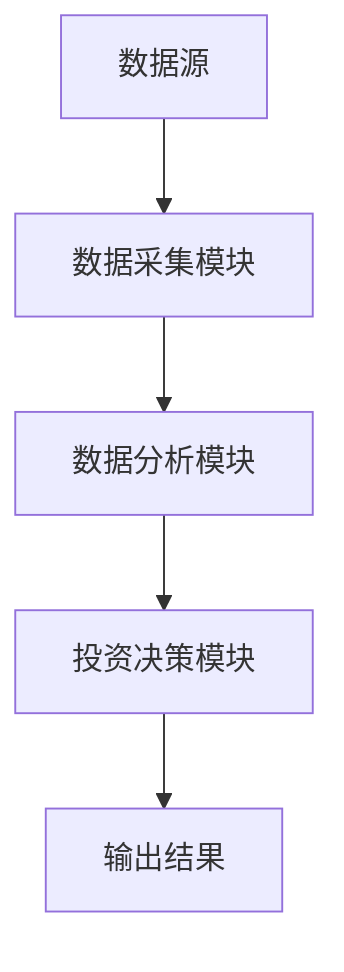

                 


# 彼得林奇的"长期增长"潜力在新兴市场的识别

> 关键词：彼得·林奇，长期增长，新兴市场，投资潜力，风险管理

> 摘要：本文探讨了彼得·林奇的长期增长投资理念在新兴市场的应用，分析了如何识别具有长期增长潜力的公司，并提供了系统的投资策略和数学模型。文章结合实际案例，详细讲解了如何在新兴市场中寻找投资机会，并通过系统架构设计和实战分析，帮助读者更好地理解和应用这些投资策略。

---

## 第一部分: 彼得·林奇的“长期增长”潜力概述

### 第1章: 长期增长与新兴市场的概念

#### 1.1 长期增长的定义与特征

##### 1.1.1 长期增长的定义
长期增长指的是企业在较长的时间内实现持续的收入和利润增长。它不仅关注短期的财务表现，更注重企业在未来数年甚至数十年内的发展潜力。

##### 1.1.2 长期增长的核心特征
长期增长的核心特征包括：
- **稳定的收入增长**：企业收入逐年稳步增长。
- **健康的盈利能力**：企业净利润率保持在合理水平。
- **强大的竞争优势**：企业在行业内具有独特的竞争优势。
- **持续的创新能力**：企业能够不断推出新产品或服务，适应市场变化。

##### 1.1.3 长期增长与短期波动的关系
长期增长与短期波动的关系可以用数学公式表示为：
$$
\text{长期增长} = \frac{\text{长期平均增长率}}{\text{短期波动率}}
$$
短期波动虽然会影响股价，但长期增长的核心在于企业的内在价值增长。

---

#### 1.2 新兴市场的定义与特点

##### 1.2.1 新兴市场的定义
新兴市场是指那些经济增长迅速、市场规模逐步扩大的国家或地区。这些市场通常具有较大的发展潜力，但同时也伴随着较高的风险。

##### 1.2.2 新兴市场的经济特征
- **高增长率**：新兴市场的GDP增速通常高于发达市场。
- **年轻人口**：新兴市场的人口结构年轻，消费潜力大。
- **政策支持**：政府通常会出台政策支持经济发展。

##### 1.2.3 新兴市场的投资机会
- **行业增长潜力**：新兴市场中某些行业（如科技、消费、金融）具有较大的增长空间。
- **低估的股票**：新兴市场中的某些股票可能被低估，具有较大的上涨潜力。

---

### 第2章: 彼得·林奇投资理念的核心要素

#### 2.1 彼得·林奇投资理念的核心要素

##### 2.1.1 长期增长投资的定义
长期增长投资是指投资者选择那些具有长期稳定增长潜力的公司进行投资。这种投资策略注重企业的基本面和长期发展潜力，而非短期市场波动。

##### 2.1.2 林奇投资理念的核心要素
- **关注企业的基本面**：林奇强调对企业财务状况、管理层能力和行业地位的分析。
- **寻找低估的股票**：林奇喜欢投资那些市场价格低于其内在价值的股票。
- **长期持有**：林奇主张长期持有优质股票，避免频繁交易。

##### 2.1.3 长期增长与价值投资的结合
长期增长与价值投资的结合可以用以下公式表示：
$$
\text{内在价值} = \text{未来现金流的现值}
$$
林奇的投资策略是寻找那些内在价值被市场低估，同时具有长期增长潜力的公司。

---

#### 2.2 林奇选股标准

##### 2.2.1 公司基本面分析
林奇认为，投资成功的前提是对企业基本面的深入分析。以下是基本面分析的关键指标：
- **收入增长**：收入是企业增长的核心指标。
- **净利润率**：净利润率反映了企业的盈利能力。
- **负债水平**：企业的负债水平影响其财务健康状况。

##### 2.2.2 行业地位与竞争优势
- **行业地位**：企业在行业中的市场份额和竞争地位。
- **竞争优势**：企业是否具有独特的竞争优势，如技术壁垒、品牌优势等。

##### 2.2.3 财务健康状况评估
- **现金流**：健康的现金流是企业长期增长的基础。
- **资产负债表**：企业的资产和负债状况。

---

### 第3章: 新兴市场中长期增长潜力的识别方法

#### 3.1 新兴市场的经济周期分析

##### 3.1.1 经济周期的定义与特征
经济周期分为四个阶段：衰退、复苏、增长和繁荣。新兴市场通常处于增长或复苏阶段。

##### 3.1.2 新兴市场经济周期的特殊性
- **波动性大**：新兴市场的经济周期波动性较大。
- **外部依赖**：新兴市场的经济往往受到全球经济的影响。

##### 3.1.3 经济周期对长期增长的影响
经济周期对长期增长的影响可以用以下公式表示：
$$
\text{长期增长率} = \text{经济周期增长率} \times \text{行业增长率}
$$

---

#### 3.2 行业趋势与公司潜力评估

##### 3.2.1 行业发展趋势分析
- **科技行业**：新兴市场中的科技行业增长潜力巨大。
- **消费行业**：随着中产阶级的崛起，消费行业具有较大的增长空间。
- **金融行业**：金融行业在新兴市场中也具有较大的增长潜力。

##### 3.2.2 公司在行业中的地位
- **市场份额**：公司在行业中的市场份额。
- **品牌影响力**：公司的品牌影响力。

##### 3.2.3 行业对长期增长的驱动作用
行业趋势对长期增长的驱动作用可以用以下公式表示：
$$
\text{行业驱动潜力} = \text{行业增长率} \times \text{公司市场份额}
$$

---

## 第二部分: 彼得·林奇投资模型的数学解析

### 第4章: 数学模型与投资策略

#### 4.1 长期增长潜力评估的数学模型

##### 4.1.1 模型的构建与假设
- 假设1：企业的长期增长率为g。
- 假设2：企业的当前利润为P。

##### 4.1.2 模型的输入变量与输出结果
- 输入变量：当前利润P，长期增长率g。
- 输出结果：企业的内在价值。

##### 4.1.3 模型的验证与优化
通过历史数据验证模型的准确性，并根据实际情况进行优化。

---

#### 4.2 新兴市场投资风险的量化分析

##### 4.2.1 风险的定义与分类
- 市场风险：市场波动对企业价值的影响。
- 信用风险：企业违约的风险。

##### 4.2.2 风险评估的数学公式
$$
\text{风险评估} = \frac{\text{市场波动率}}{\text{企业稳定性}}
$$

##### 4.2.3 风险与收益的平衡
$$
\text{风险调整后收益} = \text{预期收益} - \text{风险溢价}
$$

---

## 第三部分: 系统架构与投资策略设计

### 第5章: 系统架构与投资策略

#### 5.1 投资系统架构设计

##### 5.1.1 系统功能模块划分
- 数据采集模块：采集企业的财务数据和市场数据。
- 数据分析模块：对数据进行分析，评估企业的长期增长潜力。
- 投资决策模块：根据分析结果，制定投资策略。

##### 5.1.2 系统数据流图
以下是系统数据流图的Mermaid表示：



##### 5.1.3 系统架构的优缺点分析
- 优点：系统化、模块化，便于管理和优化。
- 缺点：可能忽视市场情绪和突发事件的影响。

---

#### 5.2 投资策略的系统实现

##### 5.2.1 策略的输入与输出
- 输入：企业的财务数据、市场数据。
- 输出：企业的长期增长潜力评估、投资建议。

##### 5.2.2 策略的实现流程
- 数据采集：获取企业的财务数据和市场数据。
- 数据分析：使用数学模型评估企业的长期增长潜力。
- 投资决策：根据分析结果，制定投资策略。

##### 5.2.3 策略的优化与调整
根据市场变化和企业情况，定期优化和调整投资策略。

---

### 第6章: 项目实战与案例分析

#### 6.1 实战环境搭建

##### 6.1.1 数据源的选择与获取
- 数据源：新兴市场的财务数据、行业报告。
- 数据获取：通过数据库或公开报告获取数据。

##### 6.1.2 数据预处理与清洗
- 数据清洗：去除无效数据，填补缺失值。
- 数据转换：将数据转换为适合分析的格式。

##### 6.1.3 数据分析工具的安装与配置
- 工具选择：使用Python的Pandas库进行数据分析。
- 工具配置：安装Python环境，配置Jupyter Notebook。

---

#### 6.2 核心代码实现

##### 6.2.1 数据分析与可视化代码
以下是Python代码示例：

```python
import pandas as pd
import matplotlib.pyplot as plt

# 数据加载
data = pd.read_csv('emerging_markets.csv')

# 数据分析
data['growth_rate'] = data['revenue'].pct_change()

# 数据可视化
data['growth_rate'].plot(kind='bar')
plt.title('行业增长率')
plt.show()
```

##### 6.2.2 投资模型的实现代码
以下是长期增长潜力评估的Python代码示例：

```python
def calculate_growth_potential(revenue, net_profit):
    growth_potential = (revenue * net_profit) / 100
    return growth_potential

# 示例数据
revenue = 1000
net_profit = 20

# 计算增长潜力
growth_potential = calculate_growth_potential(revenue, net_profit)
print(f'增长潜力: {growth_potential}%')
```

##### 6.2.3 策略优化的实现代码
以下是风险调整后收益的Python代码示例：

```python
def calculate_risk_adjusted_return(expected_return, risk_premium):
    return expected_return - risk_premium

# 示例数据
expected_return = 15
risk_premium = 5

# 计算风险调整后收益
risk_adjusted_return = calculate_risk_adjusted_return(expected_return, risk_premium)
print(f'风险调整后收益: {risk_adjusted_return}%')
```

---

#### 6.3 案例分析与结果解读

##### 6.3.1 案例背景介绍
假设我们选择一个新兴市场的科技公司作为案例。

##### 6.3.2 案例分析过程
- 数据分析：计算公司的收入增长率、净利润率等指标。
- 模型应用：使用长期增长潜力评估模型，评估公司的增长潜力。
- 投资决策：根据分析结果，制定投资策略。

##### 6.3.3 案例结果与启示
- 分析结果：公司具有较高的长期增长潜力。
- 投资建议：建议投资者长期持有该公司的股票。

---

## 第四部分: 最佳实践与投资建议

### 第7章: 最佳实践与投资建议

#### 7.1 投资中的注意事项

##### 7.1.1 风险管理的重要性
- 风险管理是投资成功的关键。
- 通过分散投资降低风险。

##### 7.1.2 投资组合的分散化策略
- 分散化投资可以降低特定行业的风险。
- 通过投资不同行业的股票，降低整体风险。

##### 7.1.3 长期投资的纪律性要求
- 长期投资需要耐心和纪律。
- 避免频繁交易，保持投资策略的一致性。

---

#### 7.2 小结与展望

##### 7.2.1 本书的核心内容总结
- 彼得·林奇的长期增长投资理念。
- 新兴市场中长期增长潜力的识别方法。
- 投资策略的系统设计与实战分析。

##### 7.2.2 新兴市场投资的未来趋势
- 新兴市场的科技行业将继续保持增长。
- 全球化背景下，新兴市场的投资机会将不断增加。

##### 7.2.3 长期增长

---

## 作者：AI天才研究院/AI Genius Institute & 禅与计算机程序设计艺术/Zen And The Art of Computer Programming

---

希望这篇文章能够帮助读者更好地理解彼得·林奇的长期增长投资理念，并在新兴市场中找到具有长期增长潜力的投资机会。通过系统的分析和具体的案例，读者可以更好地应用这些投资策略，实现长期的财富增长。

