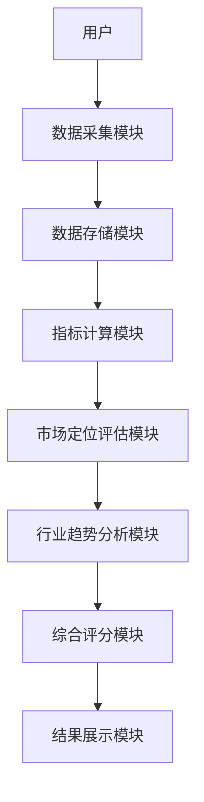
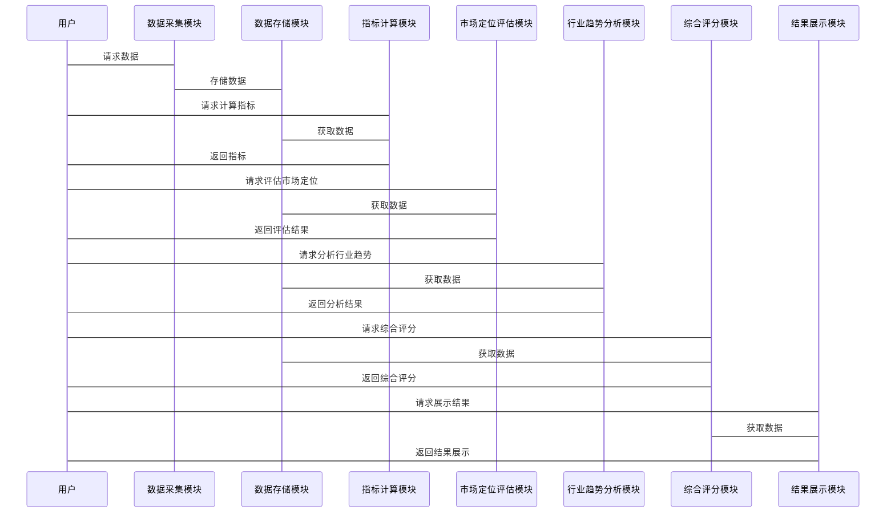

                 


# 彼得林奇的"长期增长"潜力在新兴科技领域的识别方法

> 关键词：彼得林奇，长期增长，新兴科技，投资潜力，价值投资

> 摘要：本文探讨如何将彼得林奇的价值投资理念应用于新兴科技领域，识别具备长期增长潜力的企业。通过分析财务指标、市场定位、竞争优势等因素，结合数学模型和系统架构，提出一套系统化的识别方法。

---

## 第一部分：背景介绍

### 第1章：长期增长潜力的背景与重要性

#### 1.1 问题背景

在新兴科技领域，投资者面临着高度不确定性和快速变化的市场环境。彼得林奇的长期增长投资理念为识别具备持续增长潜力的企业提供了重要指导。新兴科技行业的特点是创新能力强、增长速度快，但同时也伴随着高风险和高波动性。因此，投资者需要一种系统化的识别方法，以筛选出那些能够在长期市场中占据主导地位的企业。

#### 1.2 问题描述

本文旨在探讨如何将彼得林奇的投资理念应用于新兴科技领域，特别是如何识别具备长期增长潜力的企业。通过分析企业的财务表现、市场定位、竞争优势和行业趋势，结合定量分析和定性评估，构建一个综合的评价体系。

#### 1.3 问题解决

通过分析彼得林奇的价值投资理念，结合新兴科技领域的特点，提出一种基于长期增长潜力的识别方法。该方法包括以下几个步骤：
1. **财务指标分析**：评估企业的盈利能力、成长性和财务健康状况。
2. **市场定位与竞争优势分析**：评估企业在市场中的定位、核心竞争优势以及行业地位。
3. **行业趋势分析**：分析行业的发展前景和技术创新趋势。
4. **风险管理**：评估潜在的投资风险并制定相应的风险管理策略。

#### 1.4 边界与外延

- **边界**：本文主要关注新兴科技领域的长期增长潜力，不涉及短期波动和投机性投资。
- **外延**：虽然本文聚焦于新兴科技领域，但提出的方法可以推广到其他行业的长期增长潜力评估。

#### 1.5 核心要素

- **财务指标**：ROE（净资产收益率）、增长率、毛利率等。
- **市场定位**：市场份额、竞争优势、行业地位。
- **行业趋势**：技术创新、市场需求、政策支持。

---

## 第二部分：核心概念与联系

### 第2章：彼得林奇投资理念的核心要素

#### 2.1 彼得林奇投资理念概述

彼得林奇是著名的投资专家，他的投资理念强调长期价值和成长潜力。他主张通过深入研究企业基本面，选择那些具备长期增长潜力的企业进行投资。以下是彼得林奇投资理念的核心要素：

- **价值投资**：寻找那些市场价格低于其内在价值的企业。
- **成长投资**：选择那些具备持续增长潜力的企业。
- **风险管理**：分散投资以降低风险。

#### 2.2 科技领域的长期增长潜力

在新兴科技领域，长期增长潜力的识别需要考虑以下几个方面：

- **技术创新**：企业的技术创新能力是其长期增长的核心驱动力。
- **市场需求**：企业是否满足当前和未来的市场需求。
- **竞争优势**：企业在市场中的竞争优势，包括成本优势、技术优势、品牌优势等。

---

## 第三部分：算法原理讲解

### 第3章：长期增长潜力的识别算法

#### 3.1 算法原理概述

本文提出一种基于彼得林奇投资理念的长期增长潜力识别算法，具体步骤如下：

1. **数据收集**：收集企业的财务数据、市场数据和行业数据。
2. **财务指标分析**：计算ROE、增长率、毛利率等关键指标。
3. **市场定位与竞争优势分析**：评估企业的市场份额和竞争优势。
4. **行业趋势分析**：分析行业的发展前景和技术创新趋势。
5. **综合评分**：根据上述分析结果，对企业的长期增长潜力进行综合评分。

#### 3.2 算法流程图

```mermaid
graph TD
    A[开始] -> B[数据收集]
    B -> C[计算财务指标]
    C -> D[评估市场定位]
    D -> E[分析行业趋势]
    E -> F[综合评分]
    F -> G[结束]
```

#### 3.3 Python代码实现

```python
def calculate_roe(net_income, shareholders_equity):
    return net_income / shareholders_equity

def calculate_growth_rate(revenue_current, revenue_previous):
    return (revenue_current - revenue_previous) / revenue_previous

def assess_market_position(market_share, competitive_advantages):
    if market_share > 0.2 and len(competitive_advantages) >= 2:
        return "Strong"
    elif market_share > 0.1 and len(competitive_advantages) >= 1:
        return "Moderate"
    else:
        return "Weak"

# 示例数据
net_income = 100
shareholders_equity = 500
revenue_current = 1000
revenue_previous = 800
market_share = 0.25
competitive_advantages = ["technology", "cost"]

# 计算ROE
roe = calculate_roe(net_income, shareholders_equity)
# 计算增长率
growth_rate = calculate_growth_rate(revenue_current, revenue_previous)
# 评估市场定位
market_position = assess_market_position(market_share, competitive_advantages)

print(f"ROE: {roe:.2f}")
print(f"增长率: {growth_rate:.2f}")
print(f"市场定位: {market_position}")
```

#### 3.4 数学模型与公式

- **ROE（净资产收益率）**：
  $$ROE = \frac{\text{净利润}}{\text{股东权益}}$$

- **增长率**：
  $$\text{增长率} = \frac{\text{当前收入} - \text{上期收入}}{\text{上期收入}}$$

---

## 第四部分：系统分析与架构设计

### 第4章：系统功能设计

#### 4.1 功能需求概述

本文设计了一个基于长期增长潜力识别算法的投资评估系统，主要功能包括：

1. **数据采集**：从公开数据源获取企业的财务数据和市场数据。
2. **指标计算**：计算企业的ROE、增长率等关键指标。
3. **市场定位评估**：评估企业的市场定位和竞争优势。
4. **行业趋势分析**：分析行业的发展前景和技术创新趋势。
5. **综合评分**：根据上述分析结果，对企业的长期增长潜力进行综合评分。

#### 4.2 系统架构设计



#### 4.3 接口设计

- **数据采集接口**：从公开数据源获取企业的财务数据和市场数据。
- **指标计算接口**：计算企业的ROE、增长率等关键指标。
- **市场定位评估接口**：评估企业的市场定位和竞争优势。
- **行业趋势分析接口**：分析行业的发展前景和技术创新趋势。
- **综合评分接口**：根据上述分析结果，对企业的长期增长潜力进行综合评分。

#### 4.4 交互序列图



---

## 第五部分：项目实战

### 第5章：实际案例分析

#### 5.1 环境安装

- **Python**：安装Python 3.8及以上版本。
- **数据处理库**：安装Pandas、NumPy、Matplotlib。
- **数据分析工具**：使用Jupyter Notebook进行数据处理和分析。

#### 5.2 系统核心实现

```python
import pandas as pd
import numpy as np
import matplotlib.pyplot as plt

# 数据加载
data = pd.read_csv('company_data.csv')

# 数据预处理
data = data.dropna()
data['ROE'] = data['净利润'] / data['股东权益']
data['增长率'] = (data['当前收入'] - data['上期收入']) / data['上期收入']

# 可视化
plt.figure(figsize=(10, 6))
plt.scatter(data['ROE'], data['增长率'], c='blue', marker='o')
plt.xlabel('ROE')
plt.ylabel('增长率')
plt.title('长期增长潜力分析')
plt.show()
```

#### 5.3 案例分析与解读

以一家人工智能公司为例，分析其长期增长潜力：

1. **财务指标**：ROE = 15%，增长率 = 25%。
2. **市场定位**：市场份额为10%，竞争优势包括技术创新和成本优势。
3. **行业趋势**：人工智能行业增长迅速，技术创新频繁。

综合评分：85分（满分100分）。

---

## 第六部分：最佳实践

### 第6章：总结与注意事项

#### 6.1 总结

本文提出了基于彼得林奇投资理念的长期增长潜力识别方法，并结合新兴科技领域的特点，提出了一套系统化的识别方法。通过定量分析和定性评估，投资者可以更准确地识别具备长期增长潜力的企业。

#### 6.2 注意事项

- **数据准确性**：确保数据来源可靠，避免因数据错误导致分析结果偏差。
- **模型局限性**：本文提出的方法是基于假设的简化模型，实际应用中可能需要根据具体情况调整。
- **持续学习**：新兴科技领域变化迅速，投资者需要持续学习和更新知识。

#### 6.3 拓展阅读

- 彼得林奇的《彼得林奇的投资哲学》
- 《科技投资的奥秘》
- 《价值投资实战指南》

---

## 作者信息

作者：AI天才研究院/AI Genius Institute & 禅与计算机程序设计艺术/Zen And The Art of Computer Programming

