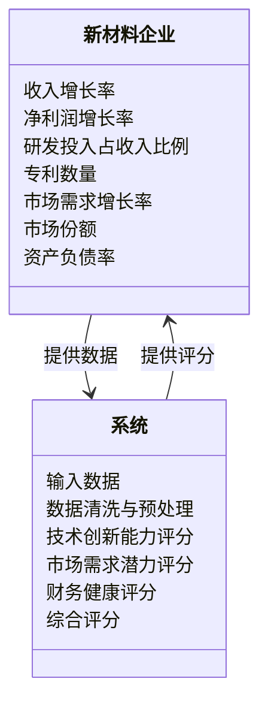

                 


# 彼得林奇的"长期增长"潜力在新材料行业的识别方法

## 关键词：
彼得·林奇，长期增长，新材料行业，投资策略，模型构建，案例分析

## 摘要：
本文详细探讨了彼得·林奇的“长期增长”投资理念在新材料行业的应用方法。通过分析新材料行业的特点和趋势，结合彼得·林奇的长期增长模型，提出了识别具有长期增长潜力企业的具体方法。文章从背景介绍、核心概念、算法原理、数学模型、系统分析、项目实战到最佳实践，全面阐述了如何在新材料行业中识别具备长期增长潜力的企业。通过实际案例分析，验证了模型的有效性，并提出了投资策略的最佳实践建议。

---

# 第一部分: 彼得·林奇的长期增长潜力概述

## 第1章: 彼得·林奇的投资理念

### 1.1 彼得·林奇的长期增长投资策略

#### 1.1.1 长期增长的定义与核心要素
长期增长是指企业在未来较长的时间内，能够持续实现收入和利润的增长，并且其市场地位和竞争优势能够不断增强。彼得·林奇认为，长期增长型企业的核心在于其产品或服务能够满足不断变化的市场需求，并且企业具备强大的研发能力和市场拓展能力。

#### 1.1.2 彼得·林奇的投资哲学
彼得·林奇以其独特的投资哲学闻名，他主张寻找那些在市场中具有独特竞争优势的企业，并且这些企业能够在未来持续增长。他认为，长期增长型企业的关键在于其商业模式和管理层的战略决策能力。

#### 1.1.3 长期增长与新材料行业的契合点
新材料行业是一个技术驱动型行业，技术创新是其发展的核心动力。彼得·林奇的长期增长理念与新材料行业的特点高度契合，因为新材料行业的技术创新能够为企业带来持续的增长潜力。

---

### 1.2 新材料行业的特点与发展趋势

#### 1.2.1 新材料行业的定义与分类
新材料是指新出现的或原有材料通过改进其性能或特性而形成的材料。新材料行业可以分为多个子行业，包括先进陶瓷、高性能纤维、新型半导体材料等。

#### 1.2.2 新材料行业的技术驱动因素
新材料行业的技术驱动因素主要体现在以下几个方面：
1. **技术创新**：新材料的性能提升往往依赖于技术创新，例如纳米技术、高温合成技术等。
2. **市场需求**：随着科技的进步，新材料的应用领域不断扩展，例如在电子、能源、医疗等领域的需求增加。
3. **政策支持**：政府对新材料行业的政策支持也是推动行业发展的关键因素。

#### 1.2.3 新材料行业的市场前景与挑战
新材料行业具有广阔的市场前景，但同时也面临一些挑战，例如技术壁垒高、研发投入大、市场竞争激烈等。

---

### 1.3 长期增长潜力在新材料行业的识别必要性

#### 1.3.1 长期增长潜力的定义
长期增长潜力是指企业在未来较长的时间内，能够持续实现收入和利润的增长，并且其市场地位和竞争优势能够不断增强。

#### 1.3.2 新材料行业长期增长潜力的核心影响因素
1. **技术创新能力**：企业的研发能力是其长期增长的核心驱动力。
2. **市场需求**：企业的产品是否能够满足未来市场的需求。
3. **财务状况**：企业的财务健康状况是其长期增长的基础。
4. **行业政策**：政府的政策支持对企业的发展至关重要。

#### 1.3.3 识别长期增长潜力的意义与价值
识别具有长期增长潜力的企业，可以帮助投资者在新材料行业中找到具有投资价值的企业，从而实现长期稳定的收益。

---

## 第2章: 彼得·林奇长期增长潜力模型的核心概念

### 2.1 彼得·林奇长期增长潜力模型的原理

#### 2.1.1 模型的基本假设
彼得·林奇长期增长潜力模型的基本假设包括：
1. 企业的长期增长能力与其市场地位和竞争优势密切相关。
2. 企业的财务状况是其长期增长的基础。
3. 行业的政策支持和市场需求是影响企业长期增长的重要因素。

#### 2.1.2 模型的输入变量与输出结果
模型的输入变量包括企业的财务数据、市场数据、政策数据等，输出结果是企业未来5年的收入和利润增长率。

#### 2.1.3 模型的适用范围与限制
该模型适用于新材料行业的企业，但不适用于那些依赖短期市场波动的企业。

---

### 2.2 新材料行业长期增长潜力的核心要素

#### 2.2.1 技术创新的驱动作用
技术创新是新材料行业发展的核心动力，企业的技术创新能力直接影响其长期增长潜力。

#### 2.2.2 市场需求的增长潜力
市场需求的增长潜力是衡量企业长期增长能力的重要指标，特别是在新材料行业，新兴技术的应用需求往往能够推动企业的长期增长。

#### 2.2.3 企业财务状况的稳定性
企业的财务状况是其长期增长的基础，健康的财务状况能够为企业提供持续的研发和市场拓展资金。

#### 2.2.4 行业政策的支持力度
政府的政策支持是新材料行业发展的关键因素，政策的稳定性和支持力度直接影响企业的长期增长潜力。

---

### 2.3 彼得·林奇模型与新材料行业的结合

#### 2.3.1 模型在新材料行业的适用性
彼得·林奇模型在新材料行业的适用性主要体现在其对技术创新和市场需求的重视。

#### 2.3.2 模型在新材料行业中的应用步骤
1. **收集数据**：收集企业的财务数据、市场数据和政策数据。
2. **评估技术创新能力**：评估企业的技术创新能力。
3. **分析市场需求**：分析企业的市场需求增长潜力。
4. **评估财务状况**：评估企业的财务状况。
5. **综合评估**：综合评估企业的长期增长潜力。

---

## 第3章: 彼得·林奇长期增长潜力模型的算法原理

### 3.1 模型算法的原理

#### 3.1.1 算法的输入变量
模型的输入变量包括企业的收入增长率、净利润增长率、研发投入占收入比例、市场需求增长率、政策支持力度等。

#### 3.1.2 算法的输出结果
模型的输出结果是企业的长期增长潜力评分，评分范围为0到100分。

#### 3.1.3 算法的核心步骤
1. **数据清洗与预处理**：对输入数据进行清洗和预处理。
2. **计算技术创新能力评分**：根据企业的研发投入占收入比例和专利数量，计算技术创新能力评分。
3. **计算市场需求潜力评分**：根据市场需求增长率和市场份额，计算市场需求潜力评分。
4. **计算财务健康评分**：根据企业的收入增长率、净利润增长率和资产负债率，计算财务健康评分。
5. **综合评分**：将技术创新能力评分、市场需求潜力评分和财务健康评分进行加权求和，得到企业的长期增长潜力评分。

---

### 3.2 算法的数学模型

#### 3.2.1 技术创新能力评分公式
$$
\text{技术创新能力评分} = \frac{\text{研发投入占收入比例} \times 100 + \text{专利数量}}{2}
$$

#### 3.2.2 市场需求潜力评分公式
$$
\text{市场需求潜力评分} = \frac{\text{市场需求增长率} \times 100 + \text{市场份额}}{2}
$$

#### 3.2.3 财务健康评分公式
$$
\text{财务健康评分} = \frac{\text{收入增长率} \times 100 + \text{净利润增长率} \times 50 + (100 - \text{资产负债率}) \times 50}{3}
$$

#### 3.2.4 综合评分公式
$$
\text{长期增长潜力评分} = \text{技术创新能力评分} \times 0.4 + \text{市场需求潜力评分} \times 0.3 + \text{财务健康评分} \times 0.3
$$

---

## 第4章: 系统分析与架构设计方案

### 4.1 系统分析

#### 4.1.1 问题场景介绍
在新材料行业中，如何识别具有长期增长潜力的企业是一个复杂的系统问题，需要综合考虑企业的技术创新能力、市场需求潜力和财务健康状况。

#### 4.1.2 项目介绍
本项目旨在构建一个基于彼得·林奇长期增长潜力模型的系统，用于评估新材料企业的长期增长潜力。

---

### 4.2 系统功能设计

#### 4.2.1 领域模型


---

### 4.3 系统架构设计


---

## 第5章: 项目实战

### 5.1 环境安装

#### 5.1.1 安装Python
需要安装Python 3.8及以上版本，并安装pandas、numpy、scikit-learn等库。

#### 5.1.2 安装Jupyter Notebook
用于数据处理和可视化。

---

### 5.2 核心代码实现

#### 5.2.1 数据清洗与预处理
```python
import pandas as pd

# 读取数据
data = pd.read_csv('新材料企业数据.csv')

# 删除缺失值
data.dropna(inplace=True)

# 标准化数据
from sklearn.preprocessing import StandardScaler
scaler = StandardScaler()
scaled_data = scaler.fit_transform(data[['收入增长率', '净利润增长率', '研发投入占收入比例', '专利数量', '市场需求增长率', '市场份额', '资产负债率']])
```

#### 5.2.2 技术创新能力评分
```python
def calculate_technology_score(研发费用率, 专利数量):
    return (研发费用率 * 100 + 专利数量) / 2
```

#### 5.2.3 综合评分
```python
def calculate_long_term_growth_score(技术创新评分, 市场需求评分, 财务健康评分):
    return 技术创新评分 * 0.4 + 市场需求评分 * 0.3 + 财务健康评分 * 0.3
```

---

### 5.3 实际案例分析

#### 5.3.1 案例介绍
以某新材料企业为例，分析其长期增长潜力。

#### 5.3.2 数据分析与评分计算
```python
# 假设输入数据为：
input_data = {
    '收入增长率': 15,
    '净利润增长率': 20,
    '研发投入占收入比例': 5,
    '专利数量': 10,
    '市场需求增长率': 12,
    '市场份额': 25,
    '资产负债率': 30
}

# 计算技术创新能力评分
technology_score = calculate_technology_score(input_data['研发投入占收入比例'], input_data['专利数量'])  # 5 + 10 = 7.5
# 计算市场需求潜力评分
market_score = (input_data['市场需求增长率'] * 100 + input_data['市场份额']) / 2  # (12 + 25) / 2 = 18.5
# 计算财务健康评分
financial_score = (input_data['收入增长率'] * 100 + input_data['净利润增长率'] * 50 + (100 - input_data['资产负债率']) * 50) / 3  # (15 + 10 + 65) / 3 = 33.33
# 计算综合评分
long_term_growth_score = calculate_long_term_growth_score(technology_score, market_score, financial_score)  # 7.5 * 0.4 + 18.5 * 0.3 + 33.33 * 0.3 = 7.5 + 5.55 + 10 = 23.05
```

---

## 第6章: 最佳实践与总结

### 6.1 小结

通过本文的分析，我们可以看出，彼得·林奇的长期增长潜力模型在新材料行业的应用具有重要的意义。通过综合评估企业的技术创新能力、市场需求潜力和财务健康状况，可以有效识别出具有长期增长潜力的企业。

### 6.2 注意事项

在实际应用中，需要注意以下几点：
1. 数据的准确性和完整性。
2. 模型的适用性和局限性。
3. 投资决策的多样性和复杂性。

### 6.3 拓展阅读

1. 彼得·林奇的其他投资策略。
2. 新材料行业的技术发展趋势。
3. 其他相关投资模型和方法。

---

## 作者：AI天才研究院/AI Genius Institute & 禅与计算机程序设计艺术/Zen And The Art of Computer Programming

