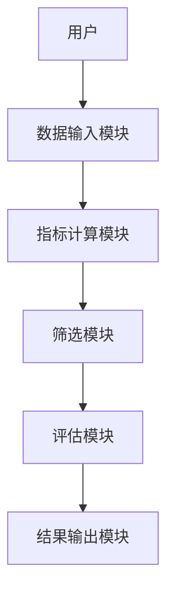
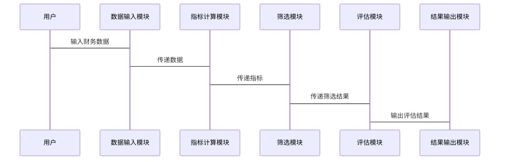

                 


# 彼得林奇的"长期增长"潜力识别方法

> 关键词：彼得林奇，长期增长，投资方法，潜力识别，财务分析

> 摘要：本文系统地介绍和分析了彼得林奇的长期增长潜力识别方法，详细阐述了该方法的核心概念、数学模型、算法原理、系统架构以及实际应用案例。通过本文的学习，读者可以掌握如何识别具有长期增长潜力的投资标的，并在实际投资中应用这些方法。

---

# 第1章: 长期增长潜力识别的背景与重要性

## 1.1 长期增长的定义与核心要素

### 1.1.1 长期增长的定义

长期增长指的是企业在未来较长的一段时间内，能够持续实现收入和利润的增长，同时保持较高的市场竞争力和盈利能力。这种增长不仅仅体现在财务数据上，还体现在企业核心竞争力的提升、市场份额的扩大以及管理能力的持续优化等方面。

### 1.1.2 长期增长的核心要素

长期增长的核心要素包括以下几个方面：

1. **收入增长**：企业营业收入的持续增长，尤其是在行业竞争中能够保持市场份额。
2. **利润增长**：净利润的持续增长，且利润率保持稳定或提高。
3. **市场竞争力**：企业在市场中的竞争优势，包括产品、技术、品牌、管理等方面。
4. **管理团队**：管理团队的稳定性和能力，能够推动企业持续发展。
5. **财务健康性**：企业的财务状况健康，债务水平合理，现金流充裕。

### 1.1.3 长期增长与短期波动的区别

长期增长关注的是企业在较长时间内的持续发展能力，而短期波动则指的是企业在短期内由于市场环境、行业周期或突发事件等因素导致的业绩波动。长期增长与短期波动的主要区别如下：

| **维度**       | **长期增长**                            | **短期波动**                            |
|-----------------|----------------------------------------|-----------------------------------------|
| 时间跨度       | 5年以上的持续增长                      | 几个月到几年的波动                      |
| 变化趋势       | 基本呈上升趋势                          | 可能上升或下降                          |
| 影响因素       | 竞争优势、管理能力、行业趋势            | 市场环境、行业周期、突发事件            |
| 投资策略       | 长期持有，追求稳定收益                 | 短期交易，捕捉波动性收益                |

---

## 1.2 彼得林奇的投资理念

### 1.2.1 彼得林奇的个人投资风格

彼得·林奇（Peter Lynch）是美国著名的职业基金经理人，以其在富达麦哲伦基金（Fidelity Magellan Fund）的卓越表现而闻名。他的投资理念以“长期增长”为核心，强调通过深入研究和分析，选择那些具有持续增长潜力的公司进行投资。

### 1.2.2 彼得林奇对长期增长的重视

彼得林奇认为，投资的核心是寻找那些能够在未来几年内保持稳定增长的公司。他强调，投资者应该关注企业的基本面，包括收入、利润、市场份额、竞争优势等，而不是仅仅依赖市场波动进行短期交易。

### 1.2.3 彼得林奇投资理念的核心思想

彼得林奇的投资理念可以总结为以下几点：

1. **长期持有优质资产**：选择那些具有长期增长潜力的公司，并长期持有。
2. **深入研究企业基本面**：通过分析企业的财务数据、行业地位、竞争优势等，筛选出真正具有增长潜力的公司。
3. **避免短期波动干扰**：忽略市场的短期波动，专注于企业的长期发展趋势。
4. **分散投资，降低风险**：通过投资多个具有长期增长潜力的公司，分散投资风险。

---

## 1.3 长期增长潜力识别的重要性

### 1.3.1 长期增长对投资者的意义

长期增长潜力识别对投资者具有重要意义，主要体现在以下几个方面：

1. **实现财富增值**：通过投资具有长期增长潜力的公司，投资者可以在较长时间内实现资产的稳定增值。
2. **降低投资风险**：长期增长的公司通常具有较强的抗风险能力，能够在市场波动中保持稳定。
3. **优化投资组合**：通过识别具有长期增长潜力的公司，投资者可以优化自己的投资组合，提高整体收益。

### 1.3.2 长期增长在投资组合中的作用

在投资组合中，长期增长潜力的公司通常扮演核心资产的角色。它们能够为投资组合提供稳定的收益，并在市场下跌时起到一定的防御作用。

### 1.3.3 如何通过长期增长实现财富增值

通过长期持有具有增长潜力的公司，投资者可以享受企业成长带来的收益。同时，长期增长的公司通常会通过分红或股价上涨的方式回报投资者。

---

## 1.4 本书的核心目标与框架

### 1.4.1 本书的核心目标

本书的核心目标是系统地介绍彼得林奇的长期增长潜力识别方法，帮助投资者掌握如何识别和选择具有长期增长潜力的公司。

### 1.4.2 本书的框架结构

本书将从以下几个方面展开：

1. **长期增长潜力识别的背景与重要性**
2. **彼得林奇长期增长模型的核心概念**
3. **彼得林奇长期增长模型的数学模型与公式**
4. **彼得林奇长期增长模型的算法原理**
5. **彼得林奇长期增长潜力评估系统的构建**
6. **彼得林奇长期增长潜力识别方法的实际应用**
7. **彼得林奇长期增长潜力识别方法的最佳实践**

### 1.4.3 本书的适用读者

本书适用于以下读者：

1. 对长期增长投资感兴趣的投资者。
2. 基金经理、投资顾问等专业人士。
3. 对彼得林奇投资理念感兴趣的研究者。

---

# 第2章: 彼得林奇长期增长模型的核心概念

## 2.1 彼得林奇长期增长模型的定义

彼得林奇长期增长模型是一种用于识别具有长期增长潜力的公司的分析框架。该模型通过对企业基本面的深入分析，结合市场环境和行业趋势，筛选出那些能够在未来较长的时间内保持稳定增长的公司。

---

## 2.2 长期增长模型的关键指标

在彼得林奇的长期增长模型中，以下是一些关键指标：

### 2.2.1 净利润增长率

净利润增长率是衡量企业盈利能力的重要指标。公式如下：

$$ \text{净利润增长率} = \frac{\text{本期净利润} - \text{上期净利润}}{\text{上期净利润}} \times 100\% $$

---

### 2.2.2 营业收入增长率

营业收入增长率是衡量企业收入增长能力的重要指标。公式如下：

$$ \text{营业收入增长率} = \frac{\text{本期营业收入} - \text{上期营业收入}}{\text{上期营业收入}} \times 100\% $$

---

### 2.2.3 股东权益增长率

股东权益增长率是衡量企业资本增长能力的重要指标。公式如下：

$$ \text{股东权益增长率} = \frac{\text{本期股东权益} - \text{上期股东权益}}{\text{上期股东权益}} \times 100\% $$

---

## 2.3 长期增长模型的核心假设

彼得林奇长期增长模型的核心假设包括以下几个方面：

1. **市场环境的稳定性**：假设市场环境相对稳定，不会出现重大变化。
2. **公司管理的持续性**：假设企业管理层能够保持稳定，并持续推动企业增长。
3. **行业发展的周期性**：假设行业处于上升周期，能够为企业的增长提供支持。

---

## 2.4 长期增长模型的边界与外延

### 2.4.1 模型的边界条件

1. **时间范围**：长期增长模型适用于5年以上的投资周期。
2. **行业限制**：模型更适合应用于具有成长性的行业，如科技、消费、医疗等。
3. **公司规模**：模型更适合应用于中大型公司，对于小公司可能需要额外调整。

---

### 2.4.2 模型的外延应用

彼得林奇长期增长模型不仅适用于股票投资，还可以应用于其他类型的投资，如私募股权、风险投资等。

---

### 2.4.3 模型的局限性

1. **模型的简化性**：模型假设了市场环境和行业趋势的稳定性，可能无法完全反映实际情况。
2. **模型的主观性**：模型的筛选标准部分具有主观性，需要结合具体情况进行调整。

---

# 第3章: 彼得林奇长期增长模型的数学模型与公式

## 3.1 净利润增长率的计算公式

净利润增长率的计算公式如下：

$$ \text{净利润增长率} = \frac{\text{本期净利润} - \text{上期净利润}}{\text{上期净利润}} \times 100\% $$

---

## 3.2 营业收入增长率的计算公式

营业收入增长率的计算公式如下：

$$ \text{营业收入增长率} = \frac{\text{本期营业收入} - \text{上期营业收入}}{\text{上期营业收入}} \times 100\% $$

---

## 3.3 股东权益增长率的计算公式

股东权益增长率的计算公式如下：

$$ \text{股东权益增长率} = \frac{\text{本期股东权益} - \text{上期股东权益}}{\text{上期股东权益}} \times 100\% $$

---

## 3.4 净利润与营业收入增长的对比分析

通过对比净利润增长率和营业收入增长率，可以更好地评估企业的盈利能力和发展能力。例如，如果企业的营业收入增长快于净利润增长，可能表明企业存在成本控制的问题。

---

## 3.5 长期增长模型的综合评估公式

综合评估公式如下：

$$ \text{长期增长潜力} = \frac{\text{净利润增长率} + \text{营业收入增长率}}{2} $$

---

# 第4章: 彼得林奇长期增长模型的算法原理

## 4.1 算法原理概述

彼得林奇长期增长模型的算法原理包括以下几个步骤：

1. **数据收集**：收集企业的财务数据，包括收入、利润、现金流等。
2. **指标计算**：计算净利润增长率、营业收入增长率等关键指标。
3. **筛选标准**：根据设定的筛选标准，筛选出符合长期增长潜力的公司。
4. **综合评估**：对筛选出的公司进行综合评估，确定最终的投资标的。

---

## 4.2 算法实现步骤

### 4.2.1 数据收集

需要收集以下数据：

- 营业收入
- 净利润
- 现金流
- 股东权益

### 4.2.2 指标计算

根据收集的数据，计算净利润增长率、营业收入增长率等关键指标。

### 4.2.3 筛选标准

设定筛选标准，例如：

- 净利润增长率 > 10%
- 营业收入增长率 > 15%
- 现金流为正

### 4.2.4 综合评估

根据筛选结果，对符合标准的公司进行综合评估，最终确定投资标的。

---

## 4.3 算法实现代码

以下是一个简单的Python代码示例：

```python
def calculate_growth(revenue, net_profit):
    revenue_growth = ((revenue[-1] - revenue[-2]) / revenue[-2]) * 100
    net_profit_growth = ((net_profit[-1] - net_profit[-2]) / net_profit[-2]) * 100
    return revenue_growth, net_profit_growth

revenue = [100, 150, 200]
net_profit = [50, 75, 100]

revenue_growth, net_profit_growth = calculate_growth(revenue, net_profit)
print(f"Revenue Growth: {revenue_growth}%")
print(f"Net Profit Growth: {net_profit_growth}%")
```

---

## 4.4 算法优化与改进

为了提高算法的准确性，可以考虑以下优化措施：

1. **引入更多的指标**：例如，引入毛利率、净利率等指标。
2. **动态调整筛选标准**：根据市场环境的变化，动态调整筛选标准。
3. **引入机器学习算法**：利用机器学习算法，对历史数据进行分析，提高筛选的准确性。

---

# 第5章: 彼得林奇长期增长潜力评估系统的构建

## 5.1 问题场景介绍

为了更好地应用彼得林奇长期增长模型，我们需要构建一个长期增长潜力评估系统。该系统将通过对企业基本面的分析，筛选出具有长期增长潜力的公司。

---

## 5.2 系统功能设计

### 5.2.1 系统功能模块

- **数据输入模块**：输入企业的财务数据。
- **指标计算模块**：计算净利润增长率、营业收入增长率等关键指标。
- **筛选模块**：根据设定的筛选标准，筛选出符合条件的公司。
- **评估模块**：对筛选出的公司进行综合评估，确定最终的投资标的。

### 5.2.2 系统功能流程

1. **数据输入**：输入企业的财务数据。
2. **指标计算**：计算净利润增长率、营业收入增长率等关键指标。
3. **筛选**：根据设定的筛选标准，筛选出符合条件的公司。
4. **评估**：对筛选出的公司进行综合评估，确定最终的投资标的。

---

## 5.3 系统架构设计

### 5.3.1 系统架构图



### 5.3.2 系统模块交互图



---

## 5.4 系统接口设计

### 5.4.1 数据输入接口

```python
def input_data(revenue, net_profit):
    # 数据输入逻辑
    pass
```

### 5.4.2 指标计算接口

```python
def calculate_growth(revenue, net_profit):
    # 指标计算逻辑
    pass
```

### 5.4.3 筛选接口

```python
def screen_companies(revenue_growth, net_profit_growth):
    # 筛选逻辑
    pass
```

### 5.4.4 评估接口

```python
def evaluate_companies(screened_companies):
    # 评估逻辑
    pass
```

---

## 5.5 系统交互流程

1. 用户输入企业的财务数据。
2. 数据输入模块将数据传递给指标计算模块。
3. 指标计算模块计算净利润增长率和营业收入增长率。
4. 筛选模块根据设定的筛选标准，筛选出符合条件的公司。
5. 评估模块对筛选出的公司进行综合评估，确定最终的投资标的。
6. 结果输出模块输出评估结果。

---

# 第6章: 彼得林奇长期增长潜力识别方法的实际应用

## 6.1 项目实战：环境安装与数据准备

### 6.1.1 环境安装

需要安装以下工具和库：

- Python 3.8+
- Pandas
- NumPy
- Matplotlib

### 6.1.2 数据准备

需要收集以下数据：

- 营业收入
- 净利润
- 现金流
- 股东权益

---

## 6.2 核心代码实现

### 6.2.1 数据清洗与处理

```python
import pandas as pd

# 读取数据
data = pd.read_csv('company_data.csv')

# 数据清洗
data.dropna(inplace=True)
data = data[~data['revenue'].isnull()]
```

### 6.2.2 指标计算

```python
def calculate_growth(data):
    data['revenue_growth'] = (data['revenue'].pct_change() * 100).round(2)
    data['net_profit_growth'] = (data['net_profit'].pct_change() * 100).round(2)
    return data

data = calculate_growth(data)
```

### 6.2.3 筛选标准

```python
筛选标准：
- 净利润增长率 > 10%
- 营业收入增长率 > 15%
- 现金流为正

筛选代码：
filtered_companies = data[(data['net_profit_growth'] > 10) & (data['revenue_growth'] > 15) & (data['cash_flow'] > 0)]
```

---

## 6.3 代码应用解读与分析

通过上述代码，我们可以筛选出符合长期增长潜力的公司。例如，假设我们有以下数据：

| 公司名称 | 营业收入 | 净利润 | 现金流 |
|----------|----------|--------|--------|
| A公司    | 100      | 50     | 20     |
| B公司    | 150      | 75     | 30     |
| C公司    | 200      | 100    | 40     |

计算后得到：

| 公司名称 | 营业收入增长率 | 净利润增长率 | 现金流 |
|----------|----------------|--------------|--------|
| A公司    | 0%             | 0%           | 20     |
| B公司    | 50%            | 50%          | 30     |
| C公司    | 33.33%         | 100%         | 40     |

根据筛选标准，B公司和C公司符合长期增长潜力的条件。

---

## 6.4 实际案例分析

以某科技公司为例，假设其财务数据如下：

| 公司名称 | 营业收入 | 净利润 | 现金流 | 股东权益 |
|----------|----------|--------|--------|----------|
| 科技公司 | 100      | 20     | 10     | 50       |

计算后得到：

| 公司名称 | 营业收入增长率 | 净利润增长率 | 现金流 | 股东权益 |
|----------|----------------|--------------|--------|----------|
| 科技公司 | 0%             | 0%           | 10     | 50       |

假设科技公司在未来几年内能够保持较高的营业收入和净利润增长率，那么它将符合长期增长潜力的条件。

---

## 6.5 项目总结

通过实际案例分析，我们可以看到，彼得林奇长期增长模型可以帮助我们筛选出具有长期增长潜力的公司。在实际应用中，需要结合企业的具体情况进行调整和优化。

---

# 第7章: 彼得林奇长期增长潜力识别方法的最佳实践

## 7.1 小结

彼得林奇长期增长潜力识别方法是一种有效的投资工具，通过对企业基本面的深入分析，可以帮助投资者筛选出具有长期增长潜力的公司。

---

## 7.2 注意事项

1. **数据准确性**：确保数据的准确性和完整性。
2. **模型的适用性**：根据实际情况调整模型的筛选标准。
3. **风险控制**：在实际投资中，需要注意风险控制，避免过度集中。

---

## 7.3 拓展阅读

1. **彼得林奇的书籍**：《彼得林奇的成功投资》
2. **长期增长投资策略**：《股票投资策略》
3. **投资分析工具**：《技术分析与投资策略》

---

# 结语

彼得林奇的长期增长潜力识别方法是一种行之有效的投资策略。通过本文的系统介绍，读者可以掌握如何识别具有长期增长潜力的公司，并在实际投资中应用这些方法。希望本文能够为投资者提供有价值的参考。

---

# 作者

作者：AI天才研究院/AI Genius Institute & 禅与计算机程序设计艺术/Zen And The Art of Computer Programming

