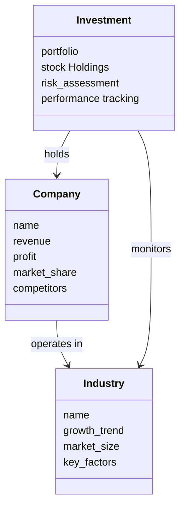

                 


# 彼得林奇的"长期增长"选股策略详解

> 关键词：彼得·林奇，长期增长，选股策略，基本面分析，投资组合，风险管理

> 摘要：本文详细解析了彼得·林奇的“长期增长”选股策略，从其核心概念、实施步骤到实际案例分析，层层深入，帮助投资者掌握这一经典投资方法。

---

## 第一部分：彼得·林奇“长期增长”选股策略概述

### 第1章：彼得·林奇与“长期增长”选股策略概述

#### 1.1 彼得·林奇及其投资理念
- **1.1.1 彼得·林奇的生平简介**
  彼得·林奇是美国著名的投资家，曾担任富达麦哲伦基金的经理，管理规模曾高达140亿美元。他以选股能力闻名，尤其擅长长期增长型投资。

- **1.1.2 林奇的投资哲学与核心理念**
  林奇强调长期持有优质股票，关注公司的基本面和成长潜力，而非短期市场波动。他相信优秀的企业能持续增长，为投资者带来超额收益。

- **1.1.3 长期增长策略的定义与目标**
  长期增长策略是指通过投资于那些具备持续盈利能力和增长潜力的公司，长期持有，获得资本增值。

#### 1.2 长期增长选股策略的核心要素
- **1.2.1 什么是长期增长投资**
  长期增长投资关注企业的内在价值，寻找那些收入和利润能够持续增长的公司。

- **1.2.2 长期增长投资的适用场景**
  适用于那些处于成长期的行业和公司，尤其是那些市场份额稳定、竞争优势明显的公司。

- **1.2.3 长期增长投资与短期交易的对比**
  长期投资注重公司基本面，而短期交易关注市场波动。长期投资风险较低，回报周期长，适合长期投资者。

---

## 第二部分：长期增长选股策略的核心指标与筛选标准

### 第2章：基本面分析的核心指标
- **2.1.1 收入与利润增长**
  企业收入和利润的持续增长是长期增长的核心。通过分析收入增长率、净利润率等指标，评估公司的盈利能力。

- **2.1.2 净利润率与ROE分析**
  净利润率（Net Profit Margin）= 净利润 / 营业收入。ROE（Return on Equity）= 净利润 / 所有者权益。高净利率和高ROE表明公司盈利能力强。

- **2.1.3 财务健康状况评估**
  通过分析资产负债表、现金流量表等，评估公司的财务健康状况，确保公司具备持续发展能力。

### 第3章：行业分析与竞争优势评估
- **3.1 行业生命周期分析**
  行业处于成长期时，企业增长潜力更大。通过分析行业趋势，选择具备增长潜力的行业。

- **3.2 企业竞争优势的判断**
  具备独特竞争优势（如技术壁垒、品牌优势）的企业更能持续增长。

- **3.3 市场地位与品牌价值**
  市场地位领先、品牌价值高的企业更具备长期增长潜力。

---

## 第三部分：长期增长选股策略的风险管理与组合构建

### 第4章：投资组合的构建原则
- **4.1 资产配置的多样性**
  通过分散投资降低风险，避免将所有资金投入单一行业或公司。

- **4.2 个股权重的合理分配**
  避免某一只股票占总投资比例过高，分散风险。

- **4.3 定期再平衡策略**
  定期审视投资组合，根据市场变化调整持仓，保持投资策略的有效性。

### 第5章：风险管理与止损策略
- **5.1 风险的定义与衡量**
  风险是投资回报的不确定性，通过波动率、VaR等指标衡量。

- **5.2 个股与组合层面的止损设置**
  设定止损点，当股价下跌超过一定比例时卖出，避免重大损失。

- **5.3 风险调整后的收益评估**
  使用夏普比率等指标评估投资收益是否值得承担相应的风险。

---

## 第四部分：长期增长选股策略的数学模型与公式

### 第6章：常用财务指标的计算公式
- **6.1 净利润率公式：**
  $$\text{净利润率} = \frac{\text{净利润}}{\text{营业收入}} \times 100\%$$

- **6.2 ROE公式：**
  $$\text{ROE} = \frac{\text{净利润}}{\text{所有者权益}} \times 100\%$$

- **6.3 市盈率公式：**
  $$\text{市盈率} = \frac{\text{股价}}{\text{每股收益}}$$

### 第7章：数学模型与公式解读
- **7.1 市盈率与成长性的关系**
  低市盈率可能意味着低估，但高成长性的公司可能市盈率较高。

- **7.2 预测未来盈利增长**
  使用历史增长率预测未来盈利，结合行业趋势和公司优势调整预测值。

---

## 第五部分：系统分析与架构设计方案

### 第8章：系统功能设计（领域模型Mermaid类图）


### 第9章：系统架构设计（Mermaid架构图）


---

## 第六部分：项目实战

### 第10章：环境安装与核心实现
- **10.1 环境安装**
  安装Python、Pandas、NumPy等工具，用于数据处理和分析。

- **10.2 核心代码实现**
  ```python
  import pandas as pd
  import numpy as np

  # 加载数据
  df = pd.read_csv('stocks.csv')

  # 计算财务指标
  df['net_profit_margin'] = df['净利润'] / df['营业收入'] * 100
  df['roe'] = df['净利润'] / df['所有者权益'] * 100

  # 筛选高增长股票
  growth_stocks = df[df['net_profit_margin'] > 10]
  ```

### 第11章：实际案例分析
- **11.1 案例一：XYZ公司的投资分析**
  XYZ公司具备高净利率和稳定的市场份额，适合长期增长投资。

- **11.2 案例二：ABC公司的投资分析**
  ABC公司处于成长期行业，具备竞争优势，适合长期投资。

### 第12章：项目小结
通过实际案例分析，验证长期增长策略的有效性，并总结经验教训。

---

## 第七部分：最佳实践与小结

### 第13章：最佳实践
- **13.1 定期审视投资组合**
  根据市场变化和公司基本面调整持仓。

- **13.2 保持长期视角**
  长期投资需要耐心，避免被短期波动干扰。

- **13.3 多元化投资**
  分散投资降低风险。

### 第14章：小结与注意事项
- **小结**
  彼得·林奇的长期增长策略注重基本面分析和公司成长潜力，是值得长期投资者学习的经典策略。

- **注意事项**
  投资需谨慎，建议根据自身风险承受能力调整投资策略。

---

## 附录
- 附录A：术语表
- 附录B：数据来源与处理方法
- 附录C：进一步阅读推荐

---

**作者：AI天才研究院 & 禅与计算机程序设计艺术**

---

通过以上详细的内容，您将能够全面了解彼得·林奇的“长期增长”选股策略，并能够将其应用于实际投资中。

