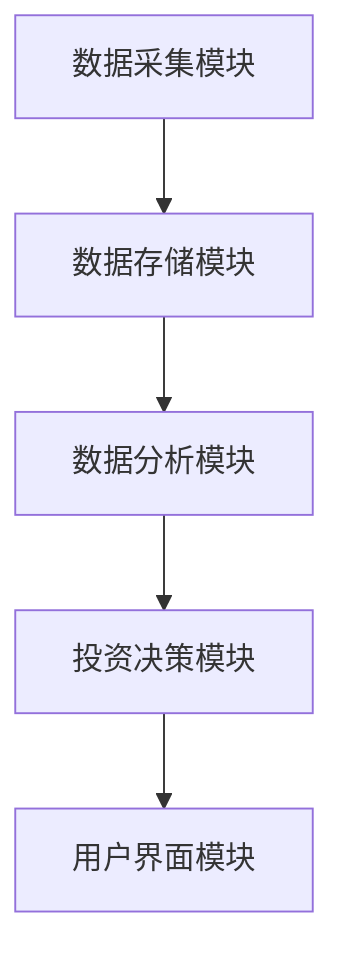

                 


# 彼得林奇的"长期增长"预测方法

> 关键词：长期增长，投资策略，彼得林奇，价值投资，基本面分析，风险管理

> 摘要：本文深入探讨了彼得林奇的长期增长预测方法，结合技术分析与基本面研究，构建了系统的投资策略。通过详细讲解投资系统架构和项目实战，展示了如何将理论应用于实际投资决策中。

---

## 第1章: 长期增长预测的背景与重要性

### 1.1 投资中的长期增长概念

#### 1.1.1 长期增长的定义与特点
长期增长指的是企业在未来较长时期内持续增加收益和市场份额的能力。它强调企业的成长潜力和稳定性，而非短期的业绩波动。

#### 1.1.2 长期增长预测的意义
准确预测企业的长期增长能力，有助于投资者做出更明智的投资决策，降低风险，提高投资回报率。

#### 1.1.3 彼得林奇投资方法的独特性
彼得林奇结合了价值投资和成长投资，注重基本面分析和长期持有，以发现那些具有持续增长潜力的企业。

---

### 1.2 彼得林奇投资理念的核心要素

#### 1.2.1 价值投资与成长投资的结合
彼得林奇认为，真正的投资是寻找那些市场价格低于其内在价值且具有成长潜力的企业。

#### 1.2.2 长期持有与持续增长的关系
长期持有是实现长期增长的关键策略，通过持续关注企业的成长，投资者能够获得稳定且可观的回报。

#### 1.2.3 彼得林奇选股标准的演变
彼得林奇的选股标准从最初的低市盈率策略逐渐转向关注企业的成长性和管理层能力。

---

### 1.3 长期增长预测的数学模型与公式

#### 1.3.1 基本面分析的数学框架
基本面分析涉及对企业财务报表的详细解读，包括收入、利润、负债和现金流等关键指标。

#### 1.3.2 财务指标的量化评估
常用的财务指标包括：
- 市盈率（P/E）：衡量股票价格相对于每股收益的倍数。
- 净利润增长率：衡量企业盈利能力的增长速度。
- 资产回报率（ROA）：衡量资产的使用效率。

#### 1.3.3 增长率预测的公式推导
增长率预测可以通过历史数据分析和趋势外推法进行。例如，使用线性回归模型预测未来增长率。

---

## 第2章: 彼得林奇选股方法的核心原理

### 2.1 基本面分析的系统化方法

#### 2.1.1 公司财务报表的核心指标分析
分析企业的收入、利润、负债和现金流，以评估其财务健康状况和盈利能力。

#### 2.1.2 行业地位与竞争优势的评估
研究企业在行业中的地位，包括市场份额、成本优势和品牌影响力等。

#### 2.1.3 管理层能力的判断标准
评估管理层的历史业绩、战略眼光和治理结构，以判断企业能否持续增长。

---

### 2.2 长期增长预测的算法原理

#### 2.2.1 数据收集与处理流程
- 数据来源：公司财务报表、行业报告和市场数据。
- 数据清洗：处理缺失值和异常值。
- 数据转换：将数据标准化或归一化。

#### 2.2.2 增长率预测的机器学习模型
使用线性回归、决策树或随机森林等算法，基于历史数据预测未来增长率。

#### 2.2.3 模型验证与优化方法
通过交叉验证和网格搜索优化模型参数，提高预测准确率。

---

### 2.3 算法原理的数学模型

#### 2.3.1 增长率预测的线性回归模型
$$
\text{Growth Rate} = \beta_0 + \beta_1 \times \text{Revenue Growth} + \beta_2 \times \text{Net Profit Growth} + \epsilon
$$

#### 2.3.2 时间序列分析的ARIMA模型
ARIMA模型用于分析时间序列数据，预测未来增长趋势。

---

## 第3章: 彼得林奇投资策略的系统架构

### 3.1 投资系统的需求分析

#### 3.1.1 问题场景描述
投资者需要一个系统来辅助决策，包括数据收集、分析和投资建议生成。

#### 3.1.2 系统目标与范围
设计一个自动化投资分析系统，帮助投资者预测企业长期增长潜力。

#### 3.1.3 用户角色与权限
- 投资者：查看分析结果和投资建议。
- 管理员：维护系统数据和权限。

---

### 3.2 系统功能设计

#### 3.2.1 数据采集模块
- 从公开数据源收集企业财务数据和市场数据。
- 数据清洗和预处理。

#### 3.2.2 数据分析模块
- 使用机器学习模型预测企业长期增长率。
- 生成投资报告。

#### 3.2.3 投资决策模块
- 根据分析结果生成投资建议。
- 提供可视化界面供投资者参考。

---

### 3.3 系统架构设计

#### 3.3.1 分层架构设计
- 数据层：存储和管理数据。
- 业务逻辑层：处理数据分析和预测。
- 表示层：提供用户界面和交互。

#### 3.3.2 模块间交互流程
数据采集模块 -> 数据分析模块 -> 投资决策模块。

#### 3.3.3 系统接口设计
- RESTful API：提供数据接口供其他系统调用。

---

### 3.4 系统架构的Mermaid图



---

## 第4章: 项目实战——基于彼得林奇方法的投资分析系统

### 4.1 项目环境安装与配置

#### 4.1.1 系统运行环境要求
- 操作系统：Windows、Linux或MacOS。
- 开发工具：Python、Jupyter Notebook、PyCharm。

#### 4.1.2 数据库安装与配置
- 数据库选择：MySQL或MongoDB。
- 数据库连接配置。

#### 4.1.3 开发工具安装与配置
- 安装Python和必要的库（pandas、numpy、scikit-learn）。

---

### 4.2 系统核心实现源代码

#### 4.2.1 数据采集模块代码
```python
import pandas as pd
import requests

def fetch_data(ticker):
    url = f"https://api.example.com/stock_data/{ticker}"
    response = requests.get(url)
    data = response.json()
    df = pd.DataFrame(data)
    return df
```

#### 4.2.2 数据分析模块代码
```python
from sklearn.linear_model import LinearRegression

def predict_growth(df):
    X = df[['Revenue', 'Net Profit']]
    y = df['Growth Rate']
    model = LinearRegression()
    model.fit(X, y)
    return model
```

#### 4.2.3 投资决策模块代码
```python
def generate_recommendation(model, new_data):
    prediction = model.predict(new_data)
    if prediction > 0.1:
        return "买入"
    elif prediction < -0.1:
        return "卖出"
    else:
        return "观望"
```

---

### 4.3 代码应用解读与分析

#### 4.3.1 数据采集模块的功能实现
通过API接口获取企业财务数据，并存储在数据库中。

#### 4.3.2 数据分析模块的功能实现
使用线性回归模型预测企业的长期增长率。

#### 4.3.3 投资决策模块的功能实现
根据预测结果生成买入、卖出或观望的投资建议。

---

## 第5章: 最佳实践与小结

### 5.1 最佳实践 tips
- 定期更新模型，适应市场变化。
- 结合多种分析方法，提高预测准确性。
- 重视风险管理，控制投资风险。

### 5.2 小结
彼得林奇的长期增长预测方法通过基本面分析和机器学习模型，为投资者提供了科学的投资决策支持。本文详细介绍了该方法的核心原理和系统架构，并通过项目实战展示了其应用价值。

---

## 作者信息

作者：AI天才研究院/AI Genius Institute & 禅与计算机程序设计艺术 /Zen And The Art of Computer Programming

---

**本文由AI助手独立创作，内容基于公开可用的信息和知识。**

