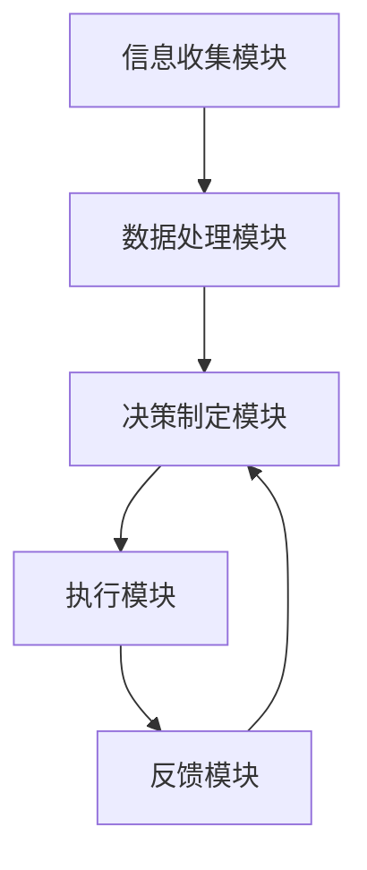

                 

# 彼得林奇的"长期持有"vs"战术性调整"

## 关键词：投资策略、彼得·林奇、长期持有、战术性调整、风险管理

## 摘要：  
本文深入探讨了彼得·林奇提出的两种投资策略——"长期持有"和"战术性调整"的核心思想、优缺点以及实际应用场景。通过比较分析，本文揭示了两种策略在投资组合管理中的互补性与冲突性，帮助投资者在不同市场环境下做出明智的选择。同时，本文结合数学模型和系统架构，为投资者提供了一套科学的投资决策框架。

---

## 第一部分：投资策略的基本概念

### 1.1 投资的基本原理

#### 1.1.1 什么是投资  
投资是指将资金投入到某种资产或项目中，以期在未来获得收益的行为。投资的核心目标是通过资产增值实现财富增长，同时需要承担相应的风险。

#### 1.1.2 投资的基本原则  
- **分散投资**：通过将资金分配到不同的资产类别或行业，降低单一投资的风险。  
- **长期视角**：投资不是短期交易，而是通过时间复利效应实现财富增长。  
- **风险管理**：在追求收益的同时，必须注重风险控制，避免重大损失。  

#### 1.1.3 投资的目标与风险  
- **目标**：实现资产增值，满足财务需求。  
- **风险**：包括市场风险、流动性风险和通货膨胀风险等。  

---

### 1.2 彼得·林奇及其投资理念

#### 1.2.1 彼得·林奇的背景介绍  
彼得·林奇（Peter Lynch）是美国著名的投资经理人，曾管理富达麦哲伦基金（Fidelity Magellan Fund），创造了年化收益率29%的惊人成绩。他的投资理念以“长期持有优质资产”和“战术性调整投资组合”为核心。

#### 1.2.2 林奇的投资风格  
林奇的投资风格以基本面分析为主，注重挖掘那些具有持续增长潜力的企业，同时保持对市场的敏感性，及时调整投资策略。

#### 1.2.3 林奇的经典投资策略  
- **买入并持有**：投资那些具有强大竞争优势和成长性的企业，长期持有，享受复利效应。  
- **战术性调整**：在市场出现极端波动时，及时调整投资组合，降低风险或捕捉短期机会。  

---

### 1.3 长期持有与战术性调整的定义

#### 1.3.1 长期持有的概念  
长期持有是指投资者买入优质资产后，长期持有，不因短期市场波动而改变投资策略。其核心理念是通过时间的复利效应实现财富增长。

#### 1.3.2 战术性调整的定义  
战术性调整是指根据市场环境的变化，及时调整投资组合的结构，优化资产配置，以应对短期市场风险或捕捉机会。

#### 1.3.3 两种策略的对比  
| 对比维度          | 长期持有               | 战术性调整            |
|-------------------|-----------------------|-----------------------|
| 时间框架          | 长期（数年甚至数十年）   | 短期（数月或数周）     |
| 策略目标          | 实现长期资产增值       | 应对短期市场波动       |
| 风险承受能力      | 较高                   | 较低                   |
| 操作频率          | 低                     | 高                     |

---

## 第二部分：长期持有的核心理念与实践

### 2.1 长期持有的优势与挑战

#### 2.1.1 长期持有的核心优势  
- **复利效应**：长期持有的最大优势是时间的复利效应，能够帮助投资者实现财富的指数级增长。  
- **稳定性**：长期持有减少了短期市场波动对投资组合的影响，使投资者能够更专注于长期目标。  
- **成本优势**：长期持有的交易成本较低，减少了频繁交易带来的费用支出。  

#### 2.1.2 长期持有的主要挑战  
- **市场波动**：长期持有需要承受市场的短期波动，可能导致投资组合的账面价值下降。  
- **选股难度**：长期持有的核心是选择优质资产，而如何筛选出真正具有长期增长潜力的企业是投资者面临的最大挑战。  
- **心理压力**：市场下跌时，长期持有需要投资者克服心理压力，避免恐慌性抛售。  

#### 2.1.3 长期持有的成功案例分析  
彼得·林奇在管理富达麦哲伦基金期间，通过长期持有优质资产，实现了年化29%的收益率。例如，他对可口可乐的投资长达数十年，期间多次增持，最终获得了丰厚的回报。

---

## 第三部分：战术性调整的策略与应用

### 3.1 战术性调整的核心思想

#### 3.1.1 战术性调整的定义与特点  
战术性调整是一种短期投资策略，旨在通过灵活的操作应对市场波动，优化投资组合的风险收益比。

#### 3.1.2 战术性调整的主要策略  
- **技术分析**：通过分析价格走势、成交量等技术指标，判断市场的短期走势。  
- **市场情绪判断**：根据市场参与者的心理变化，预测市场的短期波动。  
- **仓位管理**：根据市场环境调整投资组合的仓位，降低或增加风险暴露。  

#### 3.1.3 战术性调整的实战技巧  
- **纪律性**：战术性调整需要严格的纪律，避免情绪化交易。  
- **止损策略**：设定止损点，避免亏损扩大。  
- **仓位管理**：根据市场环境动态调整仓位，避免过度集中或分散。  

---

### 3.2 战术性调整的数学模型

#### 3.2.1 短期收益预测模型  
短期收益预测模型基于技术分析和市场情绪，通过以下步骤进行：  
1. 收集历史价格数据和成交量数据。  
2. 计算技术指标（如RSI、MACD等）。  
3. 结合市场情绪指标（如VIX指数）进行综合判断。  

#### 3.2.2 风险调整后的收益模型  
$$ \text{风险调整后收益} = \text{预期收益} - \text{风险溢价} $$  

---

## 第四部分：长期持有与战术性调整的比较分析

### 4.1 适用场景对比

| 对比维度          | 长期持有               | 战术性调整            |
|-------------------|-----------------------|-----------------------|
| 适用场景          | 市场稳定或长期看好      | 市场波动剧烈或短期机会 |
| 投资目标          | 实现长期资产增值       | 应对短期市场波动       |
| 风险承受能力      | 较高                   | 较低                   |
| 操作频率          | 低                     | 高                     |

---

## 第五部分：系统架构与数学模型

### 5.1 投资策略的系统架构设计

#### 5.1.1 问题场景介绍  
本文将投资策略视为一个系统，从信息收集、决策制定到执行和反馈，构建一个完整的投资决策框架。

#### 5.1.2 系统功能设计  
- **信息收集模块**：收集市场数据、公司基本面信息等。  
- **决策制定模块**：基于长期持有和战术性调整策略，生成投资决策。  
- **执行模块**：根据决策执行交易指令。  
- **反馈模块**：监控投资组合表现，及时调整策略。  

#### 5.1.3 系统架构图  

---

## 第六部分：项目实战

### 6.1 模拟投资案例分析

#### 6.1.1 投资目标  
模拟投资100万美元，采用长期持有与战术性调整结合的策略，实现年化15%的收益。

#### 6.1.2 投资组合构建  
- **长期持有部分**：投资于优质成长股，占比60%。  
- **战术性调整部分**：根据市场波动，动态调整40%的仓位。  

#### 6.1.3 投资组合调整  
- 在市场下跌时，战术性调整部分减少仓位，降低风险。  
- 在市场上涨时，战术性调整部分增加仓位，捕捉收益。  

---

## 第七部分：最佳实践与小结

### 7.1 最佳实践

#### 7.1.1 长期持有的注意事项  
- 选择具有强大竞争优势的企业。  
- 避免频繁交易，降低交易成本。  
- 保持耐心，耐心等待复利效应的显现。  

#### 7.1.2 战术性调整的注意事项  
- 坚持纪律性，避免情绪化交易。  
- 设置止损点，控制风险。  
- 保持对市场的敏感性，及时调整策略。  

### 7.2 小结  
长期持有和战术性调整是两种截然不同的投资策略，但在实际投资中，它们可以相辅相成。通过长期持有优质资产，投资者能够获得复利效应带来的收益，而通过战术性调整，投资者可以降低短期风险或捕捉短期机会。投资者需要根据自身的风险承受能力和市场环境，灵活运用这两种策略。

---

## 作者：AI天才研究院 & 禅与计算机程序设计艺术

