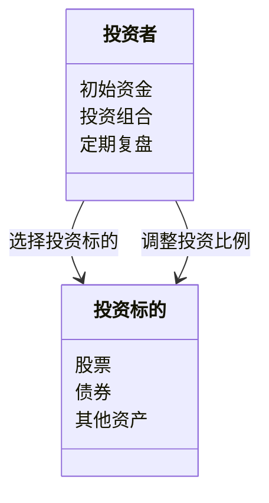
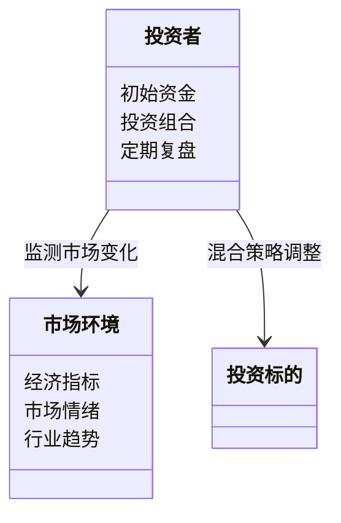

                 


# 彼得林奇的"长期持有"vs"战术性调整"的决策框架

## 关键词：彼得林奇，长期持有，战术性调整，投资策略，风险管理，系统架构

## 摘要：本文深入探讨了彼得·林奇提出的两种投资策略：长期持有和战术性调整。通过分析这两种策略的理论基础、数学模型、系统架构和实际案例，本文旨在帮助投资者理解何时及如何选择这两种策略，以优化投资组合并实现稳健回报。文章还结合了风险管理与策略优化，提供了实用的建议和最佳实践。

---

## 第一章：彼得林奇投资理念概述

### 1.1 长期持有策略
#### 1.1.1 核心概念
长期持有策略强调长期投资，避免频繁交易。核心理念包括：价值投资、分散投资和耐心持有。

#### 1.1.2 理论基础
- **价值投资**：寻找基本面良好、具有长期增长潜力的公司。
- **分散投资**：通过投资不同资产类别和行业降低风险。
- **耐心持有**：长期持有优质资产，避免短期波动影响决策。

#### 1.1.3 优缺点对比
| 优点 | 缺点 |
|------|------|
| 简单易行，降低交易成本 | 无法应对突发市场变化 |
| 享受复利效应 | 可能错过短期调整机会 |

### 1.2 战术性调整策略
#### 1.2.1 核心概念
战术性调整强调根据市场变化及时调整投资组合，注重短期收益和风险管理。

#### 1.2.2 理论基础
- **市场分析**：关注宏观经济指标、行业趋势和市场情绪。
- **灵活调整**：根据市场变化动态优化资产配置。
- **风险控制**：通过调整持仓比例控制波动风险。

#### 1.2.3 优缺点对比
| 优点 | 缺点 |
|------|------|
| 灵活应对市场变化 | 需要较高的市场判断能力 |
| 优化短期收益 | 可能增加交易成本 |

---

## 第二章：长期持有策略的理论基础

### 2.1 数学模型
长期投资的复利效应可以用以下公式计算：
$$
\text{终值} = \text{初始投资} \times (1 + \text{年收益率})^{\text{年数}}
$$

### 2.2 系统架构
以下是一个简单的系统架构图，展示长期持有策略的核心组件：



### 2.3 项目实战
#### 2.3.1 环境配置
安装Python和必要的库，如numpy和pandas。

#### 2.3.2 核心代码实现
```python
import numpy as np
import pandas as pd

def calculate_long_term_return(initial_investment, annual_return, years):
    return initial_investment * (1 + annual_return) ** years

# 示例计算
initial_investment = 10000
annual_return = 0.07
years = 10
final_value = calculate_long_term_return(initial_investment, annual_return, years)
print(f"10年后的终值为：${final_value:.2f}")
```

#### 2.3.3 案例分析
假设投资者投入10,000美元，年收益率7%，10年后的终值为：
$$ 10000 \times (1 + 0.07)^{10} = 19674.52 $$

---

## 第三章：战术性调整策略的理论基础

### 3.1 数学模型
战术性调整的动态再平衡可以用以下公式表示：
$$
\text{新权重} = \frac{\text{当前资产价值}}{\text{总组合价值}} \times \text{调整比例}
$$

### 3.2 系统架构
以下是一个战术性调整策略的系统架构图：


### 3.3 项目实战
#### 3.3.1 环境配置
与长期持有策略相同，安装必要的Python库。

#### 3.3.2 核心代码实现
```python
def calculate_dynamic_adjustment(current_portfolio, market_change):
    return current_portfolio * (1 + market_change)

# 示例计算
current_portfolio = 100000
market_change = 0.05
adjusted_portfolio = calculate_dynamic_adjustment(current_portfolio, market_change)
print(f"调整后的投资组合价值为：${adjusted_portfolio:.2f}")
```

#### 3.3.3 案例分析
当市场预期上涨5%时，投资组合调整后价值为：
$$ 100000 \times 1.05 = 105000 $$

---

## 第四章：长期持有 vs 战术性调整

### 4.1 对比分析
| 对比维度 | 长期持有 | 战术性调整 |
|----------|----------|------------|
| 适用场景 | 稳定增长 | 短期波动 |
| 操作频率 | 低 | 高 |
| 风险管理 | 较低 | 较高 |

### 4.2 综合策略
根据市场周期选择策略。例如，在牛市中使用长期持有，在熊市中进行战术性调整。

---

## 第五章：实际投资中的应用

### 5.1 系统设计
结合长期持有和战术性调整的混合策略，构建一个灵活的投资系统。



### 5.2 项目实战
#### 5.2.1 环境配置
安装必要的库，如numpy和pandas。

#### 5.2.2 核心代码实现
```python
def hybrid_strategy(initial_investment, market_trend, volatility):
    if market_trend > 0 and volatility < 0.1:
        return initial_investment * 1.05
    else:
        return initial_investment * 1.03

# 示例计算
initial_investment = 100000
market_trend = 0.05
volatility = 0.08
final_value = hybrid_strategy(initial_investment, market_trend, volatility)
print(f"最终投资组合价值为：${final_value:.2f}")
```

---

## 第六章：风险管理与策略优化

### 6.1 风险管理
使用止损和止盈机制，控制投资组合的最大回撤。

### 6.2 策略优化
结合技术指标和基本面分析，优化投资决策。

---

## 结论

彼得林奇的长期持有和战术性调整策略各有优劣，投资者应根据市场环境和个人风险承受能力选择合适策略。未来，可以通过机器学习优化投资组合，进一步提升收益。

---

## 作者：AI天才研究院 & 禅与计算机程序设计艺术

