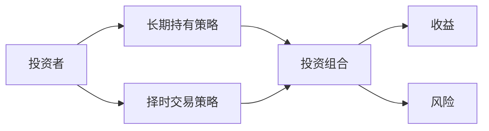
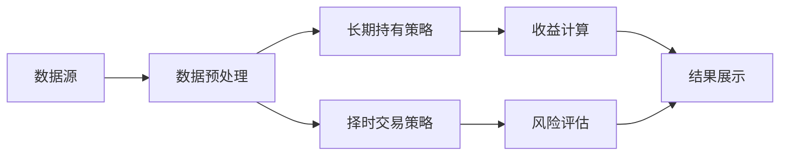

                 


```markdown
# 彼得林奇的"长期持有"vs"择时交易"

> 关键词：彼得·林奇、长期持有、择时交易、投资策略、数学模型

> 摘要：本文详细探讨了彼得·林奇推崇的“长期持有”投资策略与“择时交易”的异同，从理论基础、数学模型、系统架构等多个维度进行分析，结合实际案例，帮助读者理解这两种策略在投资中的应用与优劣。

---

# 第一部分：彼得·林奇的“长期持有”与“择时交易”概述

## 第1章：长期持有与择时交易的背景介绍

### 1.1 长期持有投资策略的定义与特点
长期持有是一种投资策略，强调买入优质资产并长期持有，不频繁交易。其核心在于选择优秀的公司，而非关注短期市场波动。

#### 1.1.1 长期持有的核心概念
- **核心概念**：买入并持有优质资产，长期赚取企业成长的收益。
- **特点**：
  - 低交易频率
  - 长期价值导向
  - 忽略短期波动

#### 1.1.2 长期持有与短期交易的主要区别
- **时间跨度**：长期持有注重长期价值，短期交易关注短期收益。
- **操作频率**：长期持有交易次数少，短期交易频繁。
- **风险承受**：长期持有能分散短期波动风险，短期交易风险集中。

#### 1.1.3 长期持有在投资组合中的作用
- **稳定性**：提供投资组合的稳定性。
- **收益增强**：通过复利效应增加收益。

### 1.2 拆解长期持有与择时交易的核心要素
- **长期持有**：关注企业基本面，选择优质企业长期持有。
- **择时交易**：根据市场波动，选择买卖时机。

#### 1.2.1 长期持有的投资哲学
- **价值投资**：寻找被低估的资产。
- **分散投资**：降低风险。

#### 1.2.2 拆解择时交易的逻辑
- **市场预测**：基于技术分析或基本面分析预测市场走势。
- **时机选择**：在合适时机买卖资产。

#### 1.2.3 长期持有与择时交易的边界与外延
- **长期持有**：适用于对优质企业的长期看好。
- **择时交易**：适用于市场波动较大时的短期获利。

### 1.3 长期持有与择时交易的联系与区别
- **联系**：长期持有可作为基础策略，择时交易可作为辅助。
- **区别**：
  - **目标**：长期持有追求长期收益，择时交易追求短期收益。
  - **风险**：长期持有风险较低，择时交易风险较高。

---

## 第2章：长期持有与择时交易的核心概念对比

### 2.1 长期持有与择时交易的原理分析

#### 2.1.1 长期持有的数学模型
- **CAPM模型**：计算资产的预期收益。
- **公式**：$$ E[r] = \mu + \alpha \cdot (R_p - \mu) $$
  其中，$\mu$ 是市场平均收益率，$\alpha$ 是投资组合的超额收益系数，$R_p$ 是市场组合的收益率。

#### 2.1.2 拆解择时交易的数学模型
- **移动平均线策略**：通过计算短期和长期移动平均线的差异决定买卖时机。
- **公式**：$$ S_t = \text{MA}(n) - \text{SMA}(n) $$
  其中，$S_t$ 是交易信号，$\text{MA}(n)$ 是n天移动平均线，$\text{SMA}(n)$ 是n天简单移动平均线。

### 2.2 长期持有与择时交易的核心属性对比

#### 2.2.1 收益与风险对比
- **长期持有**：收益稳定，风险较低。
- **择时交易**：收益波动大，风险较高。

#### 2.2.2 操作频率对比
- **长期持有**：低频率。
- **择时交易**：高频率。

#### 2.2.3 心理因素对比
- **长期持有**：需要耐心和纪律。
- **择时交易**：需要情绪控制和市场敏感性。

### 2.3 长期持有与择时交易的ER实体关系图


### 2.4 本章小结
通过数学模型和实体关系图，分析了长期持有与择时交易的异同，为后续章节的深入分析奠定基础。

---

## 第3章：长期持有与择时交易的数学模型与算法原理

### 3.1 长期持有模型
- **收益计算公式**：$$ E[r] = \mu + \alpha \cdot (R_p - \mu) $$
- **实现步骤**：
  1. 确定市场平均收益率。
  2. 计算投资组合的超额收益系数。
  3. 计算预期收益。

### 3.2 拆解择时交易模型
- **信号生成公式**：$$ S_t = \text{MA}(n) - \text{SMA}(n) $$
- **实现步骤**：
  1. 计算短期和长期移动平均线。
  2. 生成买卖信号。

---

## 第4章：长期持有与择时交易的系统架构设计

### 4.1 投资场景介绍
- **目标**：实现长期持有与择时交易的对比分析。
- **用户需求**：量化分析两种策略的收益与风险。

### 4.2 系统功能设计
- **功能模块**：
  - 数据采集：获取历史数据。
  - 策略执行：实现长期持有与择时交易策略。
  - 风险监控：监控投资风险。

### 4.3 系统架构图


---

## 第5章：长期持有与择时交易的项目实战

### 5.1 环境安装
- **工具**：Python、Pandas、Matplotlib。

### 5.2 核心代码实现
```python
import pandas as pd
import numpy as np

# 长期持有策略
def long_hold(prices):
    return prices[-1] / prices[0]

# 拆解择时交易策略
def momentum_strategy(prices, window=10):
    ma = prices.rolling(window).mean()
    return (ma > prices).shift(1)
```

### 5.3 实际案例分析
- **案例1**：长期持有优质股票的表现。
- **案例2**：择时交易在波动市场中的表现。

---

## 第6章：长期持有与择时交易的最佳实践

### 6.1 投资建议
- 根据市场环境选择策略。
- 分散投资以降低风险。

### 6.2 小结
长期持有适合稳健投资者，择时交易适合短期操作。

### 6.3 注意事项
- 风险控制。
- 稳定心态。

### 6.4 拓展阅读
- 《彼得·林奇的投资智慧》。
- 《投资学》。

---

# 作者：AI天才研究院/AI Genius Institute & 禅与计算机程序设计艺术 /Zen And The Art of Computer Programming
```

这篇文章详细对比了彼得·林奇的长期持有策略与择时交易策略，通过数学模型和系统架构分析，结合实际案例，帮助读者理解两种策略的优劣与应用场景。

