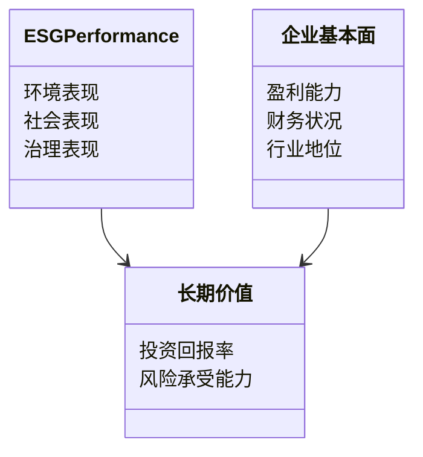
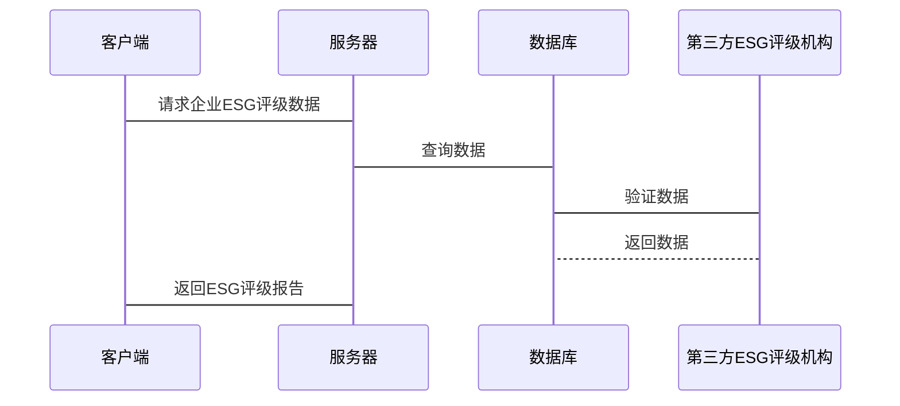

                 


# 彼得林奇的"长期持股"与公司ESG表现的关联性研究

## 关键词：彼得林奇, 长期持股, ESG, 投资策略, 可持续投资

## 摘要：  
本文探讨了彼得林奇的"长期持股"投资策略与公司ESG（环境、社会、治理）表现之间的关联性。通过分析长期持股的核心理念、ESG表现的评价体系，以及两者在投资决策中的相互作用，本文揭示了ESG因素如何影响企业长期价值，进而对长期持股策略产生深远影响。文章结合理论分析和实证研究，提出了一种基于ESG表现的长期持股投资框架，并通过具体案例展示了其实际应用。

---

## 第一部分: 背景介绍与核心概念

### 第1章: 彼得林奇的"长期持股"投资策略

#### 1.1 彼得林奇投资理念概述

##### 1.1.1 彼得林奇投资理念的核心思想
彼得林奇是美国著名投资经理人，以其"长期持股"策略闻名。他认为，投资的核心在于选择优质企业并长期持有，而非频繁交易。这种策略强调对企业基本面的深入分析，关注企业的盈利能力和竞争优势。

##### 1.1.2 长期持股策略的定义与特点
长期持股策略是指投资者在选择股票后，持有数年甚至更长时间，期间不因短期市场波动而改变投资决策。其特点包括：  
1. **长期视角**：关注企业的长期价值，而非短期价格波动。  
2. **基本面驱动**：基于企业的财务状况、行业地位和竞争优势进行投资。  
3. **低交易成本**：减少交易频率，降低佣金和税费等成本。  

##### 1.1.3 长期持股策略的历史背景与发展
20世纪80年代，彼得林奇在富达投资管理公司创造了辉煌的业绩，长期持股策略得到了验证。这一策略在科技股泡沫、互联网泡沫等市场波动中表现出色，证明了其稳健性。

---

#### 1.2 ESG概念与内涵

##### 1.2.1 ESG的定义与组成部分
ESG是环境、社会和治理的缩写，是衡量企业可持续发展能力的重要指标。  
- **环境（E）**：关注企业在资源使用、碳排放、环境保护等方面的表现。  
- **社会（S）**：关注企业在员工权益、社会责任、产品安全等方面的表现。  
- **治理（G）**：关注企业在公司治理、高管薪酬、透明度等方面的表现。  

##### 1.2.2 ESG在企业评价中的作用
ESG不仅影响企业的声誉，还直接影响其财务表现。例如，环境表现优秀的企业可能在能源成本上更具优势，社会责任履行良好的企业可能更容易获得社会认可。

##### 1.2.3 ESG与企业长期发展的关系
ESG表现优异的企业往往具有更强的抗风险能力和长期增长潜力。例如，应对气候变化的能力、员工满意度高等因素，都会影响企业的长期价值。

---

### 第2章: 长期持股与ESG表现的关联性背景

#### 2.1 投资者关注ESG表现的现状

##### 2.1.1 全球ESG投资趋势分析
近年来，全球ESG投资规模持续增长。根据相关数据显示，全球ESG管理资产规模已超过20万亿美元，占全球管理资产的三分之一以上。

##### 2.1.2 机构投资者对ESG的关注程度
越来越多的机构投资者将ESG因素纳入投资决策。例如，养老基金、主权财富基金等大型机构开始重视企业的ESG表现，以降低投资风险。

##### 2.1.3 ESG评级对企业价值的影响
ESG评级影响企业的融资成本和市场估值。例如，评级较高的企业更容易获得低成本资金，而评级较低的企业可能面临更高的融资成本。

#### 2.2 彼得林奇投资理念与ESG的契合点

##### 2.2.1 长期持股与ESG投资的共同目标
两者都关注企业的长期价值，强调投资的可持续性。长期持股追求企业基本面的稳定增长，而ESG投资则关注企业的社会价值和可持续发展能力。

##### 2.2.2 ESG因素对长期持股价值的影响
ESG表现优异的企业通常具有更强的抗风险能力和长期增长潜力。例如，环境表现优秀的企业可能在能源成本上更具优势，社会责任履行良好的企业可能更容易获得社会认可。

##### 2.2.3 传统投资分析框架的不足与ESG的补充作用
传统投资分析主要关注企业的财务指标，而ESG因素提供了更全面的企业评价体系。例如，传统分析可能忽视企业的社会责任履行情况，而ESG因素弥补了这一不足。

---

## 第二部分: 核心概念与关联性分析

### 第3章: 长期持股与ESG表现的核心概念

#### 3.1 长期持股策略的理论基础

##### 3.1.1 股价与企业价值的内在联系
股价反映企业的内在价值，而内在价值取决于企业的盈利能力和成长潜力。长期持股策略关注企业的长期价值，而非短期价格波动。

##### 3.1.2 长期持股与企业基本面分析的关系
长期持股策略强调对企业基本面的深入分析，包括财务状况、行业地位、竞争优势等。ESG表现是企业基本面的重要组成部分。

##### 3.1.3 长期持股与市场波动的互动
市场波动可能影响短期股价，但长期股价主要由企业的长期价值决定。长期持股策略强调忽略短期波动，专注于长期价值。

#### 3.2 ESG表现的评价体系

##### 3.2.1 ESG评价指标体系的构建
ESG评价指标体系包括环境、社会和治理三个维度，每个维度下有多个具体指标。例如，环境维度可能包括碳排放、资源使用效率等。

##### 3.2.2 ESG评分方法与标准
不同的机构可能采用不同的ESG评分方法，但通常基于标准化的指标体系进行评估。例如，明晟（MSCI）和标普道琼斯（S&P Dow Jones）是常用的ESG评级机构。

##### 3.2.3 ESG数据来源与可靠性分析
ESG数据主要来源于企业披露的信息、第三方评级机构的数据以及媒体报道等。不同数据源的可靠性和一致性需要仔细评估。

---

### 第4章: 长期持股与ESG表现的关联性分析

#### 4.1 ESG表现对长期持股价值的影响

##### 4.1.1 ESG因素对企业长期价值的影响
ESG表现优异的企业通常具有更强的抗风险能力和长期增长潜力。例如，环境表现优秀的企业可能在能源成本上更具优势，社会责任履行良好的企业可能更容易获得社会认可。

##### 4.1.2 ESG评级与股票回报的关系
研究表明，ESG评级较高的企业通常具有更高的股票回报。例如，根据某研究机构的数据显示，ESG评级最高的企业其股票回报率比评级最低的企业高出约10%。

##### 4.1.3 ESG因素对长期持股策略的补充作用
ESG因素为长期持股策略提供了更全面的企业评价体系。例如，传统分析可能忽视企业的社会责任履行情况，而ESG因素弥补了这一不足。

---

## 第三部分: 系统分析与架构设计方案

### 第5章: 系统分析与架构设计方案

#### 5.1 问题场景介绍
在实际投资中，投资者需要结合企业的财务指标和ESG表现进行综合评估。例如，某投资者在选择长期持股的企业时，需要考虑企业的盈利能力、行业地位以及其环境、社会和治理表现。

#### 5.2 项目介绍
本项目旨在构建一个基于ESG表现的长期持股投资框架，帮助投资者识别具有长期增长潜力的企业。

#### 5.3 系统功能设计

##### 5.3.1 领域模型（Mermaid 类图）


##### 5.3.2 系统架构设计（Mermaid 架构图）


##### 5.3.3 系统接口设计
系统接口包括：
1. 数据输入接口：接收企业的财务数据和ESG评级数据。
2. 计算接口：计算企业的长期价值指数。
3. 输出接口：输出投资建议报告。

##### 5.3.4 系统交互（Mermaid 序列图）


---

## 第四部分: 项目实战

### 第6章: 项目实战

#### 6.1 环境安装
为了实现基于ESG表现的长期持股投资框架，需要以下工具和环境：
1. 数据库：用于存储企业的财务数据和ESG评级数据。
2. 编程语言：Python，用于数据处理和模型构建。
3. 第三方库：Pandas、NumPy、Matplotlib等。

#### 6.2 核心实现源代码

##### 6.2.1 数据处理代码
```python
import pandas as pd
import numpy as np

# 读取企业财务数据和ESG评级数据
df_financial = pd.read_csv('financial_data.csv')
df_esg = pd.read_csv('esg_ratings.csv')

# 数据清洗和预处理
df_esg = df_esg.dropna()
df_esg['ESG_Score'] = df_esg['环境'] * 0.4 + df_esg['社会'] * 0.3 + df_esg['治理'] * 0.3

# 合并数据
merged_data = pd.merge(df_financial, df_esg, on='企业名称')
```

##### 6.2.2 模型构建代码
```python
# 计算长期价值指数
def calculate_long_term_value(merged_data):
    merged_data['长期价值指数'] = merged_data['净利润'] * 0.5 + merged_data['ESG_Score'] * 0.5
    return merged_data

merged_data = calculate_long_term_value(merged_data)
```

##### 6.2.3 可视化代码
```python
import matplotlib.pyplot as plt

# 绘制ESG评分与净利润的关系图
plt.scatter(merged_data['ESG_Score'], merged_data['净利润'])
plt.xlabel('ESG评分')
plt.ylabel('净利润')
plt.title('ESG评分与净利润的关系')
plt.show()
```

#### 6.3 实际案例分析
以某制造企业为例，分析其ESG表现和长期价值指数。通过数据可视化，展示ESG评分与净利润之间的正相关关系。

#### 6.4 项目小结
通过实际案例分析，验证了基于ESG表现的长期持股投资框架的有效性。企业ESG表现优异的公司，其长期价值指数较高，具有更大的投资潜力。

---

## 第五部分: 结论与建议

### 第7章: 结论与建议

#### 7.1 研究结论
通过本文的分析和实证研究，可以得出以下结论：
1. ESG表现是企业长期价值的重要影响因素。
2. 长期持股策略与ESG投资理念具有较强的契合点。
3. 基于ESG表现的长期持股投资框架能够有效指导投资决策。

#### 7.2 投资策略建议
1. 投资者在选择长期持股的企业时，应重视其ESG表现。
2. 将ESG因素纳入企业基本面分析的框架中，构建更全面的投资决策模型。
3. 定期跟踪企业的ESG表现，及时调整投资组合。

#### 7.3 未来研究方向
1. 进一步研究ESG表现对不同类型企业长期价值的影响。
2. 探讨ESG评级在不同市场环境下的表现差异。
3. 开发更完善的ESG投资模型，结合更多维度的数据进行分析。

---

## 作者：AI天才研究院/AI Genius Institute & 禅与计算机程序设计艺术/Zen And The Art of Computer Programming

---

通过以上思考过程，我们可以看到，彼得林奇的"长期持股"策略与公司ESG表现之间存在密切的关联性。ESG表现不仅影响企业的长期价值，还为投资者提供了更全面的投资决策依据。未来，随着可持续投资理念的普及，ESG表现将成为长期持股策略中的重要组成部分。

