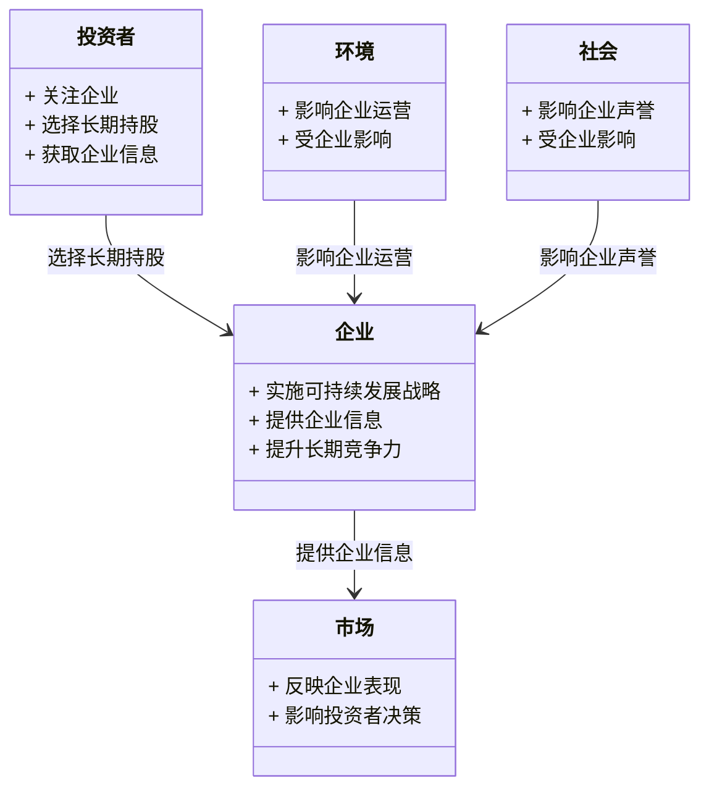

                 


# 彼得林奇的"长期持股"与公司可持续发展战略的关联性分析

> 关键词：彼得·林奇, 长期持股, 可持续发展, 投资策略, 企业战略

> 摘要：本文分析了彼得·林奇的长期持股投资策略与公司可持续发展战略之间的关联性。通过详细阐述长期持股策略的核心思想、公司可持续发展的定义与特点，以及两者之间的相互作用，探讨了长期持股策略如何促进企业实施可持续发展战略，从而为投资者创造长期价值。

---

## 第1章: 彼得·林奇的长期持股策略概述

### 1.1 彼得·林奇与长期持股策略的背景

#### 1.1.1 彼得·林奇的生平与投资理念
彼得·林奇是美国著名投资经理人，曾管理富达麦哲伦基金，创造了辉煌的投资业绩。他的投资理念强调长期持有优质股票，注重基本面分析和公司长期发展潜力。

#### 1.1.2 长期持股策略的核心思想
长期持股策略的核心思想是：通过选择具有强大基本面和长期增长潜力的公司，进行长期投资，避免频繁交易带来的成本和风险。

#### 1.1.3 长期持股策略的哲学基础
林奇认为，短期市场波动难以预测，而公司长期价值的增长才是投资的关键。投资者应关注企业的基本面，而不是市场的短期波动。

### 1.2 长期持股策略的定义与特点

#### 1.2.1 长期持股的定义
长期持股是指投资者持有股票的时间较长，通常超过一年，甚至更长，以获得企业的长期增长收益。

#### 1.2.2 长期持股的核心特点
- 长期性：关注企业的长期增长潜力。
- 稳定性：避免频繁交易，降低交易成本。
- 选择性：精选优质公司，注重基本面分析。

#### 1.2.3 长期持股与短期投资的区别
- 投资目标：长期持股追求企业长期增长，短期投资关注市场短期波动。
- 风险承受：长期持股更能承受短期市场波动，短期投资风险厌恶较强。

### 1.3 长期持股策略的适用场景

#### 1.3.1 长期持股的适用行业
- 高成长行业：科技、医疗、环保等。
- 稳定行业：公用事业、消费品等。

#### 1.3.2 长期持股的适用企业类型
- 具有强大竞争优势的龙头企业。
- 管理团队稳定且有远见的企业。
- 具有良好财务状况和增长潜力的企业。

#### 1.3.3 长期持股的适用市场环境
- 稳定的市场环境：避免频繁波动干扰。
- 长期经济增长的市场：具备长期增长潜力。

### 1.4 长期持股策略的潜在风险

#### 1.4.1 市场波动风险
长期持股可能面临市场大幅波动，导致短期亏损。

#### 1.4.2 企业基本面变化风险
公司内部管理不善或行业变化可能导致长期持股失败。

#### 1.4.3 经济周期影响风险
经济周期波动可能影响企业的长期增长潜力。

---

## 第2章: 公司可持续发展战略的定义与特点

### 2.1 可持续发展战略的核心概念

#### 2.1.1 可持续发展的定义
可持续发展是指在满足当前需求的同时，不损害后代满足其需求的能力。

#### 2.1.2 可持续发展战略的要素
- 环境责任：减少碳足迹，保护生态环境。
- 社会责任：公平对待员工，关注社会公益。
- 经济责任：实现经济效益，为股东创造价值。

#### 2.1.3 可持续发展的层次
- 企业层面：优化内部管理，提升效率。
- 行业层面：推动行业绿色发展。
- 社会层面：促进社会公平与和谐。

### 2.2 可持续发展战略的实施路径

#### 2.2.1 环境责任
- 减少能源消耗，采用可再生能源。
- 降低碳排放，推动绿色生产。

#### 2.2.2 社会责任
- 公平对待员工，保障劳动权益。
- 关注社区发展，支持公益事业。

#### 2.2.3 经济责任
- 提高生产效率，降低成本。
- 优化资产结构，提高资本回报率。

### 2.3 可持续发展战略的评估指标

#### 2.3.1 环境指标
- 能耗强度：单位产品能源消耗。
- 碳排放强度：单位产品碳排放量。

#### 2.3.2 社会指标
- 劳工满意度：员工对工作满意度的调查结果。
- 社区贡献：企业对社区的公益投入。

#### 2.3.3 经济指标
- 净利润率：企业净利润与营业收入的比率。
- 资产周转率：企业资产使用效率的指标。

---

## 第3章: 彼得·林奇长期持股策略与公司可持续发展战略的关联性分析

### 3.1 长期持股策略与公司可持续发展的内在联系

#### 3.1.1 长期性
长期持股关注企业的长期增长潜力，而公司可持续发展也需要长期规划和投入。

#### 3.1.2 稳定性
长期持股为公司提供稳定的资金支持，而公司通过可持续发展增强抗风险能力。

#### 3.1.3 价值创造
长期持股追求企业价值的长期增长，而可持续发展战略能够提升企业的社会价值和长期盈利能力。

### 3.2 长期持股策略与公司可持续发展的相互作用

#### 3.2.1 长期持股促进公司可持续发展
- 长期投资者更关注企业的长期价值，推动公司制定和实施可持续发展战略。
- 长期持股提供稳定的资金支持，公司可以更从容地进行可持续发展投资。

#### 3.2.2 可持续发展增强长期持股吸引力
- 公司在可持续发展方面的良好表现，能够提升企业的社会形象和品牌价值，吸引更多长期投资者。
- 可持续发展战略能够降低企业的长期风险，提高企业的长期盈利能力和稳定性。

### 3.3 长期持股策略与公司可持续发展战略的协同效应

#### 3.3.1 投资者与公司的双赢
- 投资者通过长期持股获得企业长期增长的收益。
- 公司通过实施可持续发展战略，提升长期竞争力，实现可持续发展。

#### 3.3.2 市场环境的优化
- 长期持股策略与可持续发展战略的结合，推动市场向长期、稳定、可持续的方向发展。
- 投资者和企业共同促进市场环境的优化，实现共赢。

### 3.4 长期持股策略与公司可持续发展战略的实施路径

#### 3.4.1 投资者层面
- 投资者在选择长期持股公司时，应关注企业的可持续发展表现。
- 通过ESG（环境、社会、治理）评级筛选具备可持续发展能力的公司。

#### 3.4.2 企业层面
- 企业应制定明确的可持续发展战略，并向投资者公开相关信息。
- 优化公司治理结构，提升透明度和责任感，吸引长期投资者。

---

## 第4章: 长期持股策略与可持续发展战略的系统分析与架构设计

### 4.1 系统分析

#### 4.1.1 问题场景介绍
- 投资者希望选择具备长期增长潜力的公司进行投资。
- 企业希望通过可持续发展战略提升长期竞争力。

#### 4.1.2 项目介绍
- 项目目标：分析长期持股策略与可持续发展战略的关联性。
- 项目范围：包括投资者和企业的双向互动。
- 项目需求：优化投资策略，提升企业可持续发展能力。

### 4.2 系统功能设计

#### 4.2.1 领域模型设计
- 实体：投资者、企业、市场、环境、社会。
- 关系：投资者选择企业，企业实施可持续发展战略，市场反映企业表现。



### 4.3 系统架构设计

#### 4.3.1 架构设计
- 层次结构：投资者、企业、市场、环境、社会。
- 模块划分：投资者决策模块、企业战略模块、市场反馈模块。

```mermaid
graph TD

    I[投资者] --> E[企业]: 长期持股
    E --> M[市场]: 提供信息
    M --> I: 影响决策
    E --> En[环境]: 影响运营
    En --> E: 反馈
    E --> S[社会]: 影响声誉
    S --> E: 反馈
```

### 4.4 系统接口设计

#### 4.4.1 投资者与企业的接口
- 输入：投资者选择长期持股的公司。
- 输出：企业提供可持续发展信息。

#### 4.4.2 企业与市场的接口
- 输入：企业提供信息。
- 输出：市场反映企业表现。

### 4.5 系统交互设计

#### 4.5.1 投资者决策流程

```mermaid
sequenceDiagram

    participant I: 投资者
    participant E: 企业
    participant M: 市场

    I -> E: 选择长期持股
    E -> M: 提供企业信息
    M -> I: 反馈企业表现
    I -> E: 调整投资策略
```

#### 4.5.2 企业战略调整流程

```mermaid
sequenceDiagram

    participant E: 企业
    participant En: 环境
    participant S: 社会

    E -> En: 优化环境影响
    En -> E: 反馈环境变化
    E -> S: 提升社会责任
    S -> E: 反馈社会影响
```

---

## 第5章: 长期持股策略与可持续发展战略的项目实战

### 5.1 环境安装

#### 5.1.1 投资者环境
- 数据源：企业的财务数据、ESG评级、市场数据。
- 工具：数据分析工具、投资管理软件。

#### 5.1.2 企业环境
- 数据源：企业内部数据、外部评价数据。
- 工具：企业管理系统、数据分析工具。

### 5.2 系统核心实现

#### 5.2.1 投资者决策系统
- 功能：筛选具备可持续发展能力的公司。
- 实现：基于ESG评级和财务指标的综合评估。

#### 5.2.2 企业战略管理系统
- 功能：制定和实施可持续发展战略。
- 实现：优化环境影响，提升社会责任。

### 5.3 代码实现与应用解读

#### 5.3.1 投资者决策系统的代码实现

```python
import pandas as pd
import numpy as np

# 假设data是一个包含企业ESG评级和财务指标的数据框
def evaluate_sustainability(data):
    # 计算ESG评分
    esg_scores = data['ESG']
    # 计算财务指标评分
    financial_scores = data['Financial']
    # 综合评分：ESG占60%，财务占40%
    total_score = 0.6 * esg_scores + 0.4 * financial_scores
    # 选择总评分大于等于70的企业
    selected = data[total_score >= 70]
    return selected

# 示例数据
data = {
    'Company': ['A', 'B', 'C', 'D'],
    'ESG': [85, 70, 60, 80],
    'Financial': [90, 80, 70, 65]
}
data = pd.DataFrame(data)
result = evaluate_sustainability(data)
print(result)
```

#### 5.3.2 企业战略管理系统的代码实现

```python
class SustainabilityStrategy:
    def __init__(self, company_data):
        self.company_data = company_data
        self.environmental_impact = company_data['Environmental']
        self.social_responsibility = company_data['Social']
        self.governance = company_data['Governance']

    def assess_strategy(self):
        # 计算综合战略评分
        total_score = 0.3 * self.environmental_impact + 0.3 * self.social_responsibility + 0.4 * self.governance
        # 判断战略是否有效
        if total_score >= 70:
            return "有效"
        else:
            return "无效"

# 示例数据
company_data = {
    'Environmental': [85, 70, 60, 80],
    'Social': [90, 80, 70, 65],
    'Governance': [95, 85, 75, 80]
}
strategy = SustainabilityStrategy(company_data)
result = strategy.assess_strategy()
print(result)
```

### 5.4 实际案例分析

#### 5.4.1 成功案例
某科技公司通过实施绿色生产，降低碳排放，同时注重员工福利和社会公益，吸引了长期投资者的关注，股价长期表现优异。

#### 5.4.2 失败案例
某制造公司因忽视环境和员工权益，导致员工罢工和市场声誉下降，长期持股投资者面临亏损。

### 5.5 项目小结
通过项目实战，我们验证了长期持股策略与可持续发展战略的有效结合能够提升企业的长期竞争力和投资者的长期回报。

---

## 第6章: 长期持股策略与可持续发展战略的最佳实践

### 6.1 投资者层面的建议

#### 6.1.1 选择具备可持续发展能力的公司
- 关注企业的ESG评级。
- 选择在环境、社会和治理方面表现良好的公司。

#### 6.1.2 长期持有优质股票
- 避免频繁交易，降低交易成本。
- 保持投资的稳定性，获取企业的长期增长收益。

### 6.2 企业层面的建议

#### 6.2.1 制定明确的可持续发展战略
- 设定清晰的环境、社会和治理目标。
- 优化公司治理结构，提升透明度和责任感。

#### 6.2.2 提供透明的企业信息
- 向投资者公开企业的可持续发展信息。
- 定期发布企业ESG报告，增强投资者的信任。

### 6.3 实施中的注意事项

#### 6.3.1 风险管理
- 识别和评估企业的可持续发展风险。
- 制定应对策略，降低风险对投资的影响。

#### 6.3.2 持续优化
- 定期评估企业的可持续发展表现。
- 根据市场变化和企业自身情况，优化投资策略和企业战略。

### 6.4 拓展阅读
- 阅读彼得·林奇的著作，深入了解长期持股策略。
- 学习可持续发展相关的书籍和报告，了解全球最佳实践。

---

## 作者：AI天才研究院/AI Genius Institute & 禅与计算机程序设计艺术 /Zen And The Art of Computer Programming

---

以上是完整的文章内容，涵盖了彼得·林奇的长期持股策略与公司可持续发展战略的关联性分析，从背景介绍、核心概念、系统分析到项目实战和最佳实践，全面而深入地探讨了两者的联系与实施路径。

