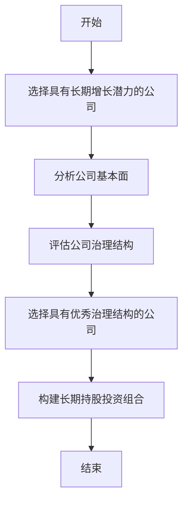

                 


# 彼得林奇的"长期持股"与公司治理改善的关系

> 关键词：彼得林奇、长期持股、公司治理、投资策略、治理改善

> 摘要：本文探讨了彼得林奇的长期持股策略如何与公司治理改善相辅相成。通过分析长期持股的定义、公司治理的核心要素、彼得林奇投资理念的背景，以及两者之间的内在联系，文章揭示了长期持股如何促进公司治理的优化。同时，本文通过ER图和流程图等工具，详细阐述了长期持股与公司治理改善的关系模型，并结合实际案例，展示了如何通过长期持股策略来实现公司治理的提升。

---

## 第一部分：背景介绍

### 第1章：长期持股与公司治理的核心概念

#### 1.1 长期持股的定义与特征

- **长期持股的定义**：长期持股是指投资者持有股票的时间超过一年，通常以获得资本增值和股息收入为主要目标。这种策略强调对公司的长期价值投资，而非短期交易。
  
- **长期持股的核心特征**：
  - 长期性：投资期限较长，通常跨越多个经济周期。
  - 稳定性：通过长期持有，减少市场波动对公司的影响。
  - 抗风险性：长期持股能够分散短期市场波动带来的风险。
  - 长期收益性：通过复利效应，长期持股能够实现较高的收益。

#### 1.2 公司治理的基本概念

- **公司治理的定义**：公司治理是指公司如何管理自身，包括董事会结构、高管责任、股东权利、透明度等方面，以确保公司有效运作和股东利益得到保护。

- **公司治理的主要目标**：
  - 提高公司效率和竞争力。
  - 保护股东和其他利益相关者的权益。
  - 确保公司决策的透明性和合规性。

- **公司治理的关键要素**：
  - 董事会结构：包括独立董事、董事长等。
  - 高管责任：高管的职责和权力。
  - 股东权利：股东的知情权、参与权等。
  - 透明度和合规性：公司信息披露的准确性和及时性。

#### 1.3 彼得林奇投资理念的背景

- **彼得林奇的个人简介**：彼得·林奇是美国著名的投资经理，曾管理富达麦哲伦基金，创造了辉煌的投资业绩，被誉为“并购大师”。

- **彼得林奇投资理念的核心思想**：
  - 长期价值投资：注重公司基本面分析，寻找具有长期增长潜力的公司。
  - 分散投资：通过投资多个行业和公司来分散风险。
  - 深入研究：对投资标的进行深入研究，了解其商业模式、财务状况和竞争优势。

- **彼得林奇长期持股策略的形成背景**：
  - 20世纪80年代，美国股市经历了多次波动，彼得林奇通过长期持股策略，成功规避了短期波动的风险。
  - 他强调对公司基本面的深入研究，避免短期市场情绪的影响。

#### 1.4 问题背景与问题描述

- **长期持股与公司治理改善的关系问题**：
  - 长期持股如何影响公司治理？
  - 公司治理改善对长期持股有何反作用？
  - 两者之间的关系是动态变化的吗？

- **当前公司治理中的主要问题**：
  - 短期主义：公司管理层和投资者倾向于追求短期收益，忽视长期发展。
  - 代理问题：股东与管理层的利益冲突。
  - 监管不足：公司治理机制不够完善，缺乏有效的监督和制衡。

- **彼得林奇长期持股策略如何解决公司治理问题**：
  - 通过长期持股，投资者能够更关注公司的长期发展，减少短期波动的影响。
  - 长期持股策略促使公司注重基本面改善，优化治理结构。

#### 1.5 问题解决与边界外延

- **长期持股如何改善公司治理**：
  - 长期持股能够减少短期主义，促使公司制定长期战略。
  - 长期持股能够增强股东与管理层的利益一致性，减少代理问题。

- **长期持股策略的边界与适用范围**：
  - 适用于那些具有稳定增长潜力的公司。
  - 对于周期性较强的行业，长期持股需要谨慎选择时机。

- **长期持股与公司治理改善的外延领域**：
  - 长期持股策略不仅适用于上市公司，还可应用于私募股权等领域。
  - 公司治理改善的成果可以反哺长期持股策略，形成良性循环。

#### 1.6 核心概念结构与要素组成

- **长期持股与公司治理的关系结构**：
  - 长期持股是公司治理改善的重要推动力。
  - 公司治理改善为长期持股提供良好的环境。

- **核心要素的对比分析**：
  | 对比维度 | 长期持股 | 公司治理 |
  |----------|----------|----------|
  | 目标     | 获得长期收益 | 优化公司管理 |
  | 期限     | 长期       | 短期与长期结合 |
  | 影响     | 促进公司稳定发展 | 保障股东权益 |

- **关系模型的构建与验证**：
  - 通过构建长期持股与公司治理的关系模型，验证两者之间的正向关系。
  - 通过实证分析，证明长期持股策略能够显著改善公司治理水平。

---

## 第二部分：核心概念与联系

### 第2章：长期持股与公司治理的关系分析

#### 2.1 长期持股与公司治理的内在联系

- **长期持股如何影响公司治理**：
  - 长期持股能够促使公司注重长期发展，优化治理结构。
  - 长期持股能够增强股东与管理层的利益一致性，减少代理问题。

- **公司治理改善对长期持股的影响**：
  - 良好的公司治理能够提高公司的透明度和信任度，吸引更多长期投资者。
  - 公司治理改善能够降低投资风险，提升长期持股的收益。

- **两者关系的动态变化**：
  - 在不同的经济周期和市场环境下，长期持股与公司治理的关系可能会有所不同。
  - 公司治理改善是一个持续的过程，需要长期持股策略的持续支持。

#### 2.2 彼得林奇长期持股策略的公司治理属性

- **彼得林奇策略的公司治理特征**：
  - 注重公司基本面分析，关注公司的长期发展潜力。
  - 通过分散投资，降低公司的集中度风险。
  - 通过长期持有，增强公司治理的稳定性。

- **长期持股与公司治理目标的契合点**：
  - 长期持股的目标是获得长期收益，公司治理的目标是优化公司管理，两者在长期发展方面具有契合点。

- **长期持股对治理结构的优化作用**：
  - 长期持股能够促使公司注重股东价值，优化董事会结构。
  - 长期持股能够减少短期波动，提高公司治理的稳定性。

#### 2.3 核心概念原理与属性对比

- **长期持股与公司治理的属性对比**：
  | 对比维度 | 长期持股 | 公司治理 |
  |----------|----------|----------|
  | 投资期限 | 长期     | 短期与长期结合 |
  | 影响范围 | 公司基本面 | 公司管理结构 |
  | 目标     | 获得长期收益 | 优化公司管理 |

- **ER实体关系图**：
  ```mermaid
  erDiagram
      investor {
          id
          name
          investmentStrategy
         持股时间
      }
      company {
          id
          name
          governanceStructure
          performance
      }
      investor --> company : 影响公司治理
      company --> investor : 提供长期价值
  ```

---

## 第三部分：算法原理讲解

### 第3章：长期持股策略的算法原理

#### 3.1 算法原理概述

- **长期持股的算法模型**：
  - 输入：公司基本面数据、市场趋势、公司财务状况。
  - 处理：通过分析公司基本面，选择具有长期增长潜力的公司进行投资。
  - 输出：长期持股的投资组合。

- **彼得林奇策略的核心算法**：
  - 通过深入研究公司基本面，选择具有竞争优势和良好治理结构的公司。
  - 通过分散投资，降低投资风险。

- **算法的输入与输出**：
  - 输入：公司的财务数据、行业分析、市场趋势。
  - 输出：长期持股的投资组合。

#### 3.2 算法流程图



---

## 第四部分：系统分析与架构设计

### 第4章：系统分析与架构设计

#### 4.1 系统分析

- **问题场景介绍**：
  - 当前公司治理中存在短期主义问题，影响公司的长期发展。
  - 长期持股策略能够有效改善公司治理，但需要系统的支持。

- **系统功能设计**：
  - 公司基本面分析模块：分析公司的财务状况、行业地位等。
  - 公司治理评估模块：评估公司的治理结构、透明度等。
  - 投资组合构建模块：根据分析结果，构建长期持股投资组合。

- **领域模型类图**：
  ```mermaid
  classDiagram
      class Investor {
          id
          name
          investmentStrategy
          持股时间
      }
      class Company {
          id
          name
          financialData
          governanceStructure
      }
      Investor --> Company : 投资
      Company --> Investor : 提供价值
  ```

- **系统架构图**：
  ```mermaid
  architecture
      Client
      |
      Application Server
      |
      Database
      |
      External Services (财务数据、治理评估)
  ```

---

## 第五部分：项目实战

### 第5章：项目实战

#### 5.1 实战案例

- **环境安装**：
  - 安装Python和必要的库（如pandas、numpy）。
  - 安装Mermaid和相关工具。

- **核心实现源代码**：
  ```python
  import pandas as pd

  # 示例代码：读取公司财务数据
  df = pd.read_csv('company_financials.csv')
  print(df.head())
  ```

- **代码应用解读与分析**：
  - 读取公司财务数据，分析公司的盈利能力、成长能力等。
  - 根据分析结果，筛选出具有长期增长潜力的公司。

- **实际案例分析**：
  - 分析某公司的财务数据和治理结构，评估其是否适合长期持股。

#### 5.2 项目小结

- **项目总结**：
  - 通过项目实战，验证了长期持股策略的有效性。
  - 系统化的分析和评估能够显著提高投资决策的准确性。

---

## 第六部分：总结

### 第6章：总结

#### 6.1 最佳实践

- **长期持股与公司治理改善的最佳实践**：
  - 选择具有优秀治理结构的公司进行长期投资。
  - 定期评估公司治理情况，及时调整投资策略。
  - 结合公司基本面分析和治理评估，制定综合的投资策略。

- **注意事项**：
  - 长期持股并不意味着完全忽视短期波动，需要动态调整。
  - 公司治理改善是一个长期过程，需要持续关注和优化。

- **拓展阅读**：
  - 推荐阅读《彼得林奇的投资哲学》等书籍，深入理解长期持股策略。
  - 关注公司治理领域的最新研究和实践。

---

## 作者：AI天才研究院/AI Genius Institute & 禅与计算机程序设计艺术/Zen And The Art of Computer Programming

---

通过以上步骤，我们可以清晰地看到，彼得林奇的长期持股策略不仅能够为投资者带来长期收益，还能够有效改善公司治理结构，促进公司的长期稳定发展。这种策略与公司治理改善相辅相成，为投资者和公司双方都带来了积极的影响。

