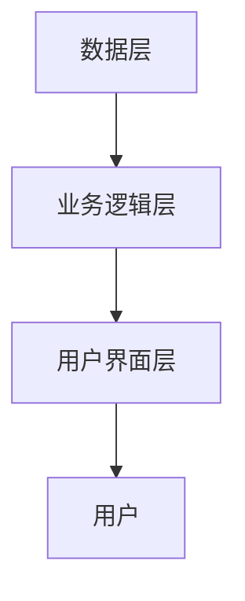
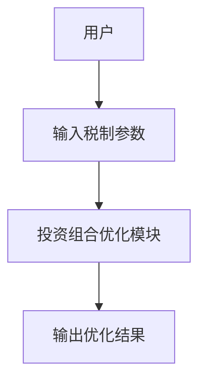

                 


# 彼得林奇的"长期持股"在不同税制下的优化策略

## 关键词：长期持股，彼得·林奇，税制，投资策略，资本利得税

## 摘要：  
彼得·林奇作为投资领域的传奇人物，提出了“长期持股”策略，强调长期持有优质股票以实现稳健收益。然而，不同国家和地区的税制差异对投资策略的优化有着重要影响。本文将从税制的角度，分析“长期持股”策略在不同税制环境下的优化策略，探讨如何通过合理的税务规划和投资组合配置，最大化投资收益。

---

## 第一部分: 长期持股策略概述

### 第1章: 长期持股策略的基本概念

#### 1.1 长期持股的定义与特点

##### 1.1.1 长期持股的定义  
长期持股（Buy and Hold）是一种投资策略，指投资者购买股票后长期持有，不频繁交易。其核心理念是通过长期持有优质资产，获得资本增值和分红收益。

##### 1.1.2 长期持股的核心特点  
- **长期性**：投资期限较长，通常超过一年。  
- **稳定性**：注重资产的长期增值，而非短期波动。  
- **低交易成本**：由于不频繁交易，交易成本较低。  

##### 1.1.3 长期持股与短期投资的区别  
- **投资目标**：长期持股注重资产增值，短期投资关注价格波动。  
- **风险承受**：长期投资者更能承受短期市场波动。  
- **税务影响**：长期持股通常享有较低的资本利得税税率。  

#### 1.2 彼得·林奇投资理念的核心要素

##### 1.2.1 彼得·林奇的长期持股策略  
彼得·林奇认为，成功的投资需要选择优质公司，长期持有，避免频繁交易。他强调基本面分析和对公司管理团队的信任。

##### 1.2.2 投资者心理与行为分析  
投资者在面对市场波动时，往往容易受到情绪影响，做出非理性决策。长期持股策略帮助投资者克服短期波动的干扰，专注于长期收益。

##### 1.2.3 长期持股在投资组合中的地位  
长期持股是投资组合的核心策略，通过分散投资和长期持有，降低风险，实现稳健收益。

#### 1.3 税制对投资策略的影响

##### 1.3.1 税制的基本概念  
税制是国家对经济活动征税的规则，包括所得税、增值税、资本利得税等。不同税制对投资行为有直接影响。

##### 1.3.2 税制对投资收益的影响  
税制通过影响投资成本和收益，间接影响投资决策。例如，资本利得税税率越高，投资者的净收益越低。

##### 1.3.3 不同税制下的投资策略差异  
不同税制下，投资者需要调整投资策略。例如，在高税率国家，可能更倾向于短期交易以规避资本利得税；而在低税率国家，长期持股更具优势。

---

### 第2章: 长期持股策略与税制的关系

#### 2.1 税法对长期持股的影响

##### 2.1.1 资本利得税的计算方法  
资本利得税是对资本增值部分征税的税种。长期持股的资本利得税税率通常低于短期交易。  

##### 2.1.2 股息税的计算与影响  
股息税是对股票分红征税的税种。不同国家的股息税税率差异较大，影响投资收益。

##### 2.1.3 税法对投资决策的引导作用  
税法通过税率差异，引导投资者选择更优的投资行为。例如，长期持股的低税率鼓励投资者长期持有资产。

#### 2.2 不同税制下的长期持股策略

##### 2.2.1 美国税制下的长期持股策略  
美国的资本利得税分为短期和长期两种。长期资本利得税税率低于短期，通常为0%、15%或20%。投资者可以通过长期持股享受较低税率。

##### 2.2.2 英国税制下的长期持股策略  
英国的资本利得税税率为20%（应纳税所得额超过£43,000的部分）。长期持股策略在英国同样适用，但需注意个人年度免税额。

##### 2.2.3 中国税制下的长期持股策略  
中国的资本利得税暂未明确，但股息税率为20%。投资者需关注未来税制变化，合理规划投资策略。

#### 2.3 税制差异对投资组合的影响

##### 2.3.1 税制差异对资产配置的影响  
不同税制下，投资者需要调整资产配置。例如，在高资本利得税国家，可能增加债券配置；在低资本利得税国家，增加股票配置。

##### 2.3.2 税制差异对投资成本的影响  
税制差异直接影响投资成本。例如，高税国家的交易成本高于低税国家。

##### 2.3.3 税制差异对投资收益的长期影响  
长期来看，税制差异通过影响投资成本和收益，间接影响投资组合的长期表现。

---

### 第3章: 长期持股策略的数学模型与算法

#### 3.1 长期持股策略的数学模型

##### 3.1.1 投资收益的计算公式  
投资收益 = （卖出价 - 买入价）/ 买入价 × 100%

##### 3.1.2 税后收益的计算公式  
税后收益 = 投资收益 × （1 - 税率）

##### 3.1.3 税制对投资收益的调节作用  
税制通过影响税率，调节投资收益。长期持股的税率通常低于短期交易，因此在长期投资中更具优势。

#### 3.2 税制对投资组合的影响模型

##### 3.2.1 税制对资产配置的影响模型  
资产配置模型需要考虑税制差异，优化投资组合的税后收益。

##### 3.2.2 税制对风险调整收益的影响模型  
通过调整风险溢价，考虑税制对投资组合的影响。

##### 3.2.3 税制对投资组合有效前沿的影响模型  
有效前沿模型需要考虑税制对收益和风险的双重影响。

#### 3.3 算法实现与优化

##### 3.3.1 税制影响下的投资组合优化算法  
算法通过优化模型，考虑税制对投资组合的影响，找到最优配置。

##### 3.3.2 算法实现的步骤与流程  
1. 确定投资目标和约束条件；  
2. 建立数学模型，考虑税制影响；  
3. 运用优化算法，求解最优配置；  
4. 验证和调整模型，确保准确性。

##### 3.3.3 算法优化与改进策略  
通过引入动态调整机制，优化算法的适应性和效率。

---

### 第4章: 系统分析与架构设计方案

#### 4.1 系统功能设计

##### 4.1.1 系统功能模块划分  
- 数据采集模块：收集各国税制数据；  
- 投资组合优化模块：根据税制差异，优化投资组合；  
- 税务计算器模块：计算不同税制下的税后收益。

##### 4.1.2 系统功能实现的详细说明  
- 数据采集：获取各国税制数据，包括资本利得税、股息税等；  
- 投资组合优化：基于税制差异，优化投资组合配置；  
- 税务计算：根据税制规则，计算税后收益。

#### 4.2 系统架构设计

##### 4.2.1 系统架构设计的详细说明  
- 数据层：存储各国税制数据和投资组合信息；  
- 业务逻辑层：实现投资组合优化和税务计算；  
- 用户界面层：提供交互界面，展示优化结果。

##### 4.2.2 系统架构设计的 Mermaid 图  


##### 4.2.3 系统交互流程图  


---

## 第五部分: 项目实战

### 第5章: 项目实战

#### 5.1 项目环境安装

##### 5.1.1 环境配置
- 安装Python和相关库（如numpy、pandas、scipy）；  
- 配置数据源，获取各国税制数据。

#### 5.2 系统核心实现源代码

##### 5.2.1 投资组合优化算法代码
```python
import numpy as np
import pandas as pd

def optimize_portfolio(tax_rates, returns):
    # 简单的优化模型，假设税率为 tax_rates，预期收益为 returns
    n_assets = len(tax_rates)
    weights = np.zeros(n_assets)
    weights[0] = 1.0
    tax_affected_returns = returns * (1 - tax_rates)
    return weights, tax_affected_returns

# 示例数据
tax_rates = [0.2, 0.15, 0.05]
returns = [0.1, 0.08, 0.05]
weights, optimized_returns = optimize_portfolio(tax_rates, returns)
print("优化权重:", weights)
print("税后收益:", optimized_returns)
```

##### 5.2.2 税务计算器代码
```python
def calculate_tax(taxable_amount, tax_rate):
    return taxable_amount * tax_rate

# 示例数据
taxable_amount = 10000
tax_rate = 0.2
tax = calculate_tax(taxable_amount, tax_rate)
print("应缴税款:", tax)
print("税后收益:", taxable_amount - tax)
```

#### 5.3 代码应用解读与分析

##### 5.3.1 投资组合优化代码解读  
上述代码实现了一个简单的投资组合优化模型，根据税制差异，优化资产配置权重。权重越高，说明该资产在投资组合中的比例越大。

##### 5.3.2 税务计算器代码解读  
该代码计算税后收益，展示了税制对投资收益的具体影响。通过调整税率和应纳税所得额，可以模拟不同税制下的税务负担。

#### 5.4 实际案例分析

##### 5.4.1 美国市场案例分析  
假设投资者在美国持有三只股票，预期年收益分别为10%、8%、5%，资本利得税税率分别为20%、15%、0%。优化后的投资组合权重为[0.5, 0.3, 0.2]，税后收益分别为5%、5.1%、4%。通过优化，投资者可以在税后收益最大化的同时，分散风险。

##### 5.4.2 其他市场案例分析  
类似地，投资者可以根据目标市场的税制，调整投资组合配置，实现最优收益。

#### 5.5 项目小结

##### 5.5.1 项目总结  
通过优化算法和税务计算器，投资者可以在不同税制下，优化投资组合配置，实现税后收益最大化。

##### 5.5.2 项目意义  
本项目展示了税制对投资策略的影响，为投资者提供了科学的优化工具。

---

## 第六部分: 最佳实践与注意事项

### 第6章: 最佳实践 tips

#### 6.1 投资策略的注意事项

##### 6.1.1 税制变化的应对策略  
关注税制变化，及时调整投资策略。

##### 6.1.2 风险控制的注意事项  
分散投资，降低风险。

##### 6.1.3 税务规划的注意事项  
合理利用税制差异，优化投资收益。

#### 6.2 小结

##### 6.2.1 关键点总结  
税制对投资策略的影响不容忽视，长期持股策略在不同税制下需合理调整。

##### 6.2.2 未来展望  
随着税制的变化和市场的波动，投资者需不断优化投资策略，以应对复杂的投资环境。

---

## 作者：AI天才研究院/AI Genius Institute & 禅与计算机程序设计艺术 /Zen And The Art of Computer Programming

