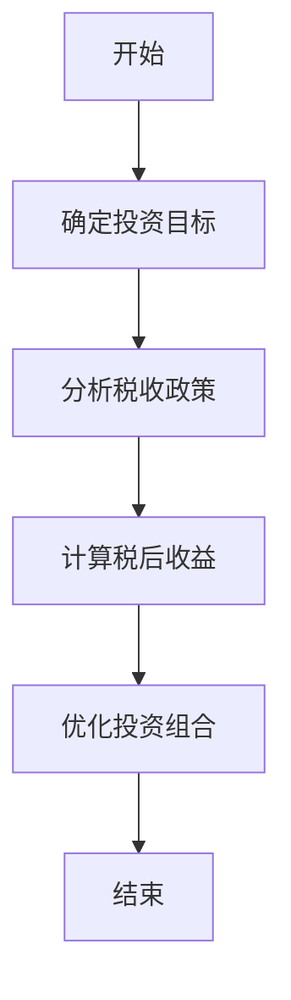
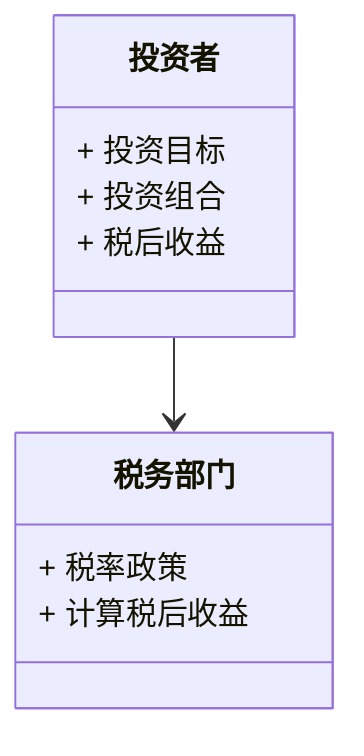
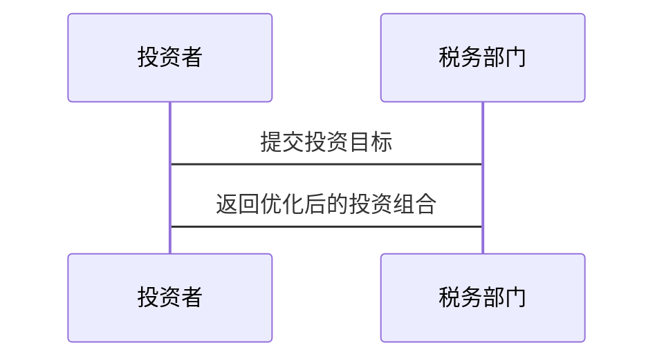

                 


# 彼得林奇的"长期持股"在不同税收政策下的优化模型

---

## 关键词：长期持股、彼得林奇、税收政策、优化模型、投资策略

---

## 摘要：  
本文探讨了彼得林奇的"长期持股"策略在不同税收政策下的优化模型。通过分析税收政策对投资决策的影响，结合优化模型的构建与实现，为投资者提供一种在复杂税收环境下优化投资组合的方法。文章从背景介绍、税收政策分析、优化模型设计、系统架构、项目实战等多个方面展开，结合实际案例，为读者提供深度的理论支持和实践指导。

---

## 第1章: 长期持股策略的背景与核心概念

### 1.1 长期持股策略的定义与特点

长期持股策略是彼得林奇在投资领域中提出的重要理念，其核心在于通过长期持有优质股票，获得稳定的资本增值。该策略强调基本面分析、分散投资和长期持有的原则，旨在降低短期波动对投资组合的影响。

- **长期持股的定义**：指投资者在较长的时间跨度内（通常超过1年）持有股票，以获得资本增值和分红收益。
- **长期持股的核心特点**：
  - 分散投资：通过投资多个行业和公司，降低单一投资的风险。
  - 长期视角：关注企业的长期增长潜力，而非短期市场波动。
  - 价值投资：选择具有竞争优势和良好管理的公司。

### 1.2 税收政策对投资决策的影响

税收政策是影响投资决策的重要因素。不同国家和地区的税收政策差异，可能导致投资者在选择投资标的和持有时间上做出调整。

- **税收政策的基本概念**：
  - 税收政策是指政府通过税收手段调节经济活动的政策。
  - 在投资领域，主要涉及资本利得税、股息税、印花税等。
- **不同税收政策对投资的影响**：
  - 高税率环境：可能迫使投资者缩短持股时间以避免高税负。
  - 低税率环境：可能鼓励投资者长期持有以享受税收优惠。

---

## 第2章: 不同税收政策下的投资环境分析

### 2.1 税收政策的分类与特点

- **资本利得税**：
  - 定义：对资本资产（如股票、房地产）出售收益征收的税。
  - 特点：税率根据持有时间长短和收益高低而变化。
- **股息税**：
  - 定义：对股票分红收益征收的税。
  - 特点：税率通常低于资本利得税，但具体政策因地区而异。
- **其他相关税收政策**：
  - 印花税：对股票交易行为征收的税，通常由卖方承担。
  - 遗产税：对遗产中的资产征收的税，可能影响投资传承。

### 2.2 不同税收政策对长期持股的影响

- **高税率环境下的投资策略**：
  - 短期交易：通过频繁交易规避资本利得税。
  - 选择免税或低税地区：通过税收优惠降低税负。
- **低税率环境下的投资策略**：
  - 长期持有：利用低税率享受资本增值。
  - 分红收入：通过股息税优惠增加收益。

---

## 第3章: 长期持股优化模型的核心概念

### 3.1 优化模型的基本原理

- **优化模型的定义**：
  - 通过数学方法优化投资组合的收益与风险。
  - 在不同税收政策下，调整持股时间和资产配置。
- **优化模型的核心要素**：
  - 收益率：股票的预期收益率。
  - 税率：资本利得税、股息税等税率。
  - 持股时间：影响税率和收益的关键因素。

### 3.2 核心概念与联系

- **核心概念原理**：
  - 税率和持股时间共同决定税后收益。
  - 通过优化模型，可以在不同税收环境下找到最优投资组合。
- **概念属性特征对比表格**：

| 概念         | 特性                 | 示例                     |
|--------------|----------------------|--------------------------|
| 税率         | 影响税后收益         | 高税率：收益下降         |
| 持股时间     | 影响税率档次         | 长期持有：低税率         |
| 投资收益     | 受税率和时间影响     | 高收益：需考虑税后收益   |

- **ER实体关系图架构的 Mermaid 流程图**：

```mermaid
erd
actor 投资者
actor 税务部门
entity 税率政策
entity 投资组合
entity 税后收益
```

---

## 第4章: 算法原理讲解

### 4.1 算法原理的数学模型和公式

- **数学模型的建立**：
  - 设定目标函数：最大化税后收益。
  - 约束条件：持股时间、税率限制等。
- **算法原理的公式推导**：

  收益率公式：
  $$ R = (1 - T) \times (1 + r) - 1 $$
  其中，T为税率，r为税前收益率。

  税后收益公式：
  $$ R_{\text{税后}} = R \times (1 - T) $$

### 4.2 算法流程图



---

## 第5章: 系统分析与架构设计方案

### 5.1 问题场景介绍

- **投资决策的复杂性**：
  - 税收政策变化快，影响投资收益。
  - 不同资产类别税法不同，需综合考虑。
- **税收政策变化的不确定性**：
  - 政策调整可能影响投资组合的收益。

### 5.2 系统功能设计

- **领域模型的 Mermaid 类图**：



### 5.3 系统架构设计

- **系统架构的 Mermaid 架构图**：

```mermaid
container 税收政策系统 {
    service 税率计算服务
    service 投资组合优化服务
    component 投资者界面
    component 税务数据存储
}
```

### 5.4 系统接口设计

- **接口定义与交互流程**：
  - 投资者输入投资目标和税收政策。
  - 系统计算税后收益并优化投资组合。

### 5.5 系统交互设计

- **交互的 Mermaid 序列图**：



---

## 第6章: 项目实战

### 6.1 环境安装与配置

- **开发环境的搭建**：
  - 安装Python和相关库（如numpy、pandas）。
  - 配置Jupyter Notebook进行数据处理。

### 6.2 核心实现

- **优化模型的代码实现**：

```python
import numpy as np

def calculate_tax_after_t(ax, tax_rate):
    return ax * (1 - tax_rate)

def optimize_portfolio(portfolio, tax_rates):
    max_profit = 0
    best_allocation = None
    for allocation in portfolio:
        tax_adjusted = calculate_tax_after_t(allocation['return'], tax_rates)
        profit = allocation['assets'] * tax_adjusted
        if profit > max_profit:
            max_profit = profit
            best_allocation = allocation
    return best_allocation
```

### 6.3 案例分析

- **实际案例的分析**：
  - 投资组合：股票A、股票B。
  - 税率政策：高税率和低税率两种情况。

---

## 第7章: 总结与展望

### 7.1 最佳实践 tips

- **投资策略的优化建议**：
  - 结合税收政策，调整持股时间和资产配置。
  - 定期评估投资组合的税后收益。
- **税收政策变化的应对策略**：
  - 关注政策变化，及时调整投资策略。
  - 分散投资，降低政策变化带来的风险。

### 7.2 小结

- 本文通过分析彼得林奇的长期持股策略，结合不同税收政策下的优化模型，为投资者提供了一种科学的投资方法。
- 未来研究可以进一步考虑多因素模型和动态税收政策的影响。

### 7.3 注意事项与风险提示

- **投资风险的注意事项**：
  - 市场波动可能导致投资收益下降。
  - 税收政策变化可能影响投资策略的有效性。
- **税收政策变化的风险提示**：
  - 政策调整可能带来额外的税负或收益。
  - 需要密切关注政策变化并及时调整投资策略。

---

## 作者：AI天才研究院/AI Genius Institute & 禅与计算机程序设计艺术 /Zen And The Art of Computer Programming

