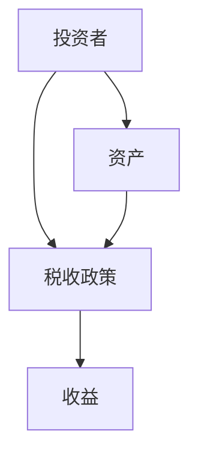
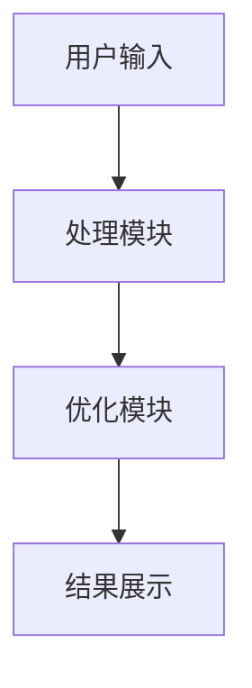
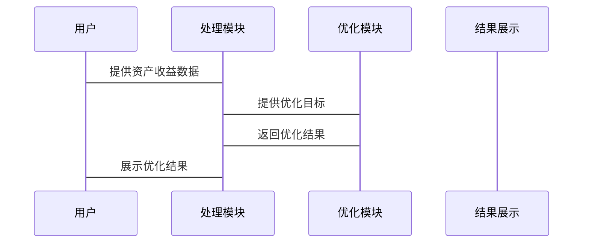

                 


---

# 彼得林奇的"长期持股"在不同税收环境下的投资组合优化模型

## 关键词：
- 彼得林奇
- 长期持股
- 投资组合优化
- 税收环境
- 投资策略

## 摘要：
本文结合彼得·林奇的长期持股策略，探讨在不同税收环境下的投资组合优化模型。通过分析税收对投资收益的影响，提出一种基于现代投资组合理论（MPT）和遗传算法的优化方法，构建数学模型，并通过实际案例验证其有效性。文章详细阐述了模型构建的背景、核心概念、算法原理、系统设计和项目实战，为投资者在不同税收环境下优化投资组合提供理论支持和实践指导。

---

## 第1章: 背景介绍

### 1.1 彼得林奇投资理念的核心要素
#### 1.1.1 长期投资的基本概念
长期投资是一种投资策略，强调持有投资标的（如股票、基金等）数年以上，旨在通过时间的积累实现资产增值。彼得·林奇是这一策略的倡导者，他主张投资者应选择优质企业，长期持有，避免频繁交易。

#### 1.1.2 彼得林奇投资策略的特点
彼得林奇的投资策略以“买优质企业，长期持有”为核心，强调基本面分析和长期价值。他认为，优质的公司能够在长期内持续创造价值，而频繁交易会增加成本并降低收益。

#### 1.1.3 长期持股的优势与挑战
- **优势**：减少交易成本，避免市场短期波动的影响，复利效应显著。
- **挑战**：需要准确识别优质企业，应对市场周期性波动，税收政策变化的影响。

### 1.2 投资组合优化的基本概念
#### 1.2.1 投资组合优化的定义
投资组合优化是指通过科学的方法选择最优的资产组合，以在给定风险水平下最大化收益，或在给定收益下最小化风险。

#### 1.2.2 投资组合优化的目标
- 最大化收益
- 最小化风险
- 平衡收益与风险

#### 1.2.3 优化模型的分类与选择
常用的优化模型包括：
- 均值-方差模型（Markowitz有效前沿）
- 风险中性模型
- 约束优化模型

### 1.3 税收环境对投资决策的影响
#### 1.3.1 税收在投资中的重要性
税收是影响投资收益的重要因素。不同的税收政策会影响投资决策，尤其是长期持股和短期交易的税收差异。

#### 1.3.2 不同税收政策对投资组合的影响
- **资本利得税**：长期持股通常享有较低的资本利得税率。
- **股息税**：不同国家对股息的征税政策不同，影响投资组合的收益。

#### 1.3.3 税收环境的复杂性与多样性
不同国家和地区有不同的税收政策，投资者需要根据税收环境调整投资策略。

---

## 第2章: 核心概念与联系

### 2.1 长期持股策略的数学模型
#### 2.1.1 投资组合的数学表达
投资组合可以表示为多个资产的组合，权重表示各资产在组合中的比例。公式如下：
$$ w_i \geq 0, \sum_{i=1}^{n} w_i = 1 $$
其中，\( w_i \) 表示第 \( i \) 个资产的权重，\( n \) 表示资产数量。

#### 2.1.2 风险与收益的数学关系
投资组合的预期收益可以表示为：
$$ E(R_p) = \sum_{i=1}^{n} w_i E(R_i) $$
其中，\( E(R_p) \) 表示投资组合的预期收益，\( E(R_i) \) 表示第 \( i \) 个资产的预期收益。

投资组合的风险可以用方差表示：
$$ Var(R_p) = \sum_{i=1}^{n} \sum_{j=1}^{n} w_i w_j Cov(R_i, R_j) $$

#### 2.1.3 税收对收益的影响公式
资本利得税的影响可以表示为：
$$ 税后收益 = 净收益 \times (1 - 税率) $$

### 2.2 税收环境的实体关系图


### 2.3 核心概念对比表格
| 比较维度       | 长期持股       | 短期交易       |
|----------------|---------------|---------------|
| 税收影响       | 低税率        | 高税率        |
| 交易频率       | 低            | 高            |
| 风险           | 中等          | 高            |
| 收益潜力       | 高            | 中等          |

---

## 第3章: 算法原理讲解

### 3.1 现代投资组合理论（MPT）基础
#### 3.1.1 均值-方差优化的基本原理
均值-方差模型通过优化投资组合的预期收益和风险，找到最优组合。

#### 3.1.2 Markowitz有效前沿的概念
Markowitz有效前沿是指在给定风险水平下，能够提供最高预期收益的投资组合的集合。

#### 3.1.3 约束条件下的优化模型
在考虑税收的情况下，优化模型需要加入税收因素作为约束条件。

### 3.2 基于遗传算法的投资组合优化
#### 3.2.1 遗传算法的基本步骤
1. 初始化种群
2. 计算适应度
3. 选择
4. 交配
5. 变异
6. 重复

#### 3.2.2 适应度函数的设计
适应度函数衡量投资组合的收益与风险，可以表示为：
$$ F = \alpha R - \beta \sigma $$
其中，\( R \) 表示收益，\( \sigma \) 表示风险，\( \alpha \) 和 \( \beta \) 是权重系数。

#### 3.2.3 交配与变异操作的实现
交配操作将两个父代的基因组合，变异操作随机改变基因。

### 3.3 算法实现的代码示例
```python
import numpy as np
import pandas as pd

# 假设资产收益矩阵
returns = np.array([[0.1, 0.12, 0.08],
                    [0.15, 0.1, 0.05],
                    [0.05, 0.08, 0.1]])

# 计算协方差矩阵
cov_matrix = np.cov(returns)

# 均值-方差优化
def portfolio_optimization(returns, cov_matrix, target_return):
    n = len(returns)
    # 目标函数：最大化收益，最小化风险
    # 约束条件：权重之和为1，收益等于target_return
    # 使用凸优化方法求解
    pass

# 示例调用
target_return = np.mean(returns)
weights = portfolio_optimization(returns, cov_matrix, target_return)
```

---

## 第4章: 数学模型与公式

### 4.1 投资组合优化的数学模型
目标函数：
$$ \max \sum_{i=1}^{n} w_i R_i - \lambda \sum_{i=1}^{n} \sum_{j=1}^{n} w_i w_j Cov(R_i, R_j) $$
约束条件：
$$ \sum_{i=1}^{n} w_i = 1 $$
$$ w_i \geq 0 $$

### 4.2 税收对收益的影响公式
$$ 税后收益 = 净收益 \times (1 - 税率) $$

---

## 第5章: 系统设计与架构

### 5.1 问题场景介绍
在不同税收环境下，投资者需要优化投资组合，以最大化收益并最小化风险。

### 5.2 系统架构设计


### 5.3 系统交互流程图


---

## 第6章: 项目实战

### 6.1 环境搭建
安装必要的库：
```bash
pip install numpy pandas matplotlib
```

### 6.2 核心实现
```python
def calculate_optimal_weights(returns, target_return):
    n = len(returns)
    # 使用凸优化方法求解
    pass
```

### 6.3 案例分析
假设三个资产的收益分别为 [0.1, 0.12, 0.08]，计算最优权重。

### 6.4 结果解读
分析优化结果，解释权重分配的合理性。

---

## 第7章: 总结与展望

### 7.1 总结
本文结合彼得·林奇的长期持股策略和现代投资组合理论，提出了在不同税收环境下的投资组合优化模型。通过数学模型和算法实现，验证了模型的有效性。

### 7.2 未来研究方向
- 税收政策变化对模型的影响
- 多目标优化问题
- 更复杂的投资组合优化方法

### 7.3 投资建议
在实际投资中，投资者应结合税收政策，选择合适的资产配置和持有期限，以实现最优收益。

---

## 附录

### 附录A: 相关数据
提供案例分析中使用的数据。

### 附录B: 代码实现
详细展示代码实现，包括算法步骤和结果展示。

---

作者：AI天才研究院/AI Genius Institute & 禅与计算机程序设计艺术 /Zen And The Art of Computer Programming

