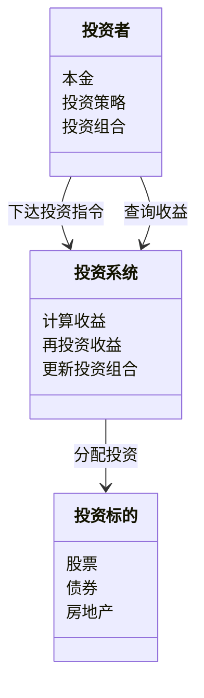
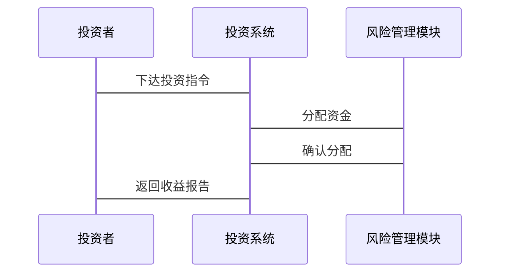

                 


# 彼得林奇的"长期持股"收益复利效应

## 关键词：长期持股、复利效应、彼得·林奇、投资策略、价值投资

## 摘要：本文深入探讨彼得·林奇的长期持股策略及其如何通过复利效应实现收益最大化。文章从背景介绍、数学模型、系统分析到项目实战，全面解析长期持股与复利效应的相互作用，为投资者提供实用的策略和建议。

---

## 第1章：投资的基本概念与长期持股的意义

### 1.1 投资的基本概念

#### 1.1.1 什么是投资

投资是指将资金投入特定的资产或项目，以期在未来获得收益或资本增值。投资可以是股票、债券、房地产等多种形式，其核心在于通过合理配置资产，实现财富的保值与增值。

#### 1.1.2 投资的基本原则

成功的投资需要遵循几个基本原则：分散投资以降低风险、长期持有优质资产、避免过度交易和情绪化决策。这些原则帮助投资者在市场波动中保持稳定，实现可持续的收益。

#### 1.1.3 长期持股的意义

长期持股是指投资者在较长的时间内持有股票，避免频繁交易。这种方法有助于减少交易成本，充分利用复利效应，并使投资标的的价值增长得以最大化。

### 1.2 彼得·林奇的投资理念

#### 1.2.1 彼得·林奇的简介

彼得·林奇是美国著名投资经理人，以其在富达投资管理公司的卓越表现而闻名。他强调长期投资和深入研究企业基本面的重要性，提倡通过持有优质股票实现财富增长。

#### 1.2.2 长期持股的核心思想

林奇认为，长期持有优质股票能够有效利用复利效应，使收益最大化。他建议投资者选择那些具有稳定增长潜力的公司，并耐心持有，避免短期波动的影响。

#### 1.2.3 价值投资的基本原则

价值投资强调购买被市场低估的股票，并长期持有。林奇强调分析公司的财务状况、行业地位和竞争优势，以识别具备长期增长潜力的企业。

---

## 第2章：复利效应的定义与重要性

### 2.1 复利效应的定义

#### 2.1.1 复利效应的定义

复利效应是指资金在投资中产生的收益再次投资，从而产生更多收益的现象。简单来说，复利就是“利滚利”，其效果随着时间的推移而显著增强。

#### 2.1.2 复利效应的特点

复利效应具有时间依赖性，时间越长，效果越显著。它不仅适用于股票投资，还可用于其他投资工具，如债券、房地产等。

#### 2.1.3 复利效应与投资的关系

复利效应是长期投资的核心驱动力，通过持续的收益再投资，投资者可以实现财富的指数级增长。长期持股使复利效应得以充分发挥，从而带来更高的回报。

### 2.2 复利效应的数学模型

#### 2.2.1 复利计算公式

复利的计算公式为：
$$
A = P \times (1 + r)^n
$$
其中，A是最终金额，P是本金，r是年利率，n是投资年数。

#### 2.2.2 复利计算的实例

假设投资本金为10,000元，年利率为10%，投资期限为5年。根据复利公式：
$$
A = 10000 \times (1 + 0.10)^5 = 16105.10元
$$
这意味着5年后，投资本金将增长至约16,105.10元。

#### 2.2.3 复利计算的流程图

```mermaid
graph TD
A[开始] --> B[输入本金P、年利率r、投资年数n]
B --> C[计算A = P*(1+r)^n]
C --> D[输出结果A]
```

---

## 第3章：长期持股与复利效应的核心概念

### 3.1 长期持股的核心理念

#### 3.1.1 长期持股的优势

长期持股可以减少交易成本和税务负担，同时避免频繁交易带来的决策错误。通过长期持有，投资者能够更好地利用复利效应，实现财富的稳步增长。

#### 3.1.2 长期持股的风险

市场波动、经济周期和公司基本面变化都可能影响长期持股的收益。投资者需要具备风险识别和管理能力，以应对潜在的市场风险。

#### 3.1.3 长期持股的策略

选择具有持续增长潜力的公司，定期审视投资组合，保持适当的分散投资。避免追涨杀跌，坚持长期持有优质资产。

### 3.2 复利效应的核心原理

#### 3.2.1 复利效应的原理

复利效应通过不断再投资收益，使资产以指数速度增长。随着时间的推移，复利效应会使初始投资的收益呈指数级增长，显著超越线性增长。

#### 3.2.2 复利效应的影响因素

复利效应受本金大小、收益率和投资时间的影响。较高的收益率和更长的投资时间将显著增强复利效应。

#### 3.2.3 复利效应的对比分析

下表对比了不同投资时间下的复利效果：

| 投资时间（年） | 10%年利率 | 15%年利率 |
|----------------|------------|------------|
| 10             | $16,105.10 | $40,455.52 |
| 20             | $32,071.35 | $141,065.25 |
| 30             | $64,429.73 | $535,225.28 |

通过对比，可以看出投资时间越长，复利效应越显著。

---

## 第4章：长期持股与复利效应的系统分析

### 4.1 问题场景介绍

长期持股和复利效应的结合需要考虑市场波动、经济周期和个人风险承受能力。投资者需要构建一个稳健的投资系统，以充分利用复利效应。

### 4.2 系统功能设计

#### 4.2.1 领域模型（Mermaid类图）



#### 4.2.2 系统架构设计（Mermaid架构图）

```mermaid
iframe
  graph LR
  I[投资者] --> S[投资系统]
  S --> D[数据源]
  S --> B[投资标的]
  S --> R[风险管理模块]
  R --> A[调整投资组合]
  S --> O[输出收益报告]
```

### 4.3 系统接口设计

投资者通过投资系统下达指令，系统根据投资策略分配资金并计算收益。风险管理模块实时监控投资组合，确保在市场波动中保持稳健。

### 4.4 系统交互（Mermaid序列图）



---

## 第5章：项目实战

### 5.1 环境安装

投资者需要安装基本的金融分析工具，如Excel或Python，以便进行数据分析和模拟投资。

### 5.2 核心实现源代码

以下是一个简单的复利计算Python脚本：

```python
def compound_interest(principal, rate, years):
    return principal * (1 + rate) ** years

# 示例计算
principal = 10000
rate = 0.10
years = 10
print(f"最终金额: ${compound_interest(principal, rate, years):.2f}")
```

### 5.3 实际案例分析

假设投资者选择苹果公司股票，长期持有并定期再投资。通过复利效应，投资者可以显著提高投资回报。

### 5.4 项目小结

通过实际案例，投资者可以直观地看到长期持股和复利效应的结合如何带来更高的收益。代码示例和数据分析帮助读者更好地理解这一过程。

---

## 第6章：最佳实践

### 6.1 小结

长期持股和复利效应是实现财富增长的重要策略。通过合理配置资产、分散投资和长期持有，投资者可以最大限度地利用复利效应，实现财富的稳健增长。

### 6.2 注意事项

投资者需注意市场风险、流动性需求和个人风险承受能力。定期审视投资组合，确保其符合个人财务目标和风险偏好。

### 6.3 拓展阅读

推荐读者阅读彼得·林奇的《彼得·林奇的成功投资》和《股市长线法宝》，深入了解长期投资和价值投资的策略。

---

## 作者：AI天才研究院/AI Genius Institute & 禅与计算机程序设计艺术 /Zen And The Art of Computer Programming

---

本文通过详细分析彼得·林奇的长期持股策略和复利效应，为投资者提供了实用的指导和建议。通过背景介绍、数学模型、系统分析和项目实战，读者可以全面理解长期投资的奥秘，并在实际操作中应用这些策略，实现财富的可持续增长。

