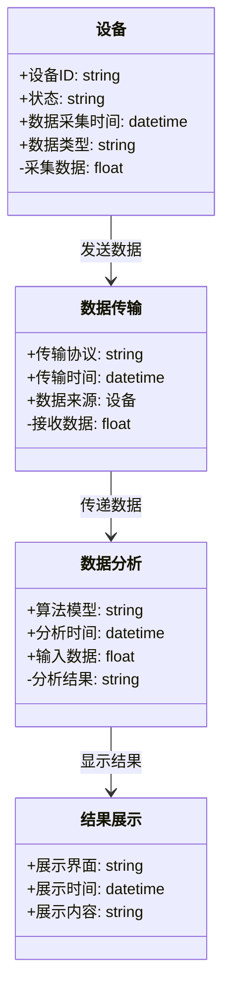
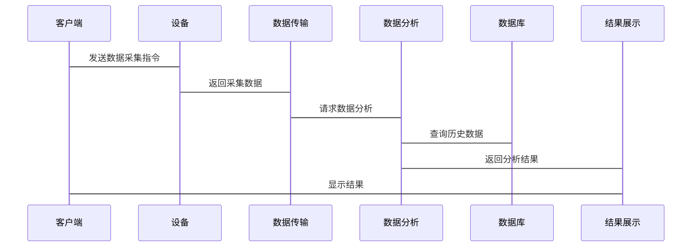

                 


# 彼得林奇的"隐形冠军"在工业互联网时代的特征演变

> 关键词：隐形冠军，工业互联网，彼得林奇，数字化转型，技术创新，市场竞争

> 摘要：本文探讨了彼得林奇提出的“隐形冠军”概念在工业互联网时代的演变特征。通过分析这些企业在数字化转型中的技术创新、组织结构优化、市场策略调整等方面的变化，总结了它们在工业互联网环境下的竞争优势与挑战，并提出了未来发展的策略建议。

---

## 第一部分：彼得林奇"隐形冠军"的概念与特征

### 第1章：彼得林奇"隐形冠军"的概念

#### 1.1 "隐形冠军"的定义与核心特征

##### 1.1.1 "隐形冠军"的定义

"隐形冠军"是指那些在特定市场领域内占据主导地位，但不为外界所广泛认知的企业。它们通常专注于某个细分市场，通过持续创新和卓越的执行力，成为该领域的领导者。

##### 1.1.2 核心特征：市场领导地位、专注性与创新性

| 特征 | 描述 |
|------|------|
| 市场领导地位 | 在特定细分市场中占据领先地位，市场份额高 |
| 专注性 | 专注于单一领域，避免多元化扩张 |
| 创新性 | 持续进行技术创新和管理创新 |

##### 1.1.3 "隐形冠军"与传统冠军的对比

| 对比维度 | 隐形冠军 | 传统冠军 |
|----------|----------|----------|
| 市场定位 | 细分市场 | 广泛市场 |
| 竞争策略 | 专业化、差异化 | 多元化、规模化 |
| 可持续性 | 高 | 中 |

#### 1.2 工业互联网时代对"隐形冠军"的影响

##### 1.2.1 工业互联网的定义与特点

工业互联网是通过互联网技术与工业系统深度融合，实现工业生产过程的智能化、网络化和协同化。

- **特点**：
  - 数据驱动
  - 智能化
  - 平台化

##### 1.2.2 工业互联网时代"隐形冠军"的特征演变

- **演变特征**：
  - **技术驱动**：从传统制造向智能制造转型
  - **数据驱动**：从经验驱动向数据驱动转型
  - **生态协同**：从单点竞争向生态协同转型

##### 1.2.3 工业互联网对"隐形冠军"商业模式的挑战与机遇

- **挑战**：
  - 竞争加剧
  - 技术更新快
  - 数据安全风险

- **机遇**：
  - 新的市场机会
  - 通过数据优化运营
  - 生态合作带来的增长

#### 1.3 "隐形冠军"的成功案例分析

##### 1.3.1 美国工业互联网领域的隐形冠军

例如，某专注于工业传感器的企业，通过工业互联网技术实现了设备的远程监控和预测性维护，成为细分市场的领导者。

##### 1.3.2 中国工业互联网领域的隐形冠军

例如，某专注于工业自动化解决方案的企业，通过工业互联网平台整合上下游资源，实现高效协同。

##### 1.3.3 欧洲工业互联网领域的隐形冠军

例如，某专注于工业机器人控制系统的欧洲企业，通过工业互联网技术实现了全球化的生产协同。

---

## 第二部分："隐形冠军"的核心竞争力分析

### 第2章：技术创新与数字化转型

#### 2.1 技术创新在"隐形冠军"中的作用

##### 2.1.1 技术创新的核心地位

- **技术创新是"隐形冠军"的核心竞争力**，通过技术壁垒巩固市场地位。

##### 2.1.2 技术创新与市场竞争力的关系

| 技术创新 | 市场竞争力 |
|----------|------------|
| 高       | 强          |
| 中       | 中          |
| 低       | 弱          |

##### 2.1.3 技术创新的实现路径

- **研发投入**：加大研发预算，建立研发团队
- **合作伙伴**：与高校、研究机构合作
- **技术并购**：通过并购获取新技术

#### 2.2 数字化转型对"隐形冠军"的影响

##### 2.2.1 数字化转型的定义与目标

- **定义**：通过数字化技术改造企业业务流程，提升效率和竞争力。
- **目标**：实现业务流程的数字化、智能化。

##### 2.2.2 数字化转型对"隐形冠军"竞争力的提升

- **提升效率**：通过自动化减少人工干预
- **增强决策能力**：通过数据分析优化决策
- **扩展市场**：通过数字化平台拓展业务

##### 2.2.3 数字化转型的实施步骤与挑战

- **步骤**：
  1. 评估现状
  2. 制定转型计划
  3. 实施技术改造
  4. 优化与迭代
- **挑战**：
  - 数据孤岛
  - 技术集成难度
  - 人员转型阻力

#### 2.3 数据驱动的决策与创新

##### 2.3.1 数据驱动的决策模式

- **数据驱动决策**：通过数据分析指导企业运营和战略制定。

##### 2.3.2 数据驱动的创新机制

- **数据挖掘**：通过数据挖掘发现新的市场机会
- **预测分析**：通过预测模型优化资源配置

##### 2.3.3 数据驱动对"隐形冠军"竞争优势的影响

- **提升效率**：通过数据优化生产流程
- **增强洞察力**：通过数据发现市场趋势
- **强化客户体验**：通过数据个性化服务

---

## 第三部分：工业互联网时代"隐形冠军"的挑战与机遇

### 第3章：工业互联网时代的挑战

#### 3.1 工业互联网带来的市场竞争加剧

##### 3.1.1 全球化竞争的加剧

- **全球化竞争**：企业需要面对全球市场的竞争压力。

##### 3.1.2 新兴技术对企业竞争优势的冲击

- **新兴技术**：如人工智能、区块链等技术的出现，可能颠覆传统竞争优势。

##### 3.1.3 传统"隐形冠军"的转型压力

- **转型压力**：传统企业需要快速适应新技术带来的变化。

#### 3.2 数字化与智能化对企业组织结构的影响

##### 3.2.1 组织结构的扁平化趋势

- **扁平化组织**：减少层级，提高决策效率。

##### 3.2.2 人才需求的变化

- **技术人才需求**：需要更多懂技术、懂业务的复合型人才。

##### 3.2.3 文化与管理的调整

- **企业文化的转型**：从传统管理向更灵活、创新的管理模式转变。

### 第4章：工业互联网时代的机遇

#### 4.1 新兴技术带来的市场机会

##### 4.1.1 人工智能技术的应用

- **应用场景**：智能制造、预测性维护等。

##### 4.1.2 区块链技术的应用

- **应用场景**：供应链管理、数据安全等。

##### 4.1.3 物联网技术的应用

- **应用场景**：设备监控、远程维护等。

#### 4.2 数字化转型带来的竞争优势

##### 4.2.1 通过数字化提升效率

- **效率提升**：自动化流程减少人工干预。

##### 4.2.2 通过数据优化决策

- **决策优化**：数据驱动的决策提高准确性。

##### 4.2.3 通过平台扩展市场

- **平台经济**：通过工业互联网平台拓展业务范围。

#### 4.3 生态合作带来的发展机遇

##### 4.3.1 生态合作的重要性

- **生态合作**：通过与上下游企业和合作伙伴协同，构建竞争优势。

##### 4.3.2 生态合作的实现路径

- **建立生态系统**：通过平台整合资源。
- **合作伙伴关系**：与战略伙伴建立长期合作关系。

##### 4.3.3 生态合作的成功案例

- **案例分析**：某工业互联网平台整合设备制造商、软件供应商、系统集成商，共同打造智能化生产解决方案。

---

## 第五部分：系统分析与架构设计方案

### 第5章：系统分析与架构设计

#### 5.1 项目介绍

##### 5.1.1 项目背景

- 某工业互联网平台旨在通过数字化技术优化生产流程，提升效率。

##### 5.1.2 项目目标

- 实现设备的远程监控和预测性维护。

##### 5.1.3 项目范围

- 包括设备数据采集、数据传输、数据分析、结果展示。

#### 5.2 系统功能设计

##### 5.2.1 领域模型设计



##### 5.2.2 系统架构设计


##### 5.2.3 系统接口设计

- **接口1**：设备数据采集接口
  - 输入：设备ID，时间戳
  - 输出：设备状态数据

- **接口2**：数据分析接口
  - 输入：数据流
  - 输出：分析结果

##### 5.2.4 系统交互设计



---

## 第六部分：项目实战

### 第6章：项目实战

#### 6.1 环境安装

##### 6.1.1 系统要求

- 操作系统：Linux/Windows
- Python版本：3.8以上
- 依赖库：Flask、Pandas、Scikit-learn

#### 6.2 系统核心实现源代码

##### 6.2.1 数据采集模块

```python
import time

def collect_data(device_id):
    # 模拟数据采集
    data = {
        'device_id': device_id,
        'timestamp': time.time(),
        'temperature': 50 + (device_id * 2),
        'pressure': 100 + (device_id * 3)
    }
    return data
```

##### 6.2.2 数据分析模块

```python
from sklearn.linear_model import LinearRegression

def analyze_data(data):
    # 模拟数据分析
    model = LinearRegression()
    model.fit([[data['timestamp']], [data['temperature']], [data['pressure']]])
    prediction = model.predict([[data['timestamp']]])
    return {'prediction': prediction[0]}
```

##### 6.2.3 结果展示模块

```python
from flask import Flask

app = Flask(__name__)

@app.route('/')
def index():
    return "设备监控平台"

@app.route('/data', methods=['GET'])
def get_data():
    return {'status': 'success', 'message': 'Data collected and analyzed'}
```

#### 6.3 代码应用解读与分析

- **数据采集模块**：通过模拟设备数据采集，实现设备状态的实时监控。
- **数据分析模块**：使用机器学习算法对数据进行预测性分析，帮助实现预测性维护。
- **结果展示模块**：通过Web界面展示分析结果，方便用户查看。

#### 6.4 实际案例分析和详细讲解剖析

- **案例分析**：某制造企业通过上述系统实现设备的远程监控和预测性维护，降低了设备故障率，提升了生产效率。

---

## 第七部分：最佳实践与小结

### 第7章：最佳实践

#### 7.1 最佳实践 tips

- **持续创新**：保持技术创新，跟上行业发展趋势。
- **数据安全**：重视数据安全，防范数据泄露风险。
- **生态合作**：积极参与行业生态，通过合作实现共赢。

#### 7.2 小结

- 工业互联网时代，"隐形冠军"需要通过技术创新、数字化转型和生态合作保持竞争优势。
- 通过系统化的架构设计和项目实施，企业可以实现智能化生产，提升市场竞争力。

---

## 第八部分：参考文献与附录

### 8.1 参考文献

1. 彼得·林奇. 《彼得·林奇的投资哲学》
2. 工业互联网联盟. 《工业互联网白皮书》
3. McKinsey & Company. 《数字化转型的成功之路》

### 8.2 附录

#### 8.2.1 工具指南

- **工具推荐**：
  - 开源工具：Kubernetes、Docker
  - 商业工具：AWS、Azure
  - 数据分析工具：Python、R

#### 8.2.2 术语解释

- **工业互联网**：通过互联网技术与工业系统深度融合，实现工业生产的智能化、网络化和协同化。

---

## 作者信息

作者：AI天才研究院/AI Genius Institute & 禅与计算机程序设计艺术 /Zen And The Art of Computer Programming

---

**Note**: 以上文章结构和内容仅为示例，实际撰写时需要根据具体情况进行调整和补充。

