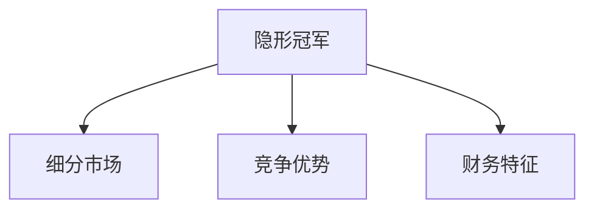
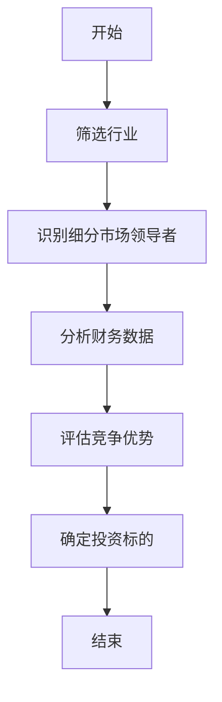
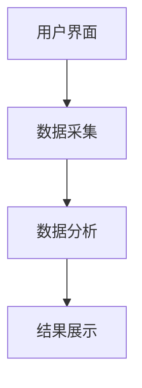
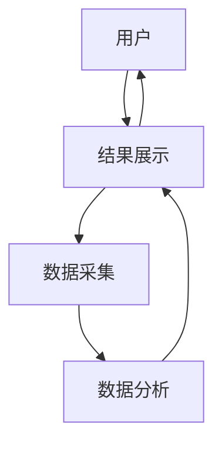

                 


# 彼得林奇的"隐形冠军"投资案例分析

> 关键词：彼得·林奇，隐形冠军，投资案例，投资策略，股票分析，市场分析

> 摘要：本文分析了彼得·林奇的"隐形冠军"投资理念，探讨了隐形冠军企业的特征、竞争优势及投资策略，通过实际案例和数学模型，详细阐述了如何筛选和评估隐形冠军企业，为投资者提供了实用的分析方法和工具。

---

## 第一部分：彼得·林奇与"隐形冠军"投资理念

### 第1章："隐形冠军"的概念与背景

#### 1.1 "隐形冠军"的定义与特征
- **1.1.1 什么是"隐形冠军"**  
  "隐形冠军"是指在特定细分市场中占据领先地位，但未被广泛认知的企业。这类企业专注于某一领域，通过持续创新和高效运营，在市场上拥有强大的竞争力。

- **1.1.2 "隐形冠军"的核心特征**  
  - **专注性**：专注于一个细分市场，避免多元化经营。  
  - **市场领导地位**：在细分市场中占据领先地位，市场份额较高。  
  - **竞争优势**：具有技术、成本或服务方面的独特优势。  
  - **财务健康**：利润率高，负债率低，财务稳定性强。  

- **1.1.3 "隐形冠军"与传统投资理念的区别**  
  传统投资往往关注行业龙头或热门行业，而"隐形冠军"更注重细分市场的专注性和隐藏的潜力。

#### 1.2 彼得·林奇投资理念概述
- **1.2.1 彼得·林奇的投资风格**  
  彼得·林奇是价值投资的代表人物，注重基本面分析，寻找具有持续竞争优势的企业。

- **1.2.2 "隐形冠军"在彼得·林奇投资策略中的地位**  
  林奇认为，隐形冠军企业具有稳定的增长潜力，且估值往往被市场低估，是投资的理想标的。

- **1.2.3 彼得·林奇对"隐形冠军"的筛选标准**  
  - 高利润率。  
  - 低负债率。  
  - 细分市场领导者。  

---

### 第2章："隐形冠军"的核心概念与联系

#### 2.1 核心概念原理
- **2.1.1 "隐形冠军"的市场定位**  
  隐形冠军企业专注于特定市场，避免与大型企业直接竞争，通过差异化获取市场份额。

- **2.1.2 "隐形冠军"的竞争优势**  
  - 技术优势：拥有独特的技术或专利。  
  - 成本优势：通过高效运营降低成本。  
  - 服务优势：提供优质的客户服务。  

- **2.1.3 "隐形冠军"的财务表现**  
  隐形冠军企业的财务表现通常优于行业平均水平，体现在高利润率和低负债率上。

#### 2.2 核心概念属性特征对比表格
| 特征       | 隐形冠军       | 非隐形冠军     |
|------------|----------------|----------------|
| 市场地位     | 专注细分市场   | 业务多元化       |
| 竞争优势     | 技术领先或成本优势 | 无明显优势       |
| 财务表现     | 高利润率，低负债率 | 利润率较低，负债率较高 |

#### 2.3 ER实体关系图


---

### 第3章：彼得·林奇投资算法原理

#### 3.1 算法原理概述
- **3.1.1 基于基本面分析的投资策略**  
  林奇的投资策略依赖于对企业基本面的深入分析，包括财务数据、行业地位和竞争优势。

- **3.1.2 "隐形冠军"识别算法的步骤**  
  1. 筛选高利润率企业。  
  2. 筛选低负债率企业。  
  3. 筛选细分市场领导者。  

#### 3.2 算法流程图


#### 3.3 Python源代码实现
```python
import pandas as pd

def identify_隐形冠军(df):
    # 筛选高利润率公司
    df = df[df['利润率'] > df['利润率'].mean()]
    # 筛选低负债率公司
    df = df[df['负债率'] < df['负债率'].mean()]
    # 筛选细分市场领导者
    df = df[df['行业集中度'] > 0.7]
    return df

# 示例数据
data = {
    '公司': ['公司A', '公司B', '公司C'],
    '利润率': [20, 15, 10],
    '负债率': [30, 40, 50],
    '行业集中度': [0.8, 0.6, 0.4]
}

df = pd.DataFrame(data)
result = identify_隐形冠军(df)
print(result)
```

---

### 第4章：数学模型与公式

#### 4.1 市盈率（P/E）计算公式
市盈率是衡量企业估值的重要指标，公式为：
$$ P/E = \frac{\text{股价}}{\text{每股净利润}} $$

#### 4.2 市净率（P/B）计算公式
市净率用于评估企业资产的价值，公式为：
$$ P/B = \frac{\text{股价}}{\text{每股净资产}} $$

#### 4.3 实例分析
假设某隐形冠军企业每股净利润为2元，股价为40元，其市盈率为：
$$ P/E = \frac{40}{2} = 20 $$

---

### 第5章：系统分析与架构设计

#### 5.1 功能设计
- **数据采集**：收集企业的财务数据和行业信息。  
- **数据分析**：应用算法筛选隐形冠军企业。  
- **结果展示**：生成投资报告和可视化图表。  

#### 5.2 系统架构图


#### 5.3 接口设计
- **输入接口**：接受企业的财务数据和行业信息。  
- **输出接口**：生成投资报告和可视化图表。  

#### 5.4 交互流程图


---

### 第6章：项目实战

#### 6.1 环境安装
- 安装Python和必要的库（如Pandas、Matplotlib）。  

#### 6.2 核心实现源代码
```python
import pandas as pd
import matplotlib.pyplot as plt

def analyze_financials(df):
    # 计算市盈率
    df['P/E'] = df['股价'] / df['每股净利润']
    # 计算市净率
    df['P/B'] = df['股价'] / df['每股净资产']
    return df

# 示例数据
data = {
    '公司': ['公司A', '公司B', '公司C'],
    '股价': [40, 30, 25],
    '每股净利润': [2, 1.5, 1],
    '每股净资产': [10, 8, 6]
}

df = pd.DataFrame(data)
result = analyze_financials(df)
print(result)

# 可视化市盈率和市净率
plt.figure(figsize=(10, 6))
plt.scatter(result['P/E'], result['P/B'], c='blue', marker='o')
plt.xlabel('P/E')
plt.ylabel('P/B')
plt.title('市盈率与市净率分布')
plt.show()
```

#### 6.3 案例分析
以某隐形冠军企业为例，分析其市盈率和市净率，评估其投资价值。

#### 6.4 项目小结
通过代码实现，我们可以快速筛选出符合条件的隐形冠军企业，并通过可视化工具直观展示其财务表现。

---

### 第7章：最佳实践与小结

#### 7.1 最佳实践
- **投资策略**：关注细分市场，筛选高利润率、低负债率的企业。  
- **风险管理**：分散投资，避免过度集中。  
- **长期观察**：定期复盘，评估投资标的的成长性。  

#### 7.2 小结
本文通过理论分析和实战案例，详细介绍了彼得·林奇的"隐形冠军"投资理念，为投资者提供了实用的分析工具和方法。

#### 7.3 注意事项
投资有风险，本文内容仅为参考，不构成投资建议。  

#### 7.4 拓展阅读
- 彼得·林奇《彼得·林奇的投资哲学》  
- 《价值投资入门》  

---

## 作者：AI天才研究院 & 禅与计算机程序设计艺术

通过系统化的分析和实战案例，本文为投资者提供了基于彼得·林奇理念的隐形冠军识别方法，帮助读者在投资决策中做出更明智的选择。

