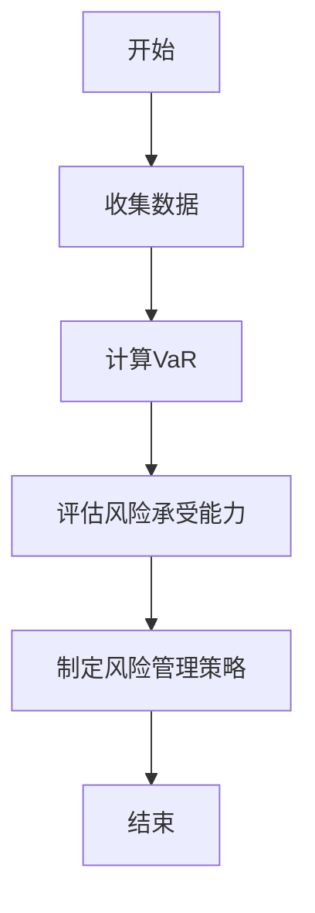
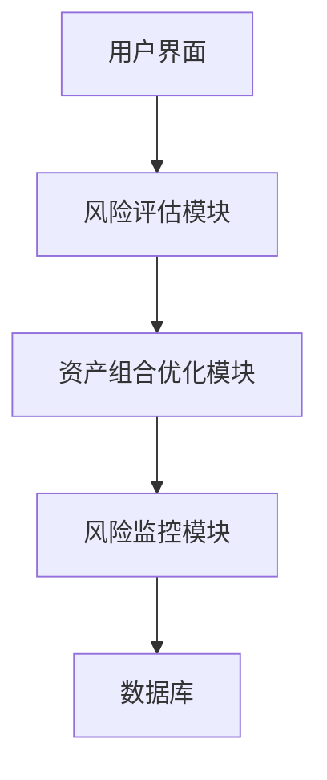

                 


```markdown
# 彼得林奇的风险管理原则

> 关键词：风险管理，彼得林奇，投资策略，风险评估，资产组合优化

> 摘要：本文深入探讨了彼得林奇的风险管理原则，从基本概念到数学模型，再到系统设计与项目实战，全面分析了风险管理的核心思想和具体实现方法。

---

## 第一部分：风险管理的基本概念

### 第1章：风险管理的定义与重要性

#### 1.1 风险管理的定义与重要性

- **风险管理的定义**：风险管理是指识别、评估和应对可能影响目标的不确定性。它通过量化和分析风险，制定相应的策略以降低潜在损失。
- **风险管理的重要性**：在投资领域，风险管理是确保资金安全和实现收益的关键。通过有效管理风险，投资者可以避免重大损失并优化投资回报。

#### 1.2 彼得林奇的背景与投资理念

- **彼得林奇的生平简介**：彼得·林奇是富达投资集团的前董事长，以其长期投资和价值发现策略闻名。
- **彼得林奇的投资哲学**：他强调长期投资，选择优质企业，避免短期波动。
- **风险管理的核心思想**：林奇认为，风险管理是投资成功的关键，强调分散投资和避免过度杠杆。

---

## 第2章：彼得林奇的风险管理原则

### 2.1 风险管理的核心原则

#### 2.1.1 风险与收益的平衡

- **风险与收益的关系**：高风险通常意味着高收益，但过高的风险可能导致重大损失。因此，平衡风险与收益是关键。
- **风险承受能力**：每个投资者的风险承受能力不同，需根据自身情况制定策略。

#### 2.1.2 风险的分散化策略

- **分散化的重要性**：通过投资不同资产和行业，降低特定风险。
- **相关性分析**：资产的相关性影响分散效果，需选择相关性低的资产。

#### 2.1.3 风险的量化与评估

- **VaR（风险价值）**：VaR是衡量潜在损失的指标，帮助投资者了解可能的最大损失。
- **数学模型**：通过概率分布和统计模型量化风险。

### 2.2 彼得林奇的投资策略

#### 2.2.1 长期投资与价值发现

- **长期投资的优势**：避免短期波动，捕捉企业长期增长。
- **价值发现方法**：寻找被低估的企业，评估其内在价值。

#### 2.2.2 避免过度杠杆

- **杠杆的双刃剑效应**：虽然能放大收益，但也可能加剧损失。
- **保守融资策略**：避免过高负债，保持财务健康。

#### 2.2.3 选择优质企业

- **优质企业的标准**：行业地位稳固，财务健康，管理团队优秀。
- **企业分析方法**：通过财务报表和行业分析筛选优质企业。

---

## 第3章：风险管理的数学模型与算法

### 3.1 风险管理的数学模型

#### 3.1.1 风险值（VaR）的定义与计算

- **VaR的定义**：在给定置信水平下，某一时间段内可能的最大损失。
- **计算方法**：基于历史数据和统计模型，计算不同置信水平下的VaR。

#### 3.1.2 风险调整后的收益（RAROC）

- **RAROC的定义**：考虑风险调整后的资本回报率，衡量收益与风险的平衡。
- **计算公式**：$$ RAROC = \frac{净利润}{平均风险资本} $$

#### 3.1.3 风险分散化与资产组合优化

- **分散化原理**：通过资产组合降低非系统性风险。
- **优化模型**：使用均值-方差优化，最小化风险或最大化收益。

### 3.2 彼得林奇风险管理算法的实现

#### 3.2.1 风险评估流程图（Mermaid）



#### 3.2.2 风险分散化策略的数学公式

- **资产组合风险公式**：$$ \sigma_p = \sqrt{\sum_{i=1}^n w_i^2 \sigma_i^2 + \sum_{i \neq j} w_i w_j \sigma_{i,j}} $$

---

## 第4章：系统分析与架构设计

### 4.1 投资风险管理系统的功能设计

#### 4.1.1 风险评估模块

- **功能**：输入资产组合，计算VaR和RAROC。
- **流程**：数据输入 -> 计算VaR -> 评估风险承受能力。

#### 4.1.2 资产组合优化模块

- **功能**：优化资产组合，降低风险或提高收益。
- **流程**：输入约束 -> 计算优化结果 -> 输出建议。

#### 4.1.3 风险监控模块

- **功能**：实时监控风险指标，提供预警。
- **流程**：数据采集 -> 风险评估 -> 预警触发。

### 4.2 系统架构设计

#### 4.2.1 系统架构图（Mermaid）



---

## 第5章：项目实战与案例分析

### 5.1 项目环境安装与配置

- **开发环境**：推荐使用Python和Jupyter Notebook。
- **数据库**：使用MySQL存储历史数据和计算结果。
- **工具**：安装Pandas、NumPy、Scipy等库。

### 5.2 核心代码实现

#### 5.2.1 风险评估模块代码

```python
import numpy as np
import pandas as pd

def calculate VaR(data, confidence_level):
    returns = data.pct_change().dropna()
    VaR = np.percentile(returns, (100 - confidence_level))
    return VaR
```

#### 5.2.2 资产组合优化模块代码

```python
from scipy.optimize import minimize

def portfolio optimization(returns, weights):
    def objective(weights):
        return (weights.dot(returns).dot(weights.T)) 
    result = minimize(objective, weights, ...)
    return result.x
```

### 5.3 案例分析与解读

- **案例背景**：假设一个投资组合，包含科技股和消费股，评估其VaR和RAROC。
- **实现过程**：使用历史数据计算VaR，优化资产组合。
- **优化结果**：展示优化后的组合风险和收益。

---

## 第6章：最佳实践与风险管理技巧

### 6.1 风险管理的最佳实践

#### 6.1.1 风险管理的三大原则

- **量化风险**：使用VaR等指标量化潜在损失。
- **分散投资**：避免集中投资，降低特定风险。
- **持续监控**：定期评估和调整风险管理策略。

#### 6.1.2 风险管理的执行步骤

- **识别风险**：识别可能影响投资的各类风险。
- **评估风险**：量化风险并评估其影响。
- **制定策略**：根据评估结果制定应对策略。
- **监控与调整**：持续监控并及时调整策略。

#### 6.1.3 风险管理的常见误区

- **忽视相关性**：资产的相关性影响分散效果。
- **过度自信**：低估市场的不确定性。

### 6.2 彼得林奇风险管理技巧

#### 6.2.1 选择优质企业的标准

- **行业地位**：选择行业龙头。
- **财务健康**：关注利润和现金流。
- **管理团队**：考察管理层能力。

#### 6.2.2 避免过度杠杆的方法

- **保守融资**：避免过高负债。
- **杠杆比例控制**：合理控制杠杆水平。

#### 6.2.3 长期投资的策略

- **长期视角**：避免短期波动干扰。
- **价值发现**：寻找被低估的企业。

---

## 第7章：小结与展望

### 7.1 本章小结

- **风险管理的核心概念**：识别、评估和应对风险。
- **彼得林奇的原则**：分散投资，选择优质企业，避免过度杠杆。
- **系统设计与实现**：基于VaR和RAROC的数学模型，构建投资管理系统。

### 7.2 未来展望

- **风险管理领域的未来趋势**：人工智能和大数据在风险管理中的应用。
- **彼得林奇思想的延续与发展**：结合新技术，优化风险管理方法。
- **风险管理技术的创新与应用**：探索新的数学模型和算法。

---

## 第8章：注意事项与拓展阅读

### 8.1 注意事项

- **数据质量**：确保数据准确性和完整性。
- **模型局限性**：了解数学模型的假设和限制。
- **持续学习**：市场环境变化，需不断更新风险管理知识。

### 8.2 拓展阅读

- **书籍推荐**：《彼得·林奇的成功投资》。
- **学术论文**：风险管理领域的最新研究成果。
- **在线资源**：投资风险管理的相关课程和讲座。

---

## 作者：AI天才研究院/AI Genius Institute & 禅与计算机程序设计艺术 /Zen And The Art of Computer Programming

---

**注**：以上内容是一个详细的目录和部分章节的示例。实际撰写时，每个小节需要根据实际内容进行扩展和补充，确保文章逻辑清晰，内容详实。
```

