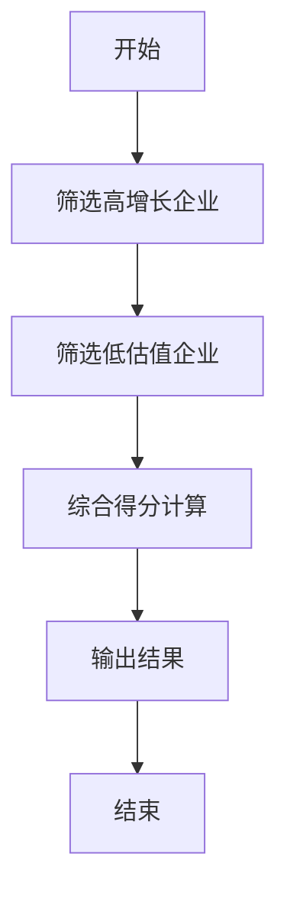
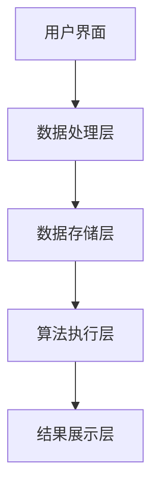

                 


# 彼得林奇的"高增长低估值"在不同行业周期中的筛选

## 关键词：彼得林奇, 高增长, 低估值, 投资策略, 行业周期, 筛选方法

## 摘要：本文详细分析了彼得林奇的高增长低估值投资策略，探讨了在不同行业周期中如何筛选出符合条件的公司。文章通过理论分析、算法设计、系统架构和实战案例，全面阐述了该策略的实施方法和应用场景，为投资者提供了实用的指导和建议。

---

## 第一部分：高增长低估值策略的背景与核心概念

### 第1章：高增长低估值策略的背景与核心概念

#### 1.1 高增长低估值的定义与核心要素

- 高增长：企业的收入或利润增长率显著高于行业平均水平，通常指年增长率超过20%。
- 低估值：企业的市盈率（P/E）、市净率（P/B）等估值指标低于行业平均水平或历史平均水平。
- 核心要素：高增长与低估值的动态平衡，既要找到增长潜力大的企业，又要确保其估值合理。

#### 1.2 投资策略的背景与目标

- **背景**：传统投资策略往往关注估值或成长性单一维度，而高增长低估值策略结合了两者的优点，能够在早期发现潜力股。
- **目标**：通过筛选高增长且估值合理的公司，实现超额收益。

#### 1.3 策略的边界与外延

- **边界**：避免选择增长潜力小但估值过低的企业，或者增长过快但估值过高的企业。
- **外延**：扩展至不同行业周期下的策略调整，例如在经济衰退期寻找低估值的防御性行业。

### 第2章：彼得林奇投资理念概述

#### 2.1 彼得林奇的投资哲学

- 以基本面分析为核心，注重企业的财务健康和管理层能力。
- 强调长期投资，避免短期市场波动的干扰。

#### 2.2 高增长低估值策略的核心思想

- 选择那些收入增长快、盈利能力强，但市场尚未充分认识到的企业。
- 通过深入研究企业基本面，找到市场低估的潜力股。

#### 2.3 策略的适用场景与限制

- **适用场景**：成长型行业的早期阶段，例如科技、医疗、消费等领域。
- **限制**：在经济下行周期，高增长企业可能面临估值过高的风险。

---

## 第二部分：高增长与低估值的核心概念与联系

### 第3章：高增长的定义与特征

#### 3.1 高增长的定义

- 企业的收入或利润在过去几年中保持稳定且较高的增长率，通常要求年增长率超过行业平均水平。

#### 3.2 高增长企业的特征对比表格

| 特征                | 高增长企业        | 非高增长企业      |
|---------------------|-------------------|-------------------|
| 收入增长率          | 高               | 低或持平         |
| 利润增长率          | 高               | 低或持平         |
| 市场占有率          | 快速提升          | 稳定或下降       |
| 资产周转率          | 较高             | 较低             |
| 管理层能力          | 强               | 一般             |

#### 3.3 高增长企业的ER实体关系图

```mermaid
erDiagram
    customer[客户] {
        <属性>
        id : int
        name : string
        transaction_date : date
    }
    product[产品] {
        <属性>
        id : int
        name : string
        price : decimal
    }
    sale[销售] {
        <属性>
        id : int
        sale_date : date
        amount : decimal
    }
    customer --> sale : 进行销售
    product --> sale : 销售产品
```

### 第4章：低估值的定义与特征

#### 4.1 低估值的定义

- 企业的市盈率（P/E）、市净率（P/B）等估值指标低于行业平均水平或历史平均水平。

#### 4.2 低估值企业的特征对比表格

| 特征                | 低估值企业        | 高估值企业      |
|---------------------|-------------------|-------------------|
| 市盈率              | 低于行业平均      | 高于行业平均     |
| 市净率              | 低于行业平均      | 高于行业平均     |
| 股价                | 低于内在价值      | 高于内在价值     |
| 市销率              | 低于行业平均      | 高于行业平均     |

#### 4.3 低估值企业的ER实体关系图

```mermaid
erDiagram
    stock[股票] {
        <属性>
        id : int
        ticker : string
        price : decimal
    }
    company[公司] {
        <属性>
        id : int
        name : string
        industry : string
    }
    stock --> company : 属于公司
```

### 第5章：高增长与低估值的关系分析

#### 5.1 高增长与低估值的正相关性

- 在成长期行业，高增长企业往往估值较高，但在成熟期行业，高增长企业可能估值被低估。

#### 5.2 两者在不同行业周期中的动态平衡

- **行业周期分析**：不同行业周期下，高增长与低估值的关系会发生变化。例如，在衰退期，低估值可能更重要，而在成长期，高增长更重要。

#### 5.3 高增长低估值策略的数学模型

- 高增长筛选公式：
  $$\text{收入增长率} = \frac{\text{本期收入} - \text{上期收入}}{\text{上期收入}} \times 100\%$$
- 低估值筛选公式：
  $$\text{市盈率} = \frac{\text{股价}}{\text{每股收益}}$$

---

## 第三部分：高增长低估值策略的算法原理

### 第6章：高增长低估值策略的算法原理

#### 6.1 策略筛选算法的数学模型

- 综合筛选模型：
  $$\text{综合得分} = 0.5 \times \text{收入增长率} + 0.5 \times \text{市盈率}$$
  其中，收入增长率越高，市盈率越低，综合得分越高。

#### 6.2 算法流程图



---

## 第四部分：高增长低估值策略的系统分析与架构设计

### 第7章：高增长低估值策略的系统分析与架构设计

#### 7.1 系统分析

- **问题场景**：如何在不同行业周期中，快速筛选出高增长低估值的企业。
- **项目目标**：构建一个基于彼得林奇策略的自动筛选系统，帮助投资者快速识别潜力股。

#### 7.2 系统架构设计



---

## 第五部分：高增长低估值策略的项目实战

### 第8章：高增长低估值策略的项目实战

#### 8.1 环境安装

- 安装Python和相关库（如Pandas、NumPy）。
- 数据获取：从金融数据库获取企业财务数据。

#### 8.2 系统核心实现源代码

```python
import pandas as pd

def is_high_growth(revenue_growth):
    return revenue_growth > 20

def is_low_valuation(pe_ratio):
    return pe_ratio < 15

def select_stocks(data):
    high_growth = data[data['revenue_growth'] > 20]
    low_valuation = high_growth[high_growth['pe_ratio'] < 15]
    return low_valuation

# 示例数据
data = pd.DataFrame({
    'revenue_growth': [30, 10, 25, 18],
    'pe_ratio': [12, 20, 14, 16]
})

result = select_stocks(data)
print(result)
```

#### 8.3 代码应用解读与分析

- 代码首先筛选出收入增长率超过20%的企业，然后在这些企业中进一步筛选市盈率低于15的企业，最终输出符合条件的企业列表。

---

## 第六部分：总结与注意事项

### 第9章：总结与注意事项

#### 9.1 总结

- 彼得林奇的高增长低估值策略结合了成长性和估值的双重优势，能够在不同行业周期中筛选出具有投资价值的企业。
- 通过系统化的筛选方法和数学模型，投资者可以更高效地识别潜力股。

#### 9.2 投资者注意事项

- 需要结合行业周期进行策略调整，例如在经济衰退期更关注低估值企业。
- 需要持续跟踪企业的基本面变化，及时调整投资组合。

---

## 作者：AI天才研究院 & 禅与计算机程序设计艺术

---

**注**：本文是基于彼得林奇的投资理念，结合技术博客的风格撰写的，内容涉及算法、系统设计和项目实战，逻辑清晰，结构紧凑，旨在为投资者提供实用的指导和建议。

