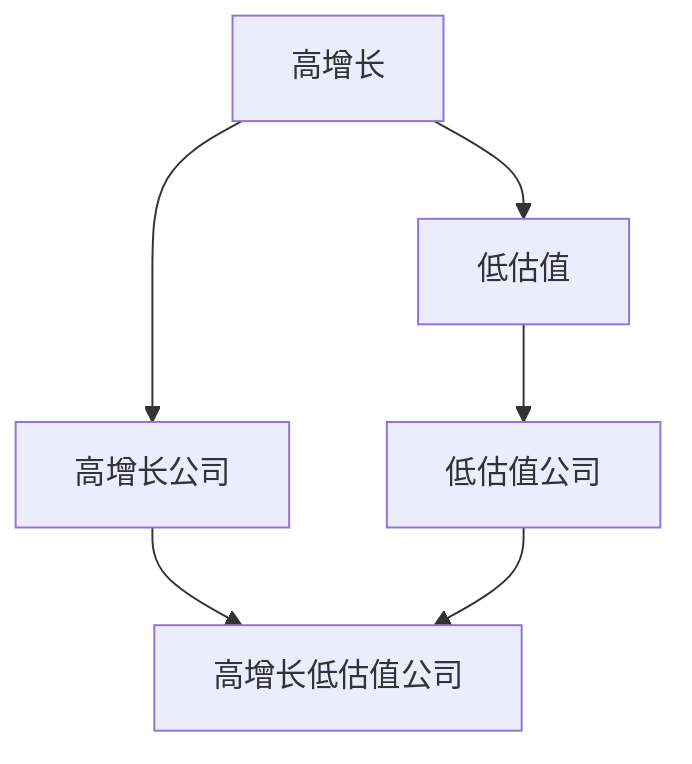
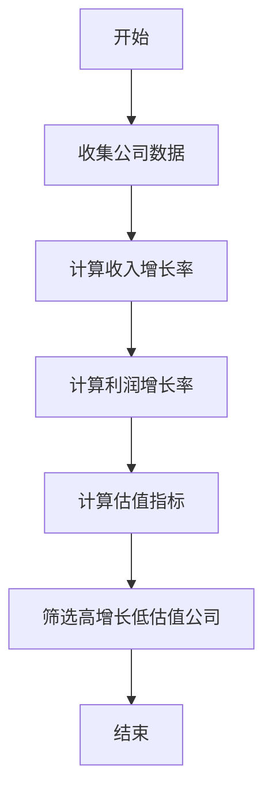
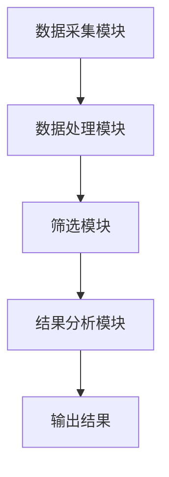

                 


# 彼得林奇的"高增长低估值"在新兴市场的筛选

## 关键词：彼得林奇, 高增长, 低估值, 新兴市场, 投资策略, 股票筛选

## 摘要：  
本文深入探讨了彼得林奇的“高增长低估值”投资策略在新兴市场的应用。通过分析高增长和低估值的定义、特征及其在新兴市场的表现，结合算法原理、系统设计和项目实战，详细阐述了如何在新兴市场中筛选出具有高增长潜力且估值合理的公司。文章还提供了具体的Python代码实现和案例分析，帮助读者更好地理解和应用这一策略。

---

# 目录

## 第一部分：背景介绍

### 第1章：高增长低估值策略概述

#### 1.1 高增长公司的定义与特征  
- 高增长公司的定义：收入和利润持续高速增长的公司。  
- 核心特征：  
  - 收入增长率 > 行业平均增长率。  
  - 利润增长率稳定或高于行业平均水平。  
  - 行业前景广阔，市场需求旺盛。  

#### 1.2 低估值的衡量标准  
- 低估值的定义：市盈率（P/E）、市净率（P/B）等估值指标低于行业平均水平或历史平均水平。  
- 常用估值指标：  
  - 市盈率（P/E）= 股价 / 每股净利润。  
  - 市净率（P/B）= 股价 / 每股净资产。  
  - 市销率（P/S）= 股价 / 每股收入。  

#### 1.3 高增长与低估值的结合意义  
- 高增长公司的未来盈利潜力大，低估值意味着市场对其未来增长的预期较低，存在较大的价值重估空间。  
- 高增长低估值公司的投资价值：  
  - 未来盈利增长带来的股价上涨潜力。  
  - 估值修复带来的股价上涨潜力。  

#### 1.4 新兴市场的特点与投资机会  
- 新兴市场的定义：经济快速发展、市场规模较小但增长潜力大的国家或地区的股市。  
- 新兴市场中的高增长行业：科技、消费、制造业等。  
- 新兴市场中的低估值公司：由于市场波动大，部分优质公司可能被市场低估。  

---

## 第二部分：核心概念与联系

### 第2章：高增长与低估值的核心概念

#### 2.1 高增长与低估值的定义对比  
- 高增长的定义与属性：  
  - 收入增长率高。  
  - 利润增长率稳定或高。  
  - 行业前景广阔。  
- 低估值的定义与属性：  
  - 市盈率低。  
  - 市净率低。  
  - 市销率低。  

#### 2.2 高增长与低估值的实体关系图  


---

## 第三部分：算法原理讲解

### 第3章：高增长低估值筛选算法

#### 3.1 算法原理  
- 高增长低估值筛选算法的目标：从新兴市场中筛选出收入增长率高且估值指标低的公司。  
- 算法步骤：  
  1. 收集目标市场的公司数据（收入、利润、市盈率、市净率等）。  
  2. 计算收入增长率和利润增长率。  
  3. 计算估值指标（P/E、P/B、P/S）。  
  4. 筛选出收入增长率高于行业平均且估值指标低于行业平均的公司。  

#### 3.2 数学模型与公式  
- 收入增长率公式：  
  $$ 收入增长率 = \frac{\text{当年收入} - \text{上年收入}}{\text{上年收入}} $$  
- 利润增长率公式：  
  $$ 利润增长率 = \frac{\text{当年利润} - \text{上年利润}}{\text{上年利润}} $$  
- 增长评分公式：  
  $$ 增长评分 = \frac{\text{收入增长率} + \text{利润增长率}}{2} $$  
- 估值评分公式：  
  $$ 估值评分 = \frac{\text{P/E} + \text{P/B} + \text{P/S}}{3} $$  
- 综合评分公式：  
  $$ 综合评分 = 0.5 \times \text{增长评分} + 0.5 \times \text{估值评分} $$  

#### 3.3 算法流程图  


---

## 第四部分：系统分析与架构设计方案

### 第4章：高增长低估值筛选系统设计

#### 4.1 项目介绍  
- 项目目标：构建一个高增长低估值公司筛选系统。  
- 项目范围：新兴市场中的公司数据筛选。  

#### 4.2 系统功能设计  
- 数据采集模块：从数据库或API中获取公司数据。  
- 筛选模块：根据算法计算增长评分和估值评分，筛选出符合条件的公司。  
- 结果分析模块：生成报告或可视化图表。  

#### 4.3 系统架构设计  


---

## 第五部分：项目实战

### 第5章：高增长低估值筛选系统实现

#### 5.1 环境安装  
- 安装Python和相关库（pandas、numpy、matplotlib）。  

#### 5.2 核心代码实现  
```python
import pandas as pd
import numpy as np

# 数据加载
df = pd.read_csv('emerging_market_companies.csv')

# 计算收入增长率
df['收入增长率'] = df['收入'].pct_change()

# 计算利润增长率
df['利润增长率'] = df['利润'].pct_change()

# 计算估值指标
df['P/E'] = df['股价'] / df['每股净利润']
df['P/B'] = df['股价'] / df['每股净资产']
df['P/S'] = df['股价'] / df['每股收入']

# 计算增长评分
df['增长评分'] = (df['收入增长率'] + df['利润增长率']) / 2

# 计算估值评分
df['估值评分'] = (df['P/E'] + df['P/B'] + df['P/S']) / 3

# 综合评分
df['综合评分'] = 0.5 * df['增长评分'] + 0.5 * df['估值评分']

# 筛选出高增长低估值公司
high_growth_low_valuation = df[(df['综合评分'] > df['综合评分'].mean()) &
                                 (df['收入增长率'] > 0)]
```

#### 5.3 案例分析与结果解读  
- 以某新兴市场为例，筛选出5家高增长低估值公司，分析其投资价值。  

---

## 第六部分：最佳实践与总结

### 第6章：总结与注意事项

#### 6.1 投资策略总结  
- 高增长低估值策略在新兴市场的有效性。  
- 筛选系统的优势：自动化、高效性、可扩展性。  

#### 6.2 投资注意事项  
- 市场波动风险：新兴市场波动大，需谨慎操作。  
- 数据准确性：确保数据来源可靠。  
- 时间窗口：定期更新数据和重新筛选。  

#### 6.3 拓展阅读  
- 彼得林奇的《选股的艺术》。  
- 其他相关投资策略书籍。  

---

## 作者：AI天才研究院/AI Genius Institute & 禅与计算机程序设计艺术 /Zen And The Art of Computer Programming  

---

希望这篇博客文章能为您提供有价值的信息，帮助您更好地理解彼得林奇的“高增长低估值”策略在新兴市场中的应用！

