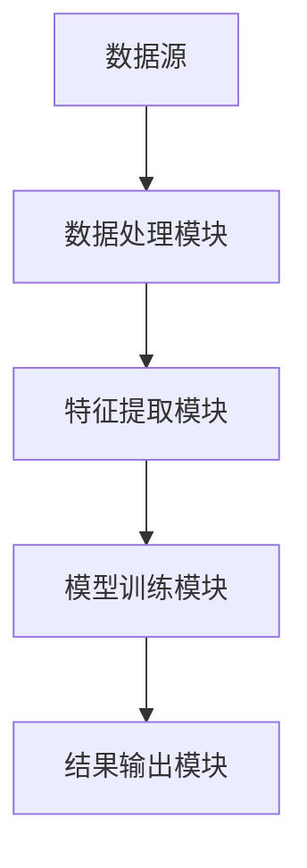

                 


# 彼得林奇的"高增长低估值"在新兴科技股中的筛选标准

> 关键词：彼得·林奇，高增长低估值，新兴科技股，股票筛选，投资策略

> 摘要：本文将详细探讨彼得·林奇的“高增长低估值”投资理念，并将其应用到新兴科技股的筛选中。通过分析高增长和低估值的核心概念，结合数学模型和系统架构，构建一个适用于新兴科技股的筛选标准。文章还将通过实际案例展示如何利用这些标准进行投资决策，并提供相关的代码实现和最佳实践建议。

---

# 第一部分：彼得·林奇的“高增长低估值”投资理念

## 第1章：彼得·林奇投资理念概述

### 1.1 彼得·林奇的投资者背景

彼得·林奇（Peter Lynch）是美国著名的职业基金经理人，曾担任富达麦哲伦基金的经理，创造了该基金13年的年平均收益率29.1%的辉煌成绩。他的投资理念以“逆向思维”和“深入研究”著称，尤其注重挖掘那些被市场低估但具有高增长潜力的股票。

#### 1.1.1 彼得·林奇的生平简介
- 1942年出生，曾在波士顿学院学习英语，后转学到波士顿大学，并获得历史学硕士学位。
- 1965年加入富达投资，1971年成为富达麦哲伦基金经理。
- 1990年退休后，著有多本投资书籍，包括《彼得·林奇的投资心理备忘录》和《选股的艺术》。

#### 1.1.2 林奇的投资风格特点
- **价值投资**：寻找基本面良好但市场低估的股票。
- **深入研究**：林奇强调对公司的深入研究，包括行业趋势、财务数据和管理层能力。
- **长期视角**：关注公司的长期增长潜力，而非短期市场波动。

#### 1.1.3 林奇投资理念的核心思想
林奇认为，投资者应寻找那些具有高增长潜力但市场估值较低的股票。他强调，市场的短期波动不应影响对长期价值的判断，尤其是在新兴科技领域，许多公司初期可能估值较低，但具备高增长的潜力。

---

### 1.2 高增长低估值的定义与特征

#### 1.2.1 高增长的定义与衡量标准
高增长意味着公司在收入和利润方面具有持续增长的能力。通常，我们可以通过以下指标来衡量：

- **收入增长率**：$$ 收入增长率 = \frac{\text{当期收入} - \text{基期收入}}{\text{基期收入}} \times 100\% $$
- **净利润增长率**：$$ 净利润增长率 = \frac{\text{当期净利润} - \text{基期净利润}}{\text{基期净利润}} \times 100\% $$

#### 1.2.2 低估值的定义与衡量标准
低估值意味着股票的市场价格低于其内在价值。常用的估值指标包括：

- **市盈率（P/E）**：$$ \text{市盈率} = \frac{\text{股价}}{\text{每股收益}} $$
- **市净率（P/B）**：$$ \text{市净率} = \frac{\text{股价}}{\text{每股净资产}} $$
- **市销率（P/S）**：$$ \text{市销率} = \frac{\text{股价}}{\text{每股营业收入}} $$

#### 1.2.3 高增长与低估值的关系分析
高增长和低估值并非总是正相关。一些公司可能因为市场忽视或行业周期原因，估值被低估，但其业务模式具备高增长潜力。因此，寻找高增长低估值的股票需要结合行业趋势和公司基本面进行综合分析。

---

### 1.3 新兴科技股的特殊性

#### 1.3.1 新兴科技股的行业特点
- **高成长性**：科技行业通常具有较高的增长潜力，尤其是在人工智能、云计算、大数据等领域。
- **高波动性**：科技股的市场价格波动较大，受技术创新和市场竞争的影响显著。
- **高风险性**：新兴科技公司可能面临技术失败、市场竞争激烈等风险。

#### 1.3.2 新兴科技股的高增长潜力
科技行业的技术创新和市场扩展为公司提供了快速发展的机会。例如，人工智能技术的突破可能导致相关公司收入和利润的快速增长。

#### 1.3.3 新兴科技股的估值波动性
由于市场的不确定性和技术创新的不确定性，新兴科技股的估值可能波动较大。这为投资者提供了在低估值时介入的机会。

---

## 第2章：高增长低估值筛选标准的核心要素

### 2.1 高增长企业的识别标准

#### 2.1.1 收入增长率的计算与分析
收入增长率是衡量公司增长能力的重要指标。我们可以通过以下步骤计算：

1. 收集公司过去几年的收入数据。
2. 计算收入增长率：$$ 收入增长率 = \frac{\text{当期收入} - \text{基期收入}}{\text{基期收入}} \times 100\% $$
3. 对比行业平均水平，判断公司的增长潜力。

#### 2.1.2 净利润增长率的计算与分析
净利润增长率反映了公司的盈利能力。计算公式为：
$$ 净利润增长率 = \frac{\text{当期净利润} - \text{基期净利润}}{\text{基期净利润}} \times 100\% $$

#### 2.1.3 营业利润率的分析与应用
营业利润率（Operating Profit Margin）是衡量公司运营效率的重要指标。计算公式为：
$$ \text{营业利润率} = \frac{\text{营业利润}}{\text{营业收入}} \times 100\% $$

---

### 2.2 低估值股票的识别标准

#### 2.2.1 市盈率（P/E）的计算与应用
市盈率是衡量股票估值的重要指标。计算公式为：
$$ \text{市盈率} = \frac{\text{股价}}{\text{每股收益}} $$

#### 2.2.2 市净率（P/B）的计算与应用
市净率是衡量股票相对于账面价值的估值指标。计算公式为：
$$ \text{市净率} = \frac{\text{股价}}{\text{每股净资产}} $$

#### 2.2.3 市销率（P/S）的计算与应用
市销率是衡量股票相对于营业收入的估值指标。计算公式为：
$$ \text{市销率} = \frac{\text{股价}}{\text{每股营业收入}} $$

---

### 2.3 高增长与低估值的结合策略

#### 2.3.1 高增长企业的低估值机会
在新兴科技行业，许多高增长公司可能因为市场对未来的不确定而被低估。此时，低市盈率或低市净率可能是介入的良机。

#### 2.3.2 低估值股票的高增长潜力
一些被市场忽视的科技公司可能具备高增长潜力，尤其是在技术突破或市场扩展方面。

#### 2.3.3 高增长与低估值的动态平衡
在实际投资中，需要根据市场变化动态调整筛选标准。例如，在市场低迷时，可以放宽估值标准；在市场繁荣时，可以更加注重增长潜力。

---

## 第3章：新兴科技股的筛选模型

### 3.1 新兴科技股的行业分析

#### 3.1.1 新兴科技行业的界定
新兴科技行业包括人工智能、云计算、大数据、区块链等领域。这些行业的特点是技术更新快、市场潜力大，但竞争也日益激烈。

#### 3.1.2 新兴科技行业的周期性分析
科技行业通常具有较强的周期性，受到宏观经济和行业趋势的影响。例如，人工智能行业的周期可能与整体科技行业的周期高度相关。

#### 3.1.3 新兴科技行业的竞争格局分析
新兴科技行业的竞争格局可能较为分散，但也可能迅速集中。例如，云计算领域的竞争可能主要集中在几家大型科技公司。

---

### 3.2 高增长低估值筛选模型的设计

#### 3.2.1 模型设计的目标与原则
- **目标**：筛选出具有高增长潜力且估值较低的新兴科技股。
- **原则**：结合定量分析（如财务指标）和定性分析（如行业趋势）。

#### 3.2.2 模型的输入变量与输出变量
- **输入变量**：
  - 收入增长率
  - 净利润增长率
  - 市盈率
  - 市净率
- **输出变量**：
  - 符合条件的股票列表

#### 3.2.3 模型的验证与优化
- **验证**：通过历史数据验证模型的有效性。
- **优化**：根据验证结果调整筛选标准。

---

### 3.3 筛选模型的算法实现

#### 3.3.1 数据预处理与特征选择
- **数据预处理**：清洗数据，处理缺失值和异常值。
- **特征选择**：选择与高增长低估值相关的特征，如收入增长率、市盈率等。

#### 3.3.2 算法选择与实现
- **算法选择**：可以使用简单的统计模型，如线性回归，或者更复杂的机器学习模型，如随机森林。
- **代码实现**（Python示例）：

```python
import pandas as pd
from sklearn.ensemble import RandomForestClassifier

# 加载数据
data = pd.read_csv('tech_stocks.csv')

# 特征选择
features = ['revenue_growth', 'profit_margin', 'pe_ratio', 'pb_ratio']
target = 'high_growth_low_valuation'

# 数据分割
X = data[features]
y = data[target]

# 模型训练
model = RandomForestClassifier()
model.fit(X, y)

# 预测结果
predictions = model.predict(X)
print("模型准确率：", model.score(X, y))
```

---

### 3.4 高增长低估值综合模型

#### 3.4.1 综合评分公式
综合评分公式将高增长和低估值两个维度进行加权计算：
$$ 综合评分 = 0.5 \times 高增长评分 + 0.5 \times 低估值评分 $$

---

## 第4章：系统架构与实现

### 4.1 系统架构设计

#### 4.1.1 系统功能模块划分
- 数据采集模块：收集股票数据。
- 数据处理模块：清洗和转换数据。
- 特征提取模块：提取高增长低估值相关的特征。
- 模型训练模块：训练筛选模型。
- 结果输出模块：输出符合条件的股票列表。

#### 4.1.2 系统数据流图


---

## 第5章：项目实战

### 5.1 实际案例分析

#### 5.1.1 数据来源
假设我们从某家金融数据供应商获取新兴科技股的财务数据和股价数据。

#### 5.1.2 数据分析与筛选
通过上述模型筛选出符合高增长低估值标准的股票。

#### 5.1.3 投资建议
根据筛选结果，建议投资者关注那些具有高增长潜力且估值较低的股票。

---

## 第6章：最佳实践与小结

### 6.1 小结
本文通过分析彼得·林奇的高增长低估值投资理念，结合新兴科技股的特点，构建了一个筛选模型，并通过实际案例展示了其应用。

### 6.2 注意事项
- **数据质量**：确保数据的准确性和完整性。
- **模型更新**：定期更新模型以适应市场变化。
- **风险控制**：高增长低估值策略存在较高的市场波动风险，投资者需注意风险控制。

### 6.3 拓展阅读
- 彼得·林奇的《选股的艺术》
- 《算法交易：利用数学模型赚取市场利润》

---

# 作者

作者：AI天才研究院/AI Genius Institute & 禅与计算机程序设计艺术/Zen And The Art of Computer Programming

