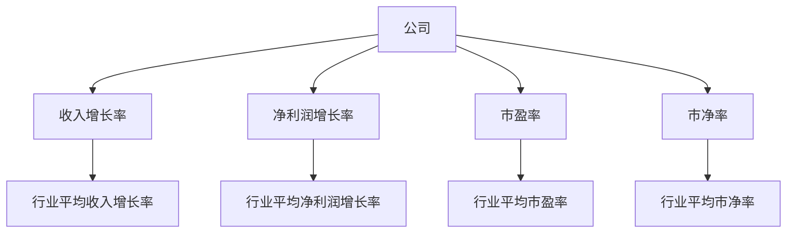
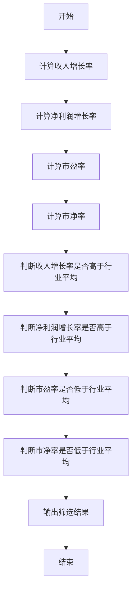
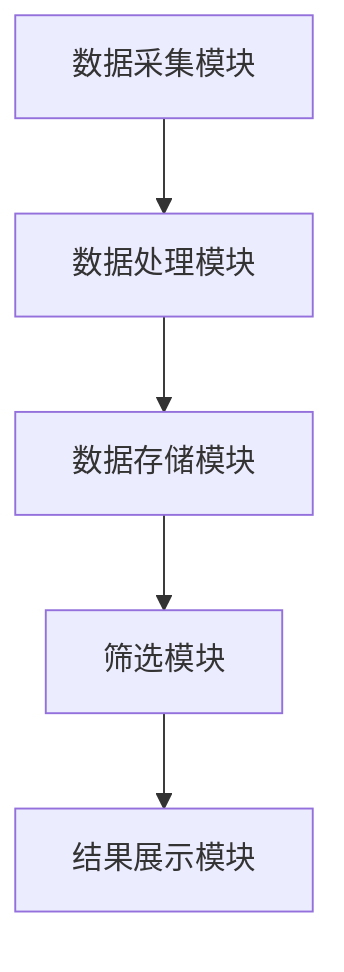

                 


# 彼得林奇的"高增长低估值"选股法

## 关键词：
彼得林奇，高增长，低估值，选股法，投资策略，价值投资，投资分析

## 摘要：
本文系统地介绍并分析了彼得林奇的"高增长低估值"选股法，从核心概念到算法原理，从系统设计到项目实战，全面解析了这一经典投资策略。文章深入探讨了高增长与低估值股票的定义、特征、关系，详细讲解了选股算法的数学模型和流程图，并通过实际案例展示了如何将这一策略应用于投资实战。文章最后给出了最佳实践建议，帮助读者更好地理解和应用这一选股方法。

---

## 第1章: 高增长低估值选股法的核心概念

### 1.1 高增长低估值选股法的定义
#### 1.1.1 高增长低估值选股法的背景
高增长低估值选股法是彼得林奇在其投资生涯中总结出的一种选股策略。这种方法的核心在于寻找那些收入增长速度快、但市场估值相对较低的公司。与传统价值投资不同，高增长低估值选股法更注重公司的成长潜力和市场对这种潜力的定价是否合理。

#### 1.1.2 高增长低估值选股法的核心要素
- **收入增长率**：衡量公司收入增长速度的核心指标。
- **市盈率（P/E）**：衡量股票估值的重要指标，用于判断股票是否被低估。
- **行业平均市盈率**：作为筛选低估值股票的基准。

#### 1.1.3 高增长低估值选股法与其他选股方法的区别
- **与价值投资的区别**：价值投资注重寻找被市场低估的股票，但不考虑公司的成长性；高增长低估值选股法则同时关注公司的成长性和估值的合理性。
- **与成长投资的区别**：成长投资只关注公司的成长潜力，但不考虑估值因素；高增长低估值选股法则要求在成长性和估值之间找到平衡。

### 1.2 彼得林奇的投资理念
#### 1.2.1 彼得林奇的选股思路
彼得林奇认为，投资股票的核心在于寻找那些能够持续增长的公司。他特别关注那些收入增长率远高于行业平均水平，但市盈率却低于行业平均水平的公司。

#### 1.2.2 彼得林奇对市场的看法
彼得林奇认为，市场短期是情绪化的，长期才是理性的。因此，投资者应该关注公司的基本面，而不是市场的短期波动。

#### 1.2.3 彼得林奇的投资策略
- **长期持有**：彼得林奇倾向于长期持有优质股票，而不是频繁交易。
- **分散投资**：他建议投资者将资金分散投资于多只股票，以降低风险。
- **注重基本面**：他强调对公司基本面的深入研究，包括财务报表、行业地位、竞争优势等。

---

## 第2章: 高增长低估值选股法的核心概念与联系

### 2.1 高增长与低估值的定义
#### 2.1.1 高增长的定义与特征
- **定义**：高增长是指公司在一定时期内收入或利润的增速远高于行业平均水平。
- **特征**：
  - 收入增长率 > 行业平均收入增长率
  - 净利润增长率 > 行业平均净利润增长率
  - 市场份额持续扩大

#### 2.1.2 低估值的定义与特征
- **定义**：低估值是指股票的市盈率（P/E）低于行业平均水平，表明市场对这只股票的定价较低。
- **特征**：
  - 市盈率 < 行业平均市盈率
  - 市净率 < 行业平均市净率
  - 股价与内在价值存在较大的折扣

#### 2.1.3 高增长与低估值的关系
高增长和低估值是两个看似矛盾但又相互关联的指标。高增长意味着公司具有较大的成长潜力，而低估值则表明市场尚未完全认识到这种潜力。因此，高增长低估值的股票往往具有较大的上涨空间。

### 2.2 高增长与低估值的对比分析
#### 2.2.1 高增长型股票与价值型股票的对比
| 指标 | 高增长型股票 | 价值型股票 |
|------|--------------|------------|
| 收入增长率 | 高于行业平均 | 低于行业平均 |
| 市盈率 | 低于行业平均 | 低于行业平均 |
| 市场预期 | 高 | 低 |
| 投资风险 | 高 | 中 |

#### 2.2.2 高增长与低估值的特征对比表格
| 指标 | 高增长 | 低估值 |
|------|--------|--------|
| 收入增长率 | 高 | - |
| 市盈率 | - | 低 |
| 净利润增长率 | 高 | - |
| 市净率 | - | 低 |

#### 2.2.3 高增长与低估值的ER实体关系图


---

## 第3章: 高增长低估值选股法的算法原理

### 3.1 高增长低估值选股法的算法流程
#### 3.1.1 算法输入：股票数据
- 收入增长率
- 净利润增长率
- 市盈率
- 市净率
- 行业平均收入增长率
- 行业平均净利润增长率
- 行业平均市盈率
- 行业平均市净率

#### 3.1.2 算法步骤：计算增长率与市盈率
1. 计算收入增长率：
   $$ \text{收入增长率} = \frac{\text{当前收入} - \text{上期收入}}{\text{上期收入}} \times 100\% $$
2. 计算净利润增长率：
   $$ \text{净利润增长率} = \frac{\text{当前净利润} - \text{上期净利润}}{\text{上期净利润}} \times 100\% $$
3. 计算市盈率：
   $$ \text{市盈率} = \frac{\text{股价}}{\text{每股净利润}} $$

#### 3.1.3 算法输出：筛选结果
1. 筛选条件：
   - 收入增长率 > 行业平均收入增长率
   - 净利润增长率 > 行业平均净利润增长率
   - 市盈率 < 行业平均市盈率
   - 市净率 < 行业平均市净率

### 3.2 高增长低估值选股法的数学模型
#### 3.2.1 收入增长率计算公式
$$ \text{收入增长率} = \frac{\text{当前收入} - \text{上期收入}}{\text{上期收入}} \times 100\% $$

#### 3.2.2 市盈率计算公式
$$ \text{市盈率} = \frac{\text{股价}}{\text{每股净利润}} $$

#### 3.2.3 筛选条件公式
$$ \text{收入增长率} > \text{行业平均收入增长率} $$
$$ \text{净利润增长率} > \text{行业平均净利润增长率} $$
$$ \text{市盈率} < \text{行业平均市盈率} $$
$$ \text{市净率} < \text{行业平均市净率} $$

### 3.3 高增长低估值选股法的流程图


---

## 第4章: 高增长低估值选股法的系统分析与架构设计

### 4.1 系统功能设计
- 数据采集模块：从数据库或网络获取股票数据。
- 数据处理模块：计算收入增长率、净利润增长率、市盈率、市净率。
- 筛选模块：根据筛选条件筛选出符合高增长低估值的股票。
- 结果展示模块：将筛选结果以图表或表格形式展示。

### 4.2 系统架构设计


---

## 第5章: 高增长低估值选股法的项目实战

### 5.1 环境安装
- Python 3.x
- Pandas、NumPy、Matplotlib
- 股票数据API（如Yahoo Finance）

### 5.2 核心代码实现
```python
import pandas as pd
import numpy as np

# 示例数据
data = {
    '公司': ['公司A', '公司B', '公司C'],
    '收入增长率': [0.3, 0.2, 0.15],
    '净利润增长率': [0.25, 0.18, 0.1],
    '市盈率': [15, 20, 12],
    '市净率': [2, 3, 1.5],
    '行业平均收入增长率': 0.18,
    '行业平均净利润增长率': 0.15,
    '行业平均市盈率': 18,
    '行业平均市净率': 2.5
}

df = pd.DataFrame(data)

# 筛选条件
筛选结果 = df[
    (df['收入增长率'] > df['行业平均收入增长率']) &
    (df['净利润增长率'] > df['行业平均净利润增长率']) &
    (df['市盈率'] < df['行业平均市盈率']) &
    (df['市净率'] < df['行业平均市净率'])
]

print(筛选结果)
```

---

## 第6章: 高增长低估值选股法的最佳实践

### 6.1 小结
彼得林奇的高增长低估值选股法是一种有效的投资策略，它通过筛选收入增长率高、估值低的股票，能够在市场中找到具有较大上涨潜力的投资标的。

### 6.2 注意事项
- **市场风险**：高增长股票通常具有较高的波动性，市场下跌时可能承受较大的损失。
- **数据质量**：选股法的准确性依赖于高质量的财务数据，数据误差可能影响筛选结果。
- **行业选择**：不同行业的平均增长率和估值水平不同，需要根据具体行业进行调整。

### 6.3 拓展阅读
- 《彼得林奇选股术》
- 《投资学》
- 《股票投资策略》

---

## 作者：AI天才研究院/AI Genius Institute & 禅与计算机程序设计艺术 /Zen And The Art of Computer Programming

