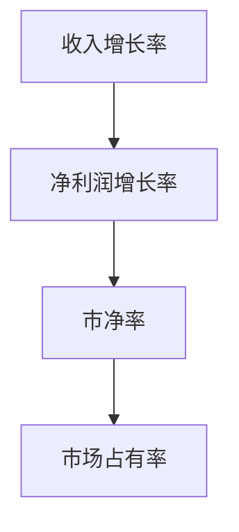
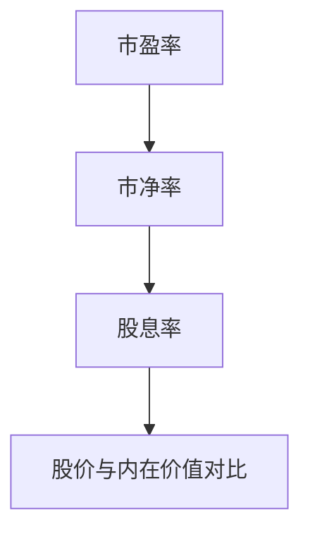
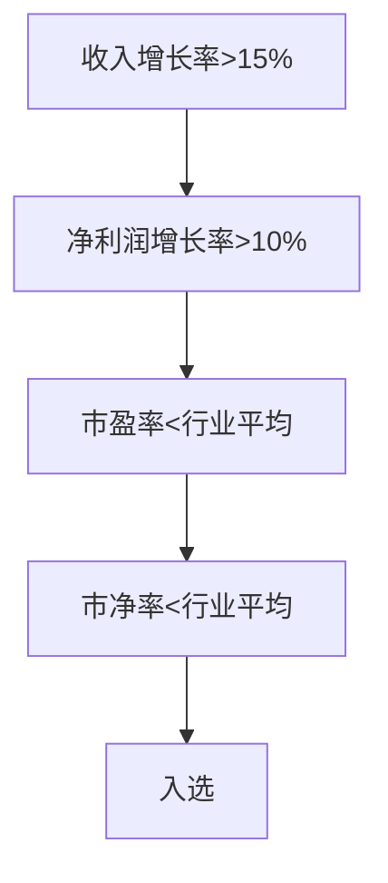
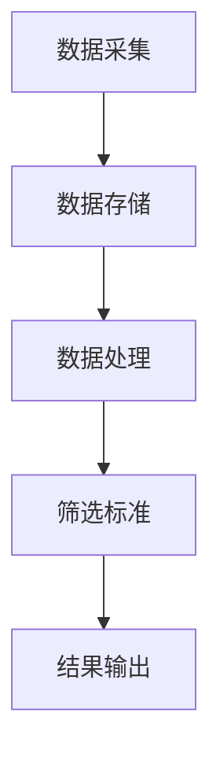

                 


# 彼得林奇的"高增长低估值"选股策略

## 关键词：彼得林奇，高增长，低估值，选股策略，投资，股票分析

## 摘要：  
彼得·林奇是全球著名的价值投资者，他的“高增长低估值”选股策略强调在高增长行业寻找估值被低估的公司。本文将详细介绍该策略的核心概念、实施步骤、数学模型、系统架构以及实战案例，帮助读者理解并掌握这一投资策略。

---

## 第一章：彼得林奇与高增长低估值选股策略

### 1.1 彼得林奇的生平与投资理念  
彼得·林奇是美国著名的投资专家，曾管理富达麦哲伦基金，创造了辉煌的投资业绩。他的投资理念强调基本面分析和长期投资，尤其关注具有高增长潜力但估值被低估的公司。

### 1.2 高增长低估值选股策略的定义  
该策略的核心在于寻找那些收入和利润快速增长，但市盈率（P/E）和市净率（P/B）等估值指标低于行业平均水平的公司。

### 1.3 该策略的有效性与适用性  
通过历史数据分析，高增长低估值策略在成长型股票投资中表现优异，尤其在新兴行业或周期性行业中表现突出。

---

## 第二章：高增长公司的识别与分析

### 2.1 高增长公司的定义与标准  
高增长公司通常具备收入增长率和净利润增长率显著高于行业平均水平的特点。

#### 表2-1：高增长公司的核心指标对比

| 指标         | 高增长公司标准 | 中速增长公司标准 | 低增长公司标准 |
|--------------|----------------|------------------|----------------|
| 收入增长率    | >20%           | 5%-20%           | <5%            |
| 净利润增长率  | >15%           | 5%-15%           | <5%            |
| 市场占有率    | 上升趋势       | 稳定或略有增长   | 下降趋势       |

### 2.2 高增长公司的财务指标分析  
#### 图2-1：高增长公司财务指标分析流程图  


---

## 第三章：低估值公司的识别与分析

### 3.1 低估值公司的定义与标准  
低估值公司通常具备市盈率（P/E）和市净率（P/B）低于行业平均水平的特点。

#### 图3-1：低估值公司估值指标分析流程图  


---

## 第四章：高增长低估值选股策略的实施步骤

### 4.1 确定投资目标与策略  
明确投资目标，选择适合的行业和公司。

### 4.2 数据收集与初步筛选  
通过数据收集工具获取目标公司的财务数据，初步筛选高增长和低估值的公司。

#### 表4-1：初步筛选标准  
| 指标         | 标准         |
|--------------|--------------|
| 收入增长率    | >15%         |
| 净利润增长率  | >10%         |
| 市盈率       | <行业平均值   |
| 市净率       | <行业平均值   |

---

## 第五章：选股策略的数学模型与算法

### 5.1 高增长低估值选股模型  
#### 图5-1：选股模型流程图  


### 5.2 数学公式  
#### 市盈率公式  
$$市盈率 = \frac{股票价格}{每股净利润}$$  

#### 市净率公式  
$$市净率 = \frac{股票价格}{每股净资产}$$  

---

## 第六章：系统分析与架构设计方案

### 6.1 项目介绍  
构建一个高增长低估值选股系统，帮助投资者快速筛选目标股票。

#### 图6-1：系统架构图  


---

## 第七章：项目实战

### 7.1 环境安装  
安装必要的数据处理工具和编程语言，如Python、Pandas等。

### 7.2 核心代码实现  
```python
import pandas as pd

# 假设df为公司数据
def high_growth_low_valuation_screening(df):
    # 收入增长率筛选
    df = df[df['收入增长率'] > 15]
    # 净利润增长率筛选
    df = df[df['净利润增长率'] > 10]
    # 市盈率筛选
    df = df[df['市盈率'] < df['行业平均市盈率']]
    # 市净率筛选
    df = df[df['市净率'] < df['行业平均市净率']]
    return df

# 示例数据
data = {
    '公司': ['A', 'B', 'C'],
    '收入增长率': [20, 5, 8],
    '净利润增长率': [12, 7, 6],
    '市盈率': [10, 15, 12],
    '行业平均市盈率': [12, 12, 12],
    '市净率': [1.5, 2, 1.8],
    '行业平均市净率': [2, 2, 2]
}
df = pd.DataFrame(data)
result = high_growth_low_valuation_screening(df)
print(result)
```

---

## 第八章：最佳实践与小结

### 8.1 最佳实践  
- 定期更新数据，避免遗漏新的投资机会。
- 结合行业趋势，选择具有持续增长潜力的行业。
- 分散投资，降低风险。

### 8.2 注意事项  
- 高增长公司可能伴随着高风险，需关注公司基本面。
- 低估值公司可能因行业周期影响，需谨慎评估。

### 8.3 拓展阅读  
- 彼得·林奇的《彼得林奇选股术》
- 其他投资策略书籍推荐

---

## 作者：AI天才研究院/AI Genius Institute & 禅与计算机程序设计艺术 /Zen And The Art of Computer Programming

