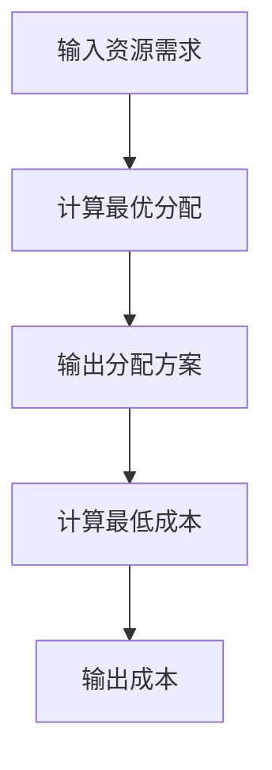
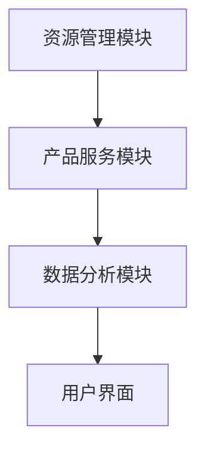

                 


# 循环经济商业模式的规模化挑战与机遇

> 关键词：循环经济，商业模式，可持续发展，资源优化，数字化转型

> 摘要：循环经济商业模式作为一种新型的经济模式，旨在通过资源的循环利用和产品服务化转型，实现经济与环境的双重效益。本文将从循环经济的定义、核心概念、算法原理、系统架构设计、项目实战等方面，全面分析循环经济商业模式的规模化挑战与机遇，探讨其在实际应用中的实现路径和未来发展方向。

---

## 第一部分：循环经济商业模式的背景与核心概念

### 第1章：循环经济商业模式的概述

#### 1.1 循环经济的定义与特征
循环经济是以资源高效利用和循环利用为核心，通过减少资源消耗和环境污染，实现经济与环境协调发展的经济模式。其核心特征包括：
- **闭环性**：资源在生产、消费和回收过程中形成闭环。
- **可持续性**：强调长期的资源利用效率和环境友好。
- **创新性**：通过技术创新和商业模式创新推动资源循环。

#### 1.2 循环经济商业模式的背景
随着全球资源枯竭和环境问题的加剧，传统线性经济模式已难以满足可持续发展的需求。循环经济模式作为一种替代方案，逐渐受到关注。其背景包括：
- **资源枯竭**：全球范围内自然资源的过度开发导致资源短缺。
- **环境问题**：工业化和城市化加剧了环境污染和生态破坏。
- **可持续发展需求**：企业和政府逐渐意识到绿色经济的重要性。

#### 1.3 循环经济商业模式的必要性
循环经济商业模式的实施是实现可持续发展的必要途径。其必要性体现在：
- **资源效率提升**：通过循环利用减少资源浪费。
- **企业社会责任**：企业需要承担环境保护的责任。
- **市场需求驱动**：消费者对绿色产品和服务的需求日益增长。

---

### 第2章：循环经济商业模式的核心要素

#### 2.1 循环经济商业模式的构成
循环经济商业模式的构成包括以下几个关键要素：
- **资源循环利用**：通过回收和再利用资源，减少对新资源的依赖。
- **产品生命周期管理**：从设计、生产、使用到回收的全生命周期管理。
- **服务化转型**：从销售产品转向提供服务，例如租赁、共享经济等。

#### 2.2 循环经济商业模式的参与者
循环经济模式涉及多方参与者：
- **企业**：作为主要的推动者，负责产品的设计、生产和回收。
- **消费者**：参与产品的使用和回收，形成闭环。
- **政府**：通过政策支持和监管推动循环经济的发展。

#### 2.3 循环经济商业模式的流程
循环经济商业模式的流程可以分为三个主要阶段：
1. **资源收集与分类**：对废弃物进行分类收集，为再利用做好准备。
2. **再生与再利用**：对收集的资源进行再生处理，生产新的产品或材料。
3. **产品服务化**：通过服务模式延长产品生命周期，减少浪费。

---

### 第3章：循环经济商业模式的挑战与机遇

#### 3.1 循环经济商业模式的挑战
循环经济模式在实际应用中面临诸多挑战：
- **技术瓶颈**：缺乏高效的资源再生技术和工艺。
- **成本问题**：循环利用的成本通常高于传统线性模式。
- **市场接受度**：消费者对循环经济产品和服务的接受度有限。

#### 3.2 循环经济商业模式的机遇
尽管存在挑战，循环经济模式也带来了巨大的机遇：
- **技术进步**：新型技术如人工智能和物联网为资源优化提供了可能。
- **政策支持**：政府通过补贴和税收优惠鼓励循环经济的发展。
- **市场需求增长**：消费者对环保产品的需求日益增加。

---

### 第4章：循环经济商业模式的数学模型与算法原理

#### 4.1 循环经济商业模式的数学模型
循环经济模式可以通过数学模型来优化资源分配和降低成本。例如，线性规划模型可以用于资源的最优分配。

**数学模型示例：**
目标函数：最大化收益
$$ \text{Maximize } Z = \sum_{i} p_i x_i - \sum_{j} c_j y_j $$
约束条件：
$$ \sum_{i} a_{ij} x_i = b_j \quad \forall j $$
$$ x_i \geq 0, y_j \geq 0 $$

其中：
- \( x_i \) 表示第i种资源的使用量
- \( y_j \) 表示第j种产品的生产量
- \( p_i \) 表示第i种资源的价格
- \( c_j \) 表示第j种产品的成本
- \( a_{ij} \) 表示第i种资源用于第j种产品的消耗系数
- \( b_j \) 表示第j种产品的资源需求量

#### 4.2 循环经济商业模式的算法原理
循环经济模式的算法原理包括资源优化配置和产品生命周期管理。例如，资源优化配置算法可以通过以下步骤实现：

1. **输入**：资源需求、资源可用量、资源价格。
2. **计算**：使用线性规划算法求解最优分配方案。
3. **输出**：资源分配方案和最低成本。

**算法流程图（Mermaid）：**


---

### 第5章：循环经济商业模式的系统架构设计

#### 5.1 循环经济商业模式的系统架构
循环经济模式的系统架构可以分为以下几个模块：
- **资源管理模块**：负责资源的收集、分类和再生。
- **产品服务模块**：提供产品租赁、共享等服务。
- **数据分析模块**：通过数据分析优化资源利用。

**系统架构图（Mermaid）：**


#### 5.2 循环经济商业模式的系统实现
系统实现需要考虑环境安装、功能实现和接口设计。例如，系统环境可能需要安装特定的软件和硬件，核心功能包括资源监控和再生处理。

**核心代码示例（Python）：**
```python
def resource_optimization(resource_demand, resource_available):
    # 简单的资源分配算法
    allocation = {}
    for resource in resource_demand:
        if resource in resource_available:
            allocation[resource] = min(resource_demand[resource], resource_available[resource])
        else:
            allocation[resource] = 0
    return allocation
```

---

### 第6章：循环经济商业模式的项目实战

#### 6.1 项目背景与目标
假设我们正在开发一个循环经济平台，目标是实现产品的全生命周期管理，包括设计、生产、使用和回收。

#### 6.2 项目实施过程
1. **需求分析**：明确平台的功能需求，如资源管理、产品服务等。
2. **系统设计**：设计系统架构和功能模块。
3. **系统实现**：编写代码并进行测试。
4. **优化与调整**：根据测试结果优化系统性能。

#### 6.3 项目成果与分析
通过项目实施，我们成功实现了资源的循环利用，降低了成本，并提高了资源利用效率。

---

## 第七章：循环经济商业模式的最佳实践与展望

### 7.1 最佳实践
- **技术创新**：持续投入研发，开发高效的资源再生技术。
- **政策支持**：争取政府的政策支持和资金补贴。
- **市场教育**：通过宣传和教育提高消费者对循环经济的认知和接受度。

### 7.2 未来展望
随着技术进步和政策支持，循环经济模式将在更多领域得到应用，成为未来经济的重要组成部分。

---

## 作者：AI天才研究院/AI Genius Institute & 禅与计算机程序设计艺术 /Zen And The Art of Computer Programming

