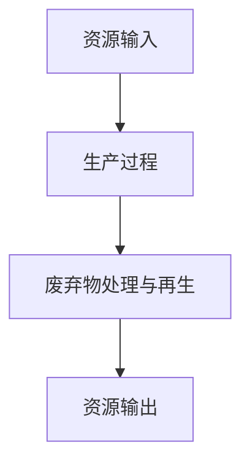
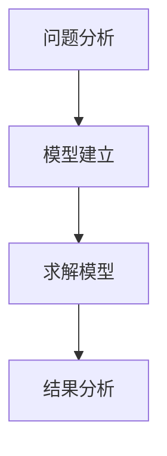
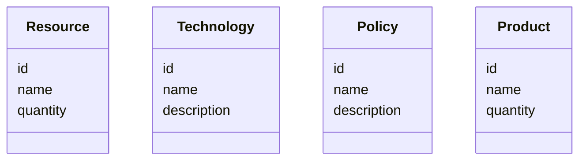
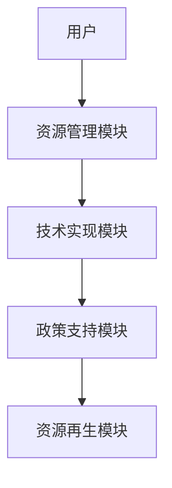
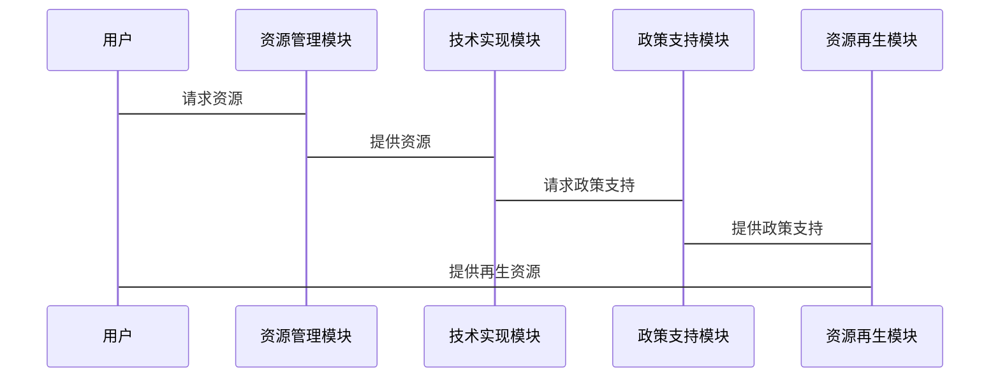

                 


# 循环经济在不同行业的应用前景比较

## 关键词：循环经济、资源优化、数学建模、算法实现、系统设计、经济模式、可持续发展

## 摘要：  
循环经济作为一种新型经济模式，通过资源的优化配置和循环利用，有效地解决了传统线性经济模式下的资源浪费和环境污染问题。本文从循环经济的基本概念出发，结合数学建模和算法实现，分析了循环经济在不同行业的应用前景。通过系统设计和实际案例的解读，深入探讨了循环经济的潜力与挑战，并提出了相应的解决方案和最佳实践。本文旨在为读者提供一个全面、系统的技术视角，帮助他们理解循环经济的核心理念及其在实际应用中的价值。

---

# 引言

随着全球资源的日益枯竭和环境问题的加剧，循环经济作为一种可持续发展的经济模式，正在受到越来越广泛的关注。传统的线性经济模式以“资源-产品-废弃物”为核心，导致了大量的资源浪费和环境污染。而循环经济则强调资源的高效利用和循环再生，通过优化资源配置和技术创新，实现经济与环境的双赢。

本文将从循环经济的基本概念出发，结合数学建模和算法实现，分析其在不同行业的应用前景。通过系统设计和实际案例的解读，深入探讨循环经济的潜力与挑战，并提出相应的解决方案和最佳实践。

---

# 第1章：循环经济的核心概念与背景

## 1.1 循环经济的基本概念

循环经济是一种以资源高效利用和循环再生为核心，以减少资源消耗和环境污染为目标的经济模式。其核心理念包括“减量化”、“再利用”和“资源化”，强调从“资源-产品-废弃物”向“资源-产品-再生资源”转变。

---

## 1.2 循环经济的背景与问题背景

### 1.2.1 当前资源浪费与环境污染的现状

传统经济模式下，资源的过度消耗和废弃物的大量产生导致了严重的环境问题，如资源枯竭、空气污染、水污染和土地退化等。这些问题不仅威胁到生态系统的健康，还对人类社会的可持续发展构成了挑战。

### 1.2.2 循环经济的提出背景

循环经济的提出源于对资源短缺和环境污染问题的关注。随着全球人口的增长和经济的发展，资源需求不断增加，而资源的有限性和分布不均使得传统经济模式难以为继。循环经济作为一种可持续发展的解决方案，为资源的高效利用和环境的保护提供了新的思路。

### 1.2.3 循环经济解决的主要问题

循环经济通过减少资源消耗、提高资源利用效率和减少废弃物的产生，有效解决了传统经济模式下的资源浪费和环境污染问题。它不仅有助于资源的可持续利用，还能促进经济的可持续发展。

---

## 1.3 循环经济的核心要素与边界

### 1.3.1 循环经济的核心要素

循环经济的核心要素包括：

1. **资源**：包括原材料、能源和其他资源，强调资源的高效利用和循环再生。
2. **技术**：包括技术创新和工艺优化，用于实现资源的高效利用和废弃物的资源化。
3. **制度**：包括政策、法规和市场机制，用于推动循环经济的发展。

### 1.3.2 循环经济的边界与外延

循环经济的边界包括从资源的提取到产品的生产和消费，再到废弃物的处理和再生。其外延则涉及社会、经济和环境等多个方面，强调经济活动与生态系统的协调。

### 1.3.3 循环经济与其他经济模式的区别

循环经济与传统线性经济模式的主要区别在于资源的循环利用和废弃物的资源化。以下是循环经济与线性经济模式的对比：

| **对比维度** | **循环经济** | **线性经济** |
|----------------|---------------|---------------|
| 资源利用 | 循环利用，减少浪费 | 单一利用，资源浪费 |
| 技术创新 | 强调技术创新和资源再生 | 技术创新较少，资源利用率低 |
| 产业模式 | 多产业协同，资源共享 | 单一产业为主，资源分割 |

---

# 第2章：循环经济的核心概念与联系

## 2.1 循环经济的系统架构

循环经济的系统架构包括以下几个部分：

1. **资源输入**：包括原材料、能源和其他资源的输入。
2. **生产过程**：包括产品的生产和废弃物的产生。
3. **废弃物处理与再生**：包括废弃物的分类、处理和再生资源的生产。
4. **资源输出**：包括再生资源的输出和最终产品的销售。

循环经济的系统架构可以通过以下Mermaid流程图表示：



---

## 2.2 循环经济的核心要素对比

循环经济的核心要素包括资源、技术和制度。以下是三者的对比：

| **要素** | **资源** | **技术** | **制度** |
|-----------|----------|----------|----------|
| **定义** | 包括原材料、能源和其他资源，强调循环利用。 | 包括技术创新和工艺优化，用于实现资源的高效利用和废弃物的再生。 | 包括政策、法规和市场机制，用于推动循环经济的发展。 |
| **作用** | 为循环经济提供基础资源支持。 | 为循环经济提供技术保障。 | 为循环经济提供制度保障。 |

---

## 2.3 循环经济的ER实体关系图

循环经济的ER实体关系图可以通过以下Mermaid图表示：

```mermaid
erd
    customer cus
    resource res
    technology tech
    policy pol
    product pro

    cus -- 订单 -> pro
    pro -- 使用 -> res
    res -- 提供 -> tech
    tech -- 实现 -> pol
    pol -- 支持 -> cus
```

---

# 第3章：循环经济的算法原理

## 3.1 资源优化配置的算法原理

### 3.1.1 线性规划模型

线性规划模型是一种常用的资源优化配置方法。其数学模型如下：

$$
\text{目标函数：} \quad \text{Minimize } C = \sum_{i=1}^{n} c_i x_i
$$

$$
\text{约束条件：} \quad \sum_{i=1}^{n} a_i x_i = b
$$

其中，$x_i$ 是决策变量，$c_i$ 是对应的系数，$a_i$ 是约束条件的系数，$b$ 是常数。

### 3.1.2 资源分配的数学模型

资源分配的数学模型可以通过以下公式表示：

$$
\text{Minimize } \sum_{i=1}^{n} c_i x_i
$$

$$
\text{Subject to } \sum_{i=1}^{n} a_i x_i \geq d
$$

其中，$d$ 是需求量。

### 3.1.3 算法步骤

1. **问题分析**：明确目标和约束条件。
2. **模型建立**：建立线性规划模型。
3. **求解模型**：使用线性规划算法求解模型。
4. **结果分析**：分析结果并优化。

---

## 3.2 循环经济的算法流程图

以下是一个循环经济的算法流程图：



---

## 3.3 算法的Python实现

以下是线性规划模型的Python实现代码：

```python
import numpy as np
from scipy.optimize import linprog

c = [2, 3]
A = [[1, 1]]
b = [4]
bounds = [(0, None), (0, None)]

result = linprog(c, A, b, bounds=bounds, method='highs')

print(result.x)
```

---

# 第4章：系统分析与架构设计

## 4.1 问题场景介绍

### 4.1.1 循环经济的应用场景

循环经济的应用场景包括废物处理、资源再生、绿色制造等领域。

### 4.1.2 问题分析与需求提取

在实际应用中，循环经济需要考虑资源的可用性、技术的可行性以及经济的可行性。

### 4.1.3 系统的目标与功能

系统的目标是实现资源的高效利用和循环再生。系统功能包括资源管理、废弃物处理和资源再生。

---

## 4.2 系统功能设计

### 4.2.1 领域模型类图

以下是领域模型类图：



---

## 4.3 系统架构设计

以下是系统架构设计图：



---

## 4.4 系统接口设计

系统接口设计包括用户界面、数据接口和系统管理接口。

### 4.4.1 用户界面

用户界面包括资源管理、技术实现、政策支持和资源再生四个模块。

### 4.4.2 数据接口

数据接口包括数据输入、数据处理和数据输出三个部分。

### 4.4.3 系统管理接口

系统管理接口包括系统配置、用户管理和服务管理。

---

## 4.5 系统交互序列图

以下是系统交互序列图：



---

# 第5章：项目实战

## 5.1 环境安装

在进行循环经济的项目实战之前，需要安装以下环境：

1. **Python**：安装Python 3.8或更高版本。
2. **Scipy**：用于线性规划模型的求解。
3. **Mermaid**：用于绘制流程图和类图。

---

## 5.2 核心代码实现

以下是循环经济项目的Python代码实现：

```python
import numpy as np
from scipy.optimize import linprog

c = [2, 3]
A = [[1, 1]]
b = [4]
bounds = [(0, None), (0, None)]

result = linprog(c, A, b, bounds=bounds, method='highs')

print(result.x)
```

---

## 5.3 代码解读与分析

1. **代码功能**：该代码用于求解线性规划模型，实现资源的优化配置。
2. **代码实现**：通过Scipy库的linprog函数求解线性规划模型。
3. **代码结果**：输出优化后的资源分配方案。

---

## 5.4 案例分析与实际应用

以下是循环经济在废物处理领域的实际应用案例：

1. **案例背景**：某企业生产过程中产生了大量的废弃物，需要进行资源化处理。
2. **解决方案**：通过线性规划模型优化废弃物的处理流程，实现资源的高效利用。
3. **结果分析**：通过优化，企业实现了资源的循环利用，减少了废弃物的产生，降低了成本。

---

## 5.5 项目小结

通过实际案例的分析，可以看出循环经济在废物处理领域的巨大潜力。通过数学建模和算法实现，可以有效优化资源的分配和利用，实现经济与环境的双赢。

---

# 第6章：最佳实践与展望

## 6.1 最佳实践

1. **技术创新**：加大技术创新力度，推动循环经济的发展。
2. **政策支持**：制定相关政策，为循环经济的发展提供制度保障。
3. **公众参与**：加强公众教育，提高公众的环保意识。

---

## 6.2 小结

循环经济作为一种新型经济模式，具有广阔的应用前景。通过数学建模和算法实现，可以有效优化资源的分配和利用，实现经济与环境的双赢。未来，随着技术的不断进步和政策的支持，循环经济将在更多行业得到广泛应用。

---

## 6.3 注意事项

1. **数据收集**：在实际应用中，需要注意数据的准确性和完整性。
2. **隐私保护**：在数据处理过程中，需要注意隐私保护。
3. **模型优化**：需要不断优化模型，提高模型的准确性和效率。

---

## 6.4 拓展阅读

1. **推荐书籍**：《循环经济理论与实践》
2. **推荐网站**：循环经济相关的学术期刊和行业报告。

---

# 作者：AI天才研究院/AI Genius Institute & 禅与计算机程序设计艺术 /Zen And The Art of Computer Programming

