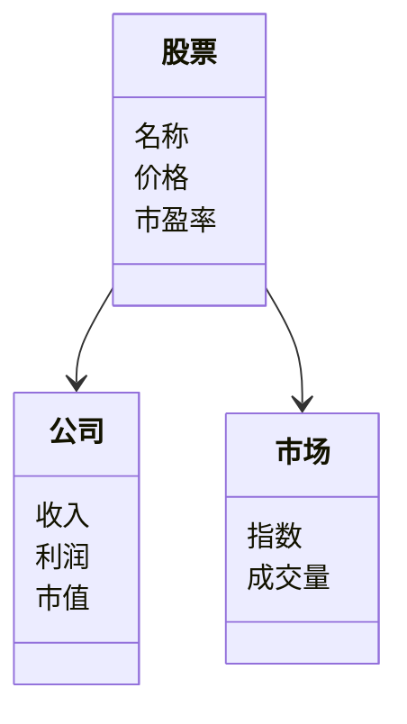
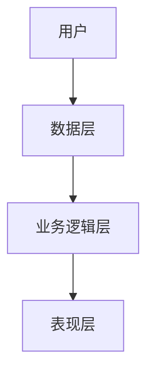

                 


# 德国股市估值: 欧洲经济引擎的投资前景

---

## 关键词：
德国股市、股市估值、欧洲经济、DCF模型、投资前景、宏观经济、企业基本面

---

## 摘要：
本文深入探讨了德国股市的估值方法及其在欧洲经济中的重要性。通过分析宏观经济指标、行业动态和企业基本面，结合DCF模型等估值工具，评估德国股市的投资潜力。文章还提供了系统架构设计和实战案例，帮助投资者理解德国股市的复杂性和投资机会。

---

## 目录大纲

### 第1章: 德国股市估值概述

#### 1.1 德国股市的背景与重要性
- 1.1.1 德国股市的定义与特点
  - 德国股市的定义
  - 德国股市的独特优势
- 1.1.2 德国股市在欧洲经济中的地位
  - 德国作为欧洲经济引擎的角色
  - 德国股市对欧洲经济的影响
- 1.1.3 德国股市的投资价值与风险
  - 投资价值分析
  - 风险因素探讨

#### 1.2 股市估值的基本概念
- 1.2.1 什么是股市估值
  - 股市估值的定义
  - 估值的目的是什么？
- 1.2.2 股市估值的核心要素
  - 市盈率（P/E Ratio）
  - 市净率（P/B Ratio）
  - 股息率（Dividend Yield）
- 1.2.3 股市估值与投资决策的关系
  - 如何利用估值进行投资决策
  - 常见的投资策略

### 第2章: 德国股市估值的核心概念与联系

#### 2.1 核心概念原理
- 2.1.1 股市估值的数学模型
  - 常用的估值模型概述
  - 数学模型的基本原理
- 2.1.2 股市估值的关键指标
  - 市盈率（P/E Ratio）
  - 市净率（P/B Ratio）
  - 股息率（Dividend Yield）
  - 剩余收益（Residual Income）
- 2.1.3 股市估值与企业基本面的关系
  - 企业基本面分析的重要性
  - 估值与企业基本面的相互作用

#### 2.2 核心概念属性特征对比表
- 表2.1: 股市估值与企业基本面的对比
  - 列出主要指标的定义、用途和局限性

#### 2.3 ER实体关系图


### 第3章: 德国股市估值的算法原理

#### 3.1 算法原理概述
- 3.1.1 股市估值的基本原理
  - 估值的基本逻辑
  - 市场参与者的心理与行为
- 3.1.2 常用估值方法的比较
  - 相对估值法（Relative Valuation）
  - 绝对估值法（Absolute Valuation）

#### 3.2 DCF模型的数学模型
- 3.2.1 DCF模型的基本公式
  - 公式解释：
    $$ V = \frac{CF_1}{(1 + r)^1} + \frac{CF_2}{(1 + r)^2} + \cdots + \frac{CF_n}{(1 + r)^n} $$
  - 其中，CF为现金流，r为折现率
- 3.2.2 DCF模型的实现步骤
  - 确定现金流
  - 选择合适的折现率
  - 计算现值
  - 调整模型参数

#### 3.3 代码实现
- 3.3.1 Python代码实现DCF模型
```python
def dcf_valuation(cash_flows, discount_rate, years):
    present_value = 0
    for i in range(years):
        cf = cash_flows[i]
        present_value += cf / (1 + discount_rate) ** (i + 1)
    return present_value

# 示例
cash_flows = [100, 150, 200, 250]
discount_rate = 0.08
years = 4
print(dcf_valuation(cash_flows, discount_rate, years))
```

### 第4章: 德国股市估值的系统分析与架构设计

#### 4.1 问题场景介绍
- 4.1.1 德国股市估值的典型问题
  - 数据获取困难
  - 模型选择复杂
  - 风险评估不足
- 4.1.2 系统目标与范围
  - 系统目标：提供高效、准确的估值工具
  - 系统范围：涵盖数据收集、模型计算、结果分析

#### 4.2 系统功能设计
- 4.2.1 领域模型


- 4.2.2 系统架构设计


#### 4.3 系统接口设计
- 4.3.1 数据接口
  - 数据来源：交易所、财经网站
  - 数据格式：JSON、CSV
- 4.3.2 用户接口
  - 输入：股票代码、时间范围
  - 输出：估值结果、图表

### 第5章: 德国股市估值的项目实战

#### 5.1 环境安装
- 5.1.1 安装Python
  - 安装步骤：下载、安装、配置环境变量
- 5.1.2 安装必要的库
  - 使用pip安装numpy、pandas、matplotlib等库

#### 5.2 系统核心实现
- 5.2.1 数据收集
  - 从Yahoo Finance获取历史数据
  - 数据清洗与预处理
- 5.2.2 模型实现
  - 使用DCF模型进行估值
  - 比较不同模型的结果

#### 5.3 案例分析
- 5.3.1 实际案例
  - 选择一家德国公司进行分析
  - 计算其DCF估值
  - 对比市场价与估值
- 5.3.2 分析结果
  - 估值结果的意义
  - 投资决策建议

### 第6章: 总结与展望

#### 6.1 最佳实践 tips
- 选择合适的估值模型
- 结合宏观经济分析
- 定期更新数据和模型

#### 6.2 小结
- 本文的主要内容总结
- 德国股市估值的重要性

#### 6.3 注意事项
- 数据的准确性和及时性
- 模型的局限性
- 风险管理的重要性

#### 6.4 拓展阅读
- 推荐相关书籍和资源
- 提供进一步学习的方向

---

## 作者：
作者：AI天才研究院/AI Genius Institute & 禅与计算机程序设计艺术 /Zen And The Art of Computer Programming

