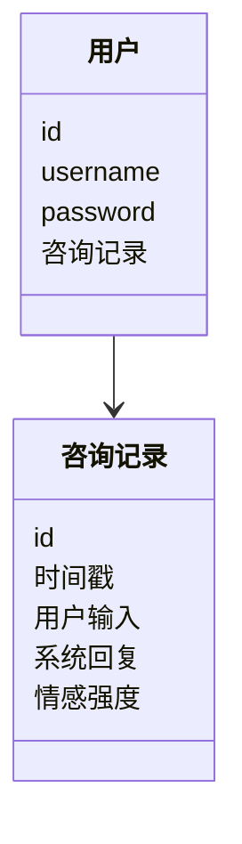

                 


# 心理咨询 AI Agent：LLM 在心理健康领域的应用

## 关键词：
- 心理咨询，人工智能，LLM，心理健康，AI代理，系统架构

## 摘要：
本文探讨了LLM在心理健康咨询中的应用，分析了其工作原理、系统架构和实际案例，展示了如何利用AI技术提升心理健康服务的可及性和效率。

---

## 第1章：心理健康问题的现状与挑战

### 1.1 心理健康问题的现状

心理健康问题在当今社会日益突出，抑郁症、焦虑症等精神疾病发病率逐年上升。传统心理咨询面临资源有限、覆盖不足的问题，特别是在欠发达地区，专业心理医生短缺，导致许多患者无法及时获得帮助。

此外，传统心理咨询依赖于医生的经验，存在主观性和个体差异，难以大规模标准化。这些挑战凸显了开发AI心理咨询代理的必要性，以提高心理健康服务的可及性和效率。

### 1.2 AI技术在心理健康领域的潜力

AI技术的发展为心理健康服务带来了新的可能性。LLM（大语言模型）能够通过自然语言处理技术，理解用户的语言表达，识别情绪和心理状态，提供个性化的建议和支持。与传统心理咨询相比，AI代理具有以下优势：

- **24/7可用性**：AI代理可以全天候提供服务，随时响应用户需求。
- **可扩展性**：AI系统可以在短时间内处理大量用户的咨询请求，缓解资源不足的问题。
- **隐私保护**：用户可以通过匿名方式与AI代理互动，减少心理负担。

### 1.3 问题背景与目标

本章分析了心理健康问题的现状及其对AI代理的需求。通过对比传统心理咨询和AI代理的优缺点，明确了AI代理在心理健康领域的应用目标：提高服务可及性，降低咨询成本，提供及时有效的心理支持。

---

## 第2章：AI心理咨询代理的核心概念

### 2.1 AI心理咨询代理的定义与特点

AI心理咨询代理是一种基于AI技术的心理健康服务系统，通过自然语言处理和机器学习算法，模拟人类心理咨询师的对话模式，为用户提供情感支持和心理建议。

其特点包括：
- **智能化**：通过LLM理解和回应用户的问题。
- **个性化**：根据用户的行为和语言特征，提供个性化的建议。
- **实时性**：快速响应用户的需求。

### 2.2 LLM在心理健康咨询中的应用原理

LLM的心理咨询代理通过以下步骤工作：
1. **用户输入**：用户输入文本，描述自己的情绪或问题。
2. **文本分析**：模型分析文本内容，识别情感倾向和关键词。
3. **生成回复**：基于分析结果，生成合适的回复，提供心理支持。

#### 核心模块的功能与交互

- **自然语言处理模块**：负责解析用户的输入，提取关键信息。
- **情感分析模块**：识别用户情绪，判断情感强度。
- **知识库**：存储心理健康相关知识和应对策略。
- **生成模块**：根据分析结果，生成自然流畅的回复。

### 2.3 核心概念与联系

通过ER实体关系图，展示了AI心理咨询代理的核心要素及其相互关系：

```mermaid
er
 entity(User) {
   id
   name
  咨询记录
 }
 entity(咨询记录) {
   id
   时间戳
   用户输入
   系统回复
 }
```

---

## 第3章：LLM算法原理与实现

### 3.1 LLM的基本原理

LLM基于深度学习，通过大量数据训练，学习语言的模式和结构，生成与输入文本相关的输出。

#### 3.1.1 模型结构

常用的模型结构包括Transformer和BERT。以BERT为例，其架构包括编码器层，用于处理输入文本，生成词嵌入。

数学模型如下：

$$
\text{BERT}(x) = \text{LayerNorm}(x + \text{MultiHeadAttention}(x))
$$

其中，$x$表示输入向量，$\text{MultiHeadAttention}$表示多头注意力机制，用于捕捉上下文信息。

#### 3.1.2 训练过程

训练过程包括两个阶段：预训练和微调。

1. **预训练**：在大规模通用文本数据上训练模型，目标是最小化预测错误。
2. **微调**：在心理健康相关数据上进行微调，适应特定领域的需求。

---

## 第4章：系统分析与架构设计

### 4.1 系统功能设计

系统功能包括：
- 用户注册与登录
- 心理咨询对话
- 情绪记录与分析
- 数据统计与报告

#### 领域模型类图



### 4.2 系统架构设计

系统架构采用分层设计：
- **前端**：用户界面，展示咨询对话和结果。
- **后端**：处理用户请求，调用LLM模型生成回复。
- **数据库**：存储用户信息和咨询记录。

架构图如下：


### 4.3 接口设计

系统提供以下接口：
- `/api/login`：用户登录
- `/api/chat`：发起咨询对话
- `/api/analytics`：获取数据统计

交互流程如下：

```mermaid
sequence
    用户 -> 前端: 提交咨询请求
    前端 -> 后端: 调用LLM生成回复
    后端 -> 数据库: 存储咨询记录
    后端 -> 前端: 返回回复
    用户 <- 前端: 显示回复
```

---

## 第5章：项目实战

### 5.1 环境安装

项目基于Python，需要安装以下库：
- `transformers`：用于加载LLM模型
- `flask`：用于构建Web应用
- ` pymongo`：用于数据库连接

### 5.2 核心代码实现

以下是心理咨询系统的实现代码：

```python
from transformers import pipeline
from flask import Flask, request, jsonify
import json
import pymongo

# 初始化模型
chatbot = pipeline("text-generation", model="gpt2")

# Flask应用
app = Flask(__name__)

@app.route("/api/chat", methods=["POST"])
def chat():
    data = json.loads(request.data)
    user_input = data["message"]
    response = chatbot(user_input, max_length=100, num_return_sequences=1)
    return jsonify({"response": response[0]['generated_text']})

if __name__ == "__main__":
    app.run(debug=True)
```

### 5.3 功能解读与案例分析

代码实现了一个简单的心理咨询系统，用户可以通过API发送请求，系统基于GPT-2模型生成回复。实际应用中，可以替换为更专业的心理健康模型，并增加数据存储和分析功能。

### 5.4 项目总结

本项目展示了如何利用AI技术构建心理咨询系统，尽管是一个基础实现，但为未来的研究和应用提供了参考。

---

## 第6章：最佳实践与总结

### 6.1 最佳实践

- 数据隐私保护：确保用户数据的安全性，遵循相关法律法规。
- 模型优化：持续优化LLM模型，提高识别准确率和回复质量。
- 用户反馈：收集用户反馈，不断改进系统功能。

### 6.2 未来展望

随着AI技术的发展，心理咨询AI代理将更加智能化，可能的功能包括：
- **情绪识别**：通过语音或表情识别用户情绪。
- **个性化建议**：根据用户历史记录提供更精准的建议。
- **多语言支持**：服务于更多国家和地区的用户。

### 6.3 注意事项

- 在实际应用中，应避免过度依赖AI，必要时仍需专业心理咨询师的介入。
- 确保系统的伦理合规，避免误诊或误导用户。

---

## 作者：AI天才研究院 & 禅与计算机程序设计艺术

---

这篇文章系统地探讨了LLM在心理健康咨询中的应用，从背景分析到算法实现，再到系统设计和项目实战，全面展示了如何利用AI技术提升心理健康服务的效率和可及性。希望对读者在AI与心理健康领域的研究和实践有所帮助。

