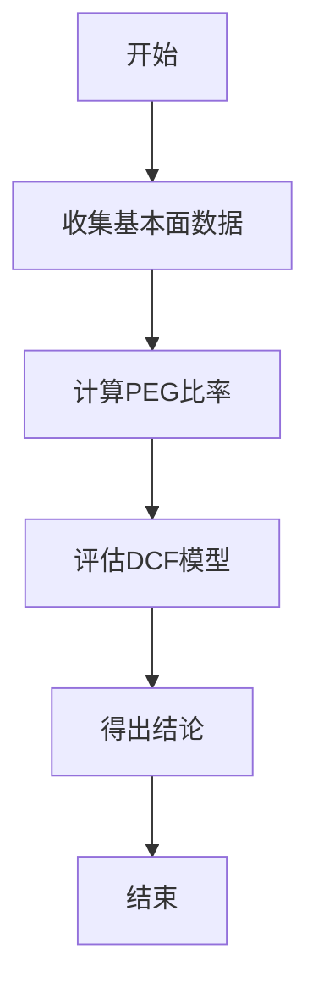
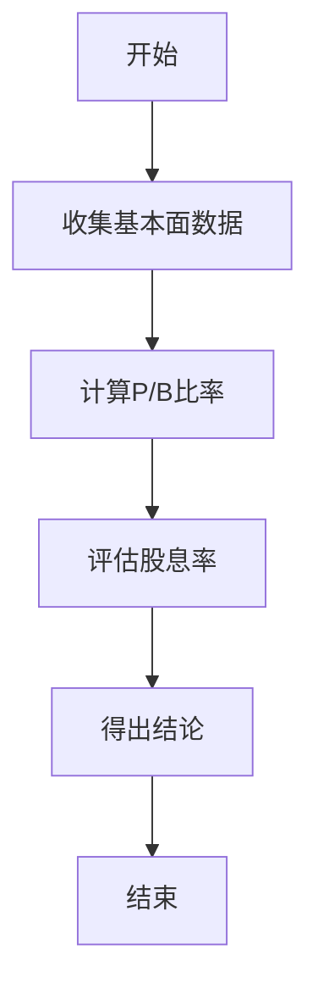

                 

# 成长股 vs 价值股：在当前市场环境中如何选择

> 关键词：成长股，价值股，投资策略，市场环境，风险管理

> 摘要：本文深入探讨了成长股和价值股的核心概念、评估方法、投资策略以及风险管理，结合当前市场环境，为投资者提供科学的投资决策参考。

---

## 第一部分：成长股与价值股的背景介绍

### 第1章：成长股与价值股的定义与区别

#### 1.1 成长股的定义与特点
- **定义**：成长股是指那些预期收入和利润增长迅速的公司股票，通常属于新兴产业或朝阳行业。
- **特点**：
  - 高增长潜力
  - 高市盈率（P/E Ratio）
  - 可能短期内波动较大
- **核心要素**：
  - 收入增长率（Revenue Growth Rate）
  - 净利润增长率（Net Profit Growth Rate）
  - 资产轻量化（Low Asset Intensity）

#### 1.2 价值股的定义与特点
- **定义**：价值股是指市场价格低于其内在价值，通常被市场低估的公司股票。
- **特点**：
  - 低市盈率（Low P/E Ratio）
  - 高股息率（High Dividend Yield）
  - 资产重（High Asset Intensity）
- **核心要素**：
  - 市净率（P/B Ratio）
  - 股息率（Dividend Yield）
  - 资产负债率（Debt-to-Asset Ratio）

#### 1.3 成长股与价值股的联系与区别
- **联系**：
  - 两者都追求超额收益
  - 两者都需要基本面分析
  - 两者都受市场情绪影响
- **区别**：
  - **目标**：成长股追求长期增长，价值股追求短期低估。
  - **风险**：成长股风险较高，价值股相对稳定。
  - **估值方法**：成长股注重未来现金流折现，价值股注重当前资产价值。

#### 1.4 成长股与价值股的投资意义
- **成长股**：适合长期投资者，能够分享高增长企业的收益。
- **价值股**：适合风险偏好较低的投资者，能够在市场波动中获得稳定收益。

---

## 第二部分：当前市场环境对成长股与价值股的影响

### 第2章：宏观经济环境对成长股与价值股的影响
- **宏观经济指标**：
  - 利率水平
  - 汇率波动
  - 通货膨胀率
- **市场周期**：
  - 牛市：成长股表现优于价值股
  - 熊市：价值股表现优于成长股

### 第3章：行业趋势与市场情绪对成长股与价值股的影响
- **行业趋势**：
  - 新兴行业（如科技、新能源）适合成长股投资
  - 成熟行业（如公用事业、金融）适合价值股投资
- **市场情绪**：
  - 热情高涨时，成长股被高估
  - 焦虑时，价值股更受青睐

---

## 第三部分：成长股与价值股的评估方法

### 第4章：成长股的评估方法

#### 4.1 成长股的核心评估指标
- **市盈率相对盈利增长比率（PEG Ratio）**：
  - 公式：PEG = P/E Ratio ÷ Earnings Growth Rate
  - 解释：PEG < 1 时，股票可能被低估
- **未来现金流折现模型（DCF Model）**：
  - 公式：股票价值 = ∑(CF_t / (1 + r)^t)
  - 解释：用于评估高增长公司的内在价值

#### 4.2 成长股的评估流程

### 第5章：价值股的评估方法

#### 5.1 价值股的核心评估指标
- **市净率（P/B Ratio）**：
  - 公式：P/B = Market Price ÷ Book Value
  - 解释：P/B < 1 时，股票可能被低估
- **股息率（Dividend Yield）**：
  - 公式：股息率 = Dividend ÷ Stock Price
  - 解释：股息率高意味着潜在收益稳定

#### 5.2 价值股的评估流程

---

## 第四部分：成长股与价值股的投资策略

### 第6章：成长股与价值股的投资策略

#### 6.1 不同市场环境下的投资策略
- **牛市**：
  - 优先选择成长股，因其高增长潜力
- **熊市**：
  - 优先选择价值股，因其抗跌性

#### 6.2 风险偏好与投资目标
- **高风险偏好**：适合投资成长股
- **低风险偏好**：适合投资价值股

---

## 第五部分：成长股与价值股的风险管理

### 第7章：成长股与价值股的风险管理

#### 7.1 投资组合的分散化
- **成长股**：建议配置在投资组合中占比不超过30%
- **价值股**：建议配置在投资组合中占比不超过50%

#### 7.2 风险对冲工具
- **止损机制**：
  - 成长股：设置10%的止损位
  - 价值股：设置5%的止损位

---

## 第六部分：成长股与价值股的案例分析

### 第8章：案例分析

#### 8.1 成长股案例：科技行业的投资机会
- 公司：某科技公司
- 数据：
  - 收入增长率：30%
  - PEG比率：0.8
- 结论：适合成长股投资

#### 8.2 价值股案例：公用事业行业的投资机会
- 公司：某公用事业公司
- 数据：
  - P/B比率：0.9
  - 股息率：5%
- 结论：适合价值股投资

---

## 第七部分：总结与展望

### 第9章：总结与展望

#### 9.1 总结
- 成长股适合长期投资者，价值股适合风险偏好较低的投资者
- 不同市场环境下，投资策略需灵活调整

#### 9.2 展望
- 随着科技和金融的进步，投资分析将更加精准
- AI技术在投资决策中的应用将更加广泛

---

作者：AI天才研究院 & 禅与计算机程序设计艺术

