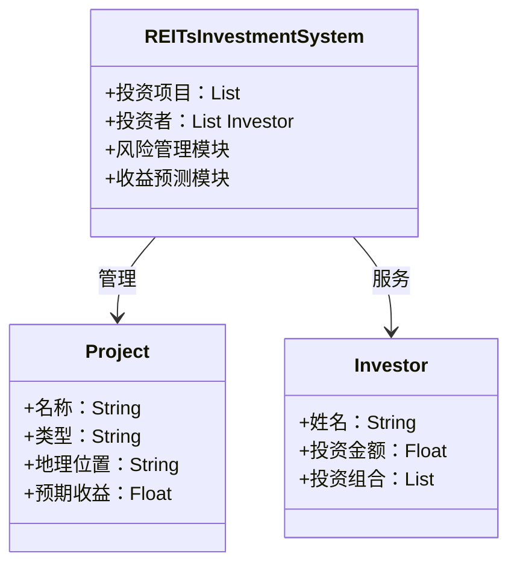

                 


# 房地产投资信托（REITs）：多元化投资组合的选择

**关键词**：房地产投资信托（REITs）、投资组合、房地产金融、风险管理、收益分析

**摘要**：本文深入探讨了房地产投资信托（REITs）作为多元化投资组合的重要组成部分，分析了其核心概念、数学模型、系统架构及实际应用。通过理论与实践相结合的方式，详细阐述了REITs的运作机制、收益预测方法、系统设计和项目实战，为投资者提供了全面的指导和参考。

---

## 第一章：房地产投资信托（REITs）的背景与概念

### 1.1 房地产投资信托（REITs）的定义与特点
- **1.1.1 REITs的基本定义**  
  房地产投资信托（Real Estate Investment Trusts，REITs）是一种通过汇集资金投资于房地产资产的金融工具，允许投资者通过购买信托份额间接持有房地产资产。

- **1.1.2 REITs的核心特点**  
  - 分散化投资：降低单一房地产项目的风险。  
  - 专业管理：由专业团队负责资产管理和运营。  
  - 流动性较高：投资者可以通过二级市场买卖REITs份额。  

- **1.1.3 REITs的运作机制**  
  REITs通过汇集资金购买、管理和出租房地产资产，定期向投资者分配收益。

### 1.2 REITs的历史与发展
- **1.2.1 REITs的起源与演变**  
  REITs起源于20世纪60年代的美国，经过多年发展，已成为全球重要的房地产投资工具。

- **1.2.2 REITs在全球范围内的发展现状**  
  全球范围内，REITs市场不断壮大，涵盖住宅、商业、工业等多种房地产类型。

- **1.2.3 REITs在中国市场的发展历程**  
  中国REITs市场起步较晚，但随着政策支持和市场需求增长，近年来发展迅速。

### 1.3 REITs的分类与结构
- **1.3.1 按资产类型分类**  
  - 商业房地产：零售、办公、酒店等。  
  - 住宅房地产：公寓、别墅等。  
  - 工业房地产：物流、仓储等。

- **1.3.2 按地域范围分类**  
  - 国内REITs：投资于特定国家或地区的房地产资产。  
  - 全球REITs：跨国投资，分散区域风险。

- **1.3.3 按运作方式分类**  
  - 股权型REITs：直接持有房地产资产。  
  - 抵押型REITs：通过发放抵押贷款获取收益。  
  - 混合型REITs：结合股权和抵押贷款两种模式。

---

## 第二章：REITs的核心概念与运作机制

### 2.1 REITs的收益来源
- **2.1.1 租金收入**  
  REITs通过出租房地产资产获得稳定的租金收入。

- **2.1.2 资产增值收益**  
  房地产资产升值带来的资本增值收益。

- **2.1.3 其他收入来源**  
  包括利息收入、管理费收入等。

### 2.2 REITs的运作流程
- **2.2.1 资产收购与管理**  
  REITs通过专业团队筛选和收购优质房地产资产，并进行日常运营管理。

- **2.2.2 资金募集与分配**  
  REITs通过发行基金份额筹集资金，定期向投资者分配收益。

- **2.2.3 投资组合管理**  
  REITs通过多元化投资降低风险，优化收益。

### 2.3 REITs的风险与收益分析
- **2.3.1 REITs的主要风险**  
  - 市场风险：房地产市场价格波动。  
  - 利率风险：利率上升可能导致REITs估值下降。  
  - 经营风险：物业运营和管理中的不确定性。

- **2.3.2 REITs的收益特征**  
  REITs通常提供稳定的现金流和较高的回报率，适合长期投资者。

- **2.3.3 REITs与其他投资工具的对比**  
  - 与股票：收益波动性较大，但分红比例较高。  
  - 与债券：收益相对稳定，但风险较低。  
  - 与房地产直接投资：门槛高，流动性差。

---

## 第三章：REITs的数学模型与收益预测

### 3.1 REITs收益模型的建立
- **3.1.1 收益模型的构建逻辑**  
  REITs收益模型需要考虑租金收入、资产增值、运营成本等多重因素。

- **3.1.2 收益模型的数学表达式**  
  $$ \text{收益} = \text{租金收入} - \text{运营成本} + \text{资产增值} $$

- **3.1.3 模型假设与参数设定**  
  - 假设1：租金收入每年增长3%。  
  - 假设2：运营成本占租金收入的10%。  

### 3.2 REITs的资产价值评估
- **3.2.1 资产价值评估方法**  
  使用净现值（NPV）和内部收益率（IRR）等指标评估房地产资产的价值。

- **3.2.2 资产价值评估公式**  
  $$ \text{NPV} = \sum_{t=1}^{n} \frac{C_t}{(1+r)^t} $$  
  其中，\( C_t \) 为第t年的现金流，\( r \) 为折现率。

- **3.2.3 实例分析与计算**  
  通过具体案例分析，计算REITs的资产价值和潜在回报。

### 3.3 REITs的现金流分析
- **3.3.1 现金流的定义与分类**  
  现金流包括流入（租金收入、出售收益）和流出（运营成本、税费）。

- **3.3.2 现金流分析的重要性**  
  现金流分析有助于评估REITs的财务健康状况和投资价值。

---

## 第四章：REITs的系统分析与架构设计

### 4.1 系统功能设计（领域模型）
- **4.1.1 领域模型的构建逻辑**  
  通过绘制Mermaid类图，展示REITs投资系统的功能模块。



### 4.2 系统架构设计
- **4.2.1 系统架构的组成**  
  包括数据层、业务逻辑层和用户界面层。

- **4.2.2 系统架构图**  
  使用Mermaid绘制系统架构图，展示各模块之间的交互关系。


---

## 第五章：REITs的项目实战

### 5.1 环境安装与配置
- **5.1.1 Python环境安装**  
  需要安装Python 3.8及以上版本。

- **5.1.2 相关库的安装**  
  使用pip安装numpy和pandas库。

### 5.2 系统核心实现
- **5.2.1 REITs收益预测代码**  
  ```python
  import numpy as np
  import pandas as pd

  def calculate_reits_return(rent, cost, appreciation):
      return rent - cost + appreciation

  # 示例数据
  rent = 1000000
  cost = 100000
  appreciation = 50000
  print(calculate_reits_return(rent, cost, appreciation))
  ```

- **5.2.2 代码解读与分析**  
  通过代码实现REITs的收益预测模型，分析各参数对收益的影响。

### 5.3 实际案例分析
- **5.3.1 案例背景**  
  某REITs投资于商业写字楼项目，预测其未来五年的收益。

- **5.3.2 案例分析与结果**  
  通过数学模型计算，得出项目的净现值和内部收益率。

---

## 第六章：最佳实践与注意事项

### 6.1 最佳实践
- **分散投资**：避免过度集中于某一类型或地区的房地产资产。  
- **关注市场趋势**：定期评估市场变化，调整投资组合。  
- **风险控制**：通过多元化和风险管理工具降低投资风险。

### 6.2 小结
REITs作为一种重要的投资工具，具有较高的收益潜力和较低的投资门槛，适合各类投资者。

### 6.3 注意事项
- 投资者需关注REITs的运营管理能力。  
- 注意市场波动对REITs价值的影响。  
- 合理配置REITs在投资组合中的比例。

---

## 附录

### A. 术语表
- REITs：房地产投资信托  
- NPV：净现值  
- IRR：内部收益率

### B. 参考文献
- [1] Smith, J. (2020). *REITs: A Comprehensive Guide*.  
- [2]证监会. (2023). *中国REITs市场发展报告*.

---

**作者：AI天才研究院/AI Genius Institute & 禅与计算机程序设计艺术 /Zen And The Art of Computer Programming**

