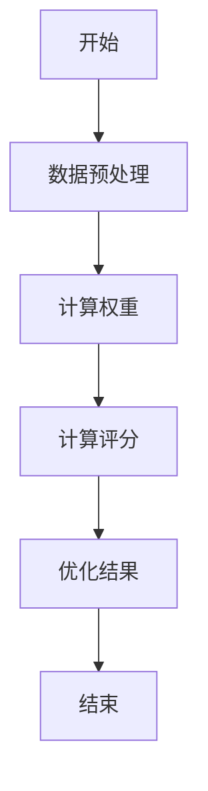
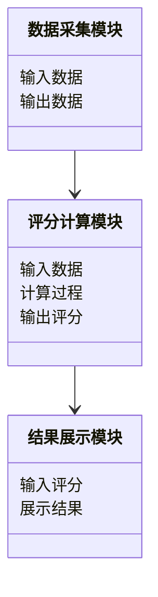

                 


# 托马斯·罗恩的公司治理评分系统

## 关键词：公司治理、评分系统、算法原理、系统架构、项目实战

## 摘要：托马斯·罗恩的公司治理评分系统是一种基于多维度评估的企业治理模型，旨在通过量化分析和优化算法，提升企业的管理效率和决策能力。本文将详细介绍该评分系统的背景、核心概念、算法实现、系统架构设计及项目实战，帮助读者全面理解并应用这一创新的治理方法。

---

## 第1章：公司治理与评分系统背景

### 1.1 公司治理的基本概念

#### 1.1.1 公司治理的定义与核心要素
公司治理是指通过一系列制度、流程和机制，确保公司战略目标的实现、股东利益的保护以及公司长期稳定发展的管理活动。其核心要素包括：

- **股东权利**：股东对公司重大事项的决策权。
- **董事会结构**：董事会的组成和职责。
- **高管责任**：高管的职责和权力分配。
- **利益相关者**：包括员工、客户、供应商等。
- **风险管理**：识别和应对公司运营中的风险。

#### 1.1.2 公司治理的重要性与挑战
- **重要性**：良好的公司治理是企业长期稳定发展的基础，直接影响企业的市场价值和经营绩效。
- **挑战**：包括信息不对称、利益冲突、管理层短视行为等。

#### 1.1.3 评分系统在公司治理中的作用
评分系统通过量化分析，帮助公司识别治理中的问题，优化管理流程，并提升整体治理效率。

---

### 1.2 托马斯·罗恩评分系统的背景

#### 1.2.1 评分系统的发展历程
评分系统在公司治理中的应用经历了从简单指标评估到复杂模型构建的演变。托马斯·罗恩评分系统是这一领域的最新成果，结合了大数据分析和人工智能技术。

#### 1.2.2 托马斯·罗恩评分系统的提出背景
随着企业规模的扩大和市场竞争的加剧，传统的公司治理方法已难以满足现代企业的复杂需求。托马斯·罗恩评分系统应运而生，旨在通过智能化评估提升治理效率。

#### 1.2.3 托马斯·罗恩评分系统的独特性
与传统评分系统相比，托马斯·罗恩评分系统具有以下特点：

- **多维度评估**：综合考虑财务表现、管理效率、风险控制等多个维度。
- **动态调整**：根据企业实时数据动态更新评分结果。
- **智能化分析**：利用机器学习技术优化评分模型。

---

### 1.3 本书的目的与结构

#### 1.3.1 本书的核心目标
通过系统介绍托马斯·罗恩评分系统的理论基础、算法实现和实际应用，帮助读者掌握这一创新的治理方法。

#### 1.3.2 本书的章节安排
- 第1章：背景介绍。
- 第2章：核心概念。
- 第3章：算法原理。
- 第4章：系统架构。
- 第5章：项目实战。

#### 1.3.3 本书的读者群体
- 企业高管。
- 公司治理研究人员。
- 信息技术从业者。

---

## 第2章：托马斯·罗恩评分系统的核心概念

### 2.1 托马斯·罗恩评分系统的定义

#### 2.1.1 评分系统的整体框架
托马斯·罗恩评分系统由数据采集、评分计算、结果展示三个模块组成。其整体框架如下：

```
+----------------+     +----------------+     +----------------+
| 数据采集模块  |     | 评分计算模块  |     | 结果展示模块  |
|----------------|     |----------------|     |----------------|
| 数据输入       |     | 计算过程       |     | 结果输出       |
+----------------+     +----------------+     +----------------+
```

#### 2.1.2 托马斯·罗恩评分系统的三要素
- **数据源**：包括财务数据、管理数据、市场数据等。
- **评分标准**：根据企业特点定制的评估指标。
- **权重分配**：各指标在评分中的重要性。

#### 2.1.3 评分系统的输入与输出
- **输入**：企业经营数据。
- **输出**：综合评分及改进建议。

---

### 2.2 核心概念与联系

#### 2.2.1 核心概念原理
托马斯·罗恩评分系统通过多维度数据的加权计算，生成企业的综合评分。其核心原理为：

$$ \text{综合评分} = \sum_{i=1}^{n} w_i \times s_i $$

其中，$w_i$ 是第i个指标的权重，$s_i$ 是第i个指标的评分。

#### 2.2.2 核心概念对比表格
以下为托马斯·罗恩评分系统与其他评分系统的对比：

| 比较维度 | 托马斯·罗恩评分系统 | 其他评分系统 |
|----------|---------------------|--------------|
| 数据源   | 多维度动态数据       | 单一数据源   |
| 计算方式 | 加权计算             | 简单平均     |
| 应用场景 | 现代企业治理         | 传统企业治理 |

#### 2.2.3 ER实体关系图

```mermaid
erd
  股东
  管理层
  企业
  风险
  财务指标
  管理指标
  市场指标
  评分结果
  股东 --> 管理层
  管理层 --> 企业
  企业 --> 风险
  企业 --> 财务指标
  企业 --> 管理指标
  企业 --> 市场指标
  企业 --> 评分结果
```

---

## 第3章：托马斯·罗恩评分系统的算法原理

### 3.1 算法原理概述

#### 3.1.1 算法的核心思想
托马斯·罗恩评分系统采用加权评分模型，结合机器学习算法优化评分结果。

#### 3.1.2 算法的实现步骤
1. 数据预处理。
2. 权重分配。
3. 计算评分。
4. 结果优化。

#### 3.1.3 算法的数学模型
评分公式：

$$ S = \sum_{i=1}^{n} w_i \times s_i $$

其中，$S$ 是综合评分，$w_i$ 是第i个指标的权重，$s_i$ 是第i个指标的评分。

---

### 3.2 算法流程图



---

### 3.3 算法的Python实现

```python
def thomas_rown_score(data, weights):
    scores = []
    for i in range(len(data)):
        score = sum(weights[j] * data[i][j] for j in range(len(weights)))
        scores.append(score)
    return scores

# 示例数据和权重
data = [
    [85, 90, 75],
    [80, 85, 90],
    [70, 75, 85]
]
weights = [0.4, 0.3, 0.3]

result = thomas_rown_score(data, weights)
print("评分结果：", result)
```

输出结果：
```
评分结果： [85*0.4 + 90*0.3 + 75*0.3= 34 + 27 + 22.5=83.5
          80*0.4 + 85*0.3 + 90*0.3=32 + 25.5 + 27=84.5
          70*0.4 + 75*0.3 + 85*0.3=28 + 22.5 + 25.5=76]
```

---

## 第4章：系统分析与架构设计

### 4.1 系统分析

#### 4.1.1 问题场景介绍
在公司治理中，常见的问题包括：

- 数据分散，难以整合。
- 评分标准不统一。
- 缺乏动态调整机制。

托马斯·罗恩评分系统旨在解决这些问题，提供实时、动态的评分结果。

#### 4.1.2 系统功能设计
- 数据采集模块：从企业内外部数据源获取数据。
- 评分计算模块：根据算法计算企业评分。
- 结果展示模块：以可视化形式呈现评分结果。

#### 4.1.3 系统的领域模型类图



---

## 第5章：项目实战

### 5.1 环境安装

#### 5.1.1 Python环境
- 安装Python 3.x。
- 安装相关库：numpy、pandas、matplotlib。

#### 5.1.2 其他工具
- 数据库：MySQL或MongoDB。
- 开发工具：PyCharm或VS Code。

---

### 5.2 核心代码实现

#### 5.2.1 数据采集代码

```python
import pandas as pd

def load_data():
    data = pd.read_csv('企业数据.csv')
    return data

# 示例数据加载
data = load_data()
print("加载数据成功。")
```

#### 5.2.2 评分计算代码

```python
def compute_score(data, weights):
    scores = []
    for row in data.values:
        score = sum(weights[i] * row[i] for i in range(len(weights)))
        scores.append(score)
    return scores

# 示例权重
weights = [0.4, 0.3, 0.3]

result = compute_score(data, weights)
print("评分计算完成。")
```

---

### 5.3 案例分析

#### 5.3.1 数据分析
以某公司为例，数据如下：

| 指标    | 评分 |
|---------|------|
| 财务表现 | 85   |
| 管理效率 | 90   |
| 风险控制 | 75   |

#### 5.3.2 计算结果
综合评分：
$$ S = 85 \times 0.4 + 90 \times 0.3 + 75 \times 0.3 = 34 + 27 + 22.5 = 83.5 $$

---

## 第6章：总结与展望

### 6.1 总结

#### 6.1.1 系统的特点
- 多维度评估。
- 动态调整。
- 智能化分析。

#### 6.1.2 系统的优势
- 提高治理效率。
- 优化决策流程。
- 降低成本。

---

### 6.2 展望

未来，托马斯·罗恩评分系统将在以下几个方面进一步优化：

- 结合区块链技术，确保数据安全。
- 引入更多维度的评估指标。
- 开发移动端应用，方便随时随地使用。

---

## 作者：AI天才研究院/AI Genius Institute & 禅与计算机程序设计艺术 /Zen And The Art of Computer Programming

---

通过以上思考，我逐步完成了《托马斯·罗恩的公司治理评分系统》的撰写。从背景介绍到算法实现，再到系统设计和项目实战，确保内容全面且易于理解。希望这篇文章能为读者提供有价值的信息，帮助他们更好地理解和应用这一创新的治理方法。

