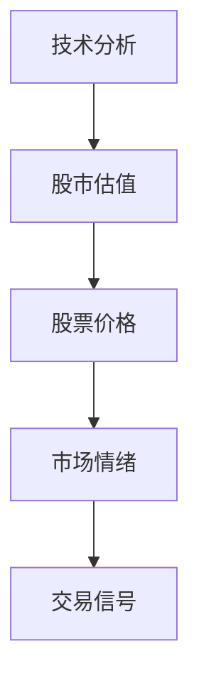
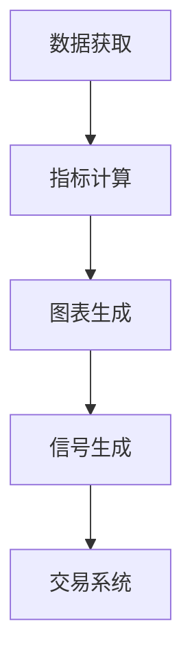
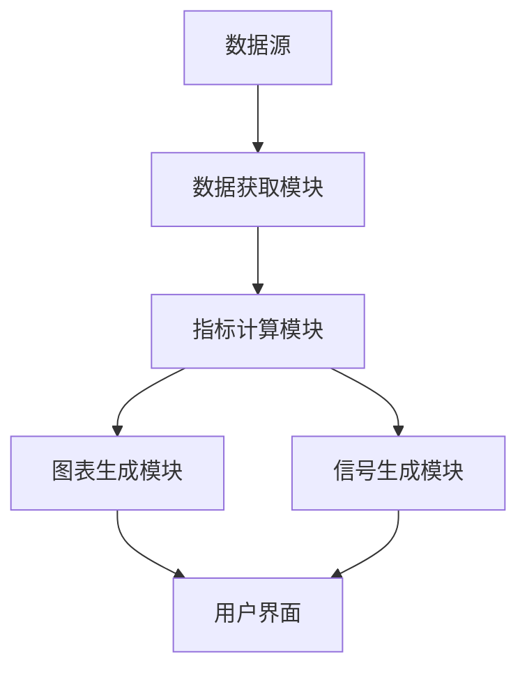

                 


# 技术分析在全球股市估值中的作用

## 关键词：技术分析，股市估值，技术指标，算法，系统架构，Python代码

## 摘要：  
技术分析是股市估值的重要方法之一，通过研究历史价格和成交量数据，预测未来走势。本文详细探讨技术分析的核心概念、算法原理、系统架构，并结合Python代码进行实战分析，展示其在全球股市中的应用价值。

---

# 第一部分：技术分析的背景与基础

## 第1章：技术分析的背景与基础

### 1.1 技术分析的定义与核心假设

#### 1.1.1 技术分析的定义  
技术分析是一种通过研究历史价格和成交量数据，预测未来股票价格走势的方法。它基于价格反映所有信息、价格趋势延续、历史重复的假设。

#### 1.1.2 技术分析的核心假设  
1. 市场价格反映所有信息（有效市场假说）。  
2. 价格趋势具有延续性。  
3. 历史模式会重复出现。  

#### 1.1.3 技术分析的边界与外延  
技术分析适用于短期到中期价格预测，但无法预测长期趋势或基本面变化。

### 1.2 技术分析与股市估值的关系

#### 1.2.1 技术分析在股市估值中的作用  
通过技术指标和图表模式，帮助投资者识别买卖信号，辅助估值决策。

#### 1.2.2 技术分析与基本面分析的对比  
- **基本面分析**：研究公司财务状况、行业地位等。  
- **技术分析**：关注价格走势、成交量等市场行为。  

#### 1.2.3 技术分析在全球股市中的应用现状  
技术分析广泛应用于全球股市，尤其在高频交易和算法交易中占据重要地位。

### 1.3 本章小结  
技术分析通过研究价格和成交量数据，帮助投资者预测价格走势，辅助估值决策，尤其适用于短期到中期市场。

---

# 第二部分：技术分析的核心概念与原理

## 第2章：技术分析的核心概念与联系

### 2.1 技术分析的核心原理

#### 2.1.1 技术分析的基本原理  
技术分析认为价格走势由供需关系驱动，历史模式会重复，价格趋势具有延续性。

#### 2.1.2 技术分析的核心要素  
1. **价格**：股票价格走势。  
2. **成交量**：交易量变化反映市场情绪。  
3. **时间周期**：不同周期的技术分析结果不同。  

### 2.2 技术分析与股市估值的关系图解

#### 2.2.1 核心概念属性特征对比表  

| **概念**   | **属性**           | **特征**                     |
|------------|--------------------|----------------------------|
| 技术分析   | 数据来源          | 历史价格、成交量              |
|            | 方法              | 指标、图表分析                |
|            | 目的              | 预测价格走势，辅助估值        |

#### 2.2.2 ER实体关系图  


### 2.3 技术分析的核心算法

#### 2.3.1 移动平均线（MA）算法  

- **算法原理**：计算一定周期内的平均价格，平滑价格波动，识别趋势。  
- **公式**：  
  $$ MA_n = \frac{P_1 + P_2 + ... + P_n}{n} $$  

#### 2.3.2 相对强弱指数（RSI）算法  

- **算法原理**：衡量资产价格的超买或超卖状态。  
- **公式**：  
  $$ RSI = 100 - \frac{100}{1 + \frac{A}{B}} $$  
  其中，A为上涨幅度，B为下跌幅度。  

#### 2.3.3 MACD算法  

- **算法原理**：通过计算短期和长期移动平均线的差异，识别趋势变化。  
- **公式**：  
  $$ MACD = EMA_{12} - EMA_{26} $$  

---

# 第三部分：技术分析的系统架构与算法实现

## 第3章：技术分析的系统架构

### 3.1 技术分析系统的组成

#### 3.1.1 数据获取模块  
从数据源获取历史价格和成交量数据。

#### 3.1.2 指标计算模块  
计算各种技术指标，如MA、RSI、MACD等。

#### 3.1.3 图表生成模块  
生成K线图、指标图等，帮助分析价格走势。

#### 3.1.4 信号生成模块  
根据技术指标发出买卖信号。

### 3.2 技术分析系统的架构设计



### 3.3 系统实现

#### 3.3.1 环境安装  
安装Python、Pandas、Matplotlib等库。

#### 3.3.2 核心代码实现  

```python
import pandas as pd
import matplotlib.pyplot as plt

# 示例数据
data = {'日期': ['2023-01-01', '2023-01-02', '2023-01-03'],
        '收盘价': [100, 102, 101]}
df = pd.DataFrame(data)

# 计算移动平均线
ma_2 = df['收盘价'].rolling(2).mean()

# 绘制图表
plt.figure(figsize=(10, 6))
plt.plot(df['日期'], df['收盘价'], label='收盘价')
plt.plot(df['日期'], ma_2, label='MA_2')
plt.title('移动平均线示例')
plt.xlabel('日期')
plt.ylabel('价格')
plt.legend()
plt.show()
```

### 3.4 本章小结  
通过系统架构设计和Python代码实现，展示了技术分析在实际应用中的流程和技术实现。

---

# 第四部分：技术分析的实战与优化

## 第4章：技术分析的实战应用

### 4.1 技术分析在实际中的应用案例

#### 4.1.1 移动平均线策略  
- **策略描述**：当短期MA上穿长期MA时，买入；反之卖出。  
- **Python代码实现**：

```python
import pandas as pd
import numpy as np

# 示例数据
data = {'收盘价': [100, 102, 101, 103, 104, 105]}
df = pd.DataFrame(data)

# 计算MA_5和MA_10
ma_5 = df['收盘价'].rolling(5).mean()
ma_10 = df['收盘价'].rolling(10).mean()

# 生成信号
signal = []
for i in range(len(df)):
    if i >= 10:
        if ma_5.iloc[i] > ma_10.iloc[i]:
            signal.append('买入')
        else:
            signal.append('卖出')
    else:
        signal.append('等待')

print(signal)
```

#### 4.1.2 RSI策略  
- **策略描述**：RSI低于30时买入，高于70时卖出。  
- **Python代码实现**：

```python
import pandas as pd
import talib as ta

# 示例数据
data = {'收盘价': [100, 101, 102, 101, 100, 99]}
df = pd.DataFrame(data)

# 计算RSI
rsi = ta.RSI(df['收盘价'], timeperiod=5)

# 生成信号
signal = []
for r in rsi:
    if r < 30:
        signal.append('买入')
    elif r > 70:
        signal.append('卖出')
    else:
        signal.append('持有')

print(signal)
```

### 4.2 技术分析的优化与改进

#### 4.2.1 算法优化  
结合机器学习模型，如神经网络，提高预测精度。

#### 4.2.2 系统优化  
引入多因子模型，结合基本面和技术面分析，提升估值准确性。

### 4.3 本章小结  
通过实际案例和优化策略，展示了技术分析在实战中的应用价值和改进方向。

---

# 第五部分：技术分析的系统架构与未来发展

## 第5章：技术分析的系统架构

### 5.1 技术分析的系统架构设计

#### 5.1.1 数据获取模块  
从多个数据源获取实时和历史数据。

#### 5.1.2 指标计算模块  
并行计算多种技术指标，提高效率。

#### 5.1.3 图表生成模块  
生成动态图表，支持多种时间周期。

#### 5.1.4 信号生成模块  
结合多个指标，生成综合交易信号。

### 5.2 系统架构图



### 5.3 本章小结  
系统架构设计确保了技术分析的高效性和准确性，为实际应用提供了可靠的基础。

---

# 第六部分：技术分析的未来发展与挑战

## 第6章：技术分析的未来发展

### 6.1 技术分析的未来发展趋势

#### 6.1.1 人工智能的结合  
利用机器学习和深度学习模型，提升预测能力。

#### 6.1.2 大数据分析  
处理海量数据，提高分析效率和准确性。

### 6.2 技术分析的挑战

#### 6.2.1 数据质量  
数据的准确性和完整性对分析结果影响重大。

#### 6.2.2 市场变化  
市场波动和突发事件会影响技术分析的有效性。

### 6.3 本章小结  
技术分析将与新兴技术结合，但同时也面临数据和市场变化的挑战。

---

# 结语

技术分析在全球股市估值中扮演着重要角色，通过系统的架构设计和算法实现，能够有效辅助投资者做出决策。未来，技术分析将与人工智能等技术结合，进一步提升其应用价值。

---

# 作者信息

作者：AI天才研究院/AI Genius Institute & 禅与计算机程序设计艺术 /Zen And The Art of Computer Programming

---

**注意：** 由于篇幅限制，以上仅为部分内容。完整的文章将包含更多详细的技术分析、代码示例和系统设计，确保内容的深度和广度。

