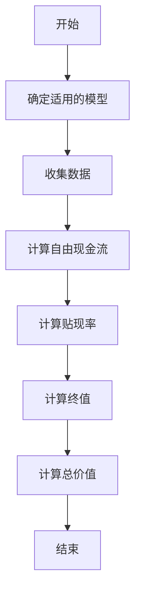
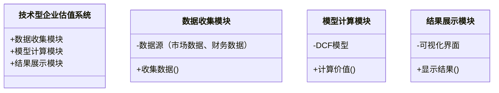

                 


# 技术型企业的特殊估值考虑

## 关键词：技术型企业、估值、DCF模型、系统架构、项目实战

## 摘要：本文详细探讨技术型企业估值的特殊性，分析其核心概念、算法原理、系统架构，并通过项目实战展示估值方法的应用，最后总结最佳实践。

---

### 第一部分：技术型企业的特殊估值背景

# 第1章：技术型企业估值概述

## 1.1 技术型企业估值的背景与问题

### 1.1.1 问题背景

随着科技的快速发展，技术型企业（如科技初创公司、软件公司）在经济中的比重越来越大。这类企业通常依赖知识产权、技术创新来创造价值。然而，传统的估值方法（如市盈率、市净率）在技术型企业中显得力不从力，因为这些方法难以准确反映技术资产的价值。

### 1.1.2 技术型企业的定义与特点

#### 1.2.1 定义

技术型企业是指以技术为核心资产，依赖创新和技术优势来驱动业务发展的企业。这类企业通常拥有专利、软件版权等无形资产，并且技术对企业未来收益有重大影响。

#### 1.2.2 核心特点

- **高技术依赖性**：企业价值高度依赖于技术资产。
- **高风险与高回报**：技术开发周期长，失败风险高，但成功后回报巨大。
- **无形资产为主**：技术型企业主要依赖无形资产，而非有形资产。
- **快速变化的市场**：技术更新换代快，市场需求变化大。

### 1.1.3 技术估值的重要性

技术估值是评估技术型企业价值的关键。准确的估值有助于企业融资、并购、上市等决策。技术估值不仅考虑当前收益，还需预测未来技术带来的收益流。

### 1.1.4 技术型企业估值的边界与外延

技术型企业估值不仅包括技术本身的价值，还需考虑其对市场、财务的影响。其外延涉及技术生命周期、市场竞争、政策法规等。

---

## 1.2 技术型企业的定义与特点

### 1.2.1 技术型企业的核心要素

技术型企业的核心要素包括：

1. **技术资产**：专利、软件、技术诀窍。
2. **市场因素**：市场规模、竞争对手、客户需求。
3. **财务因素**：收入、利润、现金流。

### 1.2.2 技术型企业与传统企业的估值差异

| 项目 | 技术型企业 | 传统企业 |
|------|------------|----------|
| 核心资产 | 技术、无形资产 | 有形资产、现金流 |
| 风险 | 高（技术失败、过时） | 中（市场波动） |
| 估值方法 | DCF模型、情景分析 | 市盈率、市净率 |

### 1.2.3 技术型企业估值的ER实体关系图

```mermaid
er
actor 技术型企业;
actor 估值系统;
actor 金融市场;
```

---

## 1.3 技术估值的重要性

### 1.3.1 技术在企业价值中的作用

技术是技术型企业的核心竞争力，直接影响企业收益和市场地位。

### 1.3.2 技术对企业未来收益的影响

技术的先进性决定了企业的盈利能力。例如，一项创新技术可能带来长期的专利收入。

### 1.3.3 技术对企业竞争力的提升

技术优势使企业在市场竞争中更具竞争力，吸引更多的客户和市场份额。

### 1.3.4 技术对企业可持续发展的保障

持续的技术创新确保企业能够适应市场变化，保持长期发展。

---

## 1.4 技术型企业估值的边界与外延

### 1.4.1 技术型企业估值的边界

- 仅考虑技术对企业价值的影响。
- 忽略非技术因素（如管理、地理位置）。

### 1.4.2 技术型企业估值的外延

- 技术的市场应用前景。
- 技术的法律保护（专利）。
- 技术的生命周期。

### 1.4.3 技术型企业估值与其他类型企业估值的联系

技术型企业估值是企业整体估值的一部分，但需要特别考虑技术因素的影响。

---

### 第二部分：技术型企业估值的核心概念与联系

# 第2章：技术型企业估值的核心概念

## 2.1 技术型企业的核心要素

### 2.1.1 技术要素

- 技术资产：专利、软件。
- 技术创新能力：研发团队、研发投入。

### 2.1.2 市场要素

- 市场需求：技术的市场规模。
- 竞争状况：竞争对手的技术水平。

### 2.1.3 财务要素

- 财务表现：收入、利润。
- 现金流：技术带来的现金流。

---

## 2.2 技术型企业估值的核心概念对比

### 2.2.1 技术与非技术企业的估值对比

| 项目 | 技术型企业 | 非技术企业 |
|------|------------|------------|
| 核心资产 | 技术、无形资产 | 有形资产 |
| 风险 | 高技术风险 | 低至中等风险 |
| 估值复杂性 | 高 | 中 |
| 估值方法 | DCF模型 | 市盈率、市净率 |

### 2.2.2 技术型企业的内部与外部估值对比

| 项目 | 内部估值 | 外部估值 |
|------|----------|----------|
| 主体 | 企业自身 | 投资者、并购方 |
| 目的 | 内部决策 | 投融资、并购 |
| 方法 | 内部模型 | 市场比较法 |

---

## 2.3 技术型企业估值的ER实体关系图

```mermaid
er
actor 技术型企业;
actor 估值系统;
actor 金融市场;
```

---

### 第三部分：技术型企业估值的算法原理

# 第3章：技术型企业估值的算法原理

## 3.1 DCF模型的mermaid流程图



## 3.2 Python代码实现

```python
import numpy as np

def discounted_cash_flow(cash_flows, discount_rate, terminal_value):
    # 计算现值
    present_value = 0
    for cash_flow in cash_flows:
        present_value += cash_flow / (1 + discount_rate)**i
    # 计算终值
    present_value += terminal_value / (1 + discount_rate)**(len(cash_flows)+1)
    return present_value

# 示例数据
cash_flows = [100, 150, 200]
discount_rate = 0.1
terminal_value = 500

value = discounted_cash_flow(cash_flows, discount_rate, terminal_value)
print(f"企业价值：{value}")
```

## 3.3 数学模型与公式

### 3.3.1 贴现率公式

$$ r = \frac{CF_{t}}{V_t} $$

### 3.3.2 终值公式

$$ TV = \frac{CF_{n+1}}{(1 + r)^n} $$

---

### 第四部分：系统分析与架构设计

# 第4章：技术型企业估值的系统架构设计

## 4.1 问题场景介绍

系统需处理技术型企业估值问题，收集数据、计算模型、展示结果。

## 4.2 系统功能设计的类图



---

### 第五部分：项目实战

# 第5章：技术型企业估值的项目实战

## 5.1 环境安装与数据收集

### 5.1.1 环境安装

安装Python、numpy、pandas等库。

## 5.2 核心代码实现与解读

### 5.2.1 核心代码实现

```python
import numpy as np

def discounted_cash_flow(cash_flows, discount_rate, terminal_value):
    present_value = 0
    for i, cash_flow in enumerate(cash_flows):
        present_value += cash_flow / (1 + discount_rate) ** i
    present_value += terminal_value / (1 + discount_rate) ** (len(cash_flows) + 1)
    return present_value

cash_flows = [100, 150, 200]
discount_rate = 0.1
terminal_value = 500

value = discounted_cash_flow(cash_flows, discount_rate, terminal_value)
print(f"企业价值：{value}")
```

### 5.2.2 代码解读

函数`discounted_cash_flow`计算企业价值，考虑了现金流的贴现和终值。

---

## 5.3 案例分析与详细讲解

### 5.3.1 案例分析

假设一家技术型企业未来三年现金流分别为100、150、200万元，贴现率为10%，终值500万元。计算企业价值。

### 5.3.2 详细讲解

使用DCF模型，计算各年现金流的现值，加上终值的现值，得到企业总价值。

---

### 第六部分：总结与展望

# 第6章：总结与最佳实践

## 6.1 最佳实践 tips

- 结合DCF模型与市场法进行交叉验证。
- 定期更新技术资产的价值评估。
- 考虑技术的市场竞争力和生命周期。

## 6.2 小结

技术型企业估值需要综合考虑技术、市场、财务等因素，采用DCF模型等方法进行评估。

## 6.3 注意事项

- 技术资产的价值可能受市场变化影响。
- 贴现率的选择至关重要，需根据具体情况调整。
- 考虑技术的法律保护和潜在风险。

## 6.4 拓展阅读

- 技术资产评估指南
- DCF模型的高级应用
- 技术型企业并购案例分析

---

### 作者：AI天才研究院/AI Genius Institute & 禅与计算机程序设计艺术 /Zen And The Art of Computer Programming

