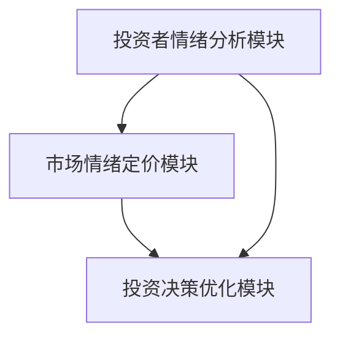
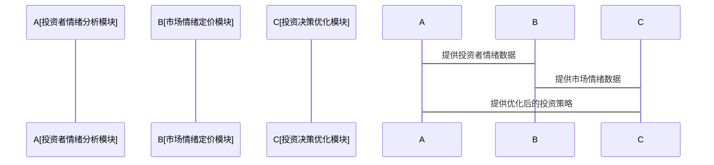

                 


# 投资心理学：克服情绪化决策的方法

> 关键词：投资心理学，情绪化决策，认知偏差，行为金融学，情绪周期模型

> 摘要：本文深入探讨了投资心理学的核心概念，分析了情绪化决策对投资的影响，并提出了克服情绪化决策的方法。通过认知偏差与情绪偏差的分析，结合行为金融学的理论和情绪周期模型，本文为投资者提供了一套系统化的投资决策支持方案。同时，本文还通过实际案例和系统设计，展示了如何在投资中应用这些理论和方法。

---

# 第一部分: 投资心理学概述

## 第1章: 投资心理学的背景与核心概念

### 1.1 投资心理学的定义与研究范围

#### 1.1.1 投资心理学的定义

投资心理学是研究投资者在投资过程中心理活动及其对决策影响的学科。它结合了心理学、金融学和经济学的理论，旨在揭示投资者在面对不确定性时的行为模式和决策机制。

#### 1.1.2 投资心理学的研究范围

- **投资者行为分析**：研究投资者在不同市场环境下的行为特征。
- **情绪与认知偏差**：分析投资者在决策过程中产生的各种情绪和认知偏差。
- **市场波动与情绪周期**：探讨市场波动与投资者情绪之间的关系。
- **行为金融学**：结合行为学理论，研究非理性行为对金融市场的影响。

#### 1.1.3 投资心理学与金融学的关系

投资心理学是金融学的重要分支，它从心理层面解释了金融市场中的异常现象，如市场泡沫、恐慌性抛售等。通过投资心理学的研究，可以帮助投资者更好地理解自己的行为，并采取更理性的决策。

### 1.2 情绪化决策的背景与问题

#### 1.2.1 投资中的情绪化决策现象

在金融市场中，投资者常常会受到情绪的影响，做出非理性的决策。例如，在市场上涨时过于乐观，大量买入；在市场下跌时过于恐慌，盲目卖出。

#### 1.2.2 情绪化决策对投资的影响

情绪化决策会导致投资者在市场波动中频繁交易，从而增加交易成本，并可能导致投资收益的下降。此外，情绪化决策还可能导致投资者忽视风险，采取冒险性过高的投资策略。

#### 1.2.3 情绪化决策的典型案例分析

- **2008年全球金融危机**：许多投资者在恐慌情绪的驱使下，大量抛售资产，导致市场进一步下跌。
- **2015年A股股灾**：投资者的恐慌情绪引发了市场的流动性危机。

### 1.3 投资心理学的核心概念

#### 1.3.1 认知偏差与情绪偏差

认知偏差是指人在信息处理过程中产生的系统性错误，而情绪偏差则是指情绪波动对决策的影响。两者共同作用，导致投资者在决策过程中出现偏差。

#### 1.3.2 行为金融学的基本理论

行为金融学是研究投资者行为的学科，它强调非理性行为对金融市场的影响。行为金融学的核心理论包括：

- **有限理性理论**：投资者在决策时受到认知能力的限制。
- **前景理论**：投资者对收益和损失的敏感程度不同。
- **情绪影响理论**：情绪波动会影响投资者的决策。

#### 1.3.3 投资者心理周期模型

投资者心理周期模型描述了投资者在市场波动中的情绪变化过程。模型通常包括以下几个阶段：

1. **乐观阶段**：投资者对市场前景感到乐观，大量买入资产。
2. **兴奋阶段**：市场上涨，投资者情绪高涨，交易活跃。
3. **恐慌阶段**：市场下跌，投资者情绪恐慌，大量卖出资产。
4. **绝望阶段**：市场持续下跌，投资者情绪低落，失去信心。
5. **反弹阶段**：市场出现反弹，投资者情绪逐渐恢复。

### 1.4 本章小结

本章介绍了投资心理学的核心概念，包括认知偏差、情绪偏差、行为金融学理论和投资者心理周期模型。这些概念为我们理解投资者行为提供了理论基础。

---

# 第二部分: 情绪与认知的相互作用

## 第2章: 认知偏差与情绪偏差

### 2.1 认知偏差的种类与影响

#### 2.1.1 确认偏差

确认偏差是指投资者倾向于寻找与自己已有观点一致的信息，而忽视与之相悖的信息。这种偏差会导致投资者在决策时缺乏全面性。

#### 2.1.2 过度自信偏差

过度自信偏差是指投资者对自己判断的信心过度，导致其低估风险。这种偏差在投资中表现得尤为明显，许多投资者相信自己能够预测市场走势。

#### 2.1.3 可得性偏差

可得性偏差是指投资者更容易记住那些容易获取的信息，而忽视其他信息。这种偏差会影响投资者的决策质量。

### 2.2 情绪偏差的种类与影响

#### 2.2.1 恐慌情绪

恐慌情绪是指投资者在市场下跌时，因害怕损失而做出的非理性决策。恐慌情绪会导致投资者大量卖出资产，加剧市场下跌。

#### 2.2.2 过度乐观情绪

过度乐观情绪是指投资者在市场上涨时，因过于乐观而大量买入资产。这种情绪会导致投资者忽视风险，采取冒险性过高的投资策略。

#### 2.2.3 悔恨情绪

悔恨情绪是指投资者在做出错误决策后，因后悔而采取报复性交易。例如，投资者因卖出股票而错失上涨机会，可能会在后续市场下跌时再次卖出，以消除悔恨情绪。

### 2.3 认知偏差与情绪偏差的相互作用

#### 2.3.1 认知偏差引发情绪偏差

认知偏差会影响投资者的情绪状态。例如，确认偏差会导致投资者过度自信，从而引发乐观情绪。

#### 2.3.2 情绪偏差影响认知偏差

情绪偏差会影响投资者的认知能力。例如，恐慌情绪会导致投资者在决策时出现可得性偏差，即只关注负面信息。

#### 2.3.3 认知与情绪的动态平衡

认知与情绪是相互作用的，它们共同影响投资者的决策。在投资过程中，投资者需要通过理性分析和情绪控制，实现认知与情绪的动态平衡。

### 2.4 本章小结

本章分析了认知偏差与情绪偏差的种类及其影响，并探讨了两者之间的相互作用。认知偏差和情绪偏差共同作用，导致投资者在决策中出现偏差。

---

# 第三部分: 投资决策中的情绪管理

## 第3章: 投资决策中的情绪周期模型

### 3.1 投资情绪周期的定义与阶段划分

#### 3.1.1 情绪周期的定义

投资情绪周期是指投资者在市场波动中情绪变化的过程。情绪周期通常包括乐观、兴奋、恐慌、绝望和反弹五个阶段。

#### 3.1.2 情绪周期的阶段划分

- **乐观阶段**：市场上涨，投资者情绪乐观。
- **兴奋阶段**：市场持续上涨，投资者情绪高涨。
- **恐慌阶段**：市场突然下跌，投资者情绪恐慌。
- **绝望阶段**：市场持续下跌，投资者情绪低落。
- **反弹阶段**：市场出现反弹，投资者情绪逐渐恢复。

#### 3.1.3 情绪周期的特征与表现

在不同阶段，投资者的情绪表现不同。例如，在乐观阶段，投资者倾向于买入资产；在恐慌阶段，投资者倾向于卖出资产。

### 3.2 情绪周期对投资决策的影响

#### 3.2.1 情绪周期与市场波动的关系

市场波动与投资者情绪密切相关。当投资者情绪高涨时，市场容易出现泡沫；当投资者情绪低落时，市场容易出现恐慌性抛售。

#### 3.2.2 不同情绪阶段的投资决策特点

- **乐观阶段**：投资者倾向于买入资产，尤其是高风险资产。
- **恐慌阶段**：投资者倾向于卖出资产，尤其是高风险资产。

#### 3.2.3 情绪周期的预测与应用

通过分析投资者情绪周期，可以帮助投资者预测市场波动，并采取相应的投资策略。

### 3.3 情绪周期模型的数学表达

#### 3.3.1 情绪周期模型的构建

情绪周期模型可以通过数学公式来描述投资者情绪的变化过程。以下是一个简化的情绪周期模型：

$$E(t) = a \cdot \sin(b \cdot t + c) + d$$

其中：
- $E(t)$ 表示投资者情绪在时间 $t$ 的值。
- $a$ 是情绪波动的幅度。
- $b$ 是情绪波动的频率。
- $c$ 是情绪波动的初始相位。
- $d$ 是情绪波动的平均值。

#### 3.3.2 情绪周期模型的数学公式

情绪周期模型可以用来预测投资者情绪的变化，从而指导投资决策。例如，当情绪周期处于乐观阶段时，投资者可以适当增加高风险资产的配置。

#### 3.3.3 情绪周期模型的验证与优化

通过实证分析，可以验证情绪周期模型的有效性，并对其进行优化。例如，可以通过调整参数 $a$、$b$、$c$ 和 $d$，使模型更好地拟合实际市场数据。

### 3.4 本章小结

本章构建了一个情绪周期模型，并通过数学公式描述了投资者情绪的变化过程。情绪周期模型可以帮助投资者预测市场波动，并采取相应的投资策略。

---

# 第四部分: 投资决策中的行为金融学分析

## 第4章: 行为金融学的核心理论

### 4.1 行为金融学的基本理论

#### 4.1.1 基于认知偏差的行为金融学

认知偏差是行为金融学的核心理论之一。它解释了投资者在决策过程中出现偏差的原因。

#### 4.1.2 基于情绪偏差的行为金融学

情绪偏差是行为金融学的另一个重要理论。它解释了投资者在情绪波动下做出非理性决策的原因。

#### 4.1.3 行为金融学与传统金融学的对比

行为金融学与传统金融学的主要区别在于，行为金融学强调非理性行为对金融市场的影响，而传统金融学假设投资者是理性的。

### 4.2 行为金融学中的情绪定价理论

#### 4.2.1 情绪定价理论的定义

情绪定价理论是指投资者情绪会影响资产价格的理论。当投资者情绪高涨时，资产价格可能被高估；当投资者情绪低落时，资产价格可能被低估。

#### 4.2.2 情绪定价理论的数学模型

情绪定价理论可以通过以下公式表示：

$$P(t) = \alpha \cdot E(t) + \beta \cdot F(t) + \gamma$$

其中：
- $P(t)$ 表示资产价格在时间 $t$ 的值。
- $\alpha$ 是情绪因素的权重。
- $E(t)$ 表示投资者情绪在时间 $t$ 的值。
- $\beta$ 是市场因子的权重。
- $F(t)$ 表示市场因子在时间 $t$ 的值。
- $\gamma$ 是常数项。

#### 4.2.3 情绪定价理论的应用与验证

通过实证分析，可以验证情绪定价理论的有效性。例如，可以通过回归分析，检验情绪因素对资产价格的影响。

### 4.3 行为金融学中的投资者行为模型

#### 4.3.1 投资者行为模型的构建

投资者行为模型可以通过以下步骤构建：
1. 确定投资者行为的驱动因素。
2. 分析投资者行为与市场环境的关系。
3. 建立数学模型描述投资者行为。

#### 4.3.2 投资者行为模型的数学公式

投资者行为模型可以通过以下公式表示：

$$B(t) = \sum_{i=1}^{n} w_i \cdot x_i(t)$$

其中：
- $B(t)$ 表示投资者行为在时间 $t$ 的值。
- $w_i$ 是第 $i$ 个驱动因素的权重。
- $x_i(t)$ 是第 $i$ 个驱动因素在时间 $t$ 的值。

#### 4.3.3 投资者行为模型的验证与优化

通过实证分析，可以验证投资者行为模型的有效性，并对其进行优化。例如，可以通过调整权重 $w_i$，使模型更好地拟合实际数据。

### 4.4 本章小结

本章介绍了行为金融学的核心理论，包括情绪定价理论和投资者行为模型。这些理论为我们理解投资者行为提供了理论支持。

---

# 第五部分: 投资决策中的系统设计

## 第5章: 投资决策支持系统的架构设计

### 5.1 系统功能设计

#### 5.1.1 投资者情绪分析模块

投资者情绪分析模块用于分析投资者情绪的变化。可以通过以下步骤实现：
1. 收集投资者情绪数据。
2. 分析投资者情绪周期。
3. 预测投资者情绪变化。

#### 5.1.2 市场情绪定价模块

市场情绪定价模块用于预测市场情绪对资产价格的影响。可以通过以下步骤实现：
1. 收集市场情绪数据。
2. 分析市场情绪周期。
3. 预测市场情绪对资产价格的影响。

#### 5.1.3 投资决策优化模块

投资决策优化模块用于优化投资决策。可以通过以下步骤实现：
1. 收集市场数据。
2. 分析市场环境。
3. 优化投资策略。

### 5.2 系统架构设计

#### 5.2.1 系统架构图

以下是一个简化的系统架构图：



#### 5.2.2 系统接口设计

系统接口设计包括以下内容：
- 投资者情绪分析模块与市场情绪定价模块的接口。
- 市场情绪定价模块与投资决策优化模块的接口。
- 投资者情绪分析模块与投资决策优化模块的接口。

#### 5.2.3 系统交互设计

以下是一个简化的系统交互图：



### 5.3 系统实现

#### 5.3.1 环境安装

以下是系统实现所需的环境：

- Python 3.8+
- NumPy
- Pandas
- Matplotlib
- Scikit-learn

#### 5.3.2 核心代码实现

以下是投资者情绪分析模块的核心代码：

```python
import numpy as np
import pandas as pd
import matplotlib.pyplot as plt

# 情绪周期模型
def emotion_cycle(t, a, b, c, d):
    return a * np.sin(b * t + c) + d

# 投资者情绪分析
def investor_emotion(t, a, b, c, d):
    emotion = emotion_cycle(t, a, b, c, d)
    return emotion

# 数据可视化
t = np.linspace(0, 10, 100)
a = 1
b = 2 * np.pi / 10
c = 0
d = 0
emotion = emotion_cycle(t, a, b, c, d)

plt.plot(t, emotion)
plt.title('Investor Emotion Cycle')
plt.xlabel('Time')
plt.ylabel('Emotion')
plt.show()
```

### 5.4 本章小结

本章设计了一个投资决策支持系统，包括投资者情绪分析模块、市场情绪定价模块和投资决策优化模块。通过系统架构设计和核心代码实现，我们可以更好地理解投资者行为，并优化投资决策。

---

# 第六部分: 项目实战

## 第6章: 投资情绪周期模型的实战应用

### 6.1 项目背景

在本章中，我们将通过一个实际案例，展示如何应用投资情绪周期模型进行投资决策。

### 6.2 项目需求分析

项目需求包括：
- 收集投资者情绪数据。
- 分析投资者情绪周期。
- 预测市场情绪变化。
- 优化投资策略。

### 6.3 项目实现

#### 6.3.1 环境安装

需要安装以下环境：
- Python 3.8+
- NumPy
- Pandas
- Matplotlib
- Scikit-learn

#### 6.3.2 核心代码实现

以下是投资者情绪分析模块的核心代码：

```python
import numpy as np
import pandas as pd
import matplotlib.pyplot as plt

# 情绪周期模型
def emotion_cycle(t, a, b, c, d):
    return a * np.sin(b * t + c) + d

# 投资者情绪分析
def investor_emotion(t, a, b, c, d):
    emotion = emotion_cycle(t, a, b, c, d)
    return emotion

# 数据可视化
t = np.linspace(0, 10, 100)
a = 1
b = 2 * np.pi / 10
c = 0
d = 0
emotion = emotion_cycle(t, a, b, c, d)

plt.plot(t, emotion)
plt.title('Investor Emotion Cycle')
plt.xlabel('Time')
plt.ylabel('Emotion')
plt.show()
```

#### 6.3.3 项目小结

通过本项目，我们展示了如何应用投资情绪周期模型进行投资决策。投资者可以通过分析情绪周期，优化投资策略，从而克服情绪化决策。

---

# 第七部分: 总结与展望

## 第7章: 总结与展望

### 7.1 总结

本文深入探讨了投资心理学的核心概念，分析了情绪化决策对投资的影响，并提出了克服情绪化决策的方法。通过认知偏差与情绪偏差的分析，结合行为金融学的理论和情绪周期模型，本文为投资者提供了一套系统化的投资决策支持方案。

### 7.2 展望

未来的研究可以进一步探讨以下方向：
- 更精确的情绪周期模型。
- 更高效的情绪分析算法。
- 更智能的投资决策支持系统。

---

# 作者信息

作者：AI天才研究院/AI Genius Institute & 禅与计算机程序设计艺术 /Zen And The Art of Computer Programming

---

通过以上思考步骤，我们可以系统地撰写一篇关于投资心理学的博客文章，帮助投资者克服情绪化决策，做出更理性的投资决策。

