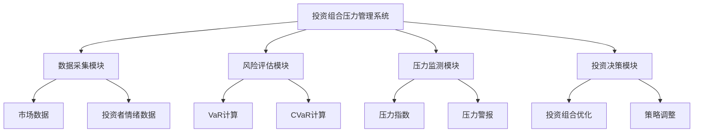

                 


# 投资心理学：如何应对投资组合带来的压力

---

## 关键词：投资心理学，投资组合，压力管理，决策偏差，风险评估，行为金融学

---

## 摘要：  
投资组合管理不仅仅是数字和模型的运算，更是人类心理与市场波动相互作用的结果。本文从投资心理学的角度，深入分析投资组合压力的成因、影响以及应对策略。通过数学模型和实际案例，我们探讨了如何利用认知重构、行为调整和系统优化来缓解投资压力，从而做出更理性的投资决策。  

---

## 正文  

### 第1章：投资心理学的背景与核心概念  

#### 1.1 投资心理学的定义与研究范围  

投资心理学是研究投资者心理活动及其对金融市场行为影响的学科。它关注投资者在决策过程中的认知偏差、情绪波动以及行为模式，旨在揭示心理因素如何影响投资行为和市场走势。  

**1.1.1 投资心理学的定义**  
投资心理学结合了心理学和金融学的理论，研究投资者在金融市场中的决策过程、情绪变化以及行为模式。它帮助我们理解为什么投资者会在市场波动中做出非理性决策，以及如何通过心理调整和行为优化来改善投资结果。  

**1.1.2 投资心理学的研究范围**  
- 投资者认知偏差（如过度自信、损失厌恶）  
- 情绪对投资决策的影响（如贪婪与恐惧）  
- 投资组合管理中的心理因素  
- 市场行为与心理预期的互动  

**1.1.3 投资心理学与金融市场的关系**  
投资心理学揭示了投资者心理如何影响市场价格、波动性和资产配置。例如，群体性情绪波动可能导致市场泡沫或崩盘，而个体认知偏差则会影响投资组合的风险和收益。  

---

#### 1.2 投资组合压力的背景与问题描述  

**1.2.1 投资组合压力的定义**  
投资组合压力是指投资者在管理投资组合时，由于市场波动、收益目标未达成或潜在损失而产生的心理压力。这种压力可能影响投资者的决策，导致非理性行为。  

**1.2.2 投资组合压力的成因**  
- 市场波动：股票、债券等资产价格的频繁波动会引发投资者的焦虑。  
- 认知偏差：投资者对市场的过度乐观或悲观预期可能导致过度交易或误判风险。  
- 业绩压力：机构投资者需要应对客户的收益预期，这可能增加心理负担。  

**1.2.3 投资组合压力的影响**  
- 非理性决策：压力可能导致投资者在市场低点卖出或在高点追涨。  
- 投资绩效下降：压力会降低决策质量，影响投资组合的收益。  
- 健康问题：长期压力可能导致投资者的心理健康问题。  

---

### 第2章：投资心理学的核心概念与联系  

#### 2.1 投资心理学的核心概念  

**2.1.1 心理账户与决策偏差**  
心理账户是指投资者将资金分配到不同的“账户”中，每个账户有不同的心理预期和风险偏好。例如，将资金分为短期和长期账户，可能导致投资者在不同账户中采取不同的投资策略。  

**2.1.2 情绪与投资决策的关系**  
情绪是投资决策的重要影响因素。贪婪和恐惧等情绪可能导致投资者在市场高点追涨或在低点恐慌性抛售。  

**2.1.3 投资组合风险与收益的平衡**  
投资组合管理的核心是在风险与收益之间找到平衡点。投资者需要在承受风险的同时，追求合理的收益。  

---

#### 2.2 投资心理学的核心概念对比  

**2.2.1 不同决策偏差的对比分析**  
以下是常见的认知偏差及其对投资决策的影响：  

| **决策偏差**       | **对投资决策的影响**                             |  
|--------------------|------------------------------------------------|  
| 过度自信           | 投资者可能高估自己的判断能力，导致过度交易。   |  
| 损失厌恶           | 投资者更害怕损失，可能导致卖出优质资产。       |  
| 羊群效应           | 投资者盲目跟随市场潮流，导致非理性投资行为。   |  

**2.2.2 投资者心理与市场行为的关系**  
投资者的群体心理会影响市场走势。例如，市场恐慌可能导致抛售潮，而过度乐观则可能导致资产泡沫。  

**2.2.3 投资组合压力与市场波动的因果关系**  
市场波动是投资组合压力的主要诱因之一，而压力又会加剧投资者的非理性行为，进一步放大市场波动。  

---

### 第3章：投资组合压力的数学模型与分析  

#### 3.1 投资组合压力的数学模型  

**3.1.1 风险评估模型**  
风险评估是投资组合管理的核心任务之一。常见的风险评估模型包括：  

- **VaR（Value at Risk）**：衡量投资组合在一定置信水平下的最大潜在损失。  
- **CVaR（Conditional Value at Risk）**：衡量在VaR水平下的平均损失。  

**数学公式：**  
$$ \text{VaR}(\alpha) = \min_{p} \{ p \mid P(L \leq p) \geq \alpha \} $$  

其中，$\alpha$ 是置信水平，$L$ 是潜在损失。  

**3.1.2 投资组合收益的数学表达**  
投资组合的预期收益可以表示为：  
$$ E[R_p] = \sum_{i=1}^n w_i E[R_i] $$  

其中，$w_i$ 是资产$i$的权重，$E[R_i]$ 是资产$i$的预期收益。  

**3.1.3 风险-收益权衡的数学公式**  
投资组合的优化目标是在给定风险水平下最大化收益，或在给定收益下最小化风险。这可以通过均值-方差优化来实现：  
$$ \min_{w} \sigma_p^2 \quad \text{subject to} \quad E[R_p] = \mu $$  

其中，$\sigma_p^2$ 是投资组合的方差，$\mu$ 是预期收益。  

---

#### 3.2 投资组合压力的算法原理  

**3.2.1 投资组合优化算法**  
均值-方差优化是投资组合管理的核心算法。以下是其实现步骤：  

1. 计算各资产的预期收益和协方差矩阵。  
2. 求解优化问题：  
   $$ \min_{w} w^T \Sigma w \quad \text{subject to} \quad w^T \mu = \mu_t \text{ 且 } w^T 1 = 1 $$  

其中，$\Sigma$ 是协方差矩阵，$\mu$ 是收益向量，$w$ 是权重向量，$\mu_t$ 是目标收益。  

**3.2.2 风险评估算法**  
VaR的计算通常需要模拟投资组合的收益分布，例如使用蒙特卡罗模拟：  
1. 生成资产收益的随机样本。  
2. 排序样本，找到对应于置信水平$\alpha$的分位数。  
3. VaR即为该分位数对应的损失值。  

**3.2.3 压力指数计算算法**  
压力指数可以基于市场波动率和投资者情绪指标计算：  
$$ \text{压力指数} = \alpha \times \text{波动率} + \beta \times \text{情绪指标} $$  

其中，$\alpha$ 和 $\beta$ 是权重系数。  

---

### 第4章：投资组合压力的系统分析与架构设计  

#### 4.1 投资组合压力的系统分析  

**4.1.1 投资组合压力的系统架构**  
以下是投资组合压力管理系统的主要模块：  

- 数据采集模块：收集市场数据和投资者情绪数据。  
- 风险评估模块：计算投资组合的VaR和CVaR。  
- 压力监测模块：实时监控压力指数并发出警报。  
- 投资决策模块：基于压力指数调整投资策略。  

**4.1.2 投资组合压力的系统功能设计**  
- 数据处理与存储  
- 风险评估与压力计算  
- 压力警报与决策支持  
- 投资组合优化与调整  

**4.1.3 投资组合压力的系统接口设计**  
以下是系统的主要接口：  

- 数据接口：与数据源（如金融数据库）对接。  
- 用户接口：提供压力指数和投资建议的可视化界面。  
- API接口：供其他系统调用压力指数和投资策略。  

---

#### 4.2 投资组合压力的系统架构图  



---

### 第5章：投资组合压力的项目实战  

#### 5.1 投资组合压力的环境安装  

**5.1.1 系统环境要求**  
- 操作系统：Windows、Linux 或 macOS  
- 开发工具：Python、Jupyter Notebook  
- 数据库：MySQL 或 SQLite  

**5.1.2 开发工具安装**  
- Python：安装Anaconda或使用虚拟环境。  
- Jupyter Notebook：通过pip安装。  
- 数据可视化工具：安装Matplotlib和Seaborn。  

**5.1.3 数据库安装与配置**  
- 安装MySQL或SQLite。  
- 创建数据库并配置连接。  

---

#### 5.2 投资组合压力的核心实现  

**5.2.1 投资组合压力的核心算法实现**  

以下是基于Python的VaR计算代码：  

```python
import numpy as np
import pandas as pd

# 假设我们有资产收益数据
returns = pd.Series([0.05, -0.02, 0.03, 0.01, -0.04])

# 计算VaR（假设置信水平为95%）
def calculate VaR(returns, confidence_level=0.95):
    sorted_returns = sorted(returns)
    p = int(len(sorted_returns) * (1 - confidence_level))
    VaR = -sorted_returns[p]
    return VaR

var = calculate VaR(returns)
print(f"VaR at 95% confidence level: {var}")
```

**5.2.2 投资组合压力的系统功能实现**  

以下是投资组合优化的代码示例：  

```python
import numpy as np
from scipy.optimize import minimize

# 定义目标函数（最小化方差）
def objective_function(weights, returns):
    return np.dot(weights.T, np.dot(returns, weights))

# 约束条件
def constraint(weights, returns, target_return):
    return np.dot(weights.T, returns) - target_return

# 优化问题
def optimize_portfolio(returns, target_return):
    n = returns.shape[1]
    init_guess = np.array([1.0/n]*n)
    bounds = [(0, 1) for _ in range(n)]
    result = minimize(objective_function, init_guess, args=(returns,), method='SLSQP', 
                     constraints={'type': 'eq', 'fun': lambda w: constraint(w, returns, target_return)})
    return result.x

# 示例数据
returns = np.array([[0.1, 0.2], [0.05, 0.15]])
weights = optimize_portfolio(returns, target_return=0.15)
print("最优权重:", weights)
```

---

#### 5.3 投资组合压力的案例分析与解读  

**5.3.1 案例分析**  
假设我们管理一个包含两只股票的投资组合，目标是实现15%的预期收益。通过优化算法，我们得到以下权重：  

- 股票A：60%  
- 股票B：40%  

计算得到的VaR为-8%，这意味着在95%的置信水平下，投资组合的最大潜在损失为8%。  

**5.3.2 项目小结**  
通过项目实战，我们验证了数学模型和算法的有效性。投资组合优化和风险评估是缓解压力的关键工具，但需要结合投资者的心理因素进行动态调整。  

---

### 第6章：投资组合压力的总结与展望  

#### 6.1 投资组合压力的总结  

**6.1.1 投资组合压力的核心概念总结**  
投资组合压力是投资者在管理资产时面临的心理负担，其成因复杂，涉及认知偏差、情绪波动和市场环境等多种因素。  

**6.1.2 投资组合压力的数学模型总结**  
通过VaR、CVaR等模型，我们可以量化投资组合的风险，并制定相应的压力管理策略。  

**6.1.3 投资组合压力的系统设计总结**  
投资组合压力管理系统通过数据采集、风险评估和决策支持，为投资者提供科学的决策工具。  

---

#### 6.2 投资组合压力的未来展望  

**6.2.1 投资组合压力研究的未来方向**  
- 结合人工智能技术，实时监测投资者情绪和市场波动。  
- 开发更精准的压力指数模型，考虑更多心理和社会因素。  
- 探索投资者行为干预的方法，如心理辅导和教育。  

**6.2.2 投资组合压力管理的未来趋势**  
随着金融科技的发展，投资组合压力管理将更加智能化和个性化。投资者可以通过实时数据分析和智能算法，更好地应对市场波动和心理压力。  

---

## 作者：AI天才研究院/AI Genius Institute & 禅与计算机程序设计艺术 /Zen And The Art of Computer Programming

