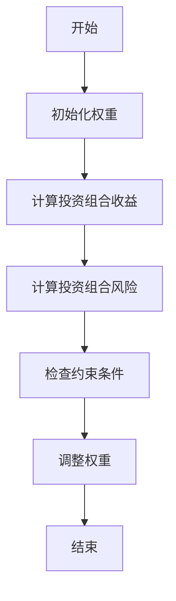
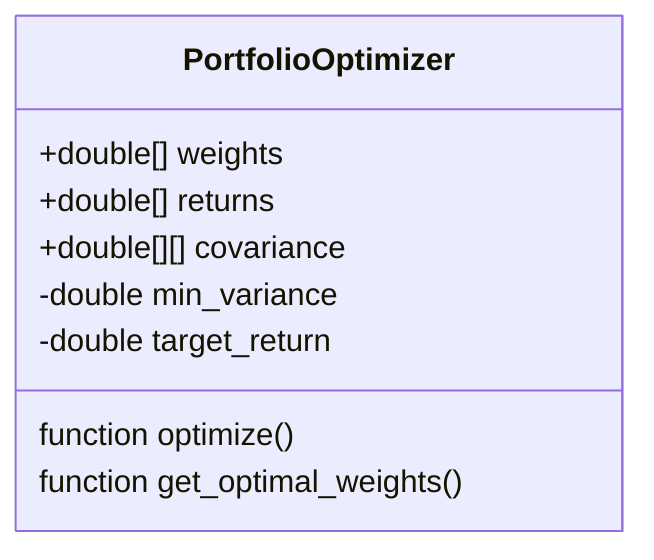

                 


# 投资组合优化：均值-方差模型的实际应用

## 关键词：投资组合优化，均值-方差模型，马科维茨理论，风险控制，资产配置，数学优化

## 摘要：
本文详细探讨了投资组合优化中的均值-方差模型的实际应用。从理论基础到算法实现，从系统设计到项目实战，全面分析了该模型在金融投资中的应用价值和实现方法。通过具体案例分析，展示了如何利用该模型进行资产配置和风险控制，帮助投资者在复杂多变的市场中实现收益与风险的最优平衡。

---

## 第1章: 投资组合优化的背景与概念

### 1.1 投资组合优化的基本概念

#### 1.1.1 投资组合的定义与特征
- **投资组合**：由多种资产（如股票、债券、基金等）组成的集合，旨在通过多样化投资降低风险。
- **特征**：
  - 多样性：分散投资以降低风险。
  - 风险与收益的权衡：追求在特定风险水平下的最大收益。
  - 可调整性：根据市场变化动态调整资产配置。

#### 1.1.2 投资组合优化的目标
- 最大化收益：在给定风险下最大化投资回报。
- 最小化风险：在给定收益下最小化投资风险。
- 平衡风险与收益：找到最优风险-收益 trade-off。

#### 1.1.3 均值-方差模型的提出与意义
- **提出者**：Harry Markowitz（1952年）。
- **意义**：首次将数学优化引入投资决策，奠定了现代投资组合理论的基础。

### 1.2 均值-方差模型的背景

#### 1.2.1 马科维茨投资组合理论的提出
- **背景**：20世纪50年代，投资者开始意识到单一资产的风险，需要通过多样化投资来降低风险。
- **理论贡献**：Markowitz 提出，投资者可以通过优化资产配置，在有效前沿上找到最优组合。

#### 1.2.2 均值-方差模型的核心假设
- 资产收益符合正态分布。
- 投资者是理性的，追求效用最大化。
- 市场是有效的，即资产价格反映所有相关信息。

#### 1.2.3 投资组合优化的现实意义
- 为投资者提供科学的资产配置方法。
- 帮助投资者在复杂市场中做出决策。
- 为金融工具（如指数基金）的设计提供理论基础。

### 1.3 投资组合优化的数学基础

#### 1.3.1 随机变量与概率分布
- **随机变量**：资产收益是随机的，可以用概率分布描述。
- **概率分布**：如正态分布、t分布等，用于描述资产收益的可能性。

#### 1.3.2 方差与协方差的定义
- **方差**：衡量资产收益的波动性，公式为 $ \sigma^2 = E[(r - E[r])^2] $。
- **协方差**：衡量两种资产收益的联动性，公式为 $ \text{Cov}(r_i, r_j) = E[(r_i - E[r_i])(r_j - E[r_j])] $。

#### 1.3.3 投资组合收益与风险的数学表达
- **投资组合收益**： $ \mu_p = \sum_{i=1}^n w_i \mu_i $，其中 $ w_i $ 是权重，$ \mu_i $ 是资产i的期望收益。
- **投资组合方差**： $ \sigma_p^2 = \sum_{i=1}^n \sum_{j=1}^n w_i w_j \text{Cov}(r_i, r_j) $。

---

## 第2章: 均值-方差模型的理论基础

### 2.1 均值-方差模型的数学公式

#### 2.1.1 投资组合的期望收益
$$ \mu_p = \sum_{i=1}^n w_i \mu_i $$

#### 2.1.2 投资组合的方差
$$ \sigma_p^2 = \sum_{i=1}^n \sum_{j=1}^n w_i w_j \text{Cov}(r_i, r_j) $$

#### 2.1.3 最优化目标的数学表达
$$ \min_{w} \sigma_p^2 \quad \text{subject to} \quad \sum_{i=1}^n w_i = 1 $$

### 2.2 均值-方差模型的核心假设

#### 2.2.1 资产收益的正态分布假设
- 资产收益服从正态分布，简化了风险的计算。
- 但现实中，金融资产收益可能呈现肥尾现象。

#### 2.2.2 投资者风险偏好的无差异曲线
- **无差异曲线**：表示投资者在不同风险和收益组合中无差异的点。
- 风险厌恶投资者会选择风险最小的组合。

#### 2.2.3 市场有效性的假设
- 假设市场有效，即资产价格反映所有信息。
- 在有效市场中，均值-方差模型能够找到最优组合。

### 2.3 均值-方差模型的扩展

#### 2.3.1 多阶段优化的考虑
- **多阶段优化**：考虑不同时间段的资产配置。
- **动态调整**：根据市场变化动态优化组合。

#### 2.3.2 约束条件的引入
- **约束条件**：
  - 资金比例约束：$ \sum_{i=1}^n w_i = 1 $。
  - 风险约束：$ \sigma_p^2 \leq \sigma_{\text{max}}^2 $。
  - 收益约束：$ \mu_p \geq \mu_{\text{min}} $。

#### 2.3.3 非线性优化问题的处理
- 均值-方差模型是非线性优化问题，通常需要使用二次规划算法求解。

---

## 第3章: 均值-方差模型的算法原理

### 3.1 最优化算法概述

#### 3.1.1 线性规划与非线性规划的区别
- **线性规划**：目标函数和约束条件均为线性。
- **非线性规划**：目标函数或约束条件为非线性。

#### 3.1.2 常用优化算法简介
- **梯度下降法**：适用于无约束优化问题。
- **牛顿法**：适用于有良好二阶导数信息的优化问题。
- **内点法**：适用于有约束优化问题。

#### 3.1.3 均值-方差模型的优化方法
- **二次规划**：目标函数和约束条件均为二次型。

### 3.2 均值-方差模型的数学推导

#### 3.2.1 投资组合方差的最小化
$$ \min_{w} \sum_{i=1}^n \sum_{j=1}^n w_i w_j \text{Cov}(r_i, r_j) $$

#### 3.2.2 投资组合收益的最大化
$$ \max_{w} \sum_{i=1}^n w_i \mu_i \quad \text{subject to} \quad \sum_{i=1}^n w_i = 1 $$

#### 3.2.3 约束条件下的优化问题
$$ \min_{w} \sigma_p^2 \quad \text{subject to} \quad \sum_{i=1}^n w_i \mu_i = \mu_p $$

### 3.3 均值-方差模型的求解过程

#### 3.3.1 求解步骤的流程图



#### 3.3.2 算法实现的伪代码

```python
function optimize_portfolio(weights, mu, cov):
    initialize optimal_weights = weights
    while not converged:
        compute portfolio_return = sum(weights * mu)
        compute portfolio_variance = sum(weights * cov * weights')
        check constraints
        adjust weights
    return optimal_weights
```

#### 3.3.3 具体案例的数学推导
- 假设两只资产，权重分别为 $w_1$ 和 $w_2$。
- 投资组合收益：$ \mu_p = w_1 \mu_1 + w_2 \mu_2 $。
- 投资组合方差：$ \sigma_p^2 = w_1^2 \sigma_1^2 + w_2^2 \sigma_2^2 + 2 w_1 w_2 \text{Cov}(r_1, r_2) $。

---

## 第4章: 均值-方差模型的实际应用

### 4.1 资产配置中的应用

#### 4.1.1 股票与债券的配置比例
- 根据风险偏好确定股票和债券的权重。
- 例如，风险厌恶的投资者可能配置更多债券。

#### 4.1.2 不同风险偏好的投资者配置策略
- **保守型**：债券比例高。
- **积极型**：股票比例高。
- **平衡型**：股票和债券比例相当。

#### 4.1.3 动态资产配置的优化
- 根据市场变化动态调整资产配置。
- 使用均值-方差模型进行实时优化。

### 4.2 风险控制中的应用

#### 4.2.1 投资组合风险的最小化
- 通过优化权重降低组合风险。
- 例如，最小化投资组合方差。

#### 4.2.2 风险与收益的平衡
- 在给定收益下最小化风险。
- 在给定风险下最大化收益。

#### 4.2.3 风险预算的实现
- 设置最大风险承受水平，优化权重以满足预算。

---

## 第5章: 系统分析与架构设计

### 5.1 系统功能设计

#### 5.1.1 领域模型（Mermaid 类图）



#### 5.1.2 系统架构设计（Mermaid 架构图）


#### 5.1.3 系统接口设计
- **输入接口**：接收资产收益和协方差矩阵。
- **输出接口**：返回优化后的权重和风险收益指标。

---

## 第6章: 项目实战

### 6.1 环境安装

#### 6.1.1 安装 Python 和依赖库
```bash
pip install numpy pandas scipy matplotlib
```

### 6.2 核心实现

#### 6.2.1 均值-方差模型的实现代码

```python
import numpy as np
from scipy.optimize import minimize

def portfolio_variance(weights, covariance):
    return np.dot(weights.T, np.dot(covariance, weights))

def optimize_portfolio(n_assets, mu, cov, target_return=0.1):
    # 初始权重向量
    initial_weights = np.array([1.0 / n_assets] * n_assets)
    
    # 定义约束条件
    constraints = [
        ('sum', initial_weights @ mu, '==', target_return)
    ]
    
    # 定义目标函数
    def objective(weights):
        return portfolio_variance(weights, cov)
    
    # 求解优化问题
    result = minimize(objective, initial_weights, 
                      constraints=constraints, 
                      method='SLSQP')
    
    return result.x

# 示例数据
n_assets = 2
mu = np.array([0.1, 0.2])
cov = np.array([[0.05, 0.02], [0.02, 0.1]])
weights = optimize_portfolio(n_assets, mu, cov)
print("优化后的权重为：", weights)
```

### 6.3 案例分析与解读

#### 6.3.1 案例分析
- 假设两只资产，期望收益分别为 10% 和 20%，协方差矩阵如上。
- 目标收益为 15%。

#### 6.3.2 优化结果
- 计算得到的最优权重可能为 [0.4, 0.6]，即投资40%在资产1，60%在资产2。

---

## 第7章: 总结与展望

### 7.1 最佳实践 Tips
- **数据质量**：确保输入数据的准确性和完整性。
- **模型假设**：注意模型的假设是否符合实际情况。
- **动态调整**：根据市场变化及时调整资产配置。

### 7.2 小结
均值-方差模型为投资组合优化提供了科学的理论基础和实践方法，但在实际应用中需要考虑市场非有效性、数据噪声等问题。

### 7.3 注意事项
- 确保计算过程的准确性。
- 定期监控和调整投资组合。

### 7.4 拓展阅读
- Markowitz, H. (1952). Portfolio Selection.
- 阅读更多关于投资组合理论的书籍，如《投资学》（教材）。

---

## 附录

### 附录 A: 均值-方差模型的数学公式

- **投资组合收益**：$ \mu_p = \sum_{i=1}^n w_i \mu_i $
- **投资组合方差**：$ \sigma_p^2 = \sum_{i=1}^n \sum_{j=1}^n w_i w_j \text{Cov}(r_i, r_j) $

### 附录 B: 优化代码示例

```python
import numpy as np
from scipy.optimize import minimize

def objective(weights, covariance):
    return np.dot(weights.T, np.dot(covariance, weights))

def constraint(weights, mu, target_return):
    return np.dot(weights, mu) - target_return

n_assets = 2
mu = np.array([0.1, 0.2])
cov = np.array([[0.05, 0.02], [0.02, 0.1]])
target_return = 0.15

initial_weights = np.array([1.0 / n_assets] * n_assets)

result = minimize(objective, initial_weights, 
                 args=(cov,), 
                 method='SLSQP',
                 constraints={'type': 'eq', 'fun': constraint, 'args': (mu, target_return)})

print("优化后的权重为：", result.x)
```

---

## 作者：AI天才研究院/AI Genius Institute & 禅与计算机程序设计艺术 /Zen And The Art of Computer Programming

---

通过本文的详细讲解，读者可以全面了解均值-方差模型的理论基础、算法实现及其在投资组合优化中的实际应用。从理论到实践，从代码实现到案例分析，帮助读者掌握投资组合优化的核心方法和技术。

