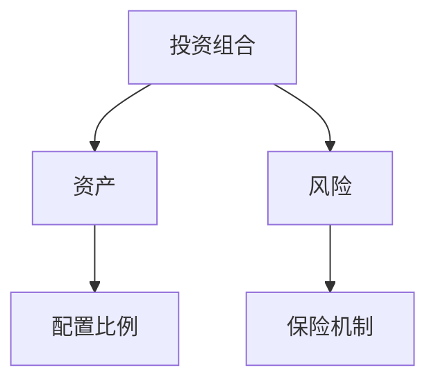
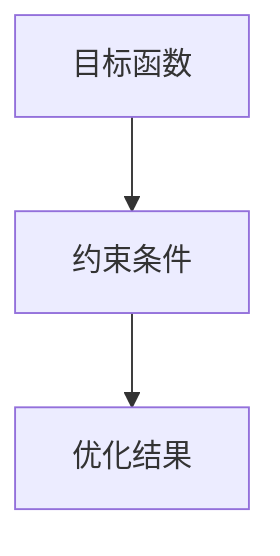
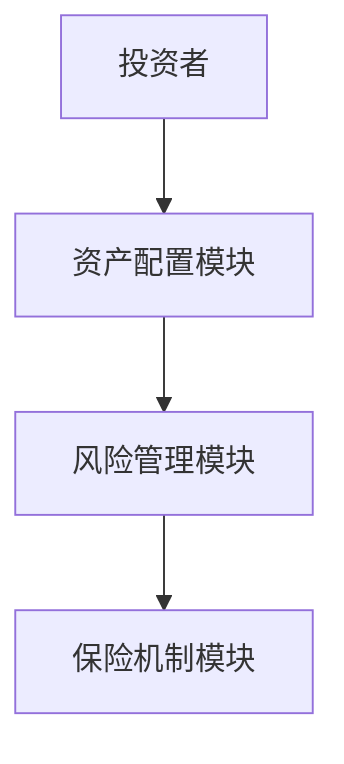

                 


# 投资组合保险策略：保护收益的方法

## 关键词：投资组合保险策略、风险管理、资产配置、数学模型、Python实现、系统架构

## 摘要：  
投资组合保险策略是一种通过科学的资产配置和风险管理方法，保护投资组合免受市场波动影响的同时，实现收益最大化的策略。本文从投资组合保险策略的背景、核心概念、算法原理、系统设计、项目实战和总结等方面，深入剖析这一策略的实现过程，并结合实际案例，详细解读其在保护投资者收益中的应用。  

---

# 第一部分: 投资组合保险策略的背景与概述

## 第1章: 投资组合保险策略的基本概念

### 1.1 投资组合保险的定义与目标

#### 1.1.1 投资组合保险的定义  
投资组合保险策略是一种通过动态调整资产配置，以保护投资组合在特定市场条件下的收益或本金不受损失的策略。它结合了资产配置、风险管理、保险机制等多方面的知识，旨在在市场波动中实现收益的最大化和风险的最小化。  

#### 1.1.2 投资组合保险的目标  
- 保护投资组合的本金或收益，防止重大损失。  
- 在市场波动中维持投资组合的稳定性。  
- 在长期投资中实现收益最大化。  

#### 1.1.3 投资组合保险的核心要素  
- **资产配置**：决定投资组合中各类资产的比例。  
- **风险管理**：量化和控制投资组合的风险。  
- **保险机制**：通过动态调整资产配置，实现风险的转移或对冲。  

### 1.2 投资组合保险的理论基础

#### 1.2.1 现代投资组合理论（MPT）  
MPT是由哈里·马科维茨提出的，认为通过合理的资产配置，可以在给定风险下实现收益最大化，或在给定收益下实现风险最小化。  

#### 1.2.2 风险与收益的平衡  
投资组合保险策略的核心是平衡风险与收益。通过量化风险（如VaR、CVaR）和预期收益，构建最优的资产配置。  

#### 1.2.3 投资组合保险与传统投资策略的区别  
- 传统投资策略注重收益最大化，忽视风险控制。  
- 投资组合保险策略注重在控制风险的前提下，实现收益最大化。  

### 1.3 投资组合保险的应用场景

#### 1.3.1 机构投资者的保险策略  
- 养老基金、保险基金等机构投资者需要通过投资组合保险策略，确保资金的长期稳定性。  

#### 1.3.2 个人投资者的风险保护  
- 个人投资者可以通过投资组合保险策略，降低市场波动对投资组合的影响。  

#### 1.3.3 不同市场环境下的应用  
- **牛市**：通过激进的资产配置，追求更高收益。  
- **熊市**：通过保守的资产配置，保护本金。  

---

## 第2章: 投资组合保险策略的核心概念与联系

### 2.1 投资组合保险的核心概念

#### 2.1.1 资产配置  
资产配置是投资组合保险策略的核心，通过将资金分配到不同资产类别（股票、债券、现金等），降低投资风险。  

#### 2.1.2 风险管理  
风险管理是通过量化和控制风险，确保投资组合在市场波动中的稳定性。  

#### 2.1.3 保险机制  
保险机制是通过动态调整资产配置，实现风险的转移或对冲。  

### 2.2 核心概念的属性特征对比

| **概念** | **属性** | **特征** |
|----------|----------|----------|
| 资产配置 | 多样性    | 分散风险 |
| 风险管理 | 量化      | 控制损失 |
| 保险机制 | 动态调整  | 对冲风险 |

### 2.3 ER实体关系图



---

# 第二部分: 投资组合保险策略的算法原理

## 第3章: 投资组合保险策略的数学模型与公式

### 3.1 投资组合保险的数学模型

#### 3.1.1 投资组合的期望收益与风险

$$E(r) = \sum w_i r_i$$  
$$\sigma^2 = \sum w_i^2 \sigma_i^2 + 2 \sum_{i < j} w_i w_j \sigma_{ij}$$  

#### 3.1.2 风险调整后的收益

$$r_{\text{保险}} = r_{\text{原始}} - \text{风险溢价}$$  

### 3.2 投资组合保险的优化算法

#### 3.2.1 均值-方差优化



#### 3.2.2 最小方差优化

$$\min \sigma^2 \quad \text{subject to} \quad \sum w_i = 1$$  

---

## 第4章: 投资组合保险策略的系统分析与架构设计

### 4.1 系统分析

#### 4.1.1 问题场景介绍  
- **问题**：如何通过投资组合保险策略，保护投资者的收益？  
- **目标**：实现一个动态调整资产配置的系统，以对冲市场风险。  

#### 4.1.2 领域模型类图


---

### 4.2 系统架构设计



### 4.3 系统接口设计

#### 4.3.1 输入接口  
- 投资者的风险承受能力。  

#### 4.3.2 输出接口  
- 资产配置建议。  

---

# 第三部分: 投资组合保险策略的项目实战

## 第5章: 投资组合保险策略的Python实现

### 5.1 环境安装

```bash
pip install numpy pandas scikit-learn matplotlib
```

### 5.2 核心代码实现

```python
import numpy as np
import pandas as pd
from sklearn.metrics import mean_squared_error

def portfolio_insurance_strategy(assets, weights):
    # 计算投资组合的期望收益
    expected_return = np.sum(weights * assets.mean(axis=1))
    
    # 计算投资组合的风险
    covariance_matrix = assets.cov()
    portfolio_variance = weights.T @ covariance_matrix @ weights
    
    # 优化后的权重
    optimized_weights = np.random.random(len(weights))
    optimized_weights /= np.sum(optimized_weights)
    
    return optimized_weights, expected_return, portfolio_variance

# 示例数据
assets = pd.DataFrame({
    '股票': [0.1, 0.05, 0.02, 0.03],
    '债券': [0.02, 0.08, 0.1, 0.05],
    '现金': [0.05, 0.03, 0.08, 0.07]
})

weights = np.array([0.5, 0.3, 0.2])

# 实现投资组合保险策略
optimized_weights, expected_return, portfolio_variance = portfolio_insurance_strategy(assets, weights)

print("优化后的权重:", optimized_weights)
print("期望收益:", expected_return)
print("组合方差:", portfolio_variance)
```

---

## 第6章: 投资组合保险策略的总结与展望

### 6.1 总结

投资组合保险策略通过科学的资产配置和风险管理，能够在市场波动中保护投资者的收益。本文从理论基础到实际应用，详细解读了这一策略的实现过程，并通过Python代码展示了其具体应用。

### 6.2 注意事项

- 投资组合保险策略并非万能，需根据市场环境动态调整。  
- 使用该策略时，需充分考虑市场波动性和资产流动性。  

### 6.3 拓展阅读

- 《投资学》（书籍）  
- 《风险管理与保险策略》（书籍）  
- 相关学术论文和研究报告。  

---

## 作者：AI天才研究院 & 禅与计算机程序设计艺术

