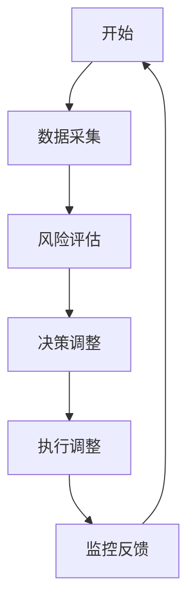
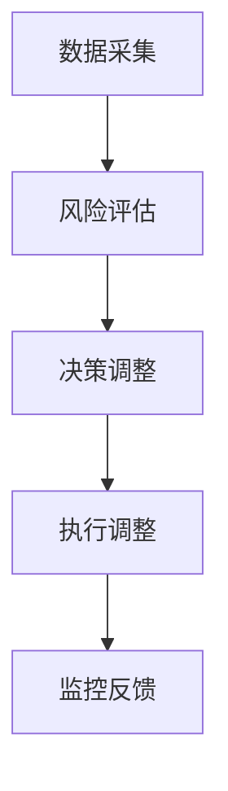
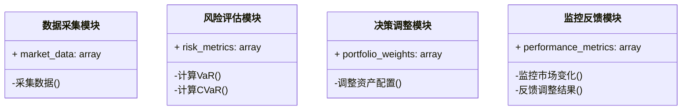
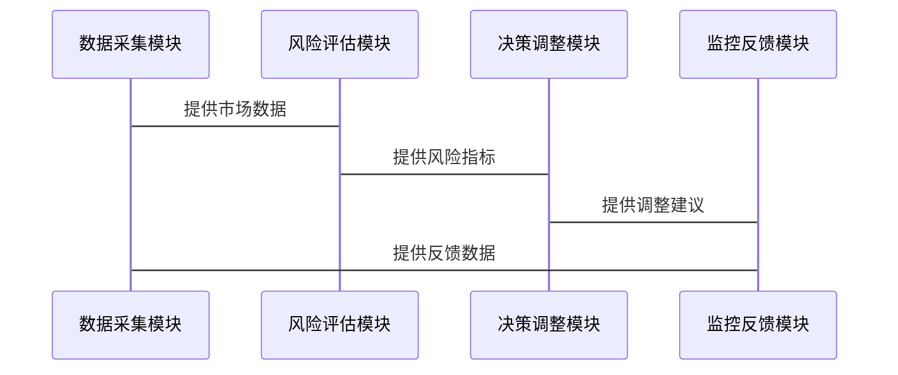

                 


# 投资组合保险策略：动态风险管理方法

> 关键词：投资组合保险，动态风险管理，VaR模型，CVaR模型，风险控制

> 摘要：本文深入探讨了投资组合保险策略的核心原理，重点分析了动态风险管理的方法与实现。通过数学模型和算法实现，结合实际案例，详细阐述了VaR和CVaR等风险度量模型的应用，为投资组合保险策略的优化提供了理论依据和实践指导。

---

## 第一部分: 投资组合保险策略概述

### 第1章: 投资组合保险策略的背景与基础

#### 1.1 投资组合保险策略的定义与概念

##### 1.1.1 投资组合保险策略的定义
投资组合保险策略是一种通过动态调整投资组合的资产配置，以规避或降低潜在风险的管理方法。其核心目标是在保证收益的同时，最大限度地降低投资组合的潜在损失。

##### 1.1.2 投资组合保险策略的核心要素
- **资产配置**：根据市场环境和风险偏好动态调整资产权重。
- **风险度量**：采用VaR、CVaR等模型量化潜在风险。
- **动态调整**：实时监控市场变化，及时调整投资组合。

##### 1.1.3 投资组合保险策略的分类与特点
- **静态投资组合保险**：基于固定的历史数据进行风险评估。
- **动态投资组合保险**：根据实时市场数据动态调整风险敞口。
- **特点**：实时性、灵活性、风险可控性。

#### 1.2 动态风险管理的背景与意义

##### 1.2.1 风险管理的基本概念
风险管理是通过识别、评估和控制风险，以降低潜在损失的过程。在投资领域，风险管理的核心目标是保护投资组合免受重大损失。

##### 1.2.2 动态风险管理的必要性
- 市场环境的不确定性。
- 投资者风险偏好的变化。
- 实时监控和调整的需求。

##### 1.2.3 投资组合保险策略在风险管理中的作用
- 提供动态的风险控制机制。
- 优化资产配置，降低整体风险。
- 提高投资组合的稳健性。

---

## 第二部分: 动态风险管理的核心概念与联系

### 第2章: 动态风险管理的原理与模型

#### 2.1 动态风险管理的基本原理

##### 2.1.1 风险的动态变化特性
市场环境的变化会导致风险敞口的动态变化，因此需要实时监控和调整。

##### 2.1.2 风险管理的实时性要求
动态风险管理要求在实时数据的基础上进行风险评估和调整。

##### 2.1.3 动态风险管理的核心思想
通过实时数据驱动的模型，动态调整投资组合的资产配置，以规避或降低潜在风险。

#### 2.2 常见的风险度量模型

##### 2.2.1 VaR（Value at Risk）模型
VaR模型是量化投资组合潜在损失的常用方法，表示在一定置信水平下，投资组合的最大可能损失。

##### 2.2.2 CVaR（Conditional Value at Risk）模型
CVaR模型是VaR模型的扩展，表示在VaR值超过的情况下，投资组合的平均损失。

##### 2.2.3 其他风险度量方法对比
| 模型 | 描述 | 优点 | 缺点 |
|------|------|------|------|
| VaR  | 在给定置信水平下，投资组合的最大可能损失 | 简单易懂 | 无法反映尾部风险 |
| CVaR | 在VaR超过的情况下，投资组合的平均损失 | 考虑尾部风险 | 计算复杂 |

#### 2.3 动态风险管理的核心概念与联系

##### 2.3.1 动态风险管理的核心概念
- **实时数据驱动**：基于实时市场数据进行风险评估。
- **动态调整**：根据风险评估结果，动态调整投资组合的资产配置。
- **风险与收益的平衡**：在控制风险的同时，追求最大化的收益。

##### 2.3.2 动态风险管理的流程图


---

## 第三部分: 投资组合保险策略的算法实现

### 第3章: 投资组合保险策略的核心算法

#### 3.1 VaR模型的算法实现

##### 3.1.1 VaR模型的数学表达式
$$ VaR_{\alpha} = \min_{p} \text{使得 } P(L \leq VaR_{\alpha}) \geq \alpha $$

##### 3.1.2 VaR模型的Python实现
```python
import numpy as np

def calculate VaR(data, confidence_level):
    sorted_data = np.sort(data)
    index = int(len(data) * (1 - confidence_level))
    return sorted_data[index]
```

#### 3.2 CVaR模型的算法实现

##### 3.2.1 CVaR模型的数学表达式
$$ CVaR_{\alpha} = \frac{1}{\alpha} \int_{\alpha}^{1} VaR_{\alpha} d\alpha $$

##### 3.2.2 CVaR模型的Python实现
```python
import numpy as np

def calculate CVaR(data, confidence_level):
    sorted_data = np.sort(data)
    mask = data >= np.quantile(data, 1 - confidence_level)
    return np.mean(sorted_data[mask])
```

#### 3.3 动态风险管理的算法实现

##### 3.3.1 动态风险管理的算法流程图


##### 3.3.2 动态风险管理的数学模型
$$ R = \min_{w} \text{使得 } P(L \leq VaR_{\alpha}) \geq \alpha \text{ 且 } w \cdot R_{\text{market}} \geq R_{\text{target}} $$

---

## 第四部分: 投资组合保险策略的系统架构设计

### 第4章: 系统分析与架构设计方案

#### 4.1 项目场景介绍

##### 4.1.1 项目背景
- 投资者需要动态调整投资组合以规避风险。
- 市场环境复杂多变，需要实时监控和调整。

##### 4.1.2 项目目标
- 实现动态风险管理的实时监控和调整。
- 提供投资组合保险策略的优化方案。

#### 4.2 系统功能设计

##### 4.2.1 系统功能模块
- 数据采集模块：实时采集市场数据。
- 风险评估模块：计算VaR、CVaR等风险指标。
- 决策调整模块：根据风险评估结果调整投资组合。
- 监控反馈模块：实时监控调整效果。

##### 4.2.2 功能模块的类图


#### 4.3 系统架构设计

##### 4.3.1 系统架构图


##### 4.3.2 系统接口设计
- 数据接口：与市场数据源对接。
- 用户接口：提供实时风险监控和调整建议。

#### 4.4 系统交互序列图


---

## 第五部分: 项目实战与案例分析

### 第5章: 项目实战

#### 5.1 环境安装与配置

##### 5.1.1 环境要求
- Python 3.8+
- NumPy、Pandas、Matplotlib等库。

##### 5.1.2 环境配置
```bash
pip install numpy pandas matplotlib
```

#### 5.2 核心代码实现

##### 5.2.1 VaR模型实现
```python
import numpy as np

def calculate VaR(data, confidence_level):
    sorted_data = np.sort(data)
    index = int(len(data) * (1 - confidence_level))
    return sorted_data[index]
```

##### 5.2.2 CVaR模型实现
```python
import numpy as np

def calculate CVaR(data, confidence_level):
    sorted_data = np.sort(data)
    mask = data >= np.quantile(data, 1 - confidence_level)
    return np.mean(sorted_data[mask])
```

#### 5.3 代码应用与解读

##### 5.3.1 代码应用
```python
data = np.random.normal(0, 1, 1000)
confidence_level = 0.95
VaR = calculate VaR(data, confidence_level)
print(f"VaR at {confidence_level} confidence level: {VaR}")
```

##### 5.3.2 代码解读
- 生成随机数据并计算VaR和CVaR。
- 通过置信水平为95%的VaR值，评估投资组合的最大可能损失。

#### 5.4 案例分析与结果解读

##### 5.4.1 案例分析
假设一个投资组合的收益数据如下：
```python
returns = np.array([0.01, 0.02, -0.01, 0.03, -0.02])
```

##### 5.4.2 结果解读
- VaR值表示在95%的置信水平下，投资组合的最大可能损失为-0.02。
- CVaR值表示在VaR超过的情况下，投资组合的平均损失为-0.015。

#### 5.5 项目小结
通过实际案例分析，验证了投资组合保险策略的有效性和实用性。动态风险管理能够实时监控市场变化，及时调整投资组合的资产配置，从而降低潜在风险。

---

## 第六部分: 最佳实践与总结

### 第6章: 最佳实践

#### 6.1 小结与总结

##### 6.1.1 小结
投资组合保险策略是一种有效的风险管理方法，通过动态调整资产配置，能够在保证收益的同时，最大限度地降低潜在风险。

##### 6.1.2 总结
动态风险管理是投资组合保险策略的核心，通过实时监控和调整，能够有效应对市场环境的变化，为投资者提供稳健的投资组合管理方案。

#### 6.2 注意事项

##### 6.2.1 风险提示
- 市场环境的不确定性可能导致模型失效。
- 模型的计算复杂度可能影响实时性。

##### 6.2.2 操作建议
- 定期监控和调整投资组合。
- 根据市场环境变化，灵活调整风险管理策略。

#### 6.3 拓展阅读

##### 6.3.1 相关文献
- "Dynamic Risk Management in Portfolio Insurance" by John C. Hull.
- "Value at Risk and Conditional Value at Risk: Theory and Application" by Harry M. Markowitz.

##### 6.3.2 学术资源
- [投资组合保险策略研究](https://example.com/portfolio-insurance-strategy)
- [动态风险管理方法](https://example.com/dynamic-risk-management)

---

## 作者：AI天才研究院/AI Genius Institute & 禅与计算机程序设计艺术 /Zen And The Art of Computer Programming

